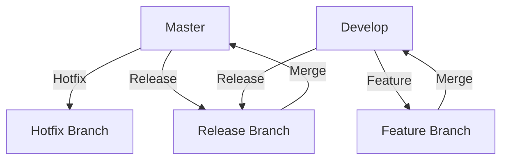

## 13.7 Version Control with Git

In the world of software development, collaboration and code management are crucial. Git, a distributed version control system, is a powerful tool that helps developers manage changes in their codebase, collaborate with others, and maintain a clean history of their projects. In this section, we'll explore the fundamental concepts of Git, branching strategies, the importance of commit messages, advanced workflows, and how Git integrates with CI/CD pipelines.

### Understanding Git: The Basics

Git is a version control system that allows multiple developers to work on a project simultaneously without overwriting each other's changes. It keeps track of every modification to the code in a special kind of database. If a mistake is made, developers can turn back the clock and compare earlier versions of the code to help fix the error while minimizing disruption to all team members.

#### Key Concepts

1. **Commits**: A commit is a snapshot of your repository at a specific point in time. Each commit has a unique ID and contains metadata such as the author, date, and a message describing the changes. Think of commits as saving your work in a video game; you can always go back to a previous save point.

2. **Branches**: Branches allow you to diverge from the main line of development and continue to work without affecting that main line. This is useful for developing features, fixing bugs, or experimenting with new ideas. The main branch is often called `main` or `master`.

3. **Merges**: Merging is the process of integrating changes from one branch into another. This is typically done when a feature branch is complete and ready to be incorporated into the main branch.

#### Basic Git Commands

- **`git init`**: Initialize a new Git repository.
- **`git clone [url]`**: Clone an existing repository from a URL.
- **`git add [file]`**: Stage changes to be committed.
- **`git commit -m "message"`**: Commit staged changes with a message.
- **`git status`**: Check the status of your working directory.
- **`git log`**: View the commit history.
- **`git branch`**: List, create, or delete branches.
- **`git checkout [branch]`**: Switch to a different branch.
- **`git merge [branch]`**: Merge a branch into the current branch.

### Branching Strategies

Branching strategies help teams manage their workflow and ensure code quality. Here are some common strategies:

#### GitFlow

GitFlow is a popular branching model that defines a strict branching structure. It uses two main branches to track the history of the project:

- **Master**: This branch contains production-ready code.
- **Develop**: This branch contains the latest delivered development changes for the next release.

In addition to these, GitFlow uses supporting branches:

- **Feature branches**: Used to develop new features. They branch off from `develop` and are merged back into `develop`.
- **Release branches**: Used to prepare a new production release. They branch off from `develop` and are merged into both `develop` and `master`.
- **Hotfix branches**: Used to quickly patch production releases. They branch off from `master` and are merged back into both `develop` and `master`.

#### Feature Branching

Feature branching involves creating a new branch for each feature or bug fix. This branch is based on the main branch and is merged back once the feature is complete. This strategy is simple and works well for small teams or projects.

#### Trunk-Based Development

In trunk-based development, developers integrate small, frequent updates into the main branch. This approach minimizes merge conflicts and encourages continuous integration. It requires a high level of discipline and automated testing to ensure code quality.

### Importance of Commit Messages

Commit messages are crucial for understanding the history of a project. A good commit message should:

- **Be concise**: Summarize the changes in a few words.
- **Explain why**: Provide context for the changes.
- **Follow a convention**: Use a consistent format, such as starting with a capital letter and using the imperative mood.

Example of a good commit message:

```
Add user authentication feature

- Implement login and registration forms
- Add password hashing and validation
- Update database schema to include user roles
```

### Advanced Git Workflows

As you become more comfortable with Git, you may encounter advanced workflows that can enhance your development process.

#### Rebase

Rebasing is the process of moving or combining a sequence of commits to a new base commit. It can be used to clean up a messy commit history before merging a feature branch into the main branch. However, it should be used with caution, as it can rewrite commit history.

```bash
git checkout feature-branch
git rebase main
```

#### Cherry-Pick

Cherry-picking allows you to apply a specific commit from one branch to another. This is useful when you need to apply a bug fix from one branch to another without merging the entire branch.

```bash
git cherry-pick <commit-hash>
```

### Code Reviews and Pull Requests

Code reviews are an essential part of the development process. They help ensure code quality, catch bugs early, and share knowledge among team members. Pull requests (PRs) are a way to propose changes to a repository and request a review before merging.

#### Tools for Code Reviews

- **GitHub**: Provides a web-based interface for code reviews and pull requests.
- **GitLab**: Offers similar features with additional CI/CD capabilities.
- **Bitbucket**: Integrates with Jira for project management and provides code review tools.

### Integrating Git with CI/CD Pipelines

Continuous Integration (CI) and Continuous Deployment (CD) are practices that automate the process of testing and deploying code. Git plays a crucial role in CI/CD pipelines by providing a source of truth for the codebase.

#### Setting Up a CI/CD Pipeline

1. **Choose a CI/CD tool**: Popular options include Jenkins, Travis CI, CircleCI, and GitHub Actions.
2. **Configure the pipeline**: Define the steps for building, testing, and deploying your code.
3. **Integrate with Git**: Set up webhooks or use built-in integrations to trigger the pipeline on specific Git events, such as commits or pull requests.

### Visualizing Git Workflows

To better understand how Git workflows operate, let's visualize a typical GitFlow branching model using a Mermaid.js diagram:



This diagram illustrates the flow of changes between branches in a GitFlow model. The `master` branch is used for production releases, while the `develop` branch is for ongoing development. Feature branches are created from `develop` and merged back once complete. Release branches are used to prepare for production releases, and hotfix branches are for urgent fixes.

### Try It Yourself

Now that we've covered the basics of Git, let's try a simple exercise. Create a new Git repository, make some changes, and practice using the commands we've discussed.

1. **Initialize a new repository**:

   ```bash
   mkdir my-project
   cd my-project
   git init
   ```

2. **Create a new file and commit it**:

   ```bash
   echo "console.log('Hello, Git!');" > index.js
   git add index.js
   git commit -m "Add index.js with a greeting message"
   ```

3. **Create a new branch and make changes**:

   ```bash
   git checkout -b feature-greeting
   echo "console.log('Welcome to Git!');" >> index.js
   git add index.js
   git commit -m "Add welcome message to index.js"
   ```

4. **Merge the feature branch back into the main branch**:

   ```bash
   git checkout main
   git merge feature-greeting
   ```

5. **Push changes to a remote repository** (if you have one set up):

   ```bash
   git remote add origin [your-repo-url]
   git push -u origin main
   ```

### Knowledge Check

- **What is a commit, and why is it important?**
- **Explain the difference between a branch and a merge.**
- **What are the benefits of using a branching strategy like GitFlow?**
- **How can you ensure your commit messages are effective?**
- **What is the purpose of rebasing, and when should you use it?**

### Summary

In this section, we've explored the fundamental concepts of Git, including commits, branches, and merges. We've discussed branching strategies like GitFlow and feature branching, the importance of commit messages, and advanced workflows like rebase and cherry-pick. We've also highlighted tools for code reviews and pull requests and emphasized the integration of Git with CI/CD pipelines. By mastering these concepts, you'll be well-equipped to manage your codebase effectively and collaborate with others in your JavaScript projects.

Remember, this is just the beginning. As you progress, you'll encounter more complex workflows and tools that will enhance your development process. Keep experimenting, stay curious, and enjoy the journey!

## Quiz Time!



### What is a commit in Git?

- [x] A snapshot of your repository at a specific point in time
- [ ] A branch in your repository
- [ ] A merge of two branches
- [ ] A remote repository

> **Explanation:** A commit is a snapshot of your repository at a specific point in time, containing changes and metadata such as the author and commit message.

### Which Git command is used to create a new branch?

- [ ] `git merge`
- [x] `git branch`
- [ ] `git commit`
- [ ] `git checkout`

> **Explanation:** The `git branch` command is used to create a new branch in your repository.

### What is the purpose of a merge in Git?

- [x] To integrate changes from one branch into another
- [ ] To delete a branch
- [ ] To create a new commit
- [ ] To initialize a repository

> **Explanation:** Merging is the process of integrating changes from one branch into another, typically when a feature branch is ready to be incorporated into the main branch.

### What is a feature branch?

- [x] A branch used to develop new features
- [ ] A branch used for production releases
- [ ] A branch used for hotfixes
- [ ] A branch used for testing

> **Explanation:** A feature branch is used to develop new features and is typically branched off from the main development branch.

### What is GitFlow?

- [x] A branching strategy with a strict structure
- [ ] A command-line tool for Git
- [ ] A GUI for managing Git repositories
- [ ] A type of commit message

> **Explanation:** GitFlow is a branching strategy that defines a strict branching structure, including main, develop, feature, release, and hotfix branches.

### Why are commit messages important?

- [x] They provide context and history for changes
- [ ] They determine the order of commits
- [ ] They are required for merging branches
- [ ] They automatically resolve conflicts

> **Explanation:** Commit messages provide context and history for changes, making it easier to understand the evolution of a project.

### What is rebasing used for in Git?

- [x] To move or combine commits to a new base commit
- [ ] To delete a branch
- [ ] To create a new repository
- [ ] To push changes to a remote repository

> **Explanation:** Rebasing is used to move or combine a sequence of commits to a new base commit, often to clean up commit history before merging.

### What is a pull request?

- [x] A request to merge changes into a repository
- [ ] A command to pull changes from a remote repository
- [ ] A request to delete a branch
- [ ] A command to initialize a repository

> **Explanation:** A pull request is a request to merge changes into a repository, often used to propose changes and request a code review.

### How can Git be integrated with CI/CD pipelines?

- [x] By triggering pipelines on specific Git events
- [ ] By using Git commands in the pipeline
- [ ] By creating branches for each pipeline step
- [ ] By merging branches automatically

> **Explanation:** Git can be integrated with CI/CD pipelines by triggering pipelines on specific Git events, such as commits or pull requests.

### True or False: Cherry-picking allows you to apply a specific commit from one branch to another.

- [x] True
- [ ] False

> **Explanation:** True. Cherry-picking allows you to apply a specific commit from one branch to another without merging the entire branch.


