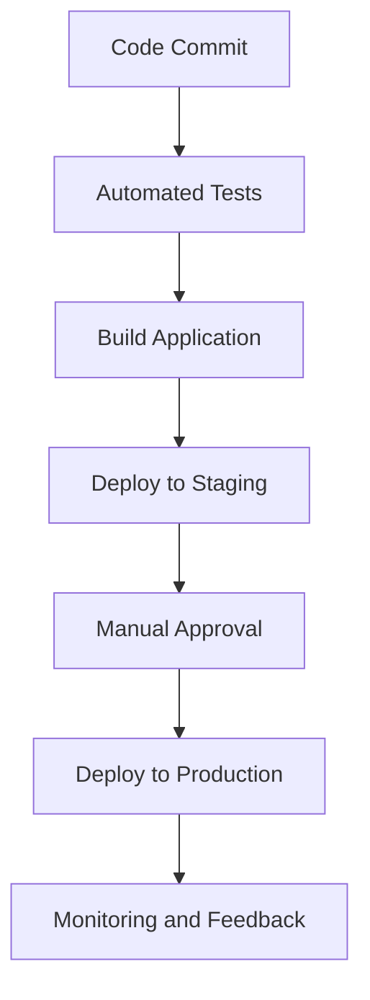

## 13.8 Continuous Deployment

In the fast-paced world of software development, delivering new features and updates swiftly and reliably is crucial. Continuous Deployment (CD) is a practice that automates the release process, ensuring that every change to the codebase is automatically tested and deployed to production. This approach minimizes human intervention, reduces the risk of errors, and accelerates the delivery of value to users.

### Understanding Continuous Deployment

Continuous Deployment is a software development practice where code changes are automatically built, tested, and deployed to production environments. This process is a part of the broader Continuous Integration/Continuous Deployment (CI/CD) pipeline, which aims to streamline the software development lifecycle.

**Key Benefits of Continuous Deployment:**

- **Speed:** Automates the deployment process, allowing for faster release cycles.
- **Reliability:** Reduces human error by automating repetitive tasks.
- **Feedback:** Provides immediate feedback on the impact of changes in production.
- **Scalability:** Easily scales with the growth of the project and team size.

### Setting Up Deployment Pipelines

To implement Continuous Deployment, you need to set up a deployment pipeline. This pipeline automates the steps from code commit to deployment. Let's explore how you can set up a deployment pipeline using popular tools like AWS CodePipeline and GitHub Actions.

#### AWS CodePipeline

AWS CodePipeline is a continuous integration and delivery service for fast and reliable application updates. It automates the build, test, and deploy phases of your release process.

**Steps to Set Up AWS CodePipeline:**

1. **Create a Pipeline:**
   - Navigate to the AWS CodePipeline console.
   - Click on "Create pipeline" and provide a name for your pipeline.

2. **Source Stage:**
   - Choose a source provider (e.g., AWS CodeCommit, GitHub).
   - Configure the source repository and branch.

3. **Build Stage:**
   - Select a build provider (e.g., AWS CodeBuild).
   - Define the buildspec.yml file to specify build commands.

4. **Deploy Stage:**
   - Choose a deployment provider (e.g., AWS Elastic Beanstalk, AWS Lambda).
   - Configure deployment settings.

5. **Review and Create:**
   - Review the pipeline configuration and click "Create pipeline."

#### GitHub Actions

GitHub Actions is a powerful tool for automating workflows directly from your GitHub repository. It allows you to build, test, and deploy your code with ease.

**Steps to Set Up GitHub Actions:**

1. **Create a Workflow File:**
   - In your GitHub repository, navigate to the "Actions" tab.
   - Click on "New workflow" and select a template or start from scratch.

2. **Define Workflow Steps:**
   - Use YAML syntax to define the steps in your workflow.
   - Include steps for building, testing, and deploying your application.

3. **Trigger the Workflow:**
   - Specify events that trigger the workflow (e.g., push, pull request).
   - Save the workflow file in the `.github/workflows` directory.

**Example GitHub Actions Workflow:**

```yaml
name: CI/CD Pipeline

on:
  push:
    branches:
      - main

jobs:
  build:
    runs-on: ubuntu-latest

    steps:
    - name: Checkout code
      uses: actions/checkout@v2

    - name: Set up Node.js
      uses: actions/setup-node@v2
      with:
        node-version: '14'

    - name: Install dependencies
      run: npm install

    - name: Run tests
      run: npm test

    - name: Build application
      run: npm run build

    - name: Deploy to production
      run: npm run deploy
```

### Deployment Strategies

Choosing the right deployment strategy is crucial for minimizing downtime and ensuring a smooth user experience. Let's explore some common deployment strategies:

#### Blue-Green Deployments

Blue-green deployments involve running two identical production environments, referred to as "blue" and "green." At any time, one environment is live, while the other is idle. When deploying a new version, you switch traffic from the live environment to the idle one.

**Benefits:**

- **Zero Downtime:** Seamless transition between environments.
- **Rollback Capability:** Easy to revert to the previous version if needed.

#### Canary Releases

Canary releases involve deploying a new version to a small subset of users before rolling it out to the entire user base. This approach allows you to monitor the impact of changes and catch any issues early.

**Benefits:**

- **Risk Mitigation:** Limits the exposure of new changes.
- **Feedback:** Provides early feedback from real users.

### Automating Tests, Builds, and Deployments

Automation is at the heart of Continuous Deployment. By automating tests, builds, and deployments, you can ensure that your code is always in a deployable state.

#### Automating Tests

Automated testing is essential for ensuring the quality of your code. Use testing frameworks like Jest or Mocha to write unit tests for your JavaScript applications.

**Example Unit Test with Jest:**

```javascript
// calculator.js
function add(a, b) {
  return a + b;
}

module.exports = add;

// calculator.test.js
const add = require('./calculator');

test('adds 1 + 2 to equal 3', () => {
  expect(add(1, 2)).toBe(3);
});
```

#### Automating Builds

Automate the build process using tools like Webpack or Parcel. These tools bundle your JavaScript code and optimize it for production.

**Example Webpack Configuration:**

```javascript
// webpack.config.js
const path = require('path');

module.exports = {
  entry: './src/index.js',
  output: {
    filename: 'bundle.js',
    path: path.resolve(__dirname, 'dist'),
  },
  mode: 'production',
};
```

#### Automating Deployments

Automate deployments using scripts or tools like AWS CodeDeploy or GitHub Actions. Ensure that your deployment scripts handle tasks like restarting servers or updating configurations.

### Database Migrations and Backward Compatibility

When deploying new versions of your application, consider the impact on your database. Database migrations involve updating the database schema to accommodate new features or changes.

**Considerations for Database Migrations:**

- **Backward Compatibility:** Ensure that new changes do not break existing functionality.
- **Versioning:** Use version control for database schema changes.
- **Testing:** Test migrations in a staging environment before deploying to production.

### Monitoring and Feedback Loops

Monitoring your application post-deployment is crucial for identifying issues and gathering feedback. Use monitoring tools like New Relic or Datadog to track performance and errors.

**Feedback Loops:**

- **User Feedback:** Collect feedback from users to identify areas for improvement.
- **Error Tracking:** Use tools like Sentry to capture and analyze errors in real-time.
- **Performance Monitoring:** Track key performance metrics to ensure optimal performance.

### Visualizing the Continuous Deployment Pipeline

To better understand the flow of a Continuous Deployment pipeline, let's visualize it using a flowchart.



**Description:** This flowchart illustrates the steps in a Continuous Deployment pipeline, from code commit to monitoring and feedback.

### Try It Yourself

Experiment with setting up a simple Continuous Deployment pipeline for a JavaScript application. Start by automating tests and builds using GitHub Actions, and then explore deploying to a cloud provider like AWS or Heroku. Modify the workflow to include additional steps, such as running integration tests or deploying to a staging environment.

### Knowledge Check

- What are the key benefits of Continuous Deployment?
- How can you automate the build process for a JavaScript application?
- What is the difference between blue-green deployments and canary releases?
- Why is monitoring important in a Continuous Deployment pipeline?

### Conclusion

Continuous Deployment is a powerful practice that automates the release process, enabling faster and more reliable software delivery. By setting up deployment pipelines, automating tests and builds, and implementing effective deployment strategies, you can streamline your development workflow and deliver value to users more efficiently. Remember, this is just the beginning. As you progress, you'll build more complex and interactive applications. Keep experimenting, stay curious, and enjoy the journey!

## Quiz Time!



### What is Continuous Deployment?

- [x] A practice where code changes are automatically built, tested, and deployed to production.
- [ ] A manual process of deploying code to production.
- [ ] A testing framework for JavaScript applications.
- [ ] A version control system for managing code changes.

> **Explanation:** Continuous Deployment is a practice that automates the release process, ensuring that every change to the codebase is automatically tested and deployed to production.

### Which tool can be used to set up a deployment pipeline in AWS?

- [x] AWS CodePipeline
- [ ] GitHub Actions
- [ ] Jenkins
- [ ] Travis CI

> **Explanation:** AWS CodePipeline is a continuous integration and delivery service for fast and reliable application updates.

### What is a benefit of blue-green deployments?

- [x] Zero downtime during deployment
- [ ] Increased manual intervention
- [ ] Longer deployment times
- [ ] Reduced feedback from users

> **Explanation:** Blue-green deployments involve running two identical production environments, allowing for seamless transitions and zero downtime.

### How can you automate tests for a JavaScript application?

- [x] Use testing frameworks like Jest or Mocha
- [ ] Manually run tests after each code change
- [ ] Use a version control system
- [ ] Deploy directly to production without testing

> **Explanation:** Automated testing is essential for ensuring the quality of your code, and frameworks like Jest or Mocha can be used to write and run tests automatically.

### What is the purpose of canary releases?

- [x] Deploy a new version to a small subset of users before a full rollout
- [ ] Deploy changes directly to all users
- [ ] Increase the risk of deployment failures
- [ ] Reduce the need for testing

> **Explanation:** Canary releases involve deploying a new version to a small subset of users, allowing for early feedback and risk mitigation.

### Why is monitoring important in a Continuous Deployment pipeline?

- [x] To identify issues and gather feedback post-deployment
- [ ] To increase deployment times
- [ ] To reduce the need for testing
- [ ] To automate code commits

> **Explanation:** Monitoring is crucial for identifying issues and gathering feedback, ensuring that your application performs optimally in production.

### What is a key consideration for database migrations?

- [x] Ensuring backward compatibility
- [ ] Ignoring version control
- [ ] Deploying without testing
- [ ] Increasing manual intervention

> **Explanation:** When deploying new versions, it's important to ensure that database migrations do not break existing functionality, maintaining backward compatibility.

### What is the role of feedback loops in Continuous Deployment?

- [x] To provide immediate feedback on the impact of changes
- [ ] To increase manual intervention
- [ ] To reduce deployment frequency
- [ ] To automate code commits

> **Explanation:** Feedback loops provide immediate feedback on the impact of changes, helping to identify areas for improvement and ensure a smooth user experience.

### How can you automate the build process for a JavaScript application?

- [x] Use tools like Webpack or Parcel
- [ ] Manually compile code after each change
- [ ] Use a version control system
- [ ] Deploy directly to production without building

> **Explanation:** Tools like Webpack or Parcel can automate the build process, bundling and optimizing your JavaScript code for production.

### Continuous Deployment ensures that every change to the codebase is automatically tested and deployed to production.

- [x] True
- [ ] False

> **Explanation:** Continuous Deployment automates the release process, ensuring that every change to the codebase is automatically tested and deployed to production.




