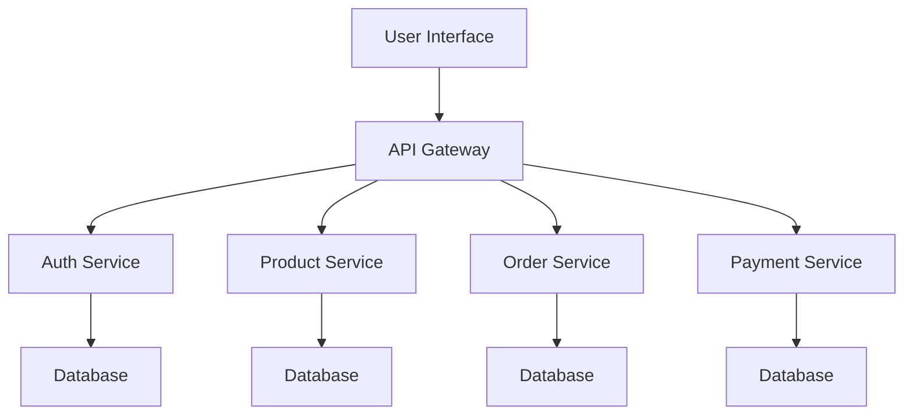

## 13.9 Integrating with APIs and Microservices

In today's interconnected world, building applications that can communicate with other services is crucial. This is where APIs (Application Programming Interfaces) and microservices come into play. In this section, we'll explore how to integrate JavaScript applications with APIs and microservices, enabling you to create modular and scalable solutions. We'll cover the basics of microservices architecture, best practices for API design, and essential considerations for security and reliability.

### Understanding Microservices Architecture

Microservices architecture is a design pattern that structures an application as a collection of loosely coupled services. Each service is responsible for a specific business function and can be developed, deployed, and scaled independently. This approach offers several advantages:

- **Scalability**: Services can be scaled independently based on demand.
- **Flexibility**: Different services can be built using different technologies.
- **Resilience**: Failure in one service doesn't necessarily affect others.
- **Faster Deployment**: Smaller, focused services can be deployed more quickly.

#### Visualizing Microservices Architecture



*Diagram: A typical microservices architecture with an API gateway and various services.*

### Designing Applications that Consume APIs

APIs allow different software systems to communicate with each other. When designing applications that consume APIs, consider the following:

1. **Understand the API**: Before integrating, thoroughly understand the API's capabilities, endpoints, and data formats.
2. **Use HTTP Methods Correctly**: Use GET for retrieving data, POST for creating resources, PUT/PATCH for updating, and DELETE for removing resources.
3. **Handle Responses**: Be prepared to handle different types of responses, including success, error, and redirection.
4. **Implement Error Handling**: Gracefully handle API errors to improve user experience.

#### Example: Consuming a REST API in JavaScript

```javascript
// Fetching data from a REST API
async function fetchData(apiUrl) {
    try {
        const response = await fetch(apiUrl);
        if (!response.ok) {
            throw new Error(`HTTP error! Status: ${response.status}`);
        }
        const data = await response.json();
        console.log(data);
    } catch (error) {
        console.error('Error fetching data:', error);
    }
}

// Example usage
fetchData('https://api.example.com/data');
```

*Code Explanation: This example demonstrates how to fetch data from a REST API using the Fetch API in JavaScript. It includes error handling to manage potential issues with the request.*

### Designing Applications that Expose APIs

When designing APIs for your applications, follow these best practices:

1. **Define Clear Endpoints**: Use descriptive and consistent naming conventions for endpoints.
2. **Use Versioning**: Implement versioning to manage changes and ensure backward compatibility.
3. **Document Your API**: Provide comprehensive documentation to help developers understand how to use your API.
4. **Implement Authentication and Authorization**: Secure your API with authentication (e.g., OAuth) and authorization mechanisms.

#### Example: Creating a Simple API with Express.js

```javascript
const express = require('express');
const app = express();
const port = 3000;

// Middleware to parse JSON requests
app.use(express.json());

// Sample endpoint to get user data
app.get('/api/v1/users', (req, res) => {
    res.json([{ id: 1, name: 'John Doe' }]);
});

// Start the server
app.listen(port, () => {
    console.log(`API server running at http://localhost:${port}`);
});
```

*Code Explanation: This example sets up a simple API using Express.js, a popular Node.js framework. It includes a single endpoint to retrieve user data.*

### Best Practices for API Versioning, Documentation, and Error Handling

#### API Versioning

- **Use URL Versioning**: Include the version number in the URL (e.g., `/api/v1/resource`).
- **Semantic Versioning**: Follow semantic versioning principles to indicate changes.

#### API Documentation

- **Use Tools like Swagger**: Swagger (now OpenAPI) provides a framework for documenting APIs.
- **Provide Examples**: Include examples of requests and responses in your documentation.

#### Error Handling

- **Standardize Error Responses**: Use consistent error formats (e.g., JSON) with meaningful messages.
- **Include Error Codes**: Provide error codes to help developers identify issues.

### Tools for API Development and Testing

Several tools can aid in API development and testing:

- **Postman**: A popular tool for testing APIs, allowing you to send requests and view responses.
- **Swagger**: A framework for designing and documenting APIs.
- **Insomnia**: Another tool for API testing, known for its user-friendly interface.

### Security Considerations: Authentication and Authorization

Security is a critical aspect of API integration. Consider the following:

- **Authentication**: Verify the identity of users or systems accessing your API. OAuth is a widely used protocol for authentication.
- **Authorization**: Determine what resources a user or system can access. Implement role-based access control (RBAC) for fine-grained permissions.
- **Use HTTPS**: Always use HTTPS to encrypt data in transit.

#### Example: Implementing OAuth 2.0

```javascript
// Example of OAuth 2.0 flow
const express = require('express');
const request = require('request');
const app = express();
const port = 3000;

// Endpoint to initiate OAuth flow
app.get('/auth', (req, res) => {
    const authUrl = 'https://auth.example.com/authorize';
    const clientId = 'your-client-id';
    const redirectUri = 'http://localhost:3000/callback';
    res.redirect(`${authUrl}?client_id=${clientId}&redirect_uri=${redirectUri}&response_type=code`);
});

// Callback endpoint to handle OAuth response
app.get('/callback', (req, res) => {
    const code = req.query.code;
    const tokenUrl = 'https://auth.example.com/token';
    const clientId = 'your-client-id';
    const clientSecret = 'your-client-secret';
    const redirectUri = 'http://localhost:3000/callback';

    request.post(tokenUrl, {
        form: {
            code,
            client_id: clientId,
            client_secret: clientSecret,
            redirect_uri: redirectUri,
            grant_type: 'authorization_code'
        }
    }, (error, response, body) => {
        if (error) {
            return res.status(500).send('Error obtaining token');
        }
        const token = JSON.parse(body).access_token;
        res.send(`Access Token: ${token}`);
    });
});

// Start the server
app.listen(port, () => {
    console.log(`OAuth server running at http://localhost:${port}`);
});
```

*Code Explanation: This example demonstrates a basic OAuth 2.0 flow using Express.js. It includes endpoints to initiate the OAuth process and handle the callback with an access token.*

### Network Reliability and Resilience

When integrating with APIs and microservices, network reliability is crucial. Consider the following strategies:

- **Retry Logic**: Implement retry logic for transient errors.
- **Timeouts**: Set appropriate timeouts for network requests.
- **Circuit Breakers**: Use circuit breakers to prevent cascading failures.

#### Example: Implementing Retry Logic

```javascript
// Function to fetch data with retry logic
async function fetchDataWithRetry(url, retries = 3) {
    for (let i = 0; i < retries; i++) {
        try {
            const response = await fetch(url);
            if (!response.ok) {
                throw new Error(`HTTP error! Status: ${response.status}`);
            }
            return await response.json();
        } catch (error) {
            console.error(`Attempt ${i + 1} failed: ${error.message}`);
            if (i === retries - 1) throw error;
        }
    }
}

// Example usage
fetchDataWithRetry('https://api.example.com/data')
    .then(data => console.log(data))
    .catch(error => console.error('Failed to fetch data:', error));
```

*Code Explanation: This example demonstrates how to implement retry logic for network requests using JavaScript. It retries the request up to a specified number of times in case of failure.*

### Try It Yourself

Now that we've covered the basics, try modifying the code examples to suit your own needs. For instance, you can:

- Change the API endpoints to interact with different services.
- Implement additional error handling strategies.
- Experiment with different authentication methods.

### Summary

Integrating with APIs and microservices is a powerful way to build scalable and modular applications. By understanding microservices architecture, designing effective APIs, and implementing best practices for security and reliability, you can create robust solutions that meet the demands of modern software development.

### References and Further Reading

- [MDN Web Docs: Fetch API](https://developer.mozilla.org/en-US/docs/Web/API/Fetch_API)
- [Express.js Official Documentation](https://expressjs.com/)
- [OAuth 2.0 Overview](https://oauth.net/2/)
- [Postman API Testing Tool](https://www.postman.com/)
- [Swagger/OpenAPI Specification](https://swagger.io/specification/)

## Quiz Time!



### What is a key advantage of microservices architecture?

- [x] Scalability
- [ ] Increased complexity
- [ ] Single point of failure
- [ ] Monolithic design

> **Explanation:** Microservices architecture allows services to be scaled independently based on demand, making it highly scalable.

### Which HTTP method is typically used to retrieve data from an API?

- [x] GET
- [ ] POST
- [ ] PUT
- [ ] DELETE

> **Explanation:** The GET method is used to request data from a specified resource.

### What is the purpose of API versioning?

- [x] To manage changes and ensure backward compatibility
- [ ] To increase the complexity of the API
- [ ] To make the API harder to use
- [ ] To reduce the number of endpoints

> **Explanation:** API versioning helps manage changes and ensures that existing clients can continue to use the API without breaking.

### Which tool is commonly used for testing APIs?

- [x] Postman
- [ ] Photoshop
- [ ] Excel
- [ ] Slack

> **Explanation:** Postman is a popular tool for testing APIs, allowing developers to send requests and view responses.

### What is OAuth primarily used for?

- [x] Authentication
- [ ] Data storage
- [ ] Image processing
- [ ] UI design

> **Explanation:** OAuth is a protocol used for authentication, allowing users to grant access to their resources without sharing credentials.

### What should you always use to encrypt data in transit?

- [x] HTTPS
- [ ] HTTP
- [ ] FTP
- [ ] SMTP

> **Explanation:** HTTPS encrypts data in transit, ensuring secure communication between clients and servers.

### What is a circuit breaker used for in network reliability?

- [x] To prevent cascading failures
- [ ] To increase network speed
- [ ] To reduce server load
- [ ] To enhance UI design

> **Explanation:** A circuit breaker is used to prevent cascading failures by stopping requests to a failing service.

### What is a common practice for handling transient errors in network requests?

- [x] Implementing retry logic
- [ ] Ignoring errors
- [ ] Increasing request size
- [ ] Reducing server capacity

> **Explanation:** Implementing retry logic helps handle transient errors by retrying requests after a failure.

### Which tool provides a framework for designing and documenting APIs?

- [x] Swagger
- [ ] Photoshop
- [ ] Excel
- [ ] Slack

> **Explanation:** Swagger (now OpenAPI) provides a framework for designing and documenting APIs.

### True or False: Microservices architecture allows different services to be built using different technologies.

- [x] True
- [ ] False

> **Explanation:** Microservices architecture allows each service to be developed using the most appropriate technology for its specific function.


