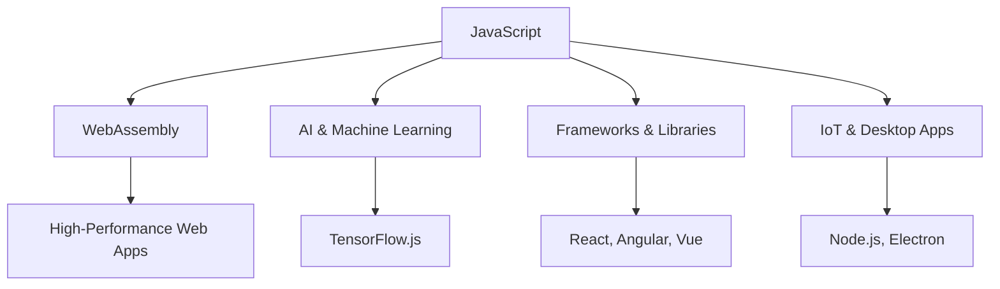

## 14.2 Trends in JavaScript Development

As we delve into the future of JavaScript, it's essential to understand the current trends shaping its development. JavaScript has evolved significantly since its inception, and it continues to adapt to the ever-changing landscape of technology. In this section, we'll explore the rise of frameworks and libraries, the expanding use of JavaScript beyond the browser, the impact of WebAssembly, and the intersection of JavaScript with AI and machine learning. We'll also emphasize the importance of adaptability and continuous learning to stay relevant in this dynamic field.

### The Rise of Frameworks and Libraries

JavaScript frameworks and libraries have become indispensable tools for developers, enabling them to build complex applications more efficiently. Let's explore some of the most popular frameworks and libraries that are currently shaping the JavaScript ecosystem.

#### React

React, developed by Facebook, has revolutionized the way we build user interfaces. Its component-based architecture allows developers to create reusable UI components, making code more maintainable and scalable. React's virtual DOM optimizes rendering performance, providing a smooth user experience.

```javascript
// Example of a simple React component
import React from 'react';

function Greeting(props) {
  return <h1>Hello, {props.name}!</h1>;
}

export default Greeting;
```

React's popularity has led to the development of a rich ecosystem of tools and libraries, such as Redux for state management and Next.js for server-side rendering.

#### Angular

Angular, maintained by Google, is a comprehensive framework for building dynamic web applications. It provides a robust set of features, including two-way data binding, dependency injection, and a powerful CLI for scaffolding projects.

```javascript
// Example of an Angular component
import { Component } from '@angular/core';

@Component({
  selector: 'app-greeting',
  template: '<h1>Hello, {{ name }}!</h1>'
})
export class GreetingComponent {
  name: string = 'World';
}
```

Angular's strong typing with TypeScript enhances code quality and maintainability, making it a preferred choice for large-scale enterprise applications.

#### Vue.js

Vue.js is a progressive framework that has gained popularity for its simplicity and flexibility. It allows developers to incrementally adopt its features, making it suitable for both small and large projects.

```javascript
// Example of a Vue.js component
<template>
  <h1>Hello, {{ name }}!</h1>
</template>

<script>
export default {
  data() {
    return {
      name: 'World'
    };
  }
};
</script>
```

Vue's gentle learning curve and extensive documentation have contributed to its widespread adoption, especially among developers new to JavaScript frameworks.

### Expanding Use of JavaScript Beyond the Browser

JavaScript is no longer confined to the browser. Its versatility has led to its adoption in various domains, including server-side development, desktop applications, and the Internet of Things (IoT).

#### Node.js

Node.js has transformed JavaScript into a powerful server-side language. Its non-blocking, event-driven architecture makes it ideal for building scalable network applications. With Node.js, developers can use JavaScript for both front-end and back-end development, fostering a unified development environment.

```javascript
// Example of a simple Node.js server
const http = require('http');

const server = http.createServer((req, res) => {
  res.statusCode = 200;
  res.setHeader('Content-Type', 'text/plain');
  res.end('Hello, World!\n');
});

server.listen(3000, () => {
  console.log('Server running at http://localhost:3000/');
});
```

Node.js's package manager, npm, provides access to a vast repository of open-source libraries, further enhancing its capabilities.

#### Electron

Electron enables developers to build cross-platform desktop applications using web technologies. By combining Node.js with Chromium, Electron allows JavaScript applications to run on Windows, macOS, and Linux with a single codebase.

```javascript
// Example of a basic Electron application
const { app, BrowserWindow } = require('electron');

function createWindow() {
  const win = new BrowserWindow({
    width: 800,
    height: 600,
    webPreferences: {
      nodeIntegration: true
    }
  });

  win.loadFile('index.html');
}

app.whenReady().then(createWindow);
```

Electron has been used to create popular applications like Visual Studio Code and Slack, demonstrating its potential for desktop development.

#### JavaScript in IoT

JavaScript's lightweight nature and extensive libraries make it a suitable choice for IoT applications. Platforms like Johnny-Five and Node-RED allow developers to control hardware devices and build IoT solutions using JavaScript.

```javascript
// Example of controlling an LED with Johnny-Five
const { Board, Led } = require('johnny-five');
const board = new Board();

board.on('ready', () => {
  const led = new Led(13);
  led.blink(500);
});
```

JavaScript's role in IoT is expected to grow as more devices become connected, offering new opportunities for innovation.

### The Impact of WebAssembly

WebAssembly (Wasm) is a binary instruction format that enables high-performance execution of code on the web. It allows developers to run code written in languages like C, C++, and Rust alongside JavaScript, unlocking new possibilities for web applications.

#### Enhancing Performance

WebAssembly's performance benefits are particularly evident in computationally intensive tasks, such as gaming, video editing, and scientific simulations. By offloading these tasks to WebAssembly, developers can achieve near-native performance in the browser.

```javascript
// Example of compiling C code to WebAssembly
#include <stdio.h>

int main() {
  printf("Hello, WebAssembly!\n");
  return 0;
}
```

WebAssembly's integration with JavaScript allows developers to leverage existing JavaScript libraries while benefiting from the performance gains of compiled languages.

#### Expanding Language Support

WebAssembly's language-agnostic nature has led to the development of tools and compilers that support a wide range of programming languages. This opens the door for developers with diverse backgrounds to contribute to web development, fostering a more inclusive ecosystem.

#### WebAssembly and JavaScript Interoperability

WebAssembly and JavaScript can work together seamlessly, with JavaScript serving as the glue between WebAssembly modules and the web platform. This interoperability allows developers to build complex applications that leverage the strengths of both technologies.

### AI, Machine Learning, and JavaScript

The intersection of AI, machine learning, and JavaScript is an exciting frontier that is transforming the way we build applications. JavaScript's accessibility and widespread adoption make it an attractive choice for integrating AI and machine learning capabilities into web applications.

#### TensorFlow.js

TensorFlow.js is a powerful library that brings machine learning to JavaScript. It allows developers to train and deploy machine learning models directly in the browser, enabling real-time predictions and interactions.

```javascript
// Example of a simple TensorFlow.js model
import * as tf from '@tensorflow/tfjs';

const model = tf.sequential();
model.add(tf.layers.dense({ units: 1, inputShape: [1] }));
model.compile({ loss: 'meanSquaredError', optimizer: 'sgd' });

const xs = tf.tensor2d([1, 2, 3, 4], [4, 1]);
const ys = tf.tensor2d([1, 3, 5, 7], [4, 1]);

model.fit(xs, ys, { epochs: 500 }).then(() => {
  model.predict(tf.tensor2d([5], [1, 1])).print();
});
```

TensorFlow.js empowers developers to create interactive and intelligent web applications without relying on server-side processing.

#### Natural Language Processing (NLP)

JavaScript libraries like Natural and Compromise provide tools for natural language processing, enabling developers to build applications that understand and respond to human language.

```javascript
// Example of basic NLP with Compromise
const nlp = require('compromise');

const doc = nlp('Hello, how can I help you today?');
console.log(doc.sentences().out('text'));
```

NLP capabilities can enhance user experiences by enabling chatbots, sentiment analysis, and language translation within web applications.

### Embracing Adaptability and Continuous Learning

In the fast-paced world of JavaScript development, staying current with the latest trends and technologies is crucial. Here are some strategies to help you remain adaptable and continuously improve your skills.

#### Engage with the Community

Participate in online forums, attend conferences, and join local meetups to connect with other developers and learn from their experiences. The JavaScript community is vibrant and welcoming, offering numerous opportunities for collaboration and knowledge sharing.

#### Explore New Tools and Technologies

Experiment with new frameworks, libraries, and tools to broaden your skill set and stay ahead of the curve. Embrace the mindset of a lifelong learner, and don't be afraid to step outside your comfort zone.

#### Contribute to Open Source

Contributing to open-source projects is a great way to gain practical experience, improve your coding skills, and give back to the community. It also provides an opportunity to collaborate with developers from around the world and learn from their expertise.

#### Stay Informed

Follow industry news, subscribe to newsletters, and read blogs to keep up with the latest developments in JavaScript and web development. Staying informed will help you anticipate changes and adapt your skills accordingly.

### Visualizing JavaScript's Interaction with Modern Technologies

To better understand how JavaScript interacts with modern technologies, let's visualize some of these interactions using Mermaid.js diagrams.



**Diagram Description:** This diagram illustrates the various domains where JavaScript is making an impact, including WebAssembly, AI and machine learning, frameworks and libraries, and its use in IoT and desktop applications.

### Conclusion

As we have explored, JavaScript is at the forefront of many exciting trends in software development. From the rise of powerful frameworks and libraries to its expanding role beyond the browser, JavaScript continues to evolve and adapt to new challenges. The integration of WebAssembly and the intersection with AI and machine learning further demonstrate JavaScript's versatility and potential.

To thrive in this dynamic environment, it's essential to embrace adaptability and continuous learning. By staying informed, engaging with the community, and exploring new tools and technologies, you can ensure that your skills remain relevant and valuable in the ever-changing landscape of JavaScript development.

Remember, this is just the beginning. As you progress, you'll build more complex and interactive applications, leveraging the latest innovations in JavaScript. Keep experimenting, stay curious, and enjoy the journey!

## Quiz Time!



### Which JavaScript framework is known for its component-based architecture?

- [x] React
- [ ] Angular
- [ ] Vue.js
- [ ] Node.js

> **Explanation:** React is known for its component-based architecture, which allows developers to create reusable UI components.

### What is the primary advantage of using WebAssembly with JavaScript?

- [x] Enhanced performance for computationally intensive tasks
- [ ] Easier syntax
- [ ] Better styling capabilities
- [ ] Improved debugging tools

> **Explanation:** WebAssembly enhances performance, especially for computationally intensive tasks, by allowing code written in languages like C and C++ to run alongside JavaScript.

### Which library enables machine learning in JavaScript?

- [ ] Compromise
- [ ] Johnny-Five
- [x] TensorFlow.js
- [ ] Natural

> **Explanation:** TensorFlow.js is a library that brings machine learning capabilities to JavaScript, allowing developers to train and deploy models in the browser.

### What is a key feature of Node.js?

- [ ] Two-way data binding
- [ ] Component-based architecture
- [x] Non-blocking, event-driven architecture
- [ ] Strong typing with TypeScript

> **Explanation:** Node.js is known for its non-blocking, event-driven architecture, which makes it ideal for building scalable network applications.

### Which JavaScript framework is maintained by Google?

- [ ] React
- [x] Angular
- [ ] Vue.js
- [ ] Electron

> **Explanation:** Angular is maintained by Google and is a comprehensive framework for building dynamic web applications.

### What is the purpose of Electron in JavaScript development?

- [ ] To enhance web styling
- [x] To build cross-platform desktop applications
- [ ] To improve server-side performance
- [ ] To manage state in web applications

> **Explanation:** Electron enables developers to build cross-platform desktop applications using web technologies like JavaScript, HTML, and CSS.

### Which of the following is a strategy for staying current with JavaScript trends?

- [x] Engaging with the community
- [ ] Avoiding new technologies
- [ ] Sticking to one framework
- [ ] Ignoring industry news

> **Explanation:** Engaging with the community is a valuable strategy for staying informed and current with the latest trends in JavaScript development.

### What is Johnny-Five used for in JavaScript?

- [ ] Machine learning
- [x] Controlling hardware devices in IoT
- [ ] Natural language processing
- [ ] Building web applications

> **Explanation:** Johnny-Five is a JavaScript library used for controlling hardware devices, making it suitable for IoT applications.

### How does WebAssembly benefit web applications?

- [x] By providing near-native performance
- [ ] By simplifying HTML structure
- [ ] By enhancing CSS styling
- [ ] By improving JavaScript syntax

> **Explanation:** WebAssembly benefits web applications by providing near-native performance, especially for computationally intensive tasks.

### True or False: JavaScript is only used for front-end development.

- [ ] True
- [x] False

> **Explanation:** False. JavaScript is used for both front-end and back-end development, thanks to environments like Node.js, and it is also used in other domains like IoT and desktop applications.


