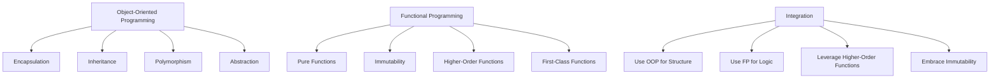

## 14.3 OOP vs. Functional Programming: A Comprehensive Revisit

In the world of software development, choosing the right programming paradigm can significantly impact the design, maintainability, and scalability of your applications. Two of the most prominent paradigms are Object-Oriented Programming (OOP) and Functional Programming (FP). Each has its own philosophy, strengths, and weaknesses. In this section, we will delve into these paradigms, compare their core concepts, discuss their benefits and trade-offs, and explore how they can be integrated to create robust JavaScript applications.

### Understanding Object-Oriented Programming (OOP)

**Object-Oriented Programming (OOP)** is a paradigm centered around objects, which are instances of classes. These objects encapsulate data and behavior, promoting modularity and reuse. The core principles of OOP include:

- **Encapsulation**: Bundling data and methods that operate on the data within a single unit or class. This hides the internal state of the object from the outside world.
- **Inheritance**: Creating new classes based on existing ones, allowing for code reuse and the creation of hierarchical relationships.
- **Polymorphism**: Allowing objects to be treated as instances of their parent class, enabling a single interface to represent different underlying forms (data types).
- **Abstraction**: Simplifying complex systems by modeling classes based on essential characteristics, while hiding unnecessary details.

#### Example of OOP in JavaScript

```javascript
class Animal {
  constructor(name) {
    this.name = name;
  }

  speak() {
    console.log(`${this.name} makes a noise.`);
  }
}

class Dog extends Animal {
  speak() {
    console.log(`${this.name} barks.`);
  }
}

const dog = new Dog('Rex');
dog.speak(); // Rex barks.
```

In this example, we define a base class `Animal` and a derived class `Dog`. The `Dog` class inherits from `Animal` and overrides the `speak` method, demonstrating polymorphism.

### Understanding Functional Programming (FP)

**Functional Programming (FP)** is a paradigm that treats computation as the evaluation of mathematical functions and avoids changing state or mutable data. Its core principles include:

- **Pure Functions**: Functions that have no side effects and return the same output given the same input.
- **Immutability**: Data cannot be modified after it is created, promoting safer and more predictable code.
- **First-Class Functions**: Functions are treated as first-class citizens, meaning they can be assigned to variables, passed as arguments, and returned from other functions.
- **Higher-Order Functions**: Functions that take other functions as arguments or return them as results.

#### Example of FP in JavaScript

```javascript
const numbers = [1, 2, 3, 4, 5];

// Pure function
const double = (n) => n * 2;

// Higher-order function
const map = (arr, fn) => arr.map(fn);

const doubledNumbers = map(numbers, double);
console.log(doubledNumbers); // [2, 4, 6, 8, 10]
```

Here, `double` is a pure function, and `map` is a higher-order function that applies `double` to each element of the `numbers` array.

### Benefits and Trade-offs of OOP

#### Benefits

- **Modularity**: OOP allows developers to break down complex problems into smaller, manageable pieces (objects).
- **Reusability**: Through inheritance and polymorphism, code can be reused across different parts of an application.
- **Scalability**: OOP systems can be easily extended with new classes and objects without affecting existing code.
- **Maintainability**: Encapsulation helps in maintaining and updating code by isolating changes to specific classes.

#### Trade-offs

- **Complexity**: OOP can introduce unnecessary complexity, especially in simple applications.
- **Overhead**: The abstraction layers in OOP can lead to performance overhead.
- **Tight Coupling**: Inheritance can lead to tightly coupled code, making changes difficult.

### Benefits and Trade-offs of FP

#### Benefits

- **Simplicity**: FP encourages simple, declarative code that is easier to reason about.
- **Predictability**: Pure functions and immutability lead to more predictable code with fewer bugs.
- **Concurrency**: FP is well-suited for concurrent programming as it avoids shared state.
- **Testability**: Pure functions are easier to test due to their deterministic nature.

#### Trade-offs

- **Learning Curve**: FP concepts can be challenging for those accustomed to imperative programming.
- **Performance**: Immutable data structures can sometimes lead to performance issues.
- **Verbosity**: FP can lead to verbose code, especially when dealing with complex data transformations.

### When to Use OOP

OOP is particularly effective in scenarios where:

- You need to model real-world entities with complex relationships.
- Your application requires a high degree of modularity and reusability.
- You are building large-scale applications that need to be easily extendable.

### When to Use FP

FP shines in situations where:

- You need to perform complex data transformations.
- Your application benefits from a high degree of concurrency.
- You want to minimize side effects and improve code predictability.

### Integrating OOP and FP

JavaScript, being a multi-paradigm language, allows developers to leverage both OOP and FP. Integrating these paradigms can lead to more flexible and powerful applications. Here are some strategies for combining OOP and FP:

- **Use OOP for Structure, FP for Logic**: Use classes and objects to structure your application, while employing functional techniques for data processing and transformations.
- **Leverage Higher-Order Functions**: Use higher-order functions to enhance the behavior of objects without modifying their structure.
- **Embrace Immutability in OOP**: Incorporate immutable data structures within your OOP design to reduce side effects and improve reliability.

#### Example of Integrating OOP and FP

```javascript
class Cart {
  constructor() {
    this.items = [];
  }

  addItem(item) {
    this.items = [...this.items, item]; // Immutability
  }

  calculateTotal() {
    return this.items.reduce((total, item) => total + item.price, 0); // FP
  }
}

const cart = new Cart();
cart.addItem({ name: 'Apple', price: 1.2 });
cart.addItem({ name: 'Banana', price: 0.8 });
console.log(cart.calculateTotal()); // 2.0
```

In this example, we use a class to represent a shopping cart (OOP), while employing immutable operations and functional techniques to manage items and calculate the total price (FP).

### Visualizing the Paradigms

To better understand the relationship between OOP and FP, let's visualize their core concepts and how they can be integrated:



### Encouraging an Open-Minded Approach

As developers, it's crucial to remain open-minded and adaptable. The choice between OOP and FP should be guided by the specific needs of your project rather than personal preference. Here are some tips for choosing the right paradigm:

- **Analyze the Problem Domain**: Consider the nature of the problem you're solving. Is it more object-oriented or functionally oriented?
- **Consider Team Expertise**: Leverage the strengths and expertise of your team. If your team is more familiar with one paradigm, it might be more efficient to use it.
- **Evaluate Long-Term Maintainability**: Consider how easy it will be to maintain and extend your codebase in the future.
- **Experiment and Iterate**: Don't be afraid to experiment with different paradigms and iterate on your design.

### Try It Yourself

To solidify your understanding, try modifying the examples provided:

- **OOP Example**: Add a new class `Cat` that inherits from `Animal` and overrides the `speak` method.
- **FP Example**: Create a new pure function that filters out odd numbers from an array.
- **Integration Example**: Add a method to the `Cart` class that applies a discount to the total price using a higher-order function.

### Conclusion

In conclusion, both Object-Oriented Programming and Functional Programming offer valuable tools and techniques for building robust JavaScript applications. By understanding their core concepts, benefits, and trade-offs, you can make informed decisions about when and how to use each paradigm. Remember, the key to successful software development is choosing the right tool for the job and being open to integrating different paradigms to achieve the best results.

## Quiz Time!



### What is a core principle of Object-Oriented Programming?

- [x] Encapsulation
- [ ] Immutability
- [ ] First-Class Functions
- [ ] Pure Functions

> **Explanation:** Encapsulation is a core principle of OOP, which involves bundling data and methods that operate on the data within a single unit or class.

### Which of the following is a characteristic of Functional Programming?

- [ ] Inheritance
- [x] Pure Functions
- [ ] Polymorphism
- [ ] Abstraction

> **Explanation:** Pure functions are a characteristic of Functional Programming, which are functions that have no side effects and return the same output given the same input.

### What is a benefit of using OOP?

- [x] Modularity
- [ ] Verbosity
- [ ] Performance Overhead
- [ ] Complexity

> **Explanation:** Modularity is a benefit of OOP, allowing developers to break down complex problems into smaller, manageable pieces.

### What is a trade-off of Functional Programming?

- [ ] Modularity
- [ ] Reusability
- [x] Performance
- [ ] Maintainability

> **Explanation:** Performance can be a trade-off in Functional Programming due to the use of immutable data structures.

### When is OOP most effective?

- [x] When modeling real-world entities with complex relationships
- [ ] When performing complex data transformations
- [ ] When minimizing side effects
- [ ] When improving code predictability

> **Explanation:** OOP is most effective when modeling real-world entities with complex relationships, as it allows for a high degree of modularity and reusability.

### How can OOP and FP be integrated in JavaScript?

- [x] Use OOP for structure and FP for logic
- [ ] Use FP for structure and OOP for logic
- [ ] Avoid using both paradigms together
- [ ] Use only one paradigm at a time

> **Explanation:** OOP can be used for structure, while FP can be used for logic, allowing for flexible and powerful applications.

### What is a higher-order function?

- [x] A function that takes other functions as arguments or returns them as results
- [ ] A function that is always pure
- [ ] A function that has no side effects
- [ ] A function that is part of a class

> **Explanation:** A higher-order function is a function that takes other functions as arguments or returns them as results, a key concept in Functional Programming.

### What is a benefit of using FP?

- [ ] Complexity
- [ ] Tight Coupling
- [x] Predictability
- [ ] Performance Overhead

> **Explanation:** Predictability is a benefit of FP, as pure functions and immutability lead to more predictable code with fewer bugs.

### What is a common trade-off of OOP?

- [ ] Simplicity
- [x] Complexity
- [ ] Predictability
- [ ] Concurrency

> **Explanation:** Complexity is a common trade-off of OOP, as it can introduce unnecessary complexity, especially in simple applications.

### True or False: JavaScript is a multi-paradigm language.

- [x] True
- [ ] False

> **Explanation:** True. JavaScript is a multi-paradigm language, meaning it supports multiple programming paradigms, including Object-Oriented Programming and Functional Programming.


