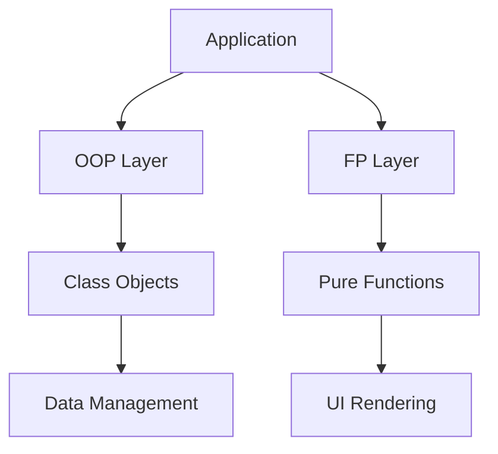

## 14.4 Embracing Hybrid Approaches

In the ever-evolving landscape of software development, the ability to adapt and integrate different programming paradigms is crucial. JavaScript, as a multi-paradigm language, offers the flexibility to combine Object-Oriented Programming (OOP) and Functional Programming (FP) techniques. This hybrid approach can lead to more versatile, maintainable, and efficient applications. In this section, we will explore how to effectively embrace hybrid programming paradigms in JavaScript, providing examples, discussing the benefits, and encouraging experimentation.

### Understanding the Hybrid Approach

Before diving into examples and benefits, let's clarify what we mean by a hybrid approach. In programming, a hybrid approach involves combining elements from different paradigms to leverage the strengths of each. In the context of JavaScript, this means integrating OOP's encapsulation, inheritance, and polymorphism with FP's immutability, first-class functions, and higher-order functions.

#### Key Concepts of OOP and FP

- **Object-Oriented Programming (OOP):** Focuses on creating objects that contain both data and methods. Key concepts include encapsulation, inheritance, and polymorphism.
  
- **Functional Programming (FP):** Emphasizes the use of pure functions, immutability, and higher-order functions. It avoids shared state and side effects.

### Benefits of a Hybrid Approach

1. **Improved Code Clarity:** By using the best practices from both paradigms, you can write code that is both clear and concise. OOP can help organize code into logical units, while FP can simplify operations with pure functions.

2. **Enhanced Flexibility:** A hybrid approach allows you to choose the right tool for the job. Some problems are best solved with OOP, while others benefit from FP techniques.

3. **Increased Reusability:** Combining paradigms can lead to more reusable code components. For instance, using FP's higher-order functions with OOP's class structures can create highly modular code.

4. **Better Maintainability:** By reducing side effects and shared state through FP, and organizing code through OOP, you can create applications that are easier to maintain and extend.

### Patterns Utilizing Both OOP and FP

Let's explore some patterns that effectively combine OOP and FP concepts.

#### 1. The Strategy Pattern with Higher-Order Functions

The Strategy Pattern is an OOP design pattern that defines a family of algorithms, encapsulates each one, and makes them interchangeable. By using higher-order functions from FP, we can enhance this pattern.

```javascript
class PaymentProcessor {
  constructor(strategy) {
    this.strategy = strategy;
  }

  processPayment(amount) {
    return this.strategy(amount);
  }
}

// Functional strategies
const creditCardStrategy = (amount) => `Paid ${amount} using Credit Card`;
const paypalStrategy = (amount) => `Paid ${amount} using PayPal`;

// Usage
const creditCardPayment = new PaymentProcessor(creditCardStrategy);
console.log(creditCardPayment.processPayment(100)); // Paid 100 using Credit Card

const paypalPayment = new PaymentProcessor(paypalStrategy);
console.log(paypalPayment.processPayment(200)); // Paid 200 using PayPal
```

**Explanation:** Here, the `PaymentProcessor` class uses a strategy function to process payments. The strategies are defined as pure functions, allowing for easy substitution and testing.

#### 2. The Observer Pattern with Functional Composition

The Observer Pattern is another OOP pattern that can benefit from FP. It allows an object, known as the subject, to maintain a list of dependents, called observers, and notify them of any state changes.

```javascript
class Subject {
  constructor() {
    this.observers = [];
  }

  addObserver(observer) {
    this.observers.push(observer);
  }

  notifyObservers(data) {
    this.observers.forEach(observer => observer(data));
  }
}

// Functional observers
const logObserver = (data) => console.log(`Log: ${data}`);
const alertObserver = (data) => alert(`Alert: ${data}`);

// Usage
const subject = new Subject();
subject.addObserver(logObserver);
subject.addObserver(alertObserver);

subject.notifyObservers('New data available');
```

**Explanation:** Observers are implemented as functions, allowing for easy composition and reuse. This makes the pattern more flexible and easier to extend.

### Modern Languages and Frameworks Supporting Multi-Paradigm Programming

JavaScript is not alone in supporting multi-paradigm programming. Many modern languages and frameworks are designed to facilitate a hybrid approach.

- **TypeScript:** As a superset of JavaScript, TypeScript adds static typing and other features that enhance both OOP and FP, making it easier to create robust hybrid applications.

- **React:** While primarily a UI library, React encourages a functional approach with components as pure functions, yet it also supports OOP concepts through class components.

- **Vue.js:** Vue supports both OOP and FP, allowing developers to choose between class-based components and functional components.

- **Node.js:** On the server side, Node.js supports both paradigms, enabling developers to build scalable applications using a combination of OOP and FP techniques.

### Practical Benefits of Hybrid Approaches

#### Improved Code Clarity

By combining OOP and FP, you can achieve code that is both organized and concise. OOP helps structure your code into logical units, while FP allows for clear and concise operations.

#### Enhanced Flexibility

A hybrid approach provides the flexibility to choose the right tool for the job. Some problems are best solved with OOP, while others benefit from FP techniques.

#### Increased Reusability

Combining paradigms can lead to more reusable code components. For instance, using FP's higher-order functions with OOP's class structures can create highly modular code.

#### Better Maintainability

By reducing side effects and shared state through FP, and organizing code through OOP, you can create applications that are easier to maintain and extend.

### Encouraging Experimentation with Hybrid Techniques

The best way to understand the benefits of a hybrid approach is to experiment with it. Here are some suggestions to get you started:

- **Refactor Existing Code:** Take a piece of code you've written and refactor it using a hybrid approach. Identify areas where OOP or FP could improve clarity or flexibility.

- **Build a Small Project:** Create a small project that combines both paradigms. For example, build a simple to-do list application using OOP for data management and FP for rendering logic.

- **Explore Libraries and Frameworks:** Look into libraries and frameworks that support multi-paradigm programming. Experiment with their features to see how they can enhance your applications.

- **Collaborate with Others:** Work with other developers who have experience with different paradigms. Share ideas and learn from each other's approaches.

### Visualizing Hybrid Approaches

To better understand how hybrid approaches work, let's visualize a simple application architecture that combines OOP and FP.



**Description:** In this diagram, the application is divided into an OOP layer and an FP layer. The OOP layer handles data management through class objects, while the FP layer manages UI rendering with pure functions.

### Conclusion

Embracing hybrid approaches in JavaScript allows you to harness the strengths of both OOP and FP. By combining these paradigms, you can create applications that are more versatile, maintainable, and efficient. As you continue your journey in programming, remember to explore and experiment with different techniques. The more you practice, the more you'll discover the best ways to leverage hybrid approaches in your projects.

### Try It Yourself

To solidify your understanding, try modifying the code examples provided. For instance, add a new payment strategy or observer function. Experiment with different combinations of OOP and FP to see how they can enhance your applications.

### References and Further Reading

- [MDN Web Docs: JavaScript](https://developer.mozilla.org/en-US/docs/Web/JavaScript)
- [Eloquent JavaScript](https://eloquentjavascript.net/)
- [You Don't Know JS](https://github.com/getify/You-Dont-Know-JS)

## Quiz Time!



### What is a hybrid approach in programming?

- [x] Combining elements from different paradigms to leverage the strengths of each.
- [ ] Using only Object-Oriented Programming techniques.
- [ ] Using only Functional Programming techniques.
- [ ] Avoiding the use of any programming paradigms.

> **Explanation:** A hybrid approach involves combining different paradigms, such as OOP and FP, to take advantage of their strengths.

### Which of the following is a benefit of a hybrid approach?

- [x] Improved code clarity
- [x] Enhanced flexibility
- [ ] Increased complexity
- [ ] Reduced maintainability

> **Explanation:** A hybrid approach can improve code clarity and flexibility by allowing the use of the best practices from multiple paradigms.

### What is the Strategy Pattern?

- [x] A pattern that defines a family of algorithms, encapsulates each one, and makes them interchangeable.
- [ ] A pattern that focuses on creating objects that contain both data and methods.
- [ ] A pattern that emphasizes the use of pure functions and immutability.
- [ ] A pattern that avoids shared state and side effects.

> **Explanation:** The Strategy Pattern is an OOP design pattern that allows algorithms to be interchangeable.

### How can Functional Programming enhance the Observer Pattern?

- [x] By implementing observers as pure functions for easy composition and reuse.
- [ ] By using classes to encapsulate observer logic.
- [ ] By avoiding the use of functions altogether.
- [ ] By increasing shared state among observers.

> **Explanation:** Implementing observers as pure functions allows for easy composition and reuse, enhancing the flexibility of the Observer Pattern.

### Which modern language supports multi-paradigm programming?

- [x] TypeScript
- [x] JavaScript
- [ ] Assembly
- [ ] COBOL

> **Explanation:** TypeScript and JavaScript support multi-paradigm programming, allowing the use of both OOP and FP techniques.

### What is a key concept of Functional Programming?

- [x] Immutability
- [ ] Inheritance
- [ ] Polymorphism
- [ ] Encapsulation

> **Explanation:** Immutability is a key concept in Functional Programming, emphasizing the use of data that cannot be changed.

### How can you experiment with hybrid approaches?

- [x] Refactor existing code using a hybrid approach.
- [x] Build a small project combining both paradigms.
- [ ] Avoid using any paradigms.
- [ ] Only use one paradigm at a time.

> **Explanation:** Experimenting with hybrid approaches involves refactoring code and building projects that combine OOP and FP.

### What does the diagram in the article illustrate?

- [x] An application architecture combining OOP and FP.
- [ ] A purely Object-Oriented architecture.
- [ ] A purely Functional architecture.
- [ ] An architecture without any paradigms.

> **Explanation:** The diagram illustrates an application architecture that combines OOP and FP to manage different aspects of the application.

### What is a benefit of using higher-order functions in OOP?

- [x] They allow for easy substitution and testing of strategies.
- [ ] They increase the complexity of the code.
- [ ] They reduce code clarity.
- [ ] They eliminate the need for encapsulation.

> **Explanation:** Higher-order functions allow for easy substitution and testing of strategies, enhancing the flexibility of OOP patterns.

### True or False: A hybrid approach can lead to more maintainable applications.

- [x] True
- [ ] False

> **Explanation:** By combining OOP and FP, a hybrid approach can reduce side effects and shared state, leading to more maintainable applications.


