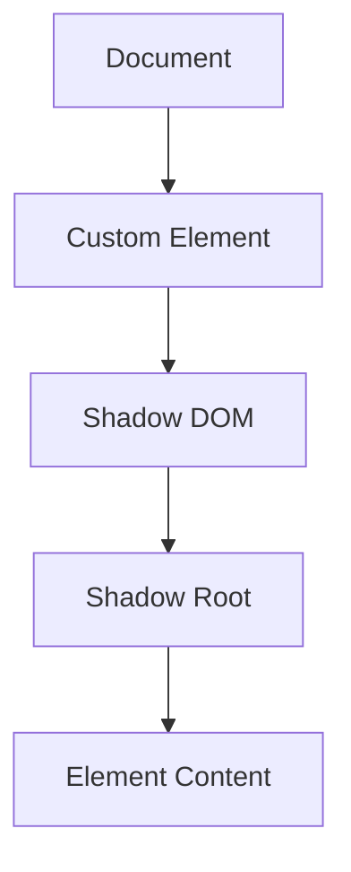

## 14.5 The Role of OOP in Web Components

In the ever-evolving landscape of web development, creating modular, reusable, and maintainable code is crucial. Web Components offer a powerful way to achieve this by allowing developers to define custom HTML elements with encapsulated functionality. In this section, we will explore how Object-Oriented Programming (OOP) principles can be applied to Web Components, enhancing their reusability and encapsulation. We will delve into the key specifications of Web Components, demonstrate how to define custom elements using ES6 classes, and discuss the benefits of using OOP in component-based development.

### Introduction to Web Components

Web Components are a suite of technologies that allow developers to create custom, reusable, encapsulated HTML elements. They consist of four main specifications:

1. **Custom Elements**: Define new HTML tags with custom behavior.
2. **Shadow DOM**: Encapsulate the internal structure and style of a component.
3. **HTML Templates**: Define reusable HTML fragments.
4. **HTML Imports** (deprecated): Previously used for loading HTML documents into other documents.

For our discussion, we will focus on Custom Elements and Shadow DOM, as these are the most relevant to OOP principles.

#### Custom Elements

Custom Elements allow developers to define new types of HTML elements. These elements can have their own properties, methods, and lifecycle callbacks, making them powerful tools for creating reusable components.

#### Shadow DOM

The Shadow DOM provides a way to encapsulate the internal structure and style of a component, preventing it from being affected by external styles. This encapsulation is a key aspect of OOP, as it allows developers to create components that are self-contained and independent of the rest of the application.

### Defining Custom Elements Using ES6 Classes

To define a custom element, we use ES6 classes to extend the `HTMLElement` class. This approach aligns with OOP principles, as it allows us to encapsulate the behavior and state of the element within a class.

#### Example: Creating a Custom Button Element

Let's create a simple custom button element to illustrate how ES6 classes can be used to define custom elements.

```javascript
// Define a class that extends HTMLElement
class CustomButton extends HTMLElement {
  constructor() {
    super(); // Always call super() first in the constructor
    this.attachShadow({ mode: 'open' }); // Attach a shadow root to the element

    // Create a button element
    const button = document.createElement('button');
    button.textContent = 'Click me';

    // Append the button to the shadow root
    this.shadowRoot.appendChild(button);

    // Add an event listener to the button
    button.addEventListener('click', () => {
      alert('Button clicked!');
    });
  }
}

// Define the custom element
customElements.define('custom-button', CustomButton);
```

In this example, we define a `CustomButton` class that extends `HTMLElement`. We attach a shadow root to the element and create a button element within it. The button is then appended to the shadow root, and an event listener is added to handle click events.

#### Using the Custom Element

Once the custom element is defined, it can be used in HTML like any other element:

```html
<!DOCTYPE html>
<html lang="en">
<head>
  <meta charset="UTF-8">
  <meta name="viewport" content="width=device-width, initial-scale=1.0">
  <title>Custom Button Example</title>
</head>
<body>
  <!-- Use the custom element -->
  <custom-button></custom-button>

  <script src="custom-button.js"></script>
</body>
</html>
```

### Benefits of Encapsulation and Reusability

One of the primary benefits of using OOP principles in Web Components is encapsulation. By encapsulating the internal structure and behavior of a component, we can ensure that it is self-contained and independent of the rest of the application. This encapsulation allows us to:

- **Prevent Style Conflicts**: The Shadow DOM ensures that the styles of a component do not interfere with the styles of other components or the global styles of the application.
- **Encapsulate Behavior**: By defining the behavior of a component within a class, we can ensure that it is self-contained and does not rely on external scripts or libraries.
- **Promote Reusability**: Custom elements can be reused across different applications and projects without modification, reducing development time and effort.

### Browser Support and Polyfills

Web Components are supported by most modern browsers, including Chrome, Firefox, Safari, and Edge. However, older versions of Internet Explorer do not support Web Components natively. To ensure compatibility across all browsers, developers can use polyfills, which are JavaScript libraries that provide support for Web Components in browsers that do not natively support them.

#### Using Polyfills

To use polyfills, include the following script in your HTML:

```html
<script src="https://unpkg.com/@webcomponents/webcomponentsjs@2.4.4/webcomponents-bundle.js"></script>
```

This script will ensure that your custom elements and Shadow DOM work in all browsers, including older versions of Internet Explorer.

### Advanced Example: Creating a Custom Modal Dialog

Let's create a more advanced example of a custom element: a modal dialog. This example will demonstrate how to use OOP principles to encapsulate the behavior and state of a more complex component.

```javascript
class CustomModal extends HTMLElement {
  constructor() {
    super();
    this.attachShadow({ mode: 'open' });

    // Create the modal container
    const modalContainer = document.createElement('div');
    modalContainer.style.display = 'none';
    modalContainer.style.position = 'fixed';
    modalContainer.style.top = '0';
    modalContainer.style.left = '0';
    modalContainer.style.width = '100%';
    modalContainer.style.height = '100%';
    modalContainer.style.backgroundColor = 'rgba(0, 0, 0, 0.5)';
    modalContainer.style.justifyContent = 'center';
    modalContainer.style.alignItems = 'center';

    // Create the modal content
    const modalContent = document.createElement('div');
    modalContent.style.backgroundColor = '#fff';
    modalContent.style.padding = '20px';
    modalContent.style.borderRadius = '5px';
    modalContent.style.boxShadow = '0 2px 10px rgba(0, 0, 0, 0.1)';

    // Append the modal content to the modal container
    modalContainer.appendChild(modalContent);

    // Append the modal container to the shadow root
    this.shadowRoot.appendChild(modalContainer);

    // Add an event listener to close the modal when clicked outside
    modalContainer.addEventListener('click', (event) => {
      if (event.target === modalContainer) {
        this.close();
      }
    });

    // Store references to the elements
    this.modalContainer = modalContainer;
    this.modalContent = modalContent;
  }

  // Method to open the modal
  open() {
    this.modalContainer.style.display = 'flex';
  }

  // Method to close the modal
  close() {
    this.modalContainer.style.display = 'none';
  }

  // Method to set the content of the modal
  setContent(content) {
    this.modalContent.innerHTML = content;
  }
}

customElements.define('custom-modal', CustomModal);
```

#### Using the Custom Modal

To use the custom modal, we can create an instance of the `CustomModal` element and call its methods to control its behavior:

```html
<!DOCTYPE html>
<html lang="en">
<head>
  <meta charset="UTF-8">
  <meta name="viewport" content="width=device-width, initial-scale=1.0">
  <title>Custom Modal Example</title>
</head>
<body>
  <!-- Use the custom modal element -->
  <custom-modal id="myModal"></custom-modal>

  <button id="openModalButton">Open Modal</button>

  <script src="custom-modal.js"></script>
  <script>
    const modal = document.getElementById('myModal');
    const openModalButton = document.getElementById('openModalButton');

    openModalButton.addEventListener('click', () => {
      modal.setContent('<h1>Hello, World!</h1><p>This is a custom modal dialog.</p>');
      modal.open();
    });
  </script>
</body>
</html>
```

### Visualizing the Interaction

To better understand how Web Components interact with the rest of the application, let's visualize the structure of a custom element using a DOM tree diagram.



**Figure 1: Visualizing the Structure of a Custom Element**

This diagram illustrates how a custom element is structured within the DOM. The custom element contains a shadow DOM, which in turn contains a shadow root and the element's content. This encapsulation ensures that the element's internal structure is isolated from the rest of the document.

### Try It Yourself

To reinforce your understanding of Web Components and OOP, try modifying the examples provided in this section. Here are a few suggestions:

- **Change the Styles**: Modify the styles of the custom button and modal dialog to match your application's design.
- **Add New Features**: Extend the functionality of the custom elements by adding new methods or properties.
- **Create Your Own Elements**: Use the principles discussed in this section to create your own custom elements.

### Key Takeaways

- Web Components allow developers to create custom, reusable, and encapsulated HTML elements.
- OOP principles, such as encapsulation and reusability, enhance the functionality and maintainability of Web Components.
- Custom elements can be defined using ES6 classes, aligning with OOP principles.
- The Shadow DOM provides encapsulation of a component's internal structure and style.
- Polyfills can be used to ensure compatibility with older browsers.

### References and Further Reading

- [MDN Web Docs: Web Components](https://developer.mozilla.org/en-US/docs/Web/Web_Components)
- [W3C: Custom Elements Specification](https://www.w3.org/TR/custom-elements/)
- [WebComponents.org: Introduction to Web Components](https://www.webcomponents.org/introduction)

Remember, this is just the beginning. As you progress, you'll build more complex and interactive web components. Keep experimenting, stay curious, and enjoy the journey!

## Quiz Time!



### What are the key specifications of Web Components?

- [x] Custom Elements and Shadow DOM
- [ ] HTML Imports and CSS Variables
- [ ] JavaScript Modules and Service Workers
- [ ] WebSockets and Local Storage

> **Explanation:** The key specifications of Web Components include Custom Elements and Shadow DOM, which are crucial for creating encapsulated and reusable components.

### How do you define a custom element in JavaScript?

- [x] By extending the HTMLElement class
- [ ] By using the `createElement` method
- [ ] By defining a new HTML tag in the HTML file
- [ ] By using the `document.write` method

> **Explanation:** Custom elements are defined in JavaScript by extending the `HTMLElement` class and using the `customElements.define` method.

### What is the purpose of the Shadow DOM in Web Components?

- [x] To encapsulate the internal structure and style of a component
- [ ] To enhance the performance of web applications
- [ ] To provide a global stylesheet for all components
- [ ] To enable server-side rendering of components

> **Explanation:** The Shadow DOM encapsulates the internal structure and style of a component, preventing it from being affected by external styles.

### Which method is used to attach a shadow root to a custom element?

- [x] `attachShadow({ mode: 'open' })`
- [ ] `createShadowRoot()`
- [ ] `appendChild()`
- [ ] `insertAdjacentHTML()`

> **Explanation:** The `attachShadow({ mode: 'open' })` method is used to attach a shadow root to a custom element, enabling encapsulation of its content.

### What is the benefit of using OOP principles in Web Components?

- [x] Encapsulation and reusability
- [ ] Faster loading times
- [ ] Reduced server load
- [ ] Increased SEO rankings

> **Explanation:** OOP principles, such as encapsulation and reusability, enhance the functionality and maintainability of Web Components.

### How can you ensure compatibility of Web Components with older browsers?

- [x] By using polyfills
- [ ] By writing inline JavaScript
- [ ] By using CSS preprocessors
- [ ] By optimizing images

> **Explanation:** Polyfills are JavaScript libraries that provide support for Web Components in browsers that do not natively support them.

### What is the role of ES6 classes in defining custom elements?

- [x] They encapsulate the behavior and state of the element
- [ ] They improve the performance of the element
- [ ] They provide a global namespace for the element
- [ ] They enable server-side rendering of the element

> **Explanation:** ES6 classes encapsulate the behavior and state of custom elements, aligning with OOP principles.

### Which browsers natively support Web Components?

- [x] Chrome, Firefox, Safari, and Edge
- [ ] Internet Explorer 9 and below
- [ ] Opera Mini and UC Browser
- [ ] Netscape Navigator and Mosaic

> **Explanation:** Modern browsers like Chrome, Firefox, Safari, and Edge natively support Web Components.

### What is the purpose of the `customElements.define` method?

- [x] To register a new custom element
- [ ] To create a new HTML document
- [ ] To attach a shadow root to an element
- [ ] To define a new CSS class

> **Explanation:** The `customElements.define` method is used to register a new custom element with the browser.

### True or False: Web Components can be reused across different applications without modification.

- [x] True
- [ ] False

> **Explanation:** True. Web Components are designed to be reusable across different applications and projects without modification.


