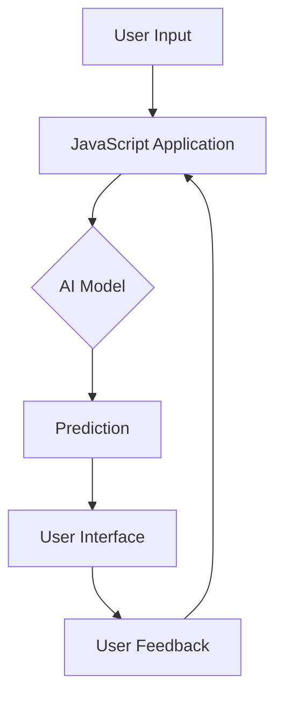

## 14.6 Machine Learning and AI in JavaScript

As we delve into the future of object-oriented programming (OOP) in JavaScript, one of the most exciting frontiers is the integration of machine learning (ML) and artificial intelligence (AI). JavaScript, traditionally seen as a language for web development, is now making significant strides in the AI domain, thanks to powerful libraries like TensorFlow.js. This section will guide you through the basics of using JavaScript for AI applications, leveraging OOP principles to build structured and efficient models.

### Introduction to Machine Learning and AI in JavaScript

Machine learning and AI are transforming industries by enabling systems to learn from data and make intelligent decisions. While Python has been the go-to language for AI development, JavaScript is gaining traction due to its ubiquity on the web and the advent of libraries like TensorFlow.js, which bring ML capabilities to the browser.

#### Why JavaScript for AI?

- **Accessibility**: JavaScript runs in the browser, making AI applications accessible to a wide audience without the need for specialized software.
- **Integration**: JavaScript can seamlessly integrate AI models into web applications, enhancing user experiences with intelligent features.
- **Real-time Processing**: With JavaScript, you can perform real-time data processing and visualization directly in the browser.

### Key Libraries for Machine Learning in JavaScript

Before we dive into building AI models, let's explore some key libraries that facilitate machine learning in JavaScript.

#### TensorFlow.js

TensorFlow.js is a powerful library that allows you to define, train, and run machine learning models entirely in the browser. It supports both pre-trained models and custom model creation, making it versatile for various AI tasks.

```javascript
// Example of loading a pre-trained model with TensorFlow.js
import * as tf from '@tensorflow/tfjs';

// Load a pre-trained model
const model = await tf.loadLayersModel('https://example.com/model.json');

// Use the model to make predictions
const input = tf.tensor2d([[5.1, 3.5, 1.4, 0.2]]);
const prediction = model.predict(input);
prediction.print();
```

#### Brain.js

Brain.js is another popular library for neural networks in JavaScript. It is designed to be simple and easy to use, making it a great choice for beginners.

```javascript
// Example of creating a simple neural network with Brain.js
const brain = require('brain.js');
const net = new brain.NeuralNetwork();

// Train the network
net.train([
  { input: [0, 0], output: [0] },
  { input: [0, 1], output: [1] },
  { input: [1, 0], output: [1] },
  { input: [1, 1], output: [0] }
]);

// Make a prediction
const output = net.run([1, 0]);
console.log(output); // Output close to [1]
```

### Building AI Models Using OOP Structures

Object-oriented programming provides a structured approach to building AI models, allowing for modular and reusable code. Let's explore how we can represent AI components using classes and objects.

#### Representing Neural Networks with Classes

In OOP, a neural network can be represented as a class, encapsulating its properties and behaviors. This approach allows for easy management and manipulation of network parameters.

```javascript
class NeuralNetwork {
  constructor(layers) {
    this.layers = layers;
    this.model = tf.sequential();
    this.initializeModel();
  }

  initializeModel() {
    this.layers.forEach(layer => {
      this.model.add(tf.layers.dense(layer));
    });
    this.model.compile({
      optimizer: 'sgd',
      loss: 'meanSquaredError'
    });
  }

  async train(data, labels, epochs = 100) {
    const xs = tf.tensor2d(data);
    const ys = tf.tensor2d(labels);
    await this.model.fit(xs, ys, { epochs });
  }

  predict(input) {
    const xs = tf.tensor2d([input]);
    return this.model.predict(xs).dataSync();
  }
}

// Example usage
const nn = new NeuralNetwork([
  { units: 4, inputShape: [2], activation: 'relu' },
  { units: 1, activation: 'sigmoid' }
]);

nn.train([[0, 0], [0, 1], [1, 0], [1, 1]], [[0], [1], [1], [0]]);
console.log(nn.predict([1, 0])); // Output close to [1]
```

#### Data Pipelines as Objects

Data preprocessing is a crucial step in machine learning. Using OOP, we can create classes that represent data pipelines, encapsulating the steps needed to prepare data for training.

```javascript
class DataPipeline {
  constructor(data) {
    this.data = data;
  }

  normalize() {
    const max = Math.max(...this.data);
    this.data = this.data.map(value => value / max);
    return this;
  }

  split(trainRatio = 0.8) {
    const trainSize = Math.floor(this.data.length * trainRatio);
    return {
      train: this.data.slice(0, trainSize),
      test: this.data.slice(trainSize)
    };
  }
}

// Example usage
const pipeline = new DataPipeline([1, 2, 3, 4, 5]);
const normalizedData = pipeline.normalize().split();
console.log(normalizedData);
```

### Challenges and Considerations in AI Development with JavaScript

While JavaScript offers unique advantages for AI development, it also presents challenges that developers must consider.

#### Performance Limitations

JavaScript, being an interpreted language, may not match the performance of compiled languages like C++ or Java for computationally intensive tasks. However, advancements in JavaScript engines and the use of WebAssembly can mitigate some of these limitations.

#### Browser Environment Constraints

Running AI models in the browser can be limited by the available computational resources. Developers must optimize models for efficiency and consider offloading heavy computations to server-side environments when necessary.

#### Security and Privacy Concerns

Handling sensitive data in the browser raises security and privacy concerns. Developers must ensure data is processed securely and consider using encryption and secure protocols.

### Encouraging Exploration in AI with JavaScript

The field of AI in JavaScript is rapidly evolving, and there are countless opportunities for exploration and innovation. Here are some ways to get started:

- **Experiment with Pre-trained Models**: Use libraries like TensorFlow.js to experiment with pre-trained models for tasks like image recognition and natural language processing.
- **Build Custom Models**: Create your own models using OOP principles to solve specific problems or enhance existing applications.
- **Contribute to Open Source**: Join the community of developers contributing to AI libraries and tools in JavaScript.
- **Stay Informed**: Follow the latest developments in AI and JavaScript to stay ahead of trends and emerging technologies.

### Visualizing JavaScript's Role in AI

To better understand how JavaScript fits into the AI landscape, let's visualize the interaction between JavaScript, AI models, and web applications.



**Diagram Description**: This flowchart illustrates the process of user interaction with a JavaScript application that utilizes an AI model. User input is processed by the JavaScript application, which then interacts with the AI model to generate predictions. The predictions are displayed in the user interface, and user feedback is used to refine the application.

### Try It Yourself

To solidify your understanding, try modifying the code examples provided. Experiment with different neural network architectures, data preprocessing techniques, and model parameters. By doing so, you'll gain hands-on experience and deepen your understanding of AI in JavaScript.

### Conclusion

Machine learning and AI in JavaScript represent a promising area of development, offering new possibilities for web applications. By leveraging object-oriented programming principles, developers can create structured, efficient, and scalable AI models. As you explore this exciting field, remember that learning is a journey. Stay curious, experiment with new ideas, and enjoy the process of discovery.

## Quiz Time!



### What is TensorFlow.js?

- [x] A library for machine learning in JavaScript
- [ ] A CSS framework for styling web pages
- [ ] A database management system
- [ ] A JavaScript testing library

> **Explanation:** TensorFlow.js is a library that allows you to define, train, and run machine learning models in JavaScript.

### Which of the following is a benefit of using JavaScript for AI?

- [x] Real-time processing in the browser
- [ ] High computational performance
- [ ] Built-in machine learning algorithms
- [ ] Automatic data encryption

> **Explanation:** JavaScript enables real-time processing and visualization directly in the browser, making it accessible for web-based AI applications.

### How can object-oriented programming help in AI development?

- [x] By providing a structured approach to building models
- [ ] By increasing the speed of computations
- [ ] By automatically generating AI algorithms
- [ ] By reducing the need for data preprocessing

> **Explanation:** OOP allows developers to create modular and reusable code, which is beneficial for managing complex AI models and data pipelines.

### What is a challenge of running AI models in the browser?

- [x] Limited computational resources
- [ ] Lack of JavaScript support
- [ ] Inability to handle user input
- [ ] Difficulty in creating user interfaces

> **Explanation:** Running AI models in the browser can be limited by the available computational resources, requiring optimization for efficiency.

### Which library is known for its simplicity in creating neural networks in JavaScript?

- [x] Brain.js
- [ ] jQuery
- [ ] React.js
- [ ] Angular

> **Explanation:** Brain.js is designed to be simple and easy to use, making it a great choice for beginners in neural network development.

### What is a potential security concern when handling data in the browser?

- [x] Data privacy and security
- [ ] Lack of data storage
- [ ] Inability to process data
- [ ] Slow data transmission

> **Explanation:** Handling sensitive data in the browser raises security and privacy concerns, requiring secure processing methods.

### How can developers mitigate performance limitations in JavaScript AI applications?

- [x] By using WebAssembly
- [ ] By avoiding OOP principles
- [ ] By reducing the size of the JavaScript file
- [ ] By using only pre-trained models

> **Explanation:** WebAssembly can help improve performance by allowing computationally intensive tasks to run more efficiently.

### What is the role of a DataPipeline class in AI development?

- [x] To encapsulate data preprocessing steps
- [ ] To train neural networks
- [ ] To visualize AI models
- [ ] To handle user authentication

> **Explanation:** A DataPipeline class can encapsulate the steps needed to prepare data for training, making the process more organized and reusable.

### What does the `predict` method in a NeuralNetwork class do?

- [x] It generates predictions based on input data
- [ ] It trains the neural network
- [ ] It normalizes the input data
- [ ] It splits the data into training and testing sets

> **Explanation:** The `predict` method uses the trained model to generate predictions based on new input data.

### True or False: JavaScript cannot be used for machine learning tasks.

- [ ] True
- [x] False

> **Explanation:** JavaScript can indeed be used for machine learning tasks, especially with libraries like TensorFlow.js and Brain.js.


