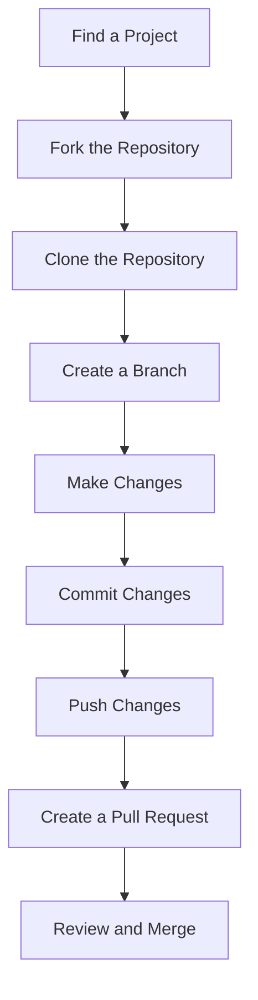

## 14.7 Ecosystem and Community Contributions

In the world of programming, the community is as vital as the code itself. Engaging with the JavaScript community not only enhances your skills but also contributes to the collective growth of the ecosystem. This section will guide you through the importance of contributing to open-source projects, finding the right projects, understanding community etiquette, and the myriad benefits of community involvement. We'll also explore how you can give back through writing tutorials, mentoring, and participating in events like hackathons, conferences, and meetups.

### The Importance of Contributing to Open-Source Projects

Open-source projects are the backbone of the software industry. They allow developers from around the world to collaborate, innovate, and solve complex problems together. By contributing to open-source projects, you not only help improve the software but also gain invaluable experience and exposure.

#### Why Contribute?

1. **Skill Enhancement**: Working on open-source projects exposes you to real-world codebases, which can be more complex and varied than personal projects. This experience helps you learn new programming techniques, tools, and best practices.

2. **Portfolio Building**: Contributions to well-known open-source projects can be a significant addition to your portfolio. They demonstrate your ability to work collaboratively and your commitment to the software community.

3. **Networking Opportunities**: Open-source projects often have contributors from all over the world. Engaging with these projects can help you build a network of like-minded professionals, which can be beneficial for career growth.

4. **Giving Back**: Many of us use open-source software daily. Contributing back to these projects is a way to show appreciation and help sustain the ecosystem.

5. **Career Opportunities**: Many companies value open-source contributions and may even hire developers based on their contributions to specific projects.

### Finding Projects to Contribute To

Finding the right project to contribute to can be daunting, especially for beginners. Here are some tips to help you get started:

#### Identify Your Interests

Start by identifying areas of interest within JavaScript. Are you passionate about front-end development, Node.js, or perhaps a specific framework like React or Angular? Focusing on your interests will make the contribution process more enjoyable and fulfilling.

#### Use Platforms Like GitHub

GitHub is the most popular platform for hosting open-source projects. Use the search feature to find projects that match your interests. Look for repositories with labels like "good first issue" or "help wanted," which indicate tasks suitable for newcomers.

#### Evaluate Project Activity

Before diving into a project, check its activity level. A project with regular updates and active maintainers is more likely to provide a supportive environment for contributors.

#### Join Community Forums

Many open-source projects have community forums or chat groups (e.g., Discord, Slack) where contributors can discuss issues and collaborate. Joining these groups can provide insights into the project's needs and how you can contribute.

### Understanding Open-Source Etiquette

Contributing to open-source projects requires understanding and following certain etiquette to ensure a positive experience for everyone involved.

#### Read the Documentation

Before contributing, thoroughly read the project's documentation, including the contribution guidelines. This will help you understand the project's structure, coding standards, and how to submit contributions.

#### Communicate Clearly

When discussing issues or proposing changes, communicate clearly and respectfully. Provide detailed explanations and be open to feedback from maintainers and other contributors.

#### Respect the Maintainers' Time

Maintainers often manage open-source projects in their free time. Be patient when waiting for responses or reviews, and express gratitude for their efforts.

#### Start Small

If you're new to a project, start with small contributions, such as fixing typos or improving documentation. This helps you get familiar with the project's workflow and build trust with the maintainers.

### Benefits of Community Involvement

Being part of the JavaScript community offers numerous benefits beyond just coding.

#### Learning and Growth

Engaging with the community exposes you to diverse perspectives and ideas. You can learn from others' experiences, gain insights into industry trends, and stay updated with the latest developments in JavaScript.

#### Networking and Collaboration

Community involvement provides opportunities to connect with other developers, share knowledge, and collaborate on projects. These connections can lead to job opportunities, partnerships, and lifelong friendships.

#### Recognition and Influence

Active community members often gain recognition for their contributions, which can enhance their professional reputation. Influential contributors may also have the opportunity to shape the direction of projects or the ecosystem as a whole.

### Participating in Events

Events like hackathons, conferences, and meetups are excellent opportunities to engage with the JavaScript community.

#### Hackathons

Hackathons are collaborative events where developers come together to build projects in a short time frame. Participating in hackathons can help you improve your problem-solving skills, learn new technologies, and meet other passionate developers.

#### Conferences

JavaScript conferences, such as JSConf and Node.js Interactive, offer a platform to learn from industry experts, discover new tools and frameworks, and network with peers. Attending conferences can inspire new ideas and provide valuable insights into the future of JavaScript.

#### Meetups

Local meetups are a great way to connect with the JavaScript community in your area. They often feature talks, workshops, and networking sessions, providing opportunities to learn and share knowledge.

### Giving Back to the Community

There are many ways to give back to the JavaScript community beyond contributing code.

#### Writing Tutorials

Sharing your knowledge through tutorials or blog posts can help others learn and grow. Platforms like Medium, Dev.to, and personal blogs are great places to publish your content.

#### Mentoring

Mentoring less experienced developers is a rewarding way to give back. You can offer guidance, share your experiences, and help others navigate their learning journey.

#### Organizing Events

If you're passionate about community building, consider organizing events like meetups or workshops. These events provide valuable learning opportunities and foster a sense of community among developers.

### Try It Yourself: Contributing to an Open-Source Project

Let's walk through a simple exercise to contribute to an open-source project on GitHub.

1. **Find a Project**: Search for a JavaScript project on GitHub that interests you. Look for issues labeled "good first issue."

2. **Fork the Repository**: Click the "Fork" button to create a copy of the repository in your GitHub account.

3. **Clone the Repository**: Clone the forked repository to your local machine using the command:

   ```bash
   git clone https://github.com/your-username/repository-name.git
   ```

4. **Create a Branch**: Create a new branch for your changes:

   ```bash
   git checkout -b my-contribution
   ```

5. **Make Changes**: Implement your changes in the codebase. Ensure your code is well-documented and follows the project's coding standards.

6. **Commit Your Changes**: Commit your changes with a descriptive message:

   ```bash
   git commit -m "Fix typo in README"
   ```

7. **Push Your Changes**: Push your changes to your forked repository:

   ```bash
   git push origin my-contribution
   ```

8. **Create a Pull Request**: Go to the original repository on GitHub and click "New Pull Request." Provide a detailed description of your changes and submit the pull request.

By following these steps, you can make your first contribution to an open-source project and start your journey in the JavaScript community.

### Visualizing Community Contributions

To better understand how contributions flow in an open-source project, let's visualize the process using a Mermaid.js diagram.



**Diagram Description:** This flowchart illustrates the steps involved in contributing to an open-source project, from finding a project to having your changes reviewed and merged.

### References and Links

- [GitHub Guides: How to Contribute to Open Source](https://guides.github.com/activities/contributing-to-open-source/)
- [Open Source Guides: Starting an Open Source Project](https://opensource.guide/)
- [Mozilla Developer Network (MDN) Web Docs](https://developer.mozilla.org/en-US/)

### Knowledge Check

- What are some benefits of contributing to open-source projects?
- How can you find projects to contribute to on GitHub?
- What is the importance of open-source etiquette?
- How can participating in community events benefit your career?

### Embrace the Journey

Engaging with the JavaScript community is a rewarding experience that offers opportunities for learning, growth, and making meaningful contributions. Remember, this is just the beginning. As you progress, you'll build more complex projects, connect with other developers, and make a positive impact on the ecosystem. Keep experimenting, stay curious, and enjoy the journey!

## Quiz Time!



### What is one benefit of contributing to open-source projects?

- [x] Skill enhancement
- [ ] Guaranteed job placement
- [ ] Free software
- [ ] Unlimited access to all repositories

> **Explanation:** Contributing to open-source projects enhances your skills by exposing you to real-world codebases and collaborative environments.

### Which platform is most popular for hosting open-source projects?

- [x] GitHub
- [ ] Bitbucket
- [ ] GitLab
- [ ] SourceForge

> **Explanation:** GitHub is the most popular platform for hosting open-source projects, providing tools for collaboration and version control.

### What label should you look for on GitHub to find beginner-friendly issues?

- [x] good first issue
- [ ] critical bug
- [ ] feature request
- [ ] enhancement

> **Explanation:** The "good first issue" label indicates tasks that are suitable for newcomers to a project.

### Why is it important to read a project's documentation before contributing?

- [x] To understand the project's structure and contribution guidelines
- [ ] To find hidden features
- [ ] To copy code for personal projects
- [ ] To bypass security measures

> **Explanation:** Reading the documentation helps you understand the project's structure, coding standards, and how to contribute effectively.

### What is a hackathon?

- [x] A collaborative event where developers build projects in a short time frame
- [ ] A conference for hackers
- [ ] A seminar on hacking techniques
- [ ] A workshop on security

> **Explanation:** A hackathon is a collaborative event where developers come together to build projects in a short time frame, fostering creativity and innovation.

### How can writing tutorials benefit the community?

- [x] By sharing knowledge and helping others learn
- [ ] By promoting personal projects
- [ ] By selling software
- [ ] By creating competition

> **Explanation:** Writing tutorials shares knowledge and helps others learn, contributing to the growth of the community.

### What is one way to give back to the community besides coding?

- [x] Mentoring less experienced developers
- [ ] Selling merchandise
- [ ] Hosting paid workshops
- [ ] Creating proprietary software

> **Explanation:** Mentoring less experienced developers is a rewarding way to give back, offering guidance and support to help others grow.

### What is the purpose of creating a branch in Git?

- [x] To work on changes without affecting the main codebase
- [ ] To delete files
- [ ] To merge unrelated projects
- [ ] To create backups

> **Explanation:** Creating a branch allows you to work on changes without affecting the main codebase, facilitating collaboration and experimentation.

### What is the final step in contributing to an open-source project?

- [x] Creating a pull request
- [ ] Deleting the repository
- [ ] Archiving the project
- [ ] Sending an email to the maintainer

> **Explanation:** Creating a pull request is the final step, where you propose your changes to be reviewed and potentially merged into the main codebase.

### True or False: Participating in community events can lead to job opportunities.

- [x] True
- [ ] False

> **Explanation:** True. Participating in community events can lead to job opportunities by expanding your network and showcasing your skills to potential employers.


