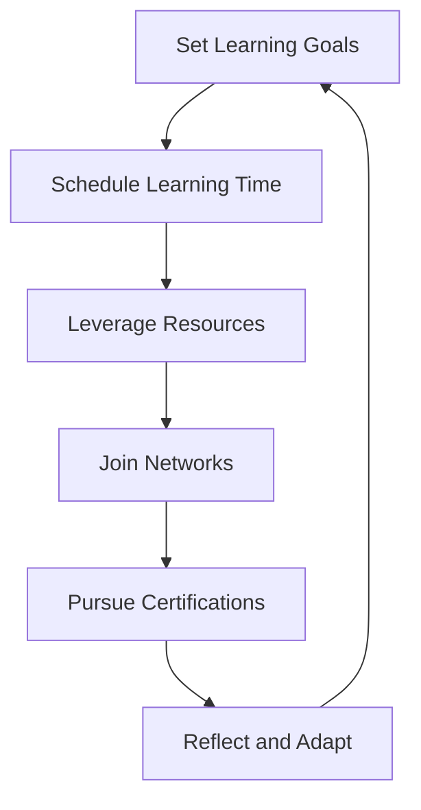

## 14.8 Education and Continuous Learning

In the ever-evolving world of technology, staying current with the latest advancements is crucial for any software professional. As we delve into the realm of Object-Oriented Programming (OOP) in JavaScript, it's essential to foster a commitment to continuous learning. This section will guide you through strategies for staying updated, recommend valuable resources, and encourage the adoption of a lifelong learning mindset.

### The Importance of Continuous Learning

Before we dive into the specifics, let's understand why continuous learning is vital:

1. **Technological Advancements**: The tech industry is dynamic, with new frameworks, libraries, and tools emerging regularly. Keeping up-to-date ensures you remain relevant and competitive.

2. **Career Growth**: Continuous learning opens doors to new opportunities, promotions, and roles that require advanced skills.

3. **Problem-Solving Skills**: Learning new concepts enhances your ability to solve complex problems and think critically.

4. **Adaptability**: Being open to learning helps you adapt to changes and embrace new challenges with confidence.

### Strategies for Staying Current

To effectively stay updated with technological advancements, consider implementing the following strategies:

#### 1. Set Learning Goals

- **Define Objectives**: Identify specific areas you want to improve or explore further. For instance, mastering ES6 features or understanding advanced OOP concepts.
- **Create a Plan**: Break down your goals into manageable tasks and set deadlines to track your progress.

#### 2. Schedule Regular Learning Time

- **Consistency is Key**: Dedicate a specific time each day or week for learning. This could be as little as 30 minutes a day.
- **Use a Calendar**: Schedule learning sessions like you would any other important meeting.

#### 3. Leverage Online Resources

- **Online Courses**: Platforms like [Coursera](https://www.coursera.org/), [Udemy](https://www.udemy.com/), and [edX](https://www.edx.org/) offer courses on JavaScript and OOP.
- **Blogs and Articles**: Follow blogs like [CSS-Tricks](https://css-tricks.com/) and [Smashing Magazine](https://www.smashingmagazine.com/) for the latest trends and tutorials.

#### 4. Join Professional Networks

- **Meetups and Conferences**: Attend events to network with peers and learn from industry experts.
- **Online Communities**: Engage with communities on platforms like [Stack Overflow](https://stackoverflow.com/) and [Reddit](https://www.reddit.com/r/javascript/).

#### 5. Pursue Certifications

- **Formal Recognition**: Certifications from recognized institutions can validate your skills and enhance your resume.
- **Continuous Assessment**: They often require ongoing learning to maintain, ensuring you stay updated.

### Recommended Resources

To aid your learning journey, here are some recommended resources across various formats:

#### Books

- **"Eloquent JavaScript" by Marijn Haverbeke**: A comprehensive guide to JavaScript, including OOP concepts.
- **"JavaScript: The Good Parts" by Douglas Crockford**: Focuses on the core features of JavaScript.

#### Online Courses

- **[JavaScript: Understanding the Weird Parts](https://www.udemy.com/course/understand-javascript/)**: A deep dive into the intricacies of JavaScript.
- **[The Complete JavaScript Course 2023: From Zero to Expert!](https://www.udemy.com/course/the-complete-javascript-course/)**: Covers everything from basics to advanced topics.

#### Blogs and Websites

- **[MDN Web Docs](https://developer.mozilla.org/en-US/docs/Web/JavaScript)**: A go-to resource for JavaScript documentation and tutorials.
- **[JavaScript Weekly](https://javascriptweekly.com/)**: A newsletter that curates the best JavaScript content from around the web.

#### Podcasts

- **[JavaScript Jabber](https://devchat.tv/js-jabber/)**: Discussions on JavaScript and web development.
- **[Syntax](https://syntax.fm/)**: A podcast about web development with a focus on JavaScript.

### Embracing a Lifelong Learning Mindset

Adopting a mindset of lifelong learning is crucial for success in the tech industry. Here are some tips to cultivate this mindset:

#### 1. Stay Curious

- **Ask Questions**: Never hesitate to ask questions, no matter how simple they may seem.
- **Explore New Topics**: Venture into areas outside your comfort zone to broaden your knowledge.

#### 2. Reflect on Your Learning

- **Self-Assessment**: Regularly evaluate what you've learned and identify areas for improvement.
- **Document Your Journey**: Keep a journal or blog to track your progress and share insights with others.

#### 3. Collaborate and Share

- **Teach Others**: Explaining concepts to others reinforces your understanding.
- **Contribute to Open Source**: Collaborate on projects to gain practical experience and learn from others.

### Visualizing Your Learning Path

To help you visualize your learning journey, consider the following diagram that outlines a continuous learning cycle:

**Caption**: This diagram illustrates a continuous learning cycle, emphasizing the importance of setting goals, scheduling time, leveraging resources, joining networks, pursuing certifications, and reflecting on your progress.

### Try It Yourself

To make the most of your learning journey, try experimenting with the following activities:

- **Create a Learning Plan**: Outline your learning goals for the next six months and identify resources to help you achieve them.
- **Join a Study Group**: Find or create a study group with peers to discuss and explore JavaScript concepts together.
- **Build a Project**: Apply what you've learned by building a small project, such as a to-do list app, using OOP principles.

### Knowledge Check

To reinforce your understanding, consider the following questions:

- What are the benefits of continuous learning in the tech industry?
- How can you effectively schedule regular learning time?
- What are some recommended online resources for learning JavaScript and OOP?
- How can joining professional networks enhance your learning experience?
- Why is it important to adopt a lifelong learning mindset?

### Embrace the Journey

Remember, this is just the beginning. As you progress, you'll build more complex and interactive applications. Keep experimenting, stay curious, and enjoy the journey! Continuous learning is not just about acquiring new skills; it's about embracing change and growth. By staying committed to your learning journey, you'll not only enhance your technical skills but also develop a mindset that thrives in an ever-changing world.

## Quiz Time!



### What is one of the main reasons continuous learning is important in the tech industry?

- [x] To stay relevant and competitive
- [ ] To avoid learning new skills
- [ ] To reduce career opportunities
- [ ] To limit adaptability

> **Explanation:** Continuous learning helps professionals stay relevant and competitive by keeping up with technological advancements.

### Which of the following is a recommended strategy for staying current with technological advancements?

- [x] Set learning goals
- [ ] Avoid online resources
- [ ] Ignore professional networks
- [ ] Skip certifications

> **Explanation:** Setting learning goals helps individuals focus on specific areas for improvement and track progress.

### Which platform is known for offering online courses on JavaScript and OOP?

- [x] Coursera
- [ ] Facebook
- [ ] Instagram
- [ ] Twitter

> **Explanation:** Coursera is a platform that offers a variety of online courses, including those on JavaScript and OOP.

### What is a benefit of joining professional networks?

- [x] Networking with peers and learning from industry experts
- [ ] Avoiding new learning opportunities
- [ ] Limiting career growth
- [ ] Reducing problem-solving skills

> **Explanation:** Professional networks provide opportunities to network with peers and learn from industry experts.

### Why is pursuing certifications recommended?

- [x] They validate skills and enhance resumes
- [ ] They are unnecessary for career growth
- [ ] They limit learning opportunities
- [ ] They reduce adaptability

> **Explanation:** Certifications validate skills and enhance resumes, making individuals more attractive to employers.

### What is a benefit of adopting a lifelong learning mindset?

- [x] Enhanced problem-solving skills
- [ ] Reduced adaptability
- [ ] Limited career growth
- [ ] Avoiding new challenges

> **Explanation:** A lifelong learning mindset enhances problem-solving skills and helps individuals adapt to new challenges.

### Which book is recommended for learning JavaScript and OOP?

- [x] "Eloquent JavaScript" by Marijn Haverbeke
- [ ] "The Great Gatsby" by F. Scott Fitzgerald
- [ ] "To Kill a Mockingbird" by Harper Lee
- [ ] "1984" by George Orwell

> **Explanation:** "Eloquent JavaScript" by Marijn Haverbeke is a comprehensive guide to JavaScript, including OOP concepts.

### What is the purpose of reflecting on your learning?

- [x] To evaluate progress and identify areas for improvement
- [ ] To avoid self-assessment
- [ ] To limit learning opportunities
- [ ] To reduce adaptability

> **Explanation:** Reflecting on learning helps individuals evaluate progress and identify areas for improvement.

### Which podcast focuses on JavaScript and web development?

- [x] JavaScript Jabber
- [ ] The Daily
- [ ] Serial
- [ ] The Joe Rogan Experience

> **Explanation:** JavaScript Jabber is a podcast that discusses JavaScript and web development topics.

### True or False: Continuous learning is only important for beginners.

- [ ] True
- [x] False

> **Explanation:** Continuous learning is important for professionals at all levels to stay current and competitive in the tech industry.


