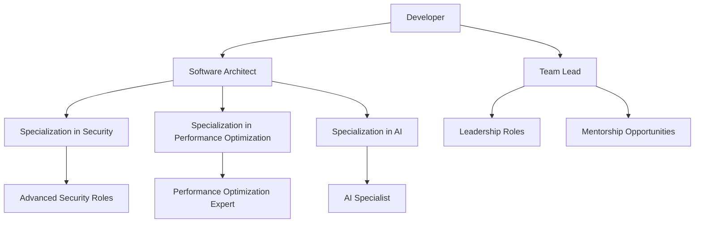

## 14.9 Preparing for Advanced Careers

As you continue your journey in mastering Object-Oriented Programming (OOP) in JavaScript, you may find yourself aspiring to take on more advanced roles within the software development industry. Whether you're aiming to become a software architect, a team lead, or a specialized technical expert, this section will guide you on how to leverage your OOP expertise to advance your career. We'll explore the importance of soft skills, the benefits of specialization, and strategies for building a strong professional portfolio. Additionally, we'll discuss how seeking mentorship and leadership opportunities can propel you toward your career goals.

### Transitioning from Developer to Advanced Roles

Transitioning from a developer role to more advanced positions like software architect or team lead requires a combination of technical expertise and leadership skills. Let's explore how you can make this transition smoothly.

#### Becoming a Software Architect

A software architect is responsible for designing and overseeing the technical aspects of software projects. This role requires a deep understanding of software design principles, including OOP, and the ability to make high-level decisions that align with business goals.

**Key Responsibilities:**
- Designing software architecture that is scalable, maintainable, and efficient.
- Evaluating and selecting appropriate technologies and frameworks.
- Ensuring that the software design adheres to industry standards and best practices.
- Collaborating with stakeholders to understand business requirements and translate them into technical solutions.

**Steps to Transition:**
1. **Deepen Your Technical Expertise:** Continuously enhance your understanding of OOP principles and design patterns. Explore advanced topics such as microservices architecture, cloud computing, and distributed systems.
2. **Build a Portfolio:** Showcase your ability to design and implement complex systems. Include projects that demonstrate your architectural skills and problem-solving abilities.
3. **Seek Mentorship:** Connect with experienced architects who can provide guidance and insights into the role. Learn from their experiences and apply their advice to your career path.

#### Transitioning to a Team Lead Role

A team lead is responsible for managing a team of developers, ensuring that projects are completed on time and meet quality standards. This role requires strong leadership and communication skills, as well as the ability to motivate and mentor team members.

**Key Responsibilities:**
- Leading and managing a team of developers.
- Facilitating communication between team members and stakeholders.
- Ensuring that projects are delivered on time and within budget.
- Providing technical guidance and support to team members.

**Steps to Transition:**
1. **Develop Leadership Skills:** Focus on improving your communication, problem-solving, and decision-making skills. Take on leadership roles in projects to gain experience.
2. **Mentor Junior Developers:** Share your knowledge and experience with less experienced team members. This will help you develop your mentorship skills and build a reputation as a leader.
3. **Build Relationships:** Establish strong relationships with your team and stakeholders. Effective communication and collaboration are key to successful leadership.

### Importance of Soft Skills

While technical skills are crucial for advancing your career, soft skills play an equally important role. Let's explore some of the key soft skills that can help you succeed in advanced roles.

#### Communication Skills

Effective communication is essential for collaborating with team members, stakeholders, and clients. As you advance in your career, you'll need to convey complex technical concepts in a clear and concise manner.

**Tips for Improving Communication:**
- **Practice Active Listening:** Pay attention to what others are saying and ask clarifying questions to ensure understanding.
- **Tailor Your Message:** Adjust your communication style based on your audience. Use technical language with developers and simplify concepts for non-technical stakeholders.
- **Provide Constructive Feedback:** Offer feedback that is specific, actionable, and focused on improvement.

#### Mentorship and Coaching

Mentorship involves guiding and supporting others in their professional development. As you advance in your career, becoming a mentor can help you develop your leadership skills and build a strong professional network.

**Benefits of Mentorship:**
- **Enhances Leadership Skills:** Mentoring others helps you develop your ability to guide and motivate team members.
- **Builds Professional Relationships:** Mentoring provides opportunities to connect with other professionals and expand your network.
- **Fosters Personal Growth:** Mentoring others can lead to personal growth and increased job satisfaction.

### Building a Strong Professional Portfolio

A professional portfolio is a collection of your work that showcases your skills, experience, and accomplishments. A strong portfolio can help you stand out to potential employers and advance your career.

#### What to Include in Your Portfolio

1. **Projects:** Include a variety of projects that demonstrate your technical skills and problem-solving abilities. Highlight projects that involve OOP and showcase your ability to design and implement complex systems.
2. **Code Samples:** Provide well-documented code samples that illustrate your coding style and proficiency in JavaScript and OOP.
3. **Case Studies:** Include detailed case studies that describe the challenges you faced, the solutions you implemented, and the outcomes achieved.
4. **Testimonials:** Include testimonials from colleagues, mentors, or clients that highlight your strengths and contributions.

#### Tips for Building Your Portfolio

- **Keep It Updated:** Regularly update your portfolio with new projects and accomplishments.
- **Make It Accessible:** Create an online portfolio that is easy to access and navigate. Consider using platforms like GitHub or personal websites.
- **Highlight Your Unique Skills:** Emphasize the skills and experiences that set you apart from other candidates.

### Specializing in Technical Areas

Specializing in a specific technical area can help you become an expert in your field and open up new career opportunities. Let's explore some areas where you can specialize.

#### Security

With the increasing importance of cybersecurity, specializing in security can lead to a rewarding career. As a security expert, you'll focus on protecting software systems from threats and vulnerabilities.

**Key Skills:**
- Understanding of security principles and best practices.
- Knowledge of encryption, authentication, and access control mechanisms.
- Ability to identify and mitigate security risks.

#### Performance Optimization

Performance optimization involves improving the efficiency and speed of software systems. Specializing in this area can help you ensure that applications run smoothly and meet user expectations.

**Key Skills:**
- Proficiency in performance profiling and analysis tools.
- Understanding of algorithms and data structures.
- Ability to identify and resolve performance bottlenecks.

#### Artificial Intelligence (AI)

AI is a rapidly growing field with numerous opportunities for specialization. As an AI expert, you'll work on developing intelligent systems that can learn and adapt.

**Key Skills:**
- Knowledge of machine learning algorithms and techniques.
- Proficiency in programming languages like Python and JavaScript.
- Ability to design and implement AI models and systems.

### Seeking Mentorship and Leadership Opportunities

Mentorship and leadership opportunities can help you develop the skills and experience needed to advance your career. Let's explore how you can seek out these opportunities.

#### Finding a Mentor

A mentor can provide guidance, support, and insights into your career path. Here's how to find a mentor:

1. **Identify Your Goals:** Determine what you want to achieve through mentorship and what areas you need guidance in.
2. **Reach Out to Potential Mentors:** Look for experienced professionals in your field who align with your goals. Reach out to them and express your interest in mentorship.
3. **Build a Relationship:** Establish a strong relationship with your mentor by being open, honest, and receptive to feedback.

#### Taking on Leadership Roles

Taking on leadership roles can help you develop your leadership skills and gain valuable experience. Here's how to get started:

1. **Volunteer for Leadership Opportunities:** Look for opportunities to lead projects or initiatives within your organization or community.
2. **Develop Your Skills:** Focus on improving your leadership, communication, and problem-solving skills.
3. **Seek Feedback:** Ask for feedback from colleagues and mentors to identify areas for improvement and growth.

### Embrace the Journey

Remember, advancing your career is a journey, not a destination. As you progress, continue to learn, grow, and adapt to new challenges. Embrace opportunities for personal and professional development, and don't be afraid to take risks and step outside your comfort zone. With dedication and perseverance, you can achieve your career goals and make a meaningful impact in the field of software development.

### Try It Yourself

To put your skills into practice, consider taking on a project that challenges your current abilities and pushes you to learn new concepts. For example, you could:

- **Design a Complex System:** Create a software system that involves multiple components and requires careful architectural planning.
- **Mentor a Junior Developer:** Share your knowledge and experience with a less experienced developer and help them grow in their career.
- **Specialize in a New Area:** Choose a technical area you're interested in and dedicate time to learning and mastering it.

### Visualizing Your Career Path

To better understand the journey from a developer to an advanced role, let's visualize the career path using a flowchart.

**Diagram Description:** This flowchart illustrates the potential career paths for a developer, including transitioning to roles like software architect or team lead, and specializing in areas like security, performance optimization, or AI.

### References and Links

For further reading and resources, consider exploring the following:

- [MDN Web Docs: JavaScript](https://developer.mozilla.org/en-US/docs/Web/JavaScript)
- [W3Schools: JavaScript Tutorial](https://www.w3schools.com/js/)
- [GitHub: Building a Strong Portfolio](https://github.com/)
- [LinkedIn Learning: Leadership Skills](https://www.linkedin.com/learning/topics/leadership)

### Knowledge Check

To reinforce your understanding of the concepts covered in this section, consider the following questions and challenges:

- What are the key responsibilities of a software architect?
- How can you improve your communication skills as a developer?
- What should you include in a professional portfolio?
- What are the benefits of specializing in a technical area?
- How can you find a mentor in your field?

## Quiz Time!



### What is a key responsibility of a software architect?

- [x] Designing scalable and maintainable software architecture
- [ ] Writing unit tests for code
- [ ] Managing project budgets
- [ ] Conducting user interviews

> **Explanation:** A software architect is responsible for designing software architecture that is scalable and maintainable.

### Which soft skill is crucial for effective leadership?

- [x] Communication
- [ ] Coding
- [ ] Debugging
- [ ] Typing speed

> **Explanation:** Communication is a crucial soft skill for effective leadership, as it involves conveying ideas clearly and collaborating with others.

### What should be included in a professional portfolio?

- [x] Projects and code samples
- [ ] Personal hobbies
- [ ] Daily routines
- [ ] Favorite books

> **Explanation:** A professional portfolio should include projects and code samples to showcase technical skills and experience.

### What is a benefit of specializing in a technical area?

- [x] Becoming an expert in the field
- [ ] Reducing work hours
- [ ] Avoiding teamwork
- [ ] Increasing typing speed

> **Explanation:** Specializing in a technical area allows you to become an expert in the field and opens up new career opportunities.

### How can you find a mentor in your field?

- [x] Reach out to experienced professionals
- [ ] Wait for someone to offer mentorship
- [ ] Avoid networking events
- [ ] Focus only on online courses

> **Explanation:** To find a mentor, reach out to experienced professionals who align with your goals and express your interest in mentorship.

### What is a key step in transitioning to a team lead role?

- [x] Developing leadership skills
- [ ] Learning a new programming language
- [ ] Reducing communication with team members
- [ ] Focusing solely on technical skills

> **Explanation:** Developing leadership skills is crucial for transitioning to a team lead role, as it involves managing and guiding a team.

### Why is mentorship beneficial for personal growth?

- [x] It fosters personal growth and job satisfaction
- [ ] It guarantees a promotion
- [ ] It reduces work responsibilities
- [ ] It eliminates the need for further learning

> **Explanation:** Mentorship fosters personal growth and job satisfaction by providing opportunities to guide and support others.

### What is a key skill for performance optimization?

- [x] Proficiency in performance profiling tools
- [ ] Ability to write lengthy code
- [ ] Knowledge of graphic design
- [ ] Expertise in social media marketing

> **Explanation:** Proficiency in performance profiling tools is essential for identifying and resolving performance bottlenecks.

### What should you do to embrace the journey of career advancement?

- [x] Continue to learn and adapt to new challenges
- [ ] Avoid taking risks
- [ ] Focus only on current skills
- [ ] Stay within your comfort zone

> **Explanation:** Embracing the journey involves continuing to learn, grow, and adapt to new challenges, and taking risks to advance your career.

### True or False: Specializing in AI requires knowledge of machine learning algorithms.

- [x] True
- [ ] False

> **Explanation:** Specializing in AI requires knowledge of machine learning algorithms, as they are fundamental to developing intelligent systems.



Remember, this is just the beginning of your journey toward advanced roles in software development. Keep experimenting, stay curious, and enjoy the journey!
