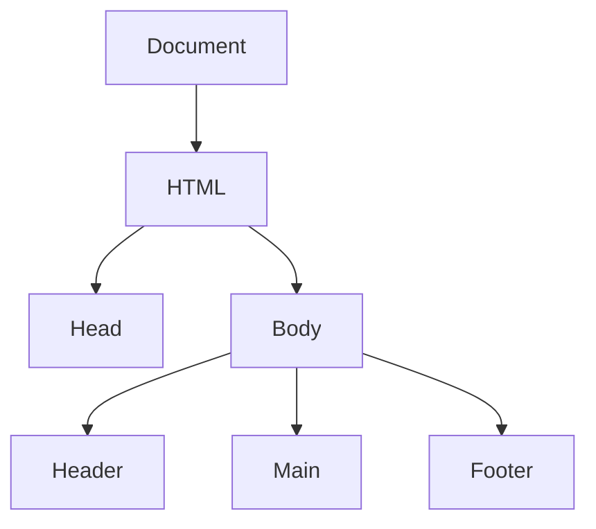
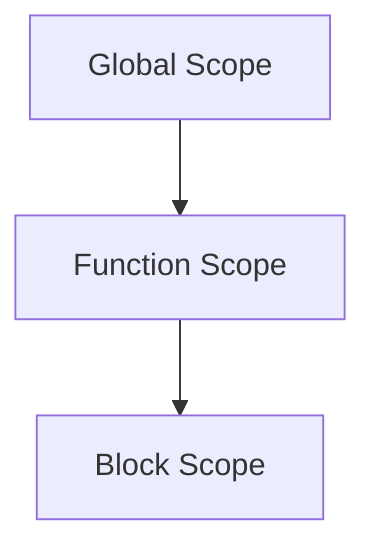

## A. JavaScript Syntax and Reference

Welcome to the JavaScript Syntax and Reference guide, a comprehensive resource designed to help you understand and master the essential syntax and features of JavaScript. This guide is structured to support absolute beginners, providing clear explanations and practical examples. Let's embark on this journey to explore the building blocks of JavaScript!

### 1. Variables and Data Types

#### 1.1 Variables

Variables are fundamental to programming, allowing us to store and manipulate data. In JavaScript, variables can be declared using `var`, `let`, or `const`.

- **`var`**: Declares a variable, optionally initializing it to a value. It has function scope or global scope.

```javascript
var name = "Alice";
console.log(name); // Output: Alice
```

- **`let`**: Declares a block-scoped variable, optionally initializing it to a value.

```javascript
let age = 25;
console.log(age); // Output: 25
```

- **`const`**: Declares a block-scoped, read-only constant.

```javascript
const birthYear = 1995;
console.log(birthYear); // Output: 1995
```

#### 1.2 Data Types

JavaScript supports several data types, including:

- **String**: Represents textual data.

```javascript
let greeting = "Hello, World!";
```

- **Number**: Represents both integer and floating-point numbers.

```javascript
let score = 95.5;
```

- **Boolean**: Represents logical values: `true` or `false`.

```javascript
let isJavaScriptFun = true;
```

- **Undefined**: A variable that has been declared but not assigned a value.

```javascript
let undefinedVariable;
console.log(undefinedVariable); // Output: undefined
```

- **Null**: Represents the intentional absence of any object value.

```javascript
let emptyValue = null;
```

- **Object**: Represents a collection of properties.

```javascript
let person = {
  name: "John",
  age: 30
};
```

- **Symbol**: Represents a unique identifier (introduced in ES6).

```javascript
let uniqueId = Symbol("id");
```

- **BigInt**: Represents whole numbers larger than `2^53 - 1` (introduced in ES2020).

```javascript
let largeNumber = BigInt(123456789012345678901234567890);
```

### 2. Operators

Operators are symbols that perform operations on operands. JavaScript includes several types of operators:

#### 2.1 Arithmetic Operators

- **Addition (`+`)**: Adds two numbers.

```javascript
let sum = 10 + 5; // Output: 15
```

- **Subtraction (`-`)**: Subtracts one number from another.

```javascript
let difference = 10 - 5; // Output: 5
```

- **Multiplication (`*`)**: Multiplies two numbers.

```javascript
let product = 10 * 5; // Output: 50
```

- **Division (`/`)**: Divides one number by another.

```javascript
let quotient = 10 / 5; // Output: 2
```

- **Modulus (`%`)**: Returns the remainder of a division.

```javascript
let remainder = 10 % 3; // Output: 1
```

- **Exponentiation (`**`)**: Raises the first operand to the power of the second operand.

```javascript
let power = 2 ** 3; // Output: 8
```

#### 2.2 Comparison Operators

- **Equal (`==`)**: Checks if two values are equal.

```javascript
console.log(5 == "5"); // Output: true
```

- **Strict Equal (`===`)**: Checks if two values are equal and of the same type.

```javascript
console.log(5 === "5"); // Output: false
```

- **Not Equal (`!=`)**: Checks if two values are not equal.

```javascript
console.log(5 != "5"); // Output: false
```

- **Strict Not Equal (`!==`)**: Checks if two values are not equal or not of the same type.

```javascript
console.log(5 !== "5"); // Output: true
```

- **Greater Than (`>`)**: Checks if the left operand is greater than the right operand.

```javascript
console.log(10 > 5); // Output: true
```

- **Less Than (`<`)**: Checks if the left operand is less than the right operand.

```javascript
console.log(10 < 5); // Output: false
```

- **Greater Than or Equal (`>=`)**: Checks if the left operand is greater than or equal to the right operand.

```javascript
console.log(10 >= 5); // Output: true
```

- **Less Than or Equal (`<=`)**: Checks if the left operand is less than or equal to the right operand.

```javascript
console.log(10 <= 5); // Output: false
```

#### 2.3 Logical Operators

- **Logical AND (`&&`)**: Returns true if both operands are true.

```javascript
console.log(true && false); // Output: false
```

- **Logical OR (`||`)**: Returns true if at least one operand is true.

```javascript
console.log(true || false); // Output: true
```

- **Logical NOT (`!`)**: Inverts the truthiness of the operand.

```javascript
console.log(!true); // Output: false
```

#### 2.4 Assignment Operators

- **Assignment (`=`)**: Assigns a value to a variable.

```javascript
let x = 10;
```

- **Addition Assignment (`+=`)**: Adds a value to a variable and assigns the result to that variable.

```javascript
x += 5; // Equivalent to x = x + 5
```

- **Subtraction Assignment (`-=`)**: Subtracts a value from a variable and assigns the result to that variable.

```javascript
x -= 5; // Equivalent to x = x - 5
```

- **Multiplication Assignment (`*=`)**: Multiplies a variable by a value and assigns the result to that variable.

```javascript
x *= 5; // Equivalent to x = x * 5
```

- **Division Assignment (`/=`)**: Divides a variable by a value and assigns the result to that variable.

```javascript
x /= 5; // Equivalent to x = x / 5
```

- **Modulus Assignment (`%=`)**: Applies the modulus operator to a variable and assigns the result to that variable.

```javascript
x %= 5; // Equivalent to x = x % 5
```

### 3. Control Flow

Control flow statements determine the order in which code executes.

#### 3.1 Conditional Statements

- **`if` Statement**: Executes a block of code if a specified condition is true.

```javascript
if (x > 0) {
  console.log("x is positive");
}
```

- **`else` Statement**: Executes a block of code if the condition in the `if` statement is false.

```javascript
if (x > 0) {
  console.log("x is positive");
} else {
  console.log("x is not positive");
}
```

- **`else if` Statement**: Specifies a new condition if the first condition is false.

```javascript
if (x > 0) {
  console.log("x is positive");
} else if (x < 0) {
  console.log("x is negative");
} else {
  console.log("x is zero");
}
```

- **`switch` Statement**: Evaluates an expression, matching the expression's value to a case clause, and executes statements associated with that case.

```javascript
let day = 3;
switch (day) {
  case 1:
    console.log("Monday");
    break;
  case 2:
    console.log("Tuesday");
    break;
  case 3:
    console.log("Wednesday");
    break;
  default:
    console.log("Another day");
}
```

#### 3.2 Looping Statements

- **`for` Loop**: Repeats a block of code a specified number of times.

```javascript
for (let i = 0; i < 5; i++) {
  console.log(i);
}
```

- **`while` Loop**: Repeats a block of code as long as a specified condition is true.

```javascript
let i = 0;
while (i < 5) {
  console.log(i);
  i++;
}
```

- **`do...while` Loop**: Executes a block of code once, and then repeats the loop as long as a specified condition is true.

```javascript
let i = 0;
do {
  console.log(i);
  i++;
} while (i < 5);
```

### 4. Functions

Functions are blocks of code designed to perform a particular task. They can be defined using function declarations, function expressions, or arrow functions.

#### 4.1 Function Declarations

```javascript
function greet(name) {
  return "Hello, " + name;
}
console.log(greet("Alice")); // Output: Hello, Alice
```

#### 4.2 Function Expressions

```javascript
const greet = function(name) {
  return "Hello, " + name;
};
console.log(greet("Bob")); // Output: Hello, Bob
```

#### 4.3 Arrow Functions

Arrow functions provide a more concise syntax for writing function expressions.

```javascript
const greet = (name) => "Hello, " + name;
console.log(greet("Charlie")); // Output: Hello, Charlie
```

### 5. Classes and Objects

JavaScript classes, introduced in ES6, provide a more intuitive syntax for creating objects and handling inheritance.

#### 5.1 Class Declarations

```javascript
class Animal {
  constructor(name) {
    this.name = name;
  }

  speak() {
    console.log(`${this.name} makes a noise.`);
  }
}

let dog = new Animal("Dog");
dog.speak(); // Output: Dog makes a noise.
```

#### 5.2 Inheritance

Inheritance allows a class to inherit properties and methods from another class.

```javascript
class Dog extends Animal {
  speak() {
    console.log(`${this.name} barks.`);
  }
}

let dog = new Dog("Dog");
dog.speak(); // Output: Dog barks.
```

#### 5.3 Static Methods

Static methods are called on the class itself, not on instances of the class.

```javascript
class MathUtils {
  static add(a, b) {
    return a + b;
  }
}

console.log(MathUtils.add(5, 3)); // Output: 8
```

### 6. Try It Yourself

Now that we've covered the basics, it's time to experiment! Try modifying the code examples to see how changes affect the output. For instance, change the values of variables, add new properties to objects, or create additional methods in classes. This hands-on approach will deepen your understanding and boost your confidence in using JavaScript.

### 7. Visualizing JavaScript Concepts

To better understand JavaScript's interaction with web browsers and web pages, let's visualize some key concepts using diagrams.

#### 7.1 The Document Object Model (DOM) Tree Structure



**Figure 1:** The DOM tree structure represents the hierarchical organization of HTML elements in a web page.

#### 7.2 Variable Scope Chains



**Figure 2:** Variable scope chains illustrate how variables are accessed in different scopes.

### 8. References and Links

For further reading and deeper dives into JavaScript, consider exploring the following resources:

- [MDN Web Docs: JavaScript](https://developer.mozilla.org/en-US/docs/Web/JavaScript)
- [W3Schools: JavaScript Tutorial](https://www.w3schools.com/js/)
- [JavaScript.info](https://javascript.info/)

### 9. Knowledge Check

To reinforce your learning, here are some questions and challenges:

- What are the differences between `var`, `let`, and `const`?
- How do you create a function in JavaScript?
- What is the purpose of the `this` keyword in a class method?
- Try creating a class with a method that calculates the area of a rectangle.

### 10. Embrace the Journey

Remember, this is just the beginning. As you progress, you'll build more complex and interactive web pages. Keep experimenting, stay curious, and enjoy the journey!

## Quiz Time!



### What is the correct way to declare a constant in JavaScript?

- [ ] var pi = 3.14;
- [ ] let pi = 3.14;
- [x] const pi = 3.14;
- [ ] pi = 3.14;

> **Explanation:** `const` is used to declare a constant, which means its value cannot be changed after initialization.

### Which of the following is a valid way to define a function in JavaScript?

- [x] function greet() {}
- [ ] def greet() {}
- [ ] func greet() {}
- [ ] function: greet() {}

> **Explanation:** The `function` keyword is used to define a function in JavaScript.

### What is the output of `console.log(5 === "5");`?

- [ ] true
- [x] false
- [ ] undefined
- [ ] null

> **Explanation:** `===` checks for both value and type equality, so `5` (number) is not equal to `"5"` (string).

### Which operator is used to compare both value and type?

- [ ] ==
- [x] ===
- [ ] !=
- [ ] =

> **Explanation:** The `===` operator checks for both value and type equality.

### In JavaScript, which of the following is a primitive data type?

- [x] String
- [x] Number
- [ ] Object
- [x] Boolean

> **Explanation:** String, Number, and Boolean are primitive data types in JavaScript, while Object is not.

### What will `console.log(typeof null);` output?

- [ ] "null"
- [x] "object"
- [ ] "undefined"
- [ ] "number"

> **Explanation:** In JavaScript, `typeof null` returns "object" due to a historical bug in the language.

### How do you create an object in JavaScript using object literal notation?

- [x] let obj = {};
- [ ] let obj = new Object();
- [ ] let obj = Object.create();
- [ ] let obj = [];

> **Explanation:** `{}` is the syntax for creating an object using object literal notation.

### What is the purpose of the `break` statement in a switch case?

- [x] To exit the switch block
- [ ] To continue to the next case
- [ ] To stop the entire program
- [ ] To repeat the current case

> **Explanation:** The `break` statement exits the switch block, preventing the execution of subsequent cases.

### Which keyword is used to inherit properties and methods from another class?

- [ ] inherit
- [ ] derive
- [x] extends
- [ ] super

> **Explanation:** The `extends` keyword is used to create a class that inherits from another class.

### JavaScript is a case-sensitive language.

- [x] True
- [ ] False

> **Explanation:** JavaScript is case-sensitive, meaning `Variable` and `variable` would be considered different identifiers.



By mastering these fundamental concepts, you're well on your way to becoming proficient in JavaScript. Keep practicing, and don't hesitate to revisit this guide whenever you need a refresher. Happy coding!
