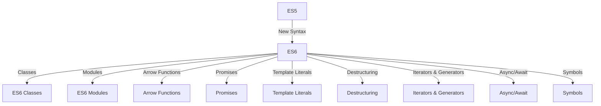

## D. ES6 and Beyond: New Features Summary

The release of ECMAScript 6 (ES6), also known as ECMAScript 2015, marked a significant milestone in the evolution of JavaScript. It introduced a host of new features that have since become foundational in modern JavaScript development. These enhancements not only made the language more powerful and expressive but also aligned it more closely with object-oriented programming (OOP) principles. In this section, we will explore these transformative features, understand their relevance to OOP, and provide practical examples to illustrate their use.

### Arrow Functions

Arrow functions offer a more concise syntax for writing function expressions. They are particularly useful in object-oriented programming for maintaining the lexical scope of `this`.

```javascript
// Traditional function expression
const add = function(a, b) {
  return a + b;
};

// Arrow function
const addArrow = (a, b) => a + b;

console.log(add(2, 3)); // 5
console.log(addArrow(2, 3)); // 5
```

**Relevance to OOP:** Arrow functions do not have their own `this` context, which means they inherit `this` from the enclosing lexical context. This behavior is beneficial when working with methods inside classes or objects, as it avoids common pitfalls associated with the `this` keyword.

### Classes

ES6 introduced a class syntax that provides a clearer and more familiar way to create objects and handle inheritance, aligning JavaScript more closely with traditional OOP languages.

```javascript
class Animal {
  constructor(name) {
    this.name = name;
  }

  speak() {
    console.log(`${this.name} makes a noise.`);
  }
}

class Dog extends Animal {
  speak() {
    console.log(`${this.name} barks.`);
  }
}

const dog = new Dog('Rex');
dog.speak(); // Rex barks.
```

**Relevance to OOP:** The class syntax simplifies the creation of objects and the implementation of inheritance, making it easier to build complex systems with clear hierarchies and shared behaviors.

### Template Literals

Template literals provide an enhanced way to work with strings, allowing for embedded expressions and multi-line strings.

```javascript
const name = 'World';
console.log(`Hello, ${name}!`); // Hello, World!

const multiLine = `This is a
multi-line string.`;
console.log(multiLine);
```

**Relevance to OOP:** Template literals improve code readability and maintainability, especially when dealing with dynamic content generation in methods.

### Modules

Modules allow developers to encapsulate code into separate files and import/export functionality as needed. This feature promotes better code organization and reuse.

```javascript
// math.js
export function add(a, b) {
  return a + b;
}

// main.js
import { add } from './math.js';
console.log(add(2, 3)); // 5
```

**Relevance to OOP:** Modules enable encapsulation and separation of concerns, which are key principles of OOP. They allow for the creation of self-contained units of functionality that can be easily reused and maintained.

### Destructuring Assignment

Destructuring allows for unpacking values from arrays or properties from objects into distinct variables, making it easier to work with complex data structures.

```javascript
const person = { name: 'Alice', age: 25 };
const { name, age } = person;
console.log(name); // Alice
console.log(age); // 25

const numbers = [1, 2, 3];
const [first, second] = numbers;
console.log(first); // 1
console.log(second); // 2
```

**Relevance to OOP:** Destructuring simplifies the extraction of data from objects and arrays, making it easier to work with complex data structures within methods and classes.

### Default Parameters

Default parameters allow functions to have default values for parameters, reducing the need for additional checks or conditional logic.

```javascript
function greet(name = 'Guest') {
  console.log(`Hello, ${name}!`);
}

greet(); // Hello, Guest!
greet('Alice'); // Hello, Alice!
```

**Relevance to OOP:** Default parameters enhance method flexibility and robustness by providing default values for optional parameters, simplifying method signatures and reducing error-prone checks.

### Rest and Spread Operators

The rest operator (`...`) allows functions to accept an indefinite number of arguments as an array, while the spread operator expands elements of an iterable.

```javascript
// Rest operator
function sum(...numbers) {
  return numbers.reduce((acc, num) => acc + num, 0);
}

console.log(sum(1, 2, 3)); // 6

// Spread operator
const arr1 = [1, 2, 3];
const arr2 = [...arr1, 4, 5, 6];
console.log(arr2); // [1, 2, 3, 4, 5, 6]
```

**Relevance to OOP:** These operators facilitate working with collections of data, making it easier to handle variable numbers of arguments in methods and to merge or clone objects and arrays.

### Promises

Promises provide a more manageable way to handle asynchronous operations, replacing the traditional callback approach with a more readable and maintainable syntax.

```javascript
const fetchData = () => {
  return new Promise((resolve, reject) => {
    setTimeout(() => resolve('Data received'), 1000);
  });
};

fetchData().then(data => console.log(data)).catch(error => console.error(error));
```

**Relevance to OOP:** Promises enable asynchronous operations to be handled in a more structured and predictable manner, which is crucial for building responsive and efficient applications.

### Let and Const

`let` and `const` introduce block scope to JavaScript, providing more control over variable declarations and reducing errors related to variable hoisting and scope leakage.

```javascript
let count = 1;
if (true) {
  let count = 2;
  console.log(count); // 2
}
console.log(count); // 1

const PI = 3.14;
console.log(PI); // 3.14
```

**Relevance to OOP:** Block-scoped variables enhance code clarity and reduce bugs, especially in complex methods with nested scopes.

### Symbol

Symbols are unique and immutable data types that can be used as identifiers for object properties, ensuring property keys are unique and avoiding naming conflicts.

```javascript
const sym1 = Symbol('description');
const sym2 = Symbol('description');
console.log(sym1 === sym2); // false

const obj = {
  [sym1]: 'value1',
  [sym2]: 'value2'
};
console.log(obj[sym1]); // value1
```

**Relevance to OOP:** Symbols provide a way to create private properties within objects, enhancing encapsulation and data privacy.

### Iterators and Generators

Iterators and generators provide a protocol for defining custom iteration behavior, allowing objects to be traversed in a controlled manner.

```javascript
function* generatorFunction() {
  yield 1;
  yield 2;
  yield 3;
}

const iterator = generatorFunction();
console.log(iterator.next().value); // 1
console.log(iterator.next().value); // 2
console.log(iterator.next().value); // 3
```

**Relevance to OOP:** Generators simplify the implementation of iterators, making it easier to define custom iteration logic within classes.

### Async/Await

Async/await syntax provides a cleaner and more intuitive way to work with promises, allowing asynchronous code to be written in a synchronous style.

```javascript
async function fetchData() {
  try {
    const data = await fetch('https://api.example.com/data');
    console.log(data);
  } catch (error) {
    console.error(error);
  }
}

fetchData();
```

**Relevance to OOP:** Async/await enhances readability and maintainability of asynchronous methods, making it easier to build complex asynchronous workflows within classes.

### Try It Yourself

To reinforce your understanding of these features, try modifying the examples provided. For instance, create a class that uses async/await to fetch data from an API, or experiment with using symbols to create private properties within an object.

### Visualizing JavaScript's Evolution



### Browser Support and Transpilation

While most modern browsers support ES6 and beyond, some features may require transpilation for older environments. Tools like Babel can convert ES6+ code into ES5, ensuring compatibility across all browsers.

### Knowledge Check

- **What are the benefits of using arrow functions in OOP?**
- **How do classes in ES6 improve code organization and readability?**
- **Why are template literals preferred over traditional string concatenation?**
- **What role do modules play in JavaScript development?**
- **How do promises and async/await enhance asynchronous programming?**

### Embrace the Journey

Remember, mastering these features is just the beginning. As you continue to explore and experiment, you'll discover new ways to leverage JavaScript's capabilities to build more robust and efficient applications. Keep learning, stay curious, and enjoy the journey!

## Quiz Time!



### What is a key advantage of using arrow functions in JavaScript?

- [x] They maintain the lexical scope of `this`.
- [ ] They can only be used in ES6 modules.
- [ ] They are faster than traditional functions.
- [ ] They do not require parentheses.

> **Explanation:** Arrow functions maintain the lexical scope of `this`, which is particularly useful in object-oriented programming.

### How do ES6 classes benefit JavaScript developers?

- [x] They provide a clearer syntax for creating objects and handling inheritance.
- [ ] They eliminate the need for prototypes.
- [ ] They are only used for asynchronous programming.
- [ ] They replace all functions in JavaScript.

> **Explanation:** ES6 classes offer a clearer and more familiar syntax for creating objects and implementing inheritance, aligning JavaScript more closely with traditional OOP languages.

### What is the purpose of template literals?

- [x] To allow embedded expressions and multi-line strings.
- [ ] To replace all string operations.
- [ ] To enforce strict typing in strings.
- [ ] To improve performance of string operations.

> **Explanation:** Template literals provide an enhanced way to work with strings, allowing for embedded expressions and multi-line strings.

### Why are modules important in JavaScript?

- [x] They promote better code organization and reuse.
- [ ] They are required for all JavaScript applications.
- [ ] They eliminate the need for functions.
- [ ] They are only used in server-side programming.

> **Explanation:** Modules allow developers to encapsulate code into separate files and import/export functionality as needed, promoting better code organization and reuse.

### What is a benefit of using promises in JavaScript?

- [x] They provide a more manageable way to handle asynchronous operations.
- [ ] They replace all synchronous code.
- [ ] They are faster than callbacks.
- [ ] They eliminate the need for error handling.

> **Explanation:** Promises provide a more manageable way to handle asynchronous operations, replacing the traditional callback approach with a more readable and maintainable syntax.

### How do `let` and `const` improve JavaScript code?

- [x] They introduce block scope, reducing errors related to variable hoisting.
- [ ] They eliminate the need for `var`.
- [ ] They are only used in ES6 modules.
- [ ] They enforce strict typing.

> **Explanation:** `let` and `const` introduce block scope, providing more control over variable declarations and reducing errors related to variable hoisting and scope leakage.

### What is the purpose of symbols in JavaScript?

- [x] To create unique and immutable property keys.
- [ ] To replace all object properties.
- [ ] To enforce strict typing.
- [ ] To improve performance of object operations.

> **Explanation:** Symbols are unique and immutable data types that can be used as identifiers for object properties, ensuring property keys are unique and avoiding naming conflicts.

### How do iterators and generators benefit JavaScript developers?

- [x] They provide a protocol for defining custom iteration behavior.
- [ ] They replace all loops in JavaScript.
- [ ] They are only used in server-side programming.
- [ ] They eliminate the need for arrays.

> **Explanation:** Iterators and generators provide a protocol for defining custom iteration behavior, allowing objects to be traversed in a controlled manner.

### What is the advantage of using async/await in JavaScript?

- [x] They provide a cleaner and more intuitive way to work with promises.
- [ ] They replace all asynchronous operations.
- [ ] They are faster than promises.
- [ ] They eliminate the need for error handling.

> **Explanation:** Async/await syntax provides a cleaner and more intuitive way to work with promises, allowing asynchronous code to be written in a synchronous style.

### True or False: ES6 features are fully supported in all modern browsers.

- [ ] True
- [x] False

> **Explanation:** While most modern browsers support ES6 and beyond, some features may require transpilation for older environments.


