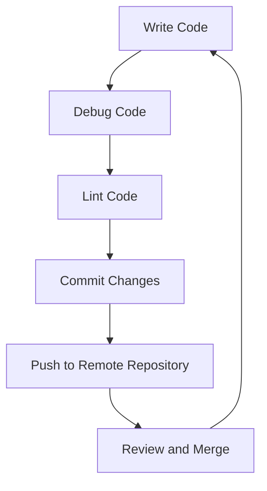

## E. Setting Up Development Tools

Embarking on your journey into Object-Oriented Programming (OOP) in JavaScript requires a solid foundation, and that begins with setting up an efficient development environment. In this guide, we'll walk through configuring popular Integrated Development Environments (IDEs) like Visual Studio Code and WebStorm, explore useful extensions, and discuss tips for debugging, linting, and version control. By the end of this chapter, you'll be equipped with the tools and knowledge to write, test, and manage your JavaScript code effectively.

### 1. Choosing the Right IDE

An IDE is your primary tool for writing and managing code. It provides features like syntax highlighting, code completion, and debugging tools that can significantly enhance productivity. Let's explore two of the most popular IDEs for JavaScript development: Visual Studio Code and WebStorm.

#### 1.1 Visual Studio Code

**Visual Studio Code (VS Code)** is a free, open-source IDE developed by Microsoft. It's highly customizable and supports a wide range of extensions, making it a favorite among developers.

**Installation Steps:**

1. **Download and Install:**
   - Visit the [Visual Studio Code website](https://code.visualstudio.com/).
   - Download the installer for your operating system (Windows, macOS, or Linux).
   - Run the installer and follow the on-screen instructions.

2. **Initial Setup:**
   - Launch VS Code.
   - Customize the appearance by selecting a theme from the welcome screen.

3. **Install Node.js:**
   - Visit the [Node.js website](https://nodejs.org/) and download the LTS version.
   - Install Node.js, which includes npm (Node Package Manager).

4. **Verify Installation:**
   - Open a terminal in VS Code.
   - Type `node -v` and `npm -v` to check the installed versions.

#### 1.2 WebStorm

**WebStorm** is a powerful IDE developed by JetBrains, specifically designed for JavaScript and web development. It offers advanced features like intelligent code completion and refactoring.

**Installation Steps:**

1. **Download and Install:**
   - Visit the [JetBrains website](https://www.jetbrains.com/webstorm/).
   - Download the installer for your operating system.
   - Run the installer and follow the setup wizard.

2. **Initial Setup:**
   - Launch WebStorm.
   - Configure the IDE appearance and keymap according to your preferences.

3. **Install Node.js:**
   - Similar to VS Code, ensure Node.js is installed on your system.

4. **Verify Installation:**
   - Open the terminal in WebStorm.
   - Run `node -v` and `npm -v` to confirm installation.

### 2. Enhancing Productivity with Extensions

Extensions or plugins can greatly enhance your coding experience by adding features like code linting, version control integration, and more. Let's explore some essential extensions for both VS Code and WebStorm.

#### 2.1 Visual Studio Code Extensions

1. **ESLint:**
   - Provides JavaScript linting capabilities to ensure code quality.
   - Install via the Extensions Marketplace in VS Code.

2. **Prettier:**
   - A code formatter that enforces consistent style.
   - Install and configure to format code on save.

3. **Debugger for Chrome:**
   - Allows debugging of JavaScript code in Google Chrome.
   - Useful for web development projects.

4. **GitLens:**
   - Enhances Git capabilities within VS Code.
   - Provides insights into code authorship and history.

5. **Live Server:**
   - Launches a local development server with live reload capability.
   - Ideal for testing web applications.

#### 2.2 WebStorm Plugins

1. **ESLint:**
   - Built-in support for ESLint is available in WebStorm.
   - Configure ESLint settings in the preferences.

2. **Prettier:**
   - Available as a plugin for WebStorm.
   - Configure to format code automatically.

3. **Node.js:**
   - WebStorm includes built-in support for Node.js.
   - Configure Node.js settings in the preferences.

4. **Git Integration:**
   - WebStorm offers robust Git integration.
   - Access Git features directly from the IDE.

5. **JavaScript Debugger:**
   - Built-in debugger for JavaScript.
   - Set breakpoints and inspect variables during execution.

### 3. Configuring Debugging

Debugging is an essential part of the development process. Both VS Code and WebStorm offer powerful debugging tools to help you identify and fix issues in your code.

#### 3.1 Debugging in Visual Studio Code

1. **Launch Configuration:**
   - Create a `launch.json` file in the `.vscode` folder.
   - Define configurations for different debugging scenarios.

2. **Setting Breakpoints:**
   - Click in the gutter next to the line number to set a breakpoint.
   - Use the Debug panel to start debugging.

3. **Inspecting Variables:**
   - Use the Variables panel to view variable values.
   - Hover over variables in the editor to see their current values.

4. **Using the Debug Console:**
   - Execute JavaScript expressions in the Debug Console.
   - Evaluate expressions and inspect objects.

#### 3.2 Debugging in WebStorm

1. **Run/Debug Configurations:**
   - Create configurations for different run/debug scenarios.
   - Access configurations from the Run menu.

2. **Setting Breakpoints:**
   - Click in the gutter next to the line number to set breakpoints.
   - Use the Debug tool window to manage breakpoints.

3. **Inspecting Variables:**
   - Use the Variables tab to view and modify variable values.
   - Evaluate expressions using the Evaluate Expression dialog.

4. **Using the Console:**
   - Access the Console tab to execute JavaScript expressions.
   - Inspect objects and evaluate code snippets.

### 4. Linting and Code Quality

Linting helps maintain code quality by identifying potential errors and enforcing coding standards. ESLint is a popular tool for linting JavaScript code.

#### 4.1 Setting Up ESLint in Visual Studio Code

1. **Install ESLint Extension:**
   - Search for "ESLint" in the Extensions Marketplace and install it.

2. **Configure ESLint:**
   - Create an `.eslintrc.json` file in your project root.
   - Define rules and configurations to enforce coding standards.

3. **Linting on Save:**
   - Enable linting on save in VS Code settings.
   - Automatically fix linting errors on save.

4. **Customizing Rules:**
   - Modify ESLint rules in the configuration file.
   - Tailor rules to match your project's coding standards.

#### 4.2 Setting Up ESLint in WebStorm

1. **Enable ESLint:**
   - Go to Preferences > Languages & Frameworks > JavaScript > Code Quality Tools > ESLint.
   - Enable ESLint and specify the configuration file.

2. **Configure ESLint:**
   - Create an `.eslintrc.json` file in your project root.
   - Define rules and configurations to enforce coding standards.

3. **Linting on Save:**
   - Enable linting on save in WebStorm settings.
   - Automatically fix linting errors on save.

4. **Customizing Rules:**
   - Modify ESLint rules in the configuration file.
   - Tailor rules to match your project's coding standards.

### 5. Version Control with Git

Version control is crucial for managing code changes and collaborating with others. Git is the most widely used version control system, and both VS Code and WebStorm offer excellent Git integration.

#### 5.1 Using Git in Visual Studio Code

1. **Initialize a Git Repository:**
   - Open the terminal in VS Code.
   - Run `git init` to initialize a new Git repository.

2. **Staging and Committing Changes:**
   - Use the Source Control panel to stage and commit changes.
   - Write meaningful commit messages.

3. **Branching and Merging:**
   - Create new branches for feature development.
   - Merge branches using the Git panel.

4. **Pushing and Pulling:**
   - Connect to a remote repository (e.g., GitHub).
   - Use the terminal or Git panel to push and pull changes.

#### 5.2 Using Git in WebStorm

1. **Initialize a Git Repository:**
   - Go to VCS > Enable Version Control Integration.
   - Select Git as the version control system.

2. **Staging and Committing Changes:**
   - Use the Commit tool window to stage and commit changes.
   - Write meaningful commit messages.

3. **Branching and Merging:**
   - Create new branches from the Branches menu.
   - Merge branches using the VCS menu.

4. **Pushing and Pulling:**
   - Connect to a remote repository (e.g., GitHub).
   - Use the VCS menu to push and pull changes.

### 6. Try It Yourself

Now that you've set up your development environment, it's time to put it to the test. Let's create a simple JavaScript project using the tools and techniques we've discussed.

**Project: To-Do List Application**

1. **Create a New Project:**
   - Open your IDE and create a new project folder.
   - Initialize a Git repository in the project folder.

2. **Set Up ESLint:**
   - Create an `.eslintrc.json` file with basic rules.
   - Install the ESLint extension or plugin.

3. **Write JavaScript Code:**
   - Create a `main.js` file.
   - Implement a simple to-do list using JavaScript objects.

```javascript
// main.js

// Create a to-do list object
const todoList = {
  tasks: [],
  addTask(task) {
    this.tasks.push(task);
    console.log(`Task "${task}" added.`);
  },
  displayTasks() {
    console.log("To-Do List:");
    this.tasks.forEach((task, index) => {
      console.log(`${index + 1}. ${task}`);
    });
  },
};

// Add tasks to the to-do list
todoList.addTask("Learn JavaScript");
todoList.addTask("Practice coding");

// Display the to-do list
todoList.displayTasks();
```

4. **Debug the Code:**
   - Set breakpoints in your code.
   - Use the debugger to step through the code and inspect variables.

5. **Commit Your Changes:**
   - Stage and commit your changes using Git.
   - Push your changes to a remote repository.

### 7. Visualizing the Development Workflow

To better understand the development workflow, let's visualize the process using a flowchart. This will help you see how each step connects to the next, from writing code to debugging and version control.



**Description:** This flowchart illustrates the typical development workflow, starting with writing code, debugging, linting, committing changes, pushing to a remote repository, and finally reviewing and merging changes.

### 8. Key Takeaways

- **Choose the Right IDE:** Visual Studio Code and WebStorm are excellent choices for JavaScript development.
- **Enhance Productivity:** Use extensions and plugins to add features like linting and version control.
- **Debugging:** Set up debugging configurations to identify and fix issues in your code.
- **Linting:** Maintain code quality with ESLint and enforce coding standards.
- **Version Control:** Use Git to manage code changes and collaborate with others.

### 9. Embrace the Journey

Remember, setting up your development environment is just the beginning. As you progress, you'll build more complex and interactive applications. Keep experimenting, stay curious, and enjoy the journey!

## Quiz Time!



### What is the primary purpose of an IDE?

- [x] To provide tools for writing and managing code
- [ ] To compile code into machine language
- [ ] To host websites on the internet
- [ ] To design user interfaces

> **Explanation:** An IDE provides tools for writing, managing, and debugging code, enhancing productivity for developers.

### Which of the following is a popular IDE for JavaScript development?

- [x] Visual Studio Code
- [ ] Microsoft Word
- [ ] Adobe Photoshop
- [ ] Google Chrome

> **Explanation:** Visual Studio Code is a widely used IDE for JavaScript and web development.

### What is the purpose of the ESLint extension?

- [x] To provide JavaScript linting capabilities
- [ ] To compile JavaScript code
- [ ] To design web pages
- [ ] To manage databases

> **Explanation:** ESLint is used to lint JavaScript code, identifying potential errors and enforcing coding standards.

### How do you set a breakpoint in Visual Studio Code?

- [x] Click in the gutter next to the line number
- [ ] Right-click the line and select "Set Breakpoint"
- [ ] Press Ctrl + B
- [ ] Type "breakpoint" in the command palette

> **Explanation:** In Visual Studio Code, you set a breakpoint by clicking in the gutter next to the line number.

### What is the purpose of Git in development?

- [x] To manage code changes and collaborate with others
- [ ] To design user interfaces
- [ ] To compile code into machine language
- [ ] To host websites on the internet

> **Explanation:** Git is a version control system used to manage code changes and facilitate collaboration among developers.

### Which command initializes a new Git repository?

- [x] git init
- [ ] git start
- [ ] git create
- [ ] git new

> **Explanation:** The `git init` command initializes a new Git repository in the current directory.

### What is the purpose of the Debug Console in Visual Studio Code?

- [x] To execute JavaScript expressions during debugging
- [ ] To compile JavaScript code
- [ ] To design web pages
- [ ] To manage databases

> **Explanation:** The Debug Console allows developers to execute JavaScript expressions and inspect objects during debugging.

### How can you automatically format code on save in Visual Studio Code?

- [x] By configuring Prettier to format on save
- [ ] By using the Format Document command
- [ ] By manually editing the code
- [ ] By using the command palette

> **Explanation:** Prettier can be configured to automatically format code on save, ensuring consistent code style.

### Which of the following is a step in the typical development workflow?

- [x] Debug Code
- [ ] Design User Interfaces
- [ ] Host Websites
- [ ] Compile Code

> **Explanation:** Debugging code is a crucial step in the development workflow to identify and fix issues.

### True or False: WebStorm is a free, open-source IDE.

- [ ] True
- [x] False

> **Explanation:** WebStorm is a commercial IDE developed by JetBrains, offering advanced features for JavaScript development.


