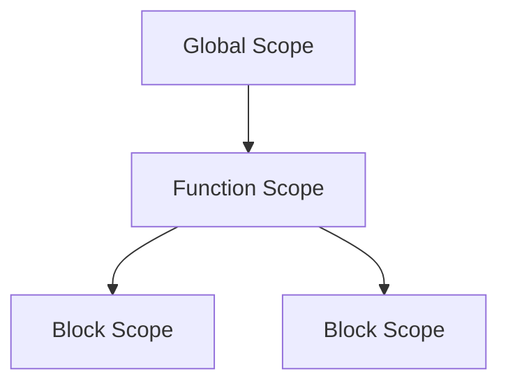

## 2.1 Variables and Data Types

Welcome to the world of JavaScript, where understanding variables and data types is foundational to writing effective and efficient code. In this section, we will explore how to declare variables using `var`, `let`, and `const`, delve into primitive and reference data types, and understand the concept of variable scope. Let's begin our journey into JavaScript fundamentals!

### Understanding Variables in JavaScript

Variables are containers for storing data values. In JavaScript, you can declare a variable using three keywords: `var`, `let`, and `const`. Each of these has its own characteristics and use cases.

#### Declaring Variables with `var`

The `var` keyword is the oldest way to declare variables in JavaScript. It has a function scope, which means that a variable declared with `var` is available throughout the function in which it is declared.

```javascript
function greet() {
  var message = "Hello, World!";
  console.log(message); // Output: Hello, World!
}
greet();
console.log(message); // Error: message is not defined
```

In the example above, the variable `message` is only accessible within the `greet` function.

#### Declaring Variables with `let`

The `let` keyword was introduced in ES6 (ECMAScript 2015) and provides block scope, which is more intuitive for many developers. A variable declared with `let` is only accessible within the block in which it is defined.

```javascript
if (true) {
  let greeting = "Hi there!";
  console.log(greeting); // Output: Hi there!
}
console.log(greeting); // Error: greeting is not defined
```

Here, `greeting` is only accessible within the `if` block.

#### Declaring Variables with `const`

The `const` keyword is also block-scoped and is used to declare variables that should not be reassigned. However, it is important to note that `const` does not make the variable immutable; it only prevents reassignment of the variable identifier.

```javascript
const pi = 3.14159;
console.log(pi); // Output: 3.14159
pi = 3.14; // Error: Assignment to constant variable
```

While you cannot reassign `pi`, you can still modify the contents of a `const` object or array.

```javascript
const numbers = [1, 2, 3];
numbers.push(4);
console.log(numbers); // Output: [1, 2, 3, 4]
```

### Primitive Data Types

JavaScript has several primitive data types, which are immutable and stored by value. These include:

1. **String**: Represents textual data.
2. **Number**: Represents numeric values.
3. **Boolean**: Represents truthy or falsy values.
4. **Null**: Represents an intentional absence of any object value.
5. **Undefined**: Represents a variable that has been declared but not assigned a value.
6. **Symbol**: Represents a unique and immutable value, often used as object keys.

#### Strings

Strings are sequences of characters used to represent text. They can be enclosed in single quotes, double quotes, or backticks for template literals.

```javascript
let singleQuote = 'Hello';
let doubleQuote = "World";
let templateLiteral = `Hello, ${doubleQuote}!`;
console.log(templateLiteral); // Output: Hello, World!
```

#### Numbers

JavaScript uses a single type for all numeric values, including integers and floating-point numbers.

```javascript
let integer = 42;
let float = 3.14;
console.log(integer + float); // Output: 45.14
```

#### Booleans

Booleans represent logical values: `true` or `false`.

```javascript
let isJavaScriptFun = true;
console.log(isJavaScriptFun); // Output: true
```

#### Null and Undefined

`Null` is an assignment value that represents no value, while `undefined` is a type of its own, indicating a variable that has not been assigned a value.

```javascript
let emptyValue = null;
let notAssigned;
console.log(emptyValue); // Output: null
console.log(notAssigned); // Output: undefined
```

#### Symbols

Symbols are unique identifiers, useful for creating unique property keys in objects.

```javascript
let symbol1 = Symbol('description');
let symbol2 = Symbol('description');
console.log(symbol1 === symbol2); // Output: false
```

### Reference Data Types

Unlike primitive data types, reference data types are mutable and stored by reference. These include objects, arrays, and functions.

#### Objects

Objects are collections of key-value pairs. They can be created using object literals or the `new Object()` syntax.

```javascript
let person = {
  name: "Alice",
  age: 30
};
console.log(person.name); // Output: Alice
```

#### Arrays

Arrays are ordered collections of values, which can be of mixed types.

```javascript
let fruits = ["apple", "banana", "cherry"];
console.log(fruits[1]); // Output: banana
```

#### Functions

Functions are first-class objects in JavaScript, meaning they can be assigned to variables, passed as arguments, and returned from other functions.

```javascript
function add(a, b) {
  return a + b;
}
console.log(add(2, 3)); // Output: 5
```

### Variable Scope

Understanding scope is crucial in JavaScript as it determines the accessibility of variables.

#### Global Scope

Variables declared outside of any function or block have global scope and can be accessed from anywhere in the code.

```javascript
var globalVar = "I'm global";

function showGlobalVar() {
  console.log(globalVar); // Output: I'm global
}
showGlobalVar();
```

#### Function Scope

Variables declared within a function using `var` are function-scoped.

```javascript
function localScope() {
  var localVar = "I'm local";
  console.log(localVar); // Output: I'm local
}
localScope();
console.log(localVar); // Error: localVar is not defined
```

#### Block Scope

Variables declared with `let` or `const` are block-scoped.

```javascript
if (true) {
  let blockVar = "I'm block-scoped";
  console.log(blockVar); // Output: I'm block-scoped
}
console.log(blockVar); // Error: blockVar is not defined
```

### Try It Yourself

Now that we've covered the basics, try modifying the examples above. For instance, change the scope of a variable or try using `const` instead of `let`. Experimenting with these concepts will help solidify your understanding.

### Visualizing Scope

To better understand how scope works, let's visualize it using a diagram.



In this diagram, the global scope contains function scopes, which in turn contain block scopes. This hierarchy determines where variables can be accessed.

### References and Links

For more information on JavaScript variables and data types, check out these resources:

- [MDN Web Docs: JavaScript Data Types and Data Structures](https://developer.mozilla.org/en-US/docs/Web/JavaScript/Data_structures)
- [W3Schools: JavaScript Variables](https://www.w3schools.com/js/js_variables.asp)

### Knowledge Check

Before we wrap up, let's test your understanding with a few questions:

1. What are the differences between `var`, `let`, and `const`?
2. How do primitive data types differ from reference data types?
3. What is the significance of variable scope in JavaScript?

### Embrace the Journey

Remember, mastering variables and data types is just the beginning of your JavaScript journey. As you continue to learn, you'll discover more about how these concepts fit into larger programming paradigms. Keep experimenting, stay curious, and enjoy the process!

## Quiz Time!



### Which keyword is used to declare a block-scoped variable in JavaScript?

- [ ] var
- [x] let
- [ ] const
- [ ] function

> **Explanation:** The `let` keyword is used to declare block-scoped variables in JavaScript.

### Which of the following is a primitive data type in JavaScript?

- [x] String
- [ ] Object
- [ ] Array
- [ ] Function

> **Explanation:** A string is a primitive data type in JavaScript, while objects, arrays, and functions are reference types.

### What will be the output of the following code?
```javascript
let x;
console.log(x);
```

- [x] undefined
- [ ] null
- [ ] 0
- [ ] Error

> **Explanation:** The variable `x` is declared but not assigned a value, so it is `undefined`.

### Which data type is used to represent unique and immutable values in JavaScript?

- [ ] Number
- [ ] Boolean
- [ ] Null
- [x] Symbol

> **Explanation:** Symbols are unique and immutable values, often used as object keys.

### How can you declare a constant variable in JavaScript?

- [ ] var
- [ ] let
- [x] const
- [ ] function

> **Explanation:** The `const` keyword is used to declare constant variables that cannot be reassigned.

### What is the scope of a variable declared with `var` inside a function?

- [ ] Block scope
- [x] Function scope
- [ ] Global scope
- [ ] Module scope

> **Explanation:** Variables declared with `var` inside a function have function scope.

### Which of the following is a reference data type in JavaScript?

- [ ] Number
- [ ] Boolean
- [x] Object
- [ ] Symbol

> **Explanation:** Objects are reference data types in JavaScript.

### What will be the output of the following code?
```javascript
const arr = [1, 2, 3];
arr.push(4);
console.log(arr);
```

- [ ] Error
- [ ] [1, 2, 3]
- [x] [1, 2, 3, 4]
- [ ] [4, 3, 2, 1]

> **Explanation:** The `push` method adds an element to the end of the array, resulting in `[1, 2, 3, 4]`.

### What is the default value of a variable that has been declared but not initialized?

- [x] undefined
- [ ] null
- [ ] 0
- [ ] false

> **Explanation:** A variable that is declared but not initialized is `undefined`.

### True or False: A variable declared with `const` can have its value changed.

- [ ] True
- [x] False

> **Explanation:** A variable declared with `const` cannot be reassigned, though objects and arrays declared with `const` can have their contents modified.



By mastering these fundamental concepts, you're well on your way to becoming proficient in JavaScript. Keep practicing and exploring, and soon you'll be able to tackle more complex programming challenges with confidence!
