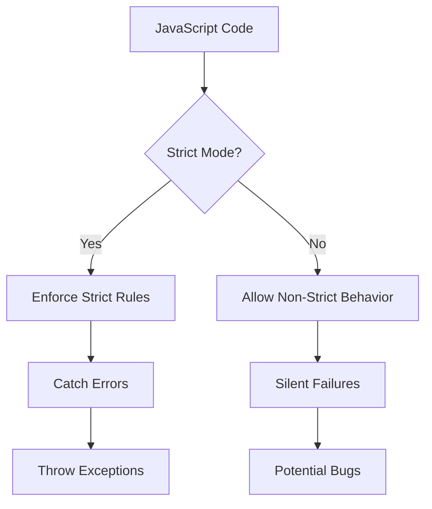

## 2.10 Strict Mode

JavaScript is a versatile and powerful language, but it has its quirks and pitfalls that can lead to unexpected behavior and hard-to-find bugs. To help developers write more robust and secure code, ECMAScript 5 introduced a feature known as "strict mode." In this section, we'll explore what strict mode is, how to enable it, its benefits, and the changes it enforces in JavaScript behavior. By the end, you'll understand why adopting strict mode is a best practice for JavaScript development.

### What is Strict Mode?

Strict mode is a way to opt into a restricted variant of JavaScript. It intentionally changes the semantics of the language to make it more secure and less error-prone. When you enable strict mode, JavaScript will enforce stricter parsing and error handling on your code, helping you catch common coding mistakes and unsafe actions.

#### Enabling Strict Mode

To enable strict mode, you simply need to include the directive `"use strict";` at the beginning of your JavaScript file or function. This directive is a string literal, not a statement, so it doesn't require a semicolon, but it's a good practice to include one for consistency.

Here's how you can enable strict mode in a JavaScript file:

```javascript
"use strict";

function myFunction() {
  // Your code here
}
```

You can also enable strict mode for individual functions:

```javascript
function myFunction() {
  "use strict";
  // Your code here
}
```

When strict mode is enabled, it applies to the entire script or function in which it is declared.

### Benefits of Strict Mode

Strict mode offers several benefits that help improve the quality and security of your JavaScript code:

1. **Catching Silent Errors**: In non-strict mode, JavaScript sometimes fails silently without throwing errors. Strict mode changes this behavior by throwing exceptions, making it easier to identify and fix bugs.

2. **Preventing Accidental Globals**: In JavaScript, if you assign a value to an undeclared variable, it automatically becomes a global variable. Strict mode prevents this by throwing an error if you try to assign a value to an undeclared variable.

3. **Eliminating `this` Coercion**: In non-strict mode, if you call a function without an explicit context, `this` defaults to the global object. Strict mode changes this behavior so that `this` remains `undefined`, preventing unintended global variable creation.

4. **Disallowing Duplicates**: Strict mode disallows duplicate parameter names in functions, which can lead to unexpected behavior.

5. **Securing `eval` and `arguments`**: Strict mode places restrictions on the use of `eval` and `arguments`, preventing potential security vulnerabilities.

6. **Improved Performance**: Some JavaScript engines can optimize strict mode code better than non-strict mode code, leading to potential performance improvements.

### Changes in Behavior with Strict Mode

Strict mode enforces several changes in JavaScript behavior. Let's explore some of the most significant ones:

#### 1. Preventing Undeclared Variables

In non-strict mode, assigning a value to an undeclared variable creates a global variable. This can lead to unintended side effects and bugs. Strict mode prevents this by throwing a `ReferenceError`.

```javascript
"use strict";

x = 10; // ReferenceError: x is not defined
```

#### 2. Eliminating `this` Coercion

In non-strict mode, if you call a function without an explicit context, `this` defaults to the global object. In strict mode, `this` remains `undefined`, preventing accidental global variable creation.

```javascript
"use strict";

function showThis() {
  console.log(this);
}

showThis(); // undefined
```

#### 3. Disallowing Duplicates

Strict mode disallows duplicate parameter names in functions, which can lead to unexpected behavior.

```javascript
"use strict";

function sum(a, a, c) { // SyntaxError: Duplicate parameter name not allowed in this context
  return a + a + c;
}
```

#### 4. Securing `eval` and `arguments`

Strict mode places restrictions on the use of `eval` and `arguments`. For example, `eval` cannot introduce new variables into the surrounding scope, and `arguments` cannot be assigned.

```javascript
"use strict";

eval("var x = 2;");
console.log(x); // ReferenceError: x is not defined

function myFunction(a, b) {
  arguments[0] = 99; // TypeError: Cannot assign to read only property '0' of object '[object Arguments]'
  console.log(a); // 1
}

myFunction(1, 2);
```

#### 5. Prohibiting Octal Syntax

Strict mode disallows octal syntax, which can lead to confusion and errors.

```javascript
"use strict";

var num = 010; // SyntaxError: Octal literals are not allowed in strict mode.
```

#### 6. Preventing `delete` on Plain Names

Strict mode prevents the use of the `delete` operator on plain variable names, as this can lead to unintended behavior.

```javascript
"use strict";

var x = 1;
delete x; // SyntaxError: Delete of an unqualified identifier in strict mode.
```

### Encouraging the Use of Strict Mode

Adopting strict mode in your JavaScript code is a best practice that can help you write more secure and reliable code. By catching common mistakes and enforcing stricter rules, strict mode helps you avoid potential pitfalls and bugs.

#### Try It Yourself

To get a feel for strict mode, try modifying some of the code examples provided above. For instance, remove the `"use strict";` directive and observe how the behavior changes. Experiment with declaring variables without `var`, `let`, or `const`, and see how strict mode helps catch these errors.

### Visualizing Strict Mode Behavior

To better understand how strict mode affects JavaScript behavior, let's visualize the differences using a flowchart. The following diagram illustrates the decision-making process when JavaScript encounters certain constructs in strict mode versus non-strict mode.



In this flowchart, we see that when strict mode is enabled, JavaScript enforces strict rules, catches errors, and throws exceptions, helping developers identify and fix issues. In contrast, non-strict mode allows for silent failures, which can lead to potential bugs.

### References and Further Reading

For more information on strict mode and its benefits, check out the following resources:

- [MDN Web Docs: Strict mode](https://developer.mozilla.org/en-US/docs/Web/JavaScript/Reference/Strict_mode)
- [W3Schools: JavaScript Strict Mode](https://www.w3schools.com/js/js_strict.asp)

### Knowledge Check

Before we wrap up, let's summarize the key takeaways from this section:

- Strict mode is a way to opt into a restricted variant of JavaScript, enforcing stricter parsing and error handling.
- Enabling strict mode helps catch silent errors, prevent accidental globals, eliminate `this` coercion, and disallow duplicates.
- Strict mode places restrictions on `eval` and `arguments`, prohibits octal syntax, and prevents `delete` on plain names.
- Adopting strict mode is a best practice for writing secure and reliable JavaScript code.

### Embrace the Journey

Remember, this is just the beginning. As you progress, you'll build more complex and interactive web pages. Keep experimenting, stay curious, and enjoy the journey!

## Quiz Time!



### What is the purpose of strict mode in JavaScript?

- [x] To enforce stricter parsing and error handling
- [ ] To make JavaScript run faster
- [ ] To disable certain JavaScript features
- [ ] To change the syntax of JavaScript

> **Explanation:** Strict mode enforces stricter parsing and error handling, helping developers catch common mistakes and write more secure code.

### How do you enable strict mode in a JavaScript file?

- [x] By adding `"use strict";` at the beginning of the file
- [ ] By adding `"strict";` at the beginning of the file
- [ ] By setting a global variable `strictMode = true;`
- [ ] By using a special JavaScript compiler

> **Explanation:** Strict mode is enabled by adding the directive `"use strict";` at the beginning of a JavaScript file or function.

### What happens if you assign a value to an undeclared variable in strict mode?

- [x] A `ReferenceError` is thrown
- [ ] The variable is automatically declared as global
- [ ] The assignment is silently ignored
- [ ] The variable is declared as local

> **Explanation:** In strict mode, assigning a value to an undeclared variable throws a `ReferenceError`, preventing accidental global variable creation.

### What is the behavior of `this` in a function called without an explicit context in strict mode?

- [x] `this` is `undefined`
- [ ] `this` is the global object
- [ ] `this` is the function itself
- [ ] `this` is an empty object

> **Explanation:** In strict mode, if a function is called without an explicit context, `this` remains `undefined`, preventing unintended global variable creation.

### Which of the following is disallowed in strict mode?

- [x] Duplicate parameter names in functions
- [ ] Using `let` and `const`
- [ ] Declaring variables with `var`
- [x] Octal syntax

> **Explanation:** Strict mode disallows duplicate parameter names in functions and octal syntax, which can lead to unexpected behavior.

### How does strict mode affect the use of `eval`?

- [x] `eval` cannot introduce new variables into the surrounding scope
- [ ] `eval` is completely disabled
- [ ] `eval` runs faster
- [ ] `eval` can only be used in global scope

> **Explanation:** In strict mode, `eval` cannot introduce new variables into the surrounding scope, enhancing security and predictability.

### What happens if you try to delete a plain variable name in strict mode?

- [x] A `SyntaxError` is thrown
- [ ] The variable is deleted
- [ ] The operation is silently ignored
- [ ] The variable is set to `null`

> **Explanation:** In strict mode, attempting to delete a plain variable name throws a `SyntaxError`, as this can lead to unintended behavior.

### Why is adopting strict mode considered a best practice?

- [x] It helps catch common mistakes and write more secure code
- [ ] It makes JavaScript code run faster
- [ ] It allows the use of deprecated features
- [ ] It simplifies JavaScript syntax

> **Explanation:** Adopting strict mode is a best practice because it helps catch common mistakes, enforce stricter rules, and write more secure and reliable code.

### Can strict mode be enabled for individual functions?

- [x] True
- [ ] False

> **Explanation:** Strict mode can be enabled for individual functions by including the `"use strict";` directive at the beginning of the function.

### What is the effect of strict mode on performance?

- [x] Some JavaScript engines can optimize strict mode code better
- [ ] Strict mode always makes code run slower
- [ ] Strict mode has no effect on performance
- [ ] Strict mode makes code run faster by default

> **Explanation:** Some JavaScript engines can optimize strict mode code better than non-strict mode code, potentially leading to performance improvements.


