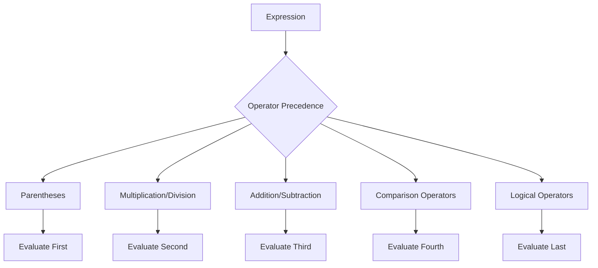

## 2.2 Operators and Expressions

In this section, we will delve into the world of operators and expressions in JavaScript. Understanding these fundamental concepts is crucial for writing effective and efficient code. Operators are special symbols that perform operations on operands, and expressions are combinations of values and operators that evaluate to a value. Let's explore the different types of operators available in JavaScript and how they can be used to create expressions.

### Arithmetic Operators

Arithmetic operators are used to perform mathematical calculations. They include addition, subtraction, multiplication, division, modulus, increment, and decrement. Let's take a closer look at each of these operators.

- **Addition (`+`)**: Adds two numbers together.
- **Subtraction (`-`)**: Subtracts the second number from the first.
- **Multiplication (`*`)**: Multiplies two numbers.
- **Division (`/`)**: Divides the first number by the second.
- **Modulus (`%`)**: Returns the remainder of the division of two numbers.
- **Increment (`++`)**: Increases a number by one.
- **Decrement (`--`)**: Decreases a number by one.

#### Example of Arithmetic Operators

```javascript
let a = 10;
let b = 5;

// Addition
let sum = a + b; // 15

// Subtraction
let difference = a - b; // 5

// Multiplication
let product = a * b; // 50

// Division
let quotient = a / b; // 2

// Modulus
let remainder = a % b; // 0

// Increment
a++; // a is now 11

// Decrement
b--; // b is now 4
```

### Assignment Operators

Assignment operators are used to assign values to variables. The most basic assignment operator is the equal sign (`=`), but there are also compound assignment operators that combine arithmetic operations with assignment.

- **Assignment (`=`)**: Assigns the value on the right to the variable on the left.
- **Addition Assignment (`+=`)**: Adds the right operand to the left operand and assigns the result to the left operand.
- **Subtraction Assignment (`-=`)**: Subtracts the right operand from the left operand and assigns the result to the left operand.
- **Multiplication Assignment (`*=`)**: Multiplies the left operand by the right operand and assigns the result to the left operand.
- **Division Assignment (`/=`)**: Divides the left operand by the right operand and assigns the result to the left operand.
- **Modulus Assignment (`%=`)**: Takes the modulus using two operands and assigns the result to the left operand.

#### Example of Assignment Operators

```javascript
let x = 10;

// Assignment
x = 5; // x is now 5

// Addition Assignment
x += 3; // x is now 8

// Subtraction Assignment
x -= 2; // x is now 6

// Multiplication Assignment
x *= 4; // x is now 24

// Division Assignment
x /= 3; // x is now 8

// Modulus Assignment
x %= 5; // x is now 3
```

### Comparison Operators

Comparison operators are used to compare two values. They return a boolean value (`true` or `false`) based on the comparison.

- **Equal (`==`)**: Checks if two values are equal.
- **Strict Equal (`===`)**: Checks if two values are equal and of the same type.
- **Not Equal (`!=`)**: Checks if two values are not equal.
- **Strict Not Equal (`!==`)**: Checks if two values are not equal or not of the same type.
- **Greater Than (`>`)**: Checks if the left value is greater than the right value.
- **Less Than (`<`)**: Checks if the left value is less than the right value.
- **Greater Than or Equal To (`>=`)**: Checks if the left value is greater than or equal to the right value.
- **Less Than or Equal To (`<=`)**: Checks if the left value is less than or equal to the right value.

#### Example of Comparison Operators

```javascript
let num1 = 10;
let num2 = 20;

// Equal
console.log(num1 == num2); // false

// Strict Equal
console.log(num1 === num2); // false

// Not Equal
console.log(num1 != num2); // true

// Strict Not Equal
console.log(num1 !== num2); // true

// Greater Than
console.log(num1 > num2); // false

// Less Than
console.log(num1 < num2); // true

// Greater Than or Equal To
console.log(num1 >= num2); // false

// Less Than or Equal To
console.log(num1 <= num2); // true
```

### Logical Operators

Logical operators are used to combine multiple boolean expressions. They include AND, OR, and NOT.

- **Logical AND (`&&`)**: Returns `true` if both operands are true.
- **Logical OR (`||`)**: Returns `true` if at least one operand is true.
- **Logical NOT (`!`)**: Returns the opposite boolean value of the operand.

#### Example of Logical Operators

```javascript
let isAdult = true;
let hasLicense = false;

// Logical AND
console.log(isAdult && hasLicense); // false

// Logical OR
console.log(isAdult || hasLicense); // true

// Logical NOT
console.log(!isAdult); // false
```

### Bitwise Operators

Bitwise operators perform operations on binary representations of numbers. They include AND, OR, XOR, NOT, LEFT SHIFT, RIGHT SHIFT, and ZERO-FILL RIGHT SHIFT.

- **Bitwise AND (`&`)**: Performs a binary AND operation.
- **Bitwise OR (`|`)**: Performs a binary OR operation.
- **Bitwise XOR (`^`)**: Performs a binary XOR operation.
- **Bitwise NOT (`~`)**: Inverts the bits of the operand.
- **Left Shift (`<<`)**: Shifts bits to the left.
- **Right Shift (`>>`)**: Shifts bits to the right.
- **Zero-fill Right Shift (`>>>`)**: Shifts bits to the right, filling with zeros.

#### Example of Bitwise Operators

```javascript
let a = 5; // 0101 in binary
let b = 3; // 0011 in binary

// Bitwise AND
console.log(a & b); // 1 (0001 in binary)

// Bitwise OR
console.log(a | b); // 7 (0111 in binary)

// Bitwise XOR
console.log(a ^ b); // 6 (0110 in binary)

// Bitwise NOT
console.log(~a); // -6 (inverts all bits)

// Left Shift
console.log(a << 1); // 10 (1010 in binary)

// Right Shift
console.log(a >> 1); // 2 (0010 in binary)

// Zero-fill Right Shift
console.log(a >>> 1); // 2 (0010 in binary)
```

### Operator Precedence and Associativity

Operator precedence determines the order in which operators are evaluated in an expression. Operators with higher precedence are evaluated before operators with lower precedence. Associativity determines the order in which operators of the same precedence are evaluated. Most operators have left-to-right associativity, except for assignment operators, which have right-to-left associativity.

#### Example of Operator Precedence

```javascript
let result = 10 + 5 * 2; // 20, because * has higher precedence than +
```

In the example above, the multiplication operator (`*`) has higher precedence than the addition operator (`+`), so the multiplication is performed first.

#### Example of Associativity

```javascript
let result = 10 - 5 - 2; // 3, because - has left-to-right associativity
```

In the example above, the subtraction operator (`-`) has left-to-right associativity, so the operations are performed from left to right.

### Try It Yourself

Now that we've covered the basics of operators and expressions, it's time to put your knowledge to the test. Try modifying the code examples above to see how different operators and expressions work. For example, you could:

- Change the values of the variables and see how the results change.
- Combine multiple operators in a single expression and observe the result.
- Use parentheses to change the order of operations in an expression.

### Exercises

1. Write a JavaScript expression that calculates the area of a rectangle with a width of 10 and a height of 5.
2. Create a function that takes two numbers as arguments and returns their average.
3. Write an expression that checks if a number is even using the modulus operator.
4. Create a function that takes a boolean value and returns its opposite using the logical NOT operator.
5. Write a JavaScript expression that swaps the values of two variables using a temporary variable.

### Visualizing Operator Precedence

To help visualize operator precedence, let's use a flowchart to represent the order in which operators are evaluated.



In this flowchart, we see that parentheses have the highest precedence, followed by multiplication and division, addition and subtraction, comparison operators, and finally logical operators.

### References and Links

For more information on operators and expressions in JavaScript, check out the following resources:

- [MDN Web Docs: Expressions and Operators](https://developer.mozilla.org/en-US/docs/Web/JavaScript/Guide/Expressions_and_Operators)
- [W3Schools: JavaScript Operators](https://www.w3schools.com/js/js_operators.asp)

### Knowledge Check

Before moving on, let's review what we've learned about operators and expressions in JavaScript. Make sure you understand the different types of operators, how to use them in expressions, and how operator precedence affects the order of operations.

### Embrace the Journey

Remember, this is just the beginning. As you progress, you'll build more complex and interactive web pages. Keep experimenting, stay curious, and enjoy the journey!

## Quiz Time!



### Which operator is used to add two numbers?

- [x] +
- [ ] -
- [ ] *
- [ ] /

> **Explanation:** The `+` operator is used for addition in JavaScript.

### What does the `===` operator do?

- [x] Checks if two values are equal and of the same type
- [ ] Checks if two values are equal
- [ ] Assigns a value to a variable
- [ ] Performs a bitwise AND operation

> **Explanation:** The `===` operator checks for both value and type equality.

### Which operator has the highest precedence?

- [x] Parentheses `()`
- [ ] Addition `+`
- [ ] Multiplication `*`
- [ ] Logical AND `&&`

> **Explanation:** Parentheses have the highest precedence and are evaluated first.

### What is the result of `5 % 2`?

- [x] 1
- [ ] 2
- [ ] 0
- [ ] 5

> **Explanation:** The modulus operator `%` returns the remainder of the division, which is 1.

### Which operator is used to combine multiple boolean expressions?

- [x] &&
- [ ] ||
- [x] !
- [ ] ==

> **Explanation:** Both `&&` (AND) and `||` (OR) are used to combine boolean expressions.

### What is the result of `!true`?

- [x] false
- [ ] true
- [ ] 0
- [ ] 1

> **Explanation:** The logical NOT operator `!` inverts the boolean value.

### How do you increase a variable `x` by 1?

- [x] x++
- [ ] x--
- [ ] x += 2
- [ ] x = x + 2

> **Explanation:** The increment operator `++` increases the value by 1.

### What does the `&` operator do?

- [x] Performs a bitwise AND operation
- [ ] Performs a logical AND operation
- [ ] Checks for equality
- [ ] Assigns a value

> **Explanation:** The `&` operator is used for bitwise AND operations.

### Which operator is used to assign a value to a variable?

- [x] =
- [ ] ==
- [ ] ===
- [ ] !=

> **Explanation:** The `=` operator is used for assignment.

### True or False: The `||` operator returns true if both operands are true.

- [ ] True
- [x] False

> **Explanation:** The `||` operator returns true if at least one operand is true.


