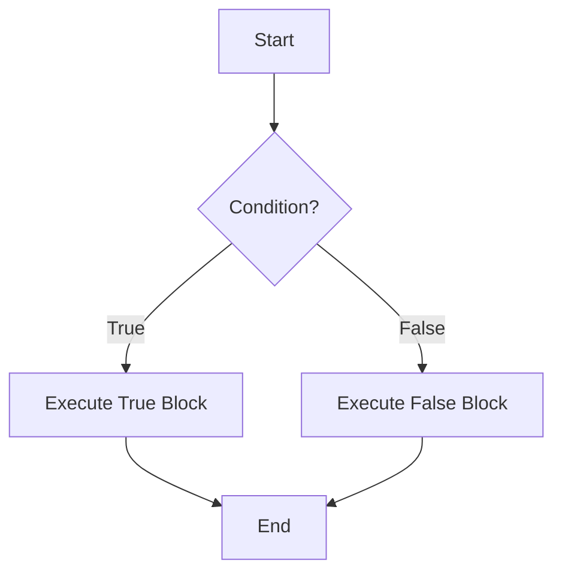

## 2.3 Control Flow Statements

In the world of programming, controlling the flow of execution is crucial for creating dynamic and responsive applications. JavaScript offers several control flow statements that allow developers to dictate the order in which statements are executed. In this section, we will explore the fundamental control flow constructs in JavaScript, including `if-else` statements, `switch-case` statements, and various loop constructs such as `for`, `while`, `do...while`, and `for...of`. By mastering these concepts, you will be able to write more efficient and logical code.

### Understanding Control Flow

Control flow refers to the order in which individual statements, instructions, or function calls are executed or evaluated in a program. In JavaScript, control flow is primarily determined by the use of conditional statements and loops. These constructs enable you to make decisions in your code and execute different blocks of code based on certain conditions.

### If-Else Statements

The `if-else` statement is one of the most fundamental control flow structures in JavaScript. It allows you to execute a block of code if a specified condition evaluates to `true`, and optionally execute another block of code if the condition is `false`.

#### Syntax of If-Else Statements

```javascript
if (condition) {
  // Code to execute if the condition is true
} else {
  // Code to execute if the condition is false
}
```

#### Example of If-Else Statements

Let's consider a simple example where we determine if a number is positive, negative, or zero:

```javascript
let number = 5;

if (number > 0) {
  console.log("The number is positive.");
} else if (number < 0) {
  console.log("The number is negative.");
} else {
  console.log("The number is zero.");
}
```

In this example, the program checks the value of `number` and prints a message based on whether it is positive, negative, or zero.

#### Nested If-Else Statements

You can also nest `if-else` statements to handle more complex conditions:

```javascript
let age = 25;

if (age < 13) {
  console.log("You are a child.");
} else if (age >= 13 && age < 20) {
  console.log("You are a teenager.");
} else if (age >= 20 && age < 65) {
  console.log("You are an adult.");
} else {
  console.log("You are a senior.");
}
```

#### Best Practices for If-Else Statements

- **Use clear and concise conditions**: Ensure that your conditions are easy to read and understand.
- **Avoid deep nesting**: Too many nested `if-else` statements can make your code difficult to read. Consider using `switch-case` or functions to simplify complex logic.
- **Use logical operators**: Combine conditions using logical operators (`&&`, `||`) to reduce the number of `if-else` statements.

### Switch-Case Statements

The `switch-case` statement provides a more elegant way to compare a variable against multiple values. It is particularly useful when you have a single variable that can take on many different values, and you want to execute different code for each value.

#### Syntax of Switch-Case Statements

```javascript
switch (expression) {
  case value1:
    // Code to execute if expression === value1
    break;
  case value2:
    // Code to execute if expression === value2
    break;
  // Add more cases as needed
  default:
    // Code to execute if none of the cases match
}
```

#### Example of Switch-Case Statements

Consider a simple example where we print the day of the week based on a number:

```javascript
let day = 3;
let dayName;

switch (day) {
  case 1:
    dayName = "Monday";
    break;
  case 2:
    dayName = "Tuesday";
    break;
  case 3:
    dayName = "Wednesday";
    break;
  case 4:
    dayName = "Thursday";
    break;
  case 5:
    dayName = "Friday";
    break;
  case 6:
    dayName = "Saturday";
    break;
  case 7:
    dayName = "Sunday";
    break;
  default:
    dayName = "Invalid day";
}

console.log(dayName);
```

In this example, the `switch` statement checks the value of `day` and assigns the corresponding day name to `dayName`.

#### Best Practices for Switch-Case Statements

- **Use `break` statements**: Always include `break` statements to prevent fall-through, unless intentional.
- **Use `default` case**: Provide a `default` case to handle unexpected values.
- **Consider readability**: Use `switch-case` when it improves the readability of your code compared to multiple `if-else` statements.

### Loops in JavaScript

Loops allow you to execute a block of code repeatedly, which is particularly useful for tasks that require iteration, such as processing arrays or collections of data. JavaScript provides several types of loops, each with its own use cases.

#### For Loop

The `for` loop is one of the most commonly used loops in JavaScript. It is ideal for iterating over a sequence of numbers or an array.

##### Syntax of For Loop

```javascript
for (initialization; condition; increment) {
  // Code to execute in each iteration
}
```

##### Example of For Loop

Let's iterate over an array of numbers and print each one:

```javascript
let numbers = [1, 2, 3, 4, 5];

for (let i = 0; i < numbers.length; i++) {
  console.log(numbers[i]);
}
```

In this example, the `for` loop initializes `i` to `0`, checks if `i` is less than the length of the `numbers` array, and increments `i` by `1` in each iteration.

#### While Loop

The `while` loop is used when you want to repeat a block of code as long as a specified condition is true.

##### Syntax of While Loop

```javascript
while (condition) {
  // Code to execute as long as the condition is true
}
```

##### Example of While Loop

Let's use a `while` loop to print numbers from `1` to `5`:

```javascript
let count = 1;

while (count <= 5) {
  console.log(count);
  count++;
}
```

In this example, the `while` loop continues to execute as long as `count` is less than or equal to `5`.

#### Do...While Loop

The `do...while` loop is similar to the `while` loop, but it guarantees that the code block will be executed at least once, even if the condition is false.

##### Syntax of Do...While Loop

```javascript
do {
  // Code to execute
} while (condition);
```

##### Example of Do...While Loop

Let's use a `do...while` loop to print numbers from `1` to `5`:

```javascript
let count = 1;

do {
  console.log(count);
  count++;
} while (count <= 5);
```

In this example, the `do...while` loop executes the code block once before checking the condition.

#### For...Of Loop

The `for...of` loop is a modern loop introduced in ES6 that is used to iterate over iterable objects, such as arrays, strings, and sets.

##### Syntax of For...Of Loop

```javascript
for (variable of iterable) {
  // Code to execute for each element in the iterable
}
```

##### Example of For...Of Loop

Let's iterate over an array of colors and print each one:

```javascript
let colors = ["red", "green", "blue"];

for (let color of colors) {
  console.log(color);
}
```

In this example, the `for...of` loop iterates over each element in the `colors` array and assigns it to the `color` variable.

#### Best Practices for Loops

- **Avoid infinite loops**: Ensure that your loop conditions will eventually evaluate to `false` to prevent infinite loops.
- **Use appropriate loop types**: Choose the loop type that best fits your use case. For example, use `for...of` for iterating over arrays and `while` for conditions that are not based on a counter.
- **Optimize performance**: Be mindful of the performance impact of loops, especially when dealing with large datasets.

### Visualizing Control Flow

To better understand how control flow works in JavaScript, let's visualize a simple program flow using a flowchart. This flowchart represents the logic of a basic `if-else` statement.



In this flowchart, the program starts at node `A`, evaluates the condition at node `B`, and then executes either the true block `C` or the false block `D` based on the condition's result.

### Try It Yourself

Now that we've covered the basics of control flow statements, it's time to experiment on your own. Try modifying the examples provided to see how changes affect the program's behavior. Here are a few suggestions:

- **Modify the If-Else Example**: Change the conditions to check for different ranges of numbers.
- **Experiment with Switch-Case**: Add more cases to the switch statement and see how it handles different values.
- **Create a New Loop**: Write a loop that iterates over an array of your favorite foods and prints each one.

### References and Further Reading

- [MDN Web Docs: Control Flow](https://developer.mozilla.org/en-US/docs/Web/JavaScript/Guide/Control_flow_and_error_handling)
- [W3Schools: JavaScript If...Else](https://www.w3schools.com/js/js_if_else.asp)
- [W3Schools: JavaScript Switch](https://www.w3schools.com/js/js_switch.asp)
- [W3Schools: JavaScript Loops](https://www.w3schools.com/js/js_loop_for.asp)

### Knowledge Check

Before moving on, let's reinforce what we've learned with a few questions and exercises. Try to answer these questions to test your understanding of control flow statements in JavaScript.

## Quiz Time!



### What is the primary purpose of control flow statements in JavaScript?

- [x] To dictate the order in which statements are executed
- [ ] To declare variables
- [ ] To define functions
- [ ] To create objects

> **Explanation:** Control flow statements determine the order in which code is executed, allowing for decision-making and iteration.

### Which statement is used to execute a block of code if a specified condition is true?

- [x] if
- [ ] switch
- [ ] for
- [ ] while

> **Explanation:** The `if` statement is used to execute a block of code if a specified condition evaluates to true.

### What keyword is used in a switch-case statement to prevent fall-through?

- [x] break
- [ ] continue
- [ ] return
- [ ] exit

> **Explanation:** The `break` keyword is used to exit a switch-case block and prevent fall-through to subsequent cases.

### Which loop guarantees that the code block will be executed at least once?

- [x] do...while
- [ ] for
- [ ] while
- [ ] for...of

> **Explanation:** The `do...while` loop executes the code block once before checking the condition, ensuring at least one execution.

### What is the correct syntax for a for loop?

- [x] for (initialization; condition; increment) { }
- [ ] for (condition; initialization; increment) { }
- [ ] for (increment; condition; initialization) { }
- [ ] for (initialization; increment; condition) { }

> **Explanation:** The correct syntax for a `for` loop is `for (initialization; condition; increment) { }`.

### Which loop is ideal for iterating over iterable objects like arrays and strings?

- [x] for...of
- [ ] for
- [ ] while
- [ ] do...while

> **Explanation:** The `for...of` loop is designed for iterating over iterable objects such as arrays and strings.

### What should you do to avoid infinite loops?

- [x] Ensure loop conditions eventually evaluate to false
- [ ] Use the `continue` statement
- [ ] Use the `return` statement
- [ ] Use the `break` statement

> **Explanation:** To avoid infinite loops, make sure that loop conditions will eventually evaluate to false, allowing the loop to terminate.

### What is the purpose of the `default` case in a switch-case statement?

- [x] To handle unexpected values not covered by other cases
- [ ] To define the first case
- [ ] To terminate the switch statement
- [ ] To repeat the switch statement

> **Explanation:** The `default` case handles unexpected values that do not match any of the specified cases.

### Which of the following is a best practice for writing if-else statements?

- [x] Use clear and concise conditions
- [ ] Use deep nesting
- [ ] Avoid logical operators
- [ ] Use multiple `else` blocks

> **Explanation:** Clear and concise conditions improve readability and maintainability of `if-else` statements.

### True or False: The `for...of` loop can be used to iterate over objects.

- [ ] True
- [x] False

> **Explanation:** The `for...of` loop is used for iterating over iterable objects like arrays and strings, not plain objects.



Remember, this is just the beginning. As you progress, you'll build more complex and interactive web pages. Keep experimenting, stay curious, and enjoy the journey!
