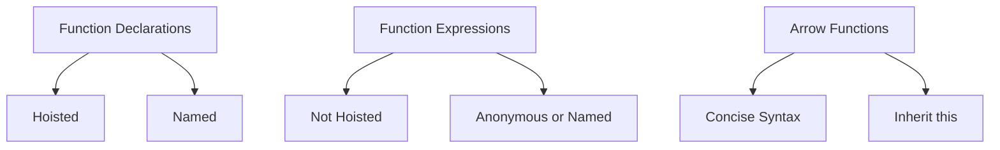

## 2.4 Functions and Their Uses

Functions are the building blocks of any JavaScript program. They allow us to encapsulate code for reuse, organize our logic, and create abstractions. In this section, we will explore different types of functions in JavaScript, including function declarations, function expressions, and arrow functions. We will also discuss function parameters, default values, rest parameters, and higher-order functions.

### Understanding Functions in JavaScript

Functions in JavaScript are first-class citizens, meaning they can be assigned to variables, passed as arguments, and returned from other functions. This flexibility allows us to write more modular and maintainable code.

#### Function Declarations

A function declaration is the most common way to define a function. It consists of the `function` keyword, followed by the function name, a list of parameters enclosed in parentheses, and a block of code enclosed in curly braces.

```javascript
function greet(name) {
    console.log("Hello, " + name + "!");
}

greet("Alice"); // Output: Hello, Alice!
```

**Key Points:**

- Function declarations are hoisted, meaning they can be called before they are defined in the code.
- They are named, which makes them easy to reference and debug.

#### Function Expressions

A function expression defines a function as part of a larger expression, such as an assignment. Unlike function declarations, function expressions are not hoisted.

```javascript
const greet = function(name) {
    console.log("Hello, " + name + "!");
};

greet("Bob"); // Output: Hello, Bob!
```

**Key Points:**

- Function expressions can be anonymous (without a name) or named.
- They are not hoisted, so they must be defined before they are called.

### Arrow Functions

Introduced in ES6, arrow functions provide a more concise syntax for writing function expressions. They are particularly useful for writing short functions.

```javascript
const greet = (name) => {
    console.log("Hello, " + name + "!");
};

greet("Charlie"); // Output: Hello, Charlie!
```

**Key Points:**

- Arrow functions do not have their own `this` context; they inherit `this` from the surrounding scope.
- They are always anonymous, but can be assigned to variables or used as arguments.

#### Arrow Function Syntax

The syntax of an arrow function can be simplified further if it has a single parameter or a single expression.

```javascript
// Single parameter, no need for parentheses
const greet = name => console.log("Hello, " + name + "!");

// Single expression, no need for curly braces
const add = (a, b) => a + b;

console.log(add(2, 3)); // Output: 5
```

### Function Parameters and Default Values

Functions can accept parameters, which are variables that act as placeholders for the values that are passed to the function.

#### Default Parameters

ES6 introduced default parameters, allowing you to set default values for parameters if no value is provided.

```javascript
function greet(name = "Guest") {
    console.log("Hello, " + name + "!");
}

greet(); // Output: Hello, Guest!
```

**Key Points:**

- Default parameters provide a fallback value, making functions more robust and reducing the need for additional checks.

#### Rest Parameters

Rest parameters allow you to represent an indefinite number of arguments as an array. They are useful for functions that need to handle multiple arguments.

```javascript
function sum(...numbers) {
    return numbers.reduce((total, num) => total + num, 0);
}

console.log(sum(1, 2, 3, 4)); // Output: 10
```

**Key Points:**

- Rest parameters must be the last parameter in the function definition.
- They gather all remaining arguments into an array.

### Higher-Order Functions

Higher-order functions are functions that take other functions as arguments or return functions as their result. They are a powerful feature of JavaScript, enabling functional programming patterns.

#### Example: Using Higher-Order Functions

```javascript
function repeat(operation, num) {
    for (let i = 0; i < num; i++) {
        operation();
    }
}

const sayHello = () => console.log("Hello!");

repeat(sayHello, 3);
// Output:
// Hello!
// Hello!
// Hello!
```

**Key Points:**

- Higher-order functions can abstract repetitive tasks and make code more reusable.
- They are commonly used with array methods like `map`, `filter`, and `reduce`.

### Visualizing Function Types

Let's visualize the different types of functions in JavaScript using a simple diagram.



This diagram illustrates the key characteristics of each function type, helping you understand their differences and uses.

### Try It Yourself

Experiment with the code examples provided in this section. Try modifying the parameters, adding default values, or using rest parameters. Create your own higher-order functions and see how they can simplify your code.

### Knowledge Check

Before moving on, let's review what we've learned:

- Differentiate between function declarations and expressions.
- Understand the syntax and use cases for arrow functions.
- Use default parameters and rest parameters effectively.
- Recognize and implement higher-order functions.

### Further Reading

For more information on JavaScript functions, check out these resources:

- [MDN Web Docs: Functions](https://developer.mozilla.org/en-US/docs/Web/JavaScript/Guide/Functions)
- [W3Schools: JavaScript Functions](https://www.w3schools.com/js/js_functions.asp)

## Quiz Time!



### What is a key difference between function declarations and function expressions?

- [x] Function declarations are hoisted, while function expressions are not.
- [ ] Function expressions are hoisted, while function declarations are not.
- [ ] Both are hoisted.
- [ ] Neither are hoisted.

> **Explanation:** Function declarations are hoisted, meaning they can be called before they are defined. Function expressions are not hoisted.

### Which of the following is true about arrow functions?

- [x] They do not have their own `this` context.
- [ ] They are always named.
- [ ] They are hoisted.
- [ ] They require the `function` keyword.

> **Explanation:** Arrow functions do not have their own `this` context; they inherit it from the surrounding scope.

### How do you define a default parameter in a function?

- [x] By assigning a value to the parameter in the function definition.
- [ ] By using the `default` keyword.
- [ ] By setting the parameter to `null`.
- [ ] By using an `if` statement inside the function.

> **Explanation:** Default parameters are defined by assigning a value to the parameter in the function definition.

### What is the purpose of rest parameters?

- [x] To gather all remaining arguments into an array.
- [ ] To limit the number of arguments a function can take.
- [ ] To provide default values for parameters.
- [ ] To return multiple values from a function.

> **Explanation:** Rest parameters gather all remaining arguments into an array, allowing functions to handle an indefinite number of arguments.

### Which of the following is an example of a higher-order function?

- [x] A function that takes another function as an argument.
- [ ] A function that returns a number.
- [ ] A function that uses default parameters.
- [ ] A function that uses rest parameters.

> **Explanation:** Higher-order functions are functions that take other functions as arguments or return functions as their result.

### What is the syntax for a single-parameter arrow function without parentheses?

- [x] `const greet = name => console.log("Hello, " + name + "!");`
- [ ] `const greet = (name) => console.log("Hello, " + name + "!");`
- [ ] `const greet = function(name) { console.log("Hello, " + name + "!"); }`
- [ ] `const greet = name => { console.log("Hello, " + name + "!"); }`

> **Explanation:** For a single-parameter arrow function, parentheses are not required around the parameter.

### What happens if you call a function with fewer arguments than the number of parameters it has?

- [x] The missing parameters are set to `undefined`.
- [ ] The function throws an error.
- [ ] The function ignores the missing parameters.
- [ ] The function uses default values for the missing parameters.

> **Explanation:** If a function is called with fewer arguments, the missing parameters are set to `undefined`.

### How can you create an anonymous function expression?

- [x] `const greet = function(name) { console.log("Hello, " + name + "!"); };`
- [ ] `function greet(name) { console.log("Hello, " + name + "!"); }`
- [ ] `const greet = (name) => { console.log("Hello, " + name + "!"); };`
- [ ] `const greet = name => console.log("Hello, " + name + "!");`

> **Explanation:** An anonymous function expression is created by assigning a function without a name to a variable.

### What is the output of the following code?
```javascript
const add = (a, b) => a + b;
console.log(add(2, 3));
```

- [x] 5
- [ ] 23
- [ ] `undefined`
- [ ] `null`

> **Explanation:** The arrow function `add` takes two parameters and returns their sum. The output is `5`.

### True or False: Arrow functions are always anonymous.

- [x] True
- [ ] False

> **Explanation:** Arrow functions are always anonymous, but they can be assigned to variables or used as arguments.



Remember, this is just the beginning. As you progress, you'll build more complex and interactive web pages. Keep experimenting, stay curious, and enjoy the journey!
