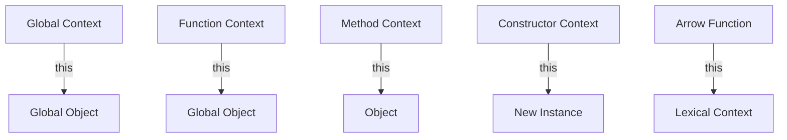

## 2.5 Understanding the 'this' Keyword

In JavaScript, the `this` keyword is a fundamental concept that can be both powerful and perplexing, especially for beginners. It is crucial to understand how `this` operates in different contexts to write effective and bug-free code. In this section, we will explore the concept of execution context and how `this` behaves in various scenarios, including global, function, method, and constructor contexts. We will also discuss common issues and how to resolve them, such as binding `this` to the correct object.

### What is Execution Context?

Before diving into the `this` keyword, it's essential to understand the concept of execution context. In JavaScript, the execution context is the environment in which the code is executed. It determines the value of `this`, as well as variables and functions that are accessible.

#### Types of Execution Contexts

1. **Global Execution Context**: This is the default context where your JavaScript code starts executing. In the browser, it's the `window` object, while in Node.js, it's the `global` object.

2. **Function Execution Context**: Each time a function is called, a new execution context is created for that function. This context includes the function's arguments, local variables, and the value of `this`.

3. **Eval Execution Context**: Code executed inside an `eval` function also gets its own execution context.

Understanding these contexts is crucial because the value of `this` depends on the context in which a function is executed.

### The `this` Keyword in Different Contexts

Let's explore how `this` behaves in different contexts.

#### Global Context

In the global execution context, `this` refers to the global object. In a browser, this is the `window` object.

```javascript
console.log(this); // In a browser, this logs the window object
```

#### Function Context

When a function is called in the global context, `this` refers to the global object.

```javascript
function showThis() {
    console.log(this);
}

showThis(); // Logs the global object (window in browsers)
```

However, in strict mode (`'use strict';`), `this` is `undefined` in a simple function call.

```javascript
'use strict';

function showThisStrict() {
    console.log(this);
}

showThisStrict(); // Logs undefined
```

#### Method Context

When a function is called as a method of an object, `this` refers to the object the method is called on.

```javascript
const person = {
    name: 'Alice',
    greet: function() {
        console.log(this.name);
    }
};

person.greet(); // Logs 'Alice'
```

In this example, `this` refers to the `person` object.

#### Constructor Context

When a function is used as a constructor with the `new` keyword, `this` refers to the newly created object.

```javascript
function Person(name) {
    this.name = name;
}

const bob = new Person('Bob');
console.log(bob.name); // Logs 'Bob'
```

Here, `this` refers to the new instance of `Person`.

### Common Issues with `this` and How to Resolve Them

The behavior of `this` can lead to some common issues, especially when dealing with callbacks and event handlers. Let's explore these issues and how to resolve them.

#### Losing `this` in Callbacks

When you pass a method as a callback, you might lose the intended `this` context.

```javascript
const person = {
    name: 'Charlie',
    greet: function() {
        console.log(this.name);
    }
};

setTimeout(person.greet, 1000); // Logs undefined or throws an error
```

In this example, `this` inside `greet` does not refer to `person` because `setTimeout` calls the function without a context.

##### Solution: Use `bind`

You can use `Function.prototype.bind` to bind `this` to the correct object.

```javascript
setTimeout(person.greet.bind(person), 1000); // Logs 'Charlie'
```

#### Arrow Functions and Lexical `this`

Arrow functions do not have their own `this` context. Instead, they inherit `this` from the surrounding lexical context.

```javascript
const person = {
    name: 'Dana',
    greet: function() {
        const sayHello = () => {
            console.log(this.name);
        };
        sayHello();
    }
};

person.greet(); // Logs 'Dana'
```

In this example, `sayHello` is an arrow function, so it inherits `this` from `greet`, which is `person`.

#### Using `call` and `apply`

You can also use `Function.prototype.call` and `Function.prototype.apply` to explicitly set `this`.

```javascript
function greet() {
    console.log(this.name);
}

const person = { name: 'Eve' };

greet.call(person); // Logs 'Eve'
greet.apply(person); // Logs 'Eve'
```

Both `call` and `apply` allow you to specify the value of `this` when calling a function. The difference is that `call` takes arguments separately, while `apply` takes them as an array.

### Try It Yourself

Experiment with the following code examples to solidify your understanding of `this`. Try modifying the examples to see how `this` behaves in different scenarios.

```javascript
// Example 1: Global context
console.log(this === window); // true in browsers

// Example 2: Function context
function showThis() {
    console.log(this);
}
showThis();

// Example 3: Method context
const car = {
    brand: 'Toyota',
    showBrand: function() {
        console.log(this.brand);
    }
};
car.showBrand();

// Example 4: Constructor context
function Car(brand) {
    this.brand = brand;
}
const myCar = new Car('Honda');
console.log(myCar.brand);

// Example 5: Arrow function
const bike = {
    brand: 'Yamaha',
    showBrand: function() {
        const display = () => {
            console.log(this.brand);
        };
        display();
    }
};
bike.showBrand();
```

### Visualizing `this` in Different Contexts

To better understand how `this` works, let's visualize it using a diagram.



In this diagram:
- The global context points `this` to the global object.
- The function context points `this` to the global object (or `undefined` in strict mode).
- The method context points `this` to the object the method belongs to.
- The constructor context points `this` to the new instance created.
- The arrow function points `this` to the lexical context.

### References and Links

For further reading on the `this` keyword and execution context, check out these resources:
- [MDN Web Docs: this](https://developer.mozilla.org/en-US/docs/Web/JavaScript/Reference/Operators/this)
- [W3Schools: JavaScript this Keyword](https://www.w3schools.com/js/js_this.asp)

### Knowledge Check

Let's reinforce what we've learned with a few questions:
- What does `this` refer to in the global context?
- How does `this` behave differently in strict mode?
- How can you bind `this` to a specific object in a callback?

### Key Takeaways

- The `this` keyword refers to different objects based on the execution context.
- In the global context, `this` refers to the global object.
- In a function, `this` can refer to the global object or be `undefined` in strict mode.
- In a method, `this` refers to the object the method is called on.
- In a constructor, `this` refers to the newly created object.
- Arrow functions inherit `this` from their surrounding lexical context.
- Use `bind`, `call`, and `apply` to control the value of `this`.

### Embrace the Journey

Understanding `this` is a crucial step in mastering JavaScript. As you continue your journey, remember that practice and experimentation are key. Keep exploring, stay curious, and enjoy the process of learning!

## Quiz Time!



### In the global context, what does `this` refer to in a browser?

- [x] The `window` object
- [ ] `undefined`
- [ ] The current function
- [ ] The `document` object

> **Explanation:** In the global context, `this` refers to the global object, which is `window` in browsers.

### What is the value of `this` inside a function in strict mode?

- [x] `undefined`
- [ ] The global object
- [ ] The function itself
- [ ] The `document` object

> **Explanation:** In strict mode, `this` is `undefined` inside a function unless explicitly set.

### How can you ensure `this` refers to a specific object in a callback?

- [x] Use `bind`
- [ ] Use `eval`
- [ ] Use `setTimeout`
- [ ] Use `alert`

> **Explanation:** The `bind` method creates a new function with `this` bound to the specified object.

### What does `this` refer to inside a method of an object?

- [x] The object itself
- [ ] The global object
- [ ] `undefined`
- [ ] The method's prototype

> **Explanation:** Inside a method, `this` refers to the object the method belongs to.

### What is the behavior of `this` in an arrow function?

- [x] Inherits `this` from the lexical context
- [ ] Has its own `this`
- [ ] Refers to the global object
- [ ] Always `undefined`

> **Explanation:** Arrow functions do not have their own `this`; they inherit it from the surrounding lexical context.

### Which method allows you to call a function with a specific `this` value?

- [x] `call`
- [ ] `setInterval`
- [ ] `alert`
- [ ] `prompt`

> **Explanation:** The `call` method allows you to invoke a function with a specific `this` value.

### What does `this` refer to in a constructor function?

- [x] The newly created object
- [ ] The global object
- [ ] `undefined`
- [ ] The constructor's prototype

> **Explanation:** In a constructor function, `this` refers to the newly created object.

### How does `apply` differ from `call`?

- [x] `apply` takes arguments as an array
- [ ] `apply` does not set `this`
- [ ] `apply` is slower than `call`
- [ ] `apply` is only for asynchronous functions

> **Explanation:** The `apply` method takes arguments as an array, while `call` takes them individually.

### What is a common issue with `this` in callbacks?

- [x] Losing the intended `this` context
- [ ] It always refers to the global object
- [ ] It cannot be used in strict mode
- [ ] It causes memory leaks

> **Explanation:** A common issue is losing the intended `this` context when a method is used as a callback.

### True or False: Arrow functions have their own `this` context.

- [ ] True
- [x] False

> **Explanation:** False. Arrow functions do not have their own `this` context; they inherit it from the surrounding lexical context.


