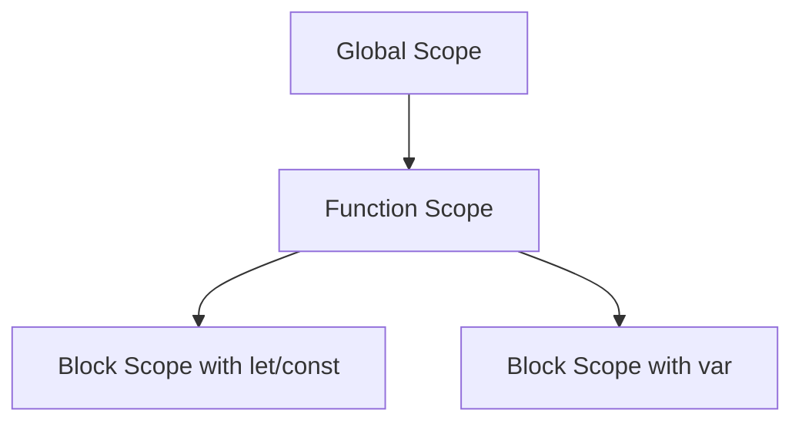
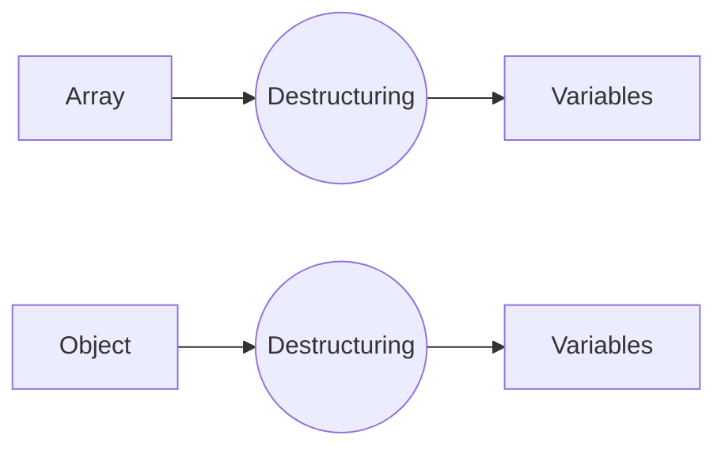

## 2.6 Introduction to ES6 Features

JavaScript has been a cornerstone of web development since its inception. However, as the web evolved, so did the need for a more robust, efficient, and developer-friendly language. Enter ECMAScript 6 (ES6), also known as ECMAScript 2015, which introduced a host of new features that significantly enhanced JavaScript's capabilities, especially in the realm of object-oriented programming (OOP). In this section, we'll delve into some of the key ES6 features that will aid you in writing more structured and efficient code.

### Why ES6 Matters

ES6 was a game-changer in the JavaScript world. It introduced syntax and features that not only made the language more powerful but also more readable and maintainable. These enhancements are particularly beneficial for OOP, as they provide more tools to create and manage objects and classes effectively. Let's explore some of these features, starting with `let` and `const`.

### Let and Const vs. Var

Before ES6, JavaScript developers primarily used the `var` keyword to declare variables. However, `var` has some quirks, particularly with scope and hoisting, which can lead to unexpected behavior. ES6 introduced `let` and `const` to address these issues.

#### Let

The `let` keyword allows you to declare variables that are block-scoped. This means the variable is only accessible within the block it is defined in, such as within a loop or an if statement.

```javascript
function exampleLet() {
  let x = 10;
  if (true) {
    let x = 20; // This x is different from the x outside the block
    console.log(x); // 20
  }
  console.log(x); // 10
}

exampleLet();
```

In the example above, the `let` keyword ensures that the `x` inside the if block is a separate variable from the `x` outside the block. This prevents accidental overwriting of variables and makes the code more predictable.

#### Const

The `const` keyword is used to declare variables that are block-scoped and cannot be reassigned. This is particularly useful for constants or values that should not change throughout the program.

```javascript
const PI = 3.14159;
console.log(PI); // 3.14159

// Trying to reassign a const variable will result in an error
// PI = 3.14; // Uncaught TypeError: Assignment to constant variable.
```

While `const` prevents reassignment, it does not make the variable immutable. If the variable is an object or an array, you can still modify its contents.

```javascript
const person = { name: 'Alice', age: 25 };
person.age = 26; // This is allowed
console.log(person.age); // 26
```

#### Var

The `var` keyword, in contrast, is function-scoped or globally scoped, depending on where it is declared. This can lead to issues with variable hoisting, where a variable is accessible before it is declared.

```javascript
function exampleVar() {
  console.log(a); // undefined due to hoisting
  var a = 5;
  console.log(a); // 5
}

exampleVar();
```

In this example, the variable `a` is hoisted to the top of the function, which can lead to confusion and bugs. By using `let` and `const`, you can avoid these pitfalls and write more reliable code.

### Template Literals

Template literals are a powerful feature introduced in ES6 that allows for easier string manipulation and interpolation. They are enclosed by backticks (`` ` ``) instead of single or double quotes and can contain placeholders for variables and expressions.

#### Basic Usage

```javascript
let name = 'John';
let greeting = `Hello, ${name}!`;
console.log(greeting); // Hello, John!
```

In the example above, the `${name}` syntax allows you to embed the value of the `name` variable directly into the string. This makes it much easier to construct strings dynamically compared to traditional string concatenation.

#### Multiline Strings

Template literals also support multiline strings, which can be particularly useful for formatting text or HTML.

```javascript
let message = `This is a message
that spans multiple
lines.`;
console.log(message);
```

This feature eliminates the need for cumbersome string concatenation or escape characters to create multiline strings.

#### Expressions in Template Literals

You can also include expressions within template literals, which will be evaluated and included in the resulting string.

```javascript
let a = 5;
let b = 10;
console.log(`The sum of ${a} and ${b} is ${a + b}.`); // The sum of 5 and 10 is 15.
```

### Destructuring Assignment

Destructuring is a convenient way to extract values from arrays or properties from objects into distinct variables. This feature can simplify your code and make it more readable.

#### Array Destructuring

```javascript
let numbers = [1, 2, 3];
let [one, two, three] = numbers;
console.log(one, two, three); // 1 2 3
```

In this example, the values from the `numbers` array are unpacked into individual variables `one`, `two`, and `three`.

#### Object Destructuring

```javascript
let person = { name: 'Alice', age: 25 };
let { name, age } = person;
console.log(name, age); // Alice 25
```

Here, the properties `name` and `age` are extracted from the `person` object and assigned to variables with the same names.

#### Nested Destructuring

Destructuring can also be used with nested objects and arrays.

```javascript
let user = {
  id: 1,
  details: {
    name: 'Bob',
    age: 30
  }
};

let { details: { name, age } } = user;
console.log(name, age); // Bob 30
```

### The Spread Operator

The spread operator (`...`) is a versatile tool that can be used to expand elements of an iterable (like an array) or properties of an object.

#### Spread in Arrays

```javascript
let arr1 = [1, 2, 3];
let arr2 = [...arr1, 4, 5, 6];
console.log(arr2); // [1, 2, 3, 4, 5, 6]
```

In this example, the elements of `arr1` are spread into `arr2`, creating a new array that combines both arrays.

#### Spread in Objects

```javascript
let obj1 = { a: 1, b: 2 };
let obj2 = { ...obj1, c: 3 };
console.log(obj2); // { a: 1, b: 2, c: 3 }
```

The spread operator can also be used to copy properties from one object to another, making it easy to merge objects or add new properties.

### Try It Yourself

To solidify your understanding of these ES6 features, try modifying the following code examples:

1. **Variable Scope**: Change the `let` and `const` declarations to `var` and observe how the behavior changes.
2. **Template Literals**: Create a multiline string using template literals that includes variables and expressions.
3. **Destructuring**: Use destructuring to extract values from a nested object or array.
4. **Spread Operator**: Use the spread operator to combine multiple arrays or objects into one.

### Visualizing ES6 Features

To better understand how these features work, let's visualize some of them using diagrams.

#### Variable Scope



**Caption**: This diagram illustrates the scope hierarchy in JavaScript, showing how `let` and `const` create block scopes within functions.

#### Destructuring Assignment



**Caption**: This diagram shows how destructuring extracts values from arrays and objects into variables.

### Further Reading

To deepen your understanding of ES6 features, consider exploring the following resources:

- [MDN Web Docs on ES6](https://developer.mozilla.org/en-US/docs/Web/JavaScript/Guide/Introduction)
- [W3Schools ES6 Tutorial](https://www.w3schools.com/js/js_es6.asp)

### Knowledge Check

Let's see how well you've grasped these concepts. Consider the following questions:

1. What is the main difference between `let` and `var`?
2. How do template literals improve string manipulation?
3. Can you modify the contents of an object declared with `const`?
4. How does destructuring simplify variable assignment?
5. What are some use cases for the spread operator?

### Embrace the Journey

Remember, mastering these ES6 features is just the beginning of your journey into modern JavaScript. As you continue to learn and experiment, you'll find new ways to apply these tools to create more efficient and elegant code. Keep exploring, stay curious, and enjoy the process!

## Quiz Time!



### What is the main advantage of using `let` over `var`?

- [x] Block scope
- [ ] Function scope
- [ ] Global scope
- [ ] No scope

> **Explanation:** `let` provides block scope, which helps prevent variable conflicts and makes code more predictable.

### How do template literals improve string manipulation?

- [x] Allow embedding expressions
- [ ] Require concatenation
- [ ] Limit string length
- [ ] Use single quotes

> **Explanation:** Template literals allow embedding expressions directly within strings, simplifying string construction.

### Can you reassign a variable declared with `const`?

- [ ] Yes
- [x] No

> **Explanation:** Variables declared with `const` cannot be reassigned, although their contents can be modified if they are objects or arrays.

### What does destructuring allow you to do?

- [x] Extract values from arrays or objects
- [ ] Combine arrays
- [ ] Modify object properties
- [ ] Create new variables

> **Explanation:** Destructuring allows you to extract values from arrays or objects into distinct variables.

### What is a common use case for the spread operator?

- [x] Merging arrays
- [ ] Declaring variables
- [ ] Creating functions
- [ ] Looping through arrays

> **Explanation:** The spread operator is commonly used to merge arrays or objects by expanding their elements or properties.

### Which keyword is used to declare a constant variable?

- [x] const
- [ ] let
- [ ] var
- [ ] static

> **Explanation:** The `const` keyword is used to declare variables that cannot be reassigned.

### What is the syntax for a template literal?

- [x] Backticks (` `)
- [ ] Single quotes (' ')
- [ ] Double quotes (" ")
- [ ] Curly braces ({ })

> **Explanation:** Template literals are enclosed in backticks, allowing for embedded expressions and multiline strings.

### How does the spread operator work with objects?

- [x] Copies properties
- [ ] Deletes properties
- [ ] Modifies properties
- [ ] Creates new objects

> **Explanation:** The spread operator copies properties from one object to another, facilitating object merging.

### What is the result of using `let` inside a loop?

- [x] Creates a new scope for each iteration
- [ ] Reuses the same variable
- [ ] Throws an error
- [ ] Ignores the loop

> **Explanation:** Using `let` inside a loop creates a new scope for each iteration, preventing variable conflicts.

### Can template literals include expressions?

- [x] True
- [ ] False

> **Explanation:** Template literals can include expressions, which are evaluated and included in the resulting string.




