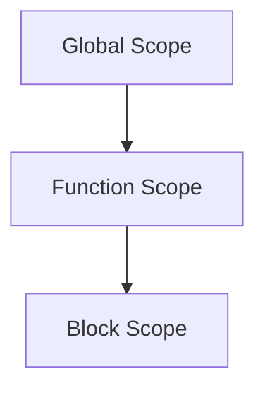
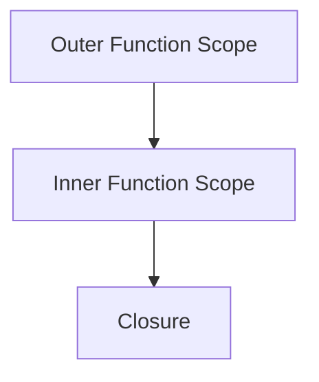

## 2.7 Scope and Closure

As we continue our journey through JavaScript fundamentals, understanding scope and closure is crucial for mastering the language. These concepts are foundational to writing efficient and effective code, particularly in the context of object-oriented programming (OOP). In this section, we will delve into the intricacies of scope and closure, providing you with the knowledge to harness their power in your JavaScript projects.

### Understanding Scope in JavaScript

Scope in JavaScript refers to the accessibility of variables and functions in different parts of your code. It determines where variables and functions can be accessed or referenced. JavaScript has three types of scope: global, local, and block. Let's explore each of these in detail.

#### Global Scope

Variables declared in the global scope are accessible from anywhere in your JavaScript code. They are defined outside of any function or block. Because of their wide accessibility, global variables can be modified by any part of your code, which can lead to unexpected behavior if not managed carefully.

```javascript
// Global variable
let globalVar = "I'm a global variable";

function displayGlobalVar() {
  console.log(globalVar); // Accessible here
}

displayGlobalVar(); // Output: I'm a global variable
console.log(globalVar); // Accessible here too
```

In the example above, `globalVar` is a global variable and can be accessed both inside and outside the `displayGlobalVar` function.

#### Local Scope

Local scope refers to variables declared within a function. These variables are only accessible within the function in which they are defined. Once the function execution is complete, local variables are removed from memory.

```javascript
function localScopeExample() {
  let localVar = "I'm a local variable";
  console.log(localVar); // Accessible here
}

localScopeExample(); // Output: I'm a local variable
console.log(localVar); // Error: localVar is not defined
```

Here, `localVar` is a local variable and is only accessible within the `localScopeExample` function. Attempting to access it outside the function results in an error.

#### Block Scope

Block scope is a newer addition to JavaScript, introduced with ES6. Variables declared with `let` and `const` within a block (denoted by curly braces `{}`) are block-scoped. This means they are only accessible within that block.

```javascript
if (true) {
  let blockVar = "I'm a block-scoped variable";
  console.log(blockVar); // Accessible here
}

console.log(blockVar); // Error: blockVar is not defined
```

In this example, `blockVar` is only accessible within the `if` block. Attempting to access it outside the block results in an error.

### Visualizing Scope

To better understand how scope works, let's visualize the scope chain in JavaScript. The scope chain is a hierarchy of scopes that JavaScript uses to resolve variable references.



In the diagram above, the global scope is at the top level, followed by function scope, and then block scope. When JavaScript looks for a variable, it starts at the current scope and moves up the chain until it finds the variable or reaches the global scope.

### Introduction to Closures

Closures are a powerful feature in JavaScript that allow functions to retain access to their lexical scope, even after the function has finished executing. This means that a function can "remember" the environment in which it was created.

#### How Closures Work

A closure is created when a function is defined inside another function, and the inner function references variables from the outer function. The inner function retains access to these variables, even after the outer function has completed execution.

```javascript
function outerFunction(outerVariable) {
  return function innerFunction(innerVariable) {
    console.log(`Outer Variable: ${outerVariable}`);
    console.log(`Inner Variable: ${innerVariable}`);
  };
}

const closureExample = outerFunction("outside");
closureExample("inside");
// Output:
// Outer Variable: outside
// Inner Variable: inside
```

In this example, `innerFunction` is a closure that retains access to `outerVariable`, even after `outerFunction` has finished executing.

### Practical Examples of Closures

Closures are used in various scenarios in JavaScript, such as data encapsulation, function factories, and maintaining state in asynchronous operations. Let's explore some practical examples.

#### Data Encapsulation

Closures can be used to encapsulate data, providing a way to create private variables that cannot be accessed directly from outside the function.

```javascript
function createCounter() {
  let count = 0;
  return function() {
    count += 1;
    return count;
  };
}

const counter = createCounter();
console.log(counter()); // Output: 1
console.log(counter()); // Output: 2
```

In this example, the `count` variable is encapsulated within the `createCounter` function and can only be accessed and modified through the returned function.

#### Function Factories

Closures can be used to create function factories, which are functions that return other functions. This technique is useful for creating functions with pre-configured settings.

```javascript
function greetingFactory(greeting) {
  return function(name) {
    console.log(`${greeting}, ${name}!`);
  };
}

const sayHello = greetingFactory("Hello");
sayHello("Alice"); // Output: Hello, Alice!

const sayGoodbye = greetingFactory("Goodbye");
sayGoodbye("Bob"); // Output: Goodbye, Bob!
```

Here, `greetingFactory` returns a function that remembers the `greeting` variable, allowing us to create customized greeting functions.

#### Maintaining State in Asynchronous Operations

Closures are particularly useful in asynchronous programming, where they can help maintain state across asynchronous operations.

```javascript
function fetchData(url) {
  fetch(url)
    .then(response => response.json())
    .then(data => {
      console.log(`Data from ${url}:`, data);
    });
}

fetchData("https://api.example.com/data");
```

In this example, the `fetchData` function uses a closure to retain access to the `url` variable, allowing it to log the data source after the asynchronous operation completes.

### Use Cases for Closures

Closures are beneficial in various scenarios, including:

- **Encapsulation**: Protecting variables from being accessed or modified directly.
- **Function Factories**: Creating functions with pre-configured settings.
- **Event Handlers**: Retaining access to variables in event-driven programming.
- **Asynchronous Programming**: Maintaining state across asynchronous operations.

### Visualizing Closures

To visualize how closures work, let's look at a diagram that illustrates the relationship between the outer and inner functions.



In the diagram above, the inner function scope has access to the outer function scope, creating a closure that retains access to the variables in the outer scope.

### Try It Yourself

Now that we've covered the basics of scope and closures, it's time to experiment with these concepts. Try modifying the code examples to see how changes affect variable accessibility and closure behavior. Here are some suggestions:

- **Modify the `createCounter` function** to include a reset method that sets the count back to zero.
- **Create a function factory** that generates functions for different mathematical operations (e.g., addition, subtraction).
- **Experiment with asynchronous closures** by creating a function that fetches data from multiple URLs and logs the results.

### Key Takeaways

- **Scope** determines the accessibility of variables and functions in JavaScript.
- **Global scope** variables are accessible from anywhere in the code.
- **Local scope** variables are accessible only within the function they are declared in.
- **Block scope** variables, introduced with ES6, are accessible only within the block they are declared in.
- **Closures** allow functions to retain access to their lexical scope, even after the function has finished executing.
- Closures are useful for **data encapsulation**, **function factories**, and **maintaining state** in asynchronous operations.

### References and Further Reading

- [MDN Web Docs: JavaScript Scoping](https://developer.mozilla.org/en-US/docs/Web/JavaScript/Guide/Grammar_and_types#Scoping)
- [MDN Web Docs: Closures](https://developer.mozilla.org/en-US/docs/Web/JavaScript/Closures)
- [W3Schools: JavaScript Scope](https://www.w3schools.com/js/js_scope.asp)

Remember, understanding scope and closures is a vital step in mastering JavaScript. As you continue to explore these concepts, you'll find new ways to apply them in your coding projects. Keep experimenting, stay curious, and enjoy the journey!

## Quiz Time!



### What is global scope in JavaScript?

- [x] Variables accessible from anywhere in the code
- [ ] Variables accessible only within a function
- [ ] Variables accessible only within a block
- [ ] Variables that are not accessible at all

> **Explanation:** Global scope variables are declared outside of any function or block and can be accessed from anywhere in the code.

### What is local scope?

- [ ] Variables accessible from anywhere in the code
- [x] Variables accessible only within a function
- [ ] Variables accessible only within a block
- [ ] Variables that are not accessible at all

> **Explanation:** Local scope variables are declared within a function and are only accessible within that function.

### What is block scope?

- [ ] Variables accessible from anywhere in the code
- [ ] Variables accessible only within a function
- [x] Variables accessible only within a block
- [ ] Variables that are not accessible at all

> **Explanation:** Block scope variables are declared with `let` or `const` within a block and are only accessible within that block.

### What is a closure in JavaScript?

- [x] A function that retains access to its lexical scope
- [ ] A function that does not retain access to its lexical scope
- [ ] A variable that is accessible from anywhere in the code
- [ ] A variable that is not accessible at all

> **Explanation:** A closure is a function that retains access to its lexical scope, allowing it to remember the environment in which it was created.

### Which of the following is a use case for closures?

- [x] Data encapsulation
- [x] Function factories
- [ ] Global variable access
- [ ] Syntax error handling

> **Explanation:** Closures are used for data encapsulation and function factories, among other use cases.

### How can closures help in asynchronous programming?

- [x] By maintaining state across asynchronous operations
- [ ] By preventing any state from being maintained
- [ ] By making all variables global
- [ ] By eliminating the need for functions

> **Explanation:** Closures can maintain state across asynchronous operations, allowing functions to retain access to variables even after the asynchronous task completes.

### What is the scope chain?

- [x] A hierarchy of scopes used to resolve variable references
- [ ] A chain of functions that call each other
- [ ] A sequence of asynchronous operations
- [ ] A list of global variables

> **Explanation:** The scope chain is a hierarchy of scopes that JavaScript uses to resolve variable references, starting from the current scope and moving up to the global scope.

### How do you create a closure in JavaScript?

- [x] By defining a function inside another function and referencing variables from the outer function
- [ ] By declaring all variables as global
- [ ] By using only `var` for variable declarations
- [ ] By avoiding the use of functions

> **Explanation:** A closure is created by defining a function inside another function and referencing variables from the outer function, allowing the inner function to retain access to those variables.

### Which keyword is used to declare block-scoped variables?

- [x] let
- [x] const
- [ ] var
- [ ] function

> **Explanation:** The `let` and `const` keywords are used to declare block-scoped variables, which are only accessible within the block they are declared in.

### True or False: Closures can only be created using arrow functions.

- [ ] True
- [x] False

> **Explanation:** Closures can be created using both regular functions and arrow functions. The key is that the inner function retains access to the outer function's variables.


