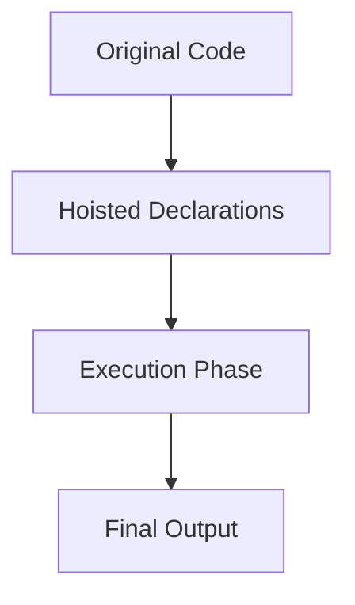

## 2.8 Hoisting in JavaScript

As we delve deeper into the fundamentals of JavaScript, understanding the concept of hoisting is crucial. Hoisting is a unique behavior in JavaScript that affects how variables and functions are declared and initialized. By mastering hoisting, you'll gain insights into how JavaScript interprets your code, which can help you write more predictable and bug-free programs.

### What is Hoisting?

Hoisting is a JavaScript mechanism where variable and function declarations are moved to the top of their containing scope during the compile phase. This means that regardless of where functions and variables are declared in your code, they are moved to the top of their scope before the code execution begins.

#### How Hoisting Works

To understand hoisting, imagine that JavaScript has two phases when it runs your code:

1. **Compilation Phase**: During this phase, JavaScript scans the code for variable and function declarations and "hoists" them to the top of their respective scopes.
2. **Execution Phase**: JavaScript executes the code line by line, now with the knowledge of all the declarations made during the compilation phase.

### Hoisting and Variable Declarations

In JavaScript, variables can be declared using `var`, `let`, or `const`. Each of these keywords behaves differently when it comes to hoisting.

#### `var` Hoisting

Variables declared with `var` are hoisted to the top of their function or global scope. However, only the declaration is hoisted, not the initialization. This can lead to unexpected behavior if you're not aware of it.

**Example:**

```javascript
console.log(myVar); // Output: undefined
var myVar = 5;
console.log(myVar); // Output: 5
```

**Explanation:**

In the above example, the declaration `var myVar;` is hoisted to the top, but the initialization `myVar = 5;` remains in place. During the execution phase, `myVar` is initially `undefined`.

#### `let` and `const` Hoisting

Variables declared with `let` and `const` are also hoisted, but they are not initialized. This means they exist in a "temporal dead zone" from the start of the block until the declaration is encountered.

**Example:**

```javascript
console.log(myLet); // ReferenceError: Cannot access 'myLet' before initialization
let myLet = 10;

console.log(myConst); // ReferenceError: Cannot access 'myConst' before initialization
const myConst = 20;
```

**Explanation:**

Unlike `var`, accessing `let` or `const` variables before their declaration results in a `ReferenceError`. This is because they are in the temporal dead zone.

### Hoisting and Function Declarations

Function declarations are fully hoisted, meaning both the function name and its body are moved to the top of their scope. This allows you to call functions before they are defined in the code.

**Example:**

```javascript
console.log(add(2, 3)); // Output: 5

function add(a, b) {
  return a + b;
}
```

**Explanation:**

In this example, the function `add` is hoisted, so it can be called before its definition in the code.

### Hoisting and Function Expressions

Function expressions, whether named or anonymous, are not hoisted in the same way as function declarations. They behave like variables declared with `var`, `let`, or `const`.

**Example:**

```javascript
console.log(subtract(5, 2)); // TypeError: subtract is not a function

var subtract = function(a, b) {
  return a - b;
};
```

**Explanation:**

Here, the variable `subtract` is hoisted, but its initialization as a function is not. Therefore, calling it before the assignment results in a `TypeError`.

### Visualizing Hoisting

To better understand hoisting, let's visualize how JavaScript rearranges your code during the compilation phase.



**Description:**

- **Original Code**: Your written code with declarations and initializations.
- **Hoisted Declarations**: JavaScript moves declarations to the top of their scope.
- **Execution Phase**: JavaScript executes the code with hoisted declarations.
- **Final Output**: The result after execution.

### Best Practices to Avoid Hoisting Pitfalls

Understanding hoisting is essential, but there are best practices you can follow to avoid common pitfalls associated with it:

1. **Declare Variables at the Top**: Always declare your variables at the top of their scope. This makes the code more readable and predictable.

2. **Use `let` and `const`**: Prefer `let` and `const` over `var` to avoid issues with hoisting and to benefit from block scope.

3. **Initialize Variables**: Initialize your variables when you declare them to avoid unexpected `undefined` values.

4. **Define Functions Before Calling**: Although function declarations are hoisted, defining them before calling can improve code readability.

### Try It Yourself

Let's experiment with hoisting by modifying the following code:

```javascript
console.log(myVar); // What will this output?
var myVar = 10;
console.log(myVar); // What will this output?

console.log(myLet); // What will this output?
let myLet = 20;
console.log(myLet); // What will this output?

console.log(myConst); // What will this output?
const myConst = 30;
console.log(myConst); // What will this output?
```

**Challenge:**

- Predict the output of each `console.log` statement.
- Modify the code to avoid errors and unexpected outputs.

### Further Reading

For more information on hoisting, you can explore the following resources:

- [MDN Web Docs on Hoisting](https://developer.mozilla.org/en-US/docs/Glossary/Hoisting)
- [W3Schools JavaScript Hoisting](https://www.w3schools.com/js/js_hoisting.asp)

### Knowledge Check

Before we wrap up, let's reinforce what we've learned:

- What is hoisting, and how does it affect variable and function declarations?
- How do `var`, `let`, and `const` differ in terms of hoisting?
- What are the best practices to avoid confusion caused by hoisting?

### Embrace the Journey

Remember, understanding hoisting is a step towards mastering JavaScript. As you continue your journey, keep experimenting and learning. Hoisting is just one of many fascinating aspects of JavaScript that you'll encounter. Stay curious and enjoy the process!

## Quiz Time!



### What is hoisting in JavaScript?

- [x] The process of moving variable and function declarations to the top of their scope.
- [ ] The process of moving variable and function initializations to the top of their scope.
- [ ] The process of executing code line by line.
- [ ] The process of optimizing code for performance.

> **Explanation:** Hoisting is the JavaScript mechanism where variable and function declarations are moved to the top of their scope during the compile phase.

### How does hoisting affect variables declared with `var`?

- [x] Only the declaration is hoisted, not the initialization.
- [ ] Both the declaration and initialization are hoisted.
- [ ] Neither the declaration nor initialization is hoisted.
- [ ] Only the initialization is hoisted.

> **Explanation:** Variables declared with `var` are hoisted, meaning their declaration is moved to the top of their scope, but their initialization remains in place.

### What happens if you access a `let` variable before its declaration?

- [ ] It returns `undefined`.
- [x] It throws a `ReferenceError`.
- [ ] It returns `null`.
- [ ] It throws a `TypeError`.

> **Explanation:** Accessing a `let` variable before its declaration results in a `ReferenceError` due to the temporal dead zone.

### Are function declarations hoisted in JavaScript?

- [x] Yes, both the function name and body are hoisted.
- [ ] No, only the function name is hoisted.
- [ ] No, only the function body is hoisted.
- [ ] No, function declarations are not hoisted.

> **Explanation:** Function declarations are fully hoisted, meaning both the function name and its body are moved to the top of their scope.

### How do function expressions behave in terms of hoisting?

- [ ] Both the function name and body are hoisted.
- [ ] Only the function body is hoisted.
- [x] They behave like variables declared with `var`, `let`, or `const`.
- [ ] They are not affected by hoisting.

> **Explanation:** Function expressions behave like variables, meaning their declaration is hoisted, but their initialization is not.

### What is the "temporal dead zone"?

- [x] The period between the start of a block and the declaration of a `let` or `const` variable.
- [ ] The period between the declaration and initialization of a `var` variable.
- [ ] The period between function declaration and execution.
- [ ] The period after a variable is initialized.

> **Explanation:** The temporal dead zone is the period between the start of a block and the declaration of a `let` or `const` variable, during which the variable cannot be accessed.

### Which of the following is a best practice to avoid hoisting issues?

- [x] Declare variables at the top of their scope.
- [ ] Use `var` instead of `let` or `const`.
- [ ] Avoid using functions.
- [ ] Declare variables at the bottom of their scope.

> **Explanation:** Declaring variables at the top of their scope helps avoid confusion caused by hoisting and makes the code more readable.

### What is the output of the following code?
```javascript
console.log(myVar);
var myVar = 10;
```

- [x] `undefined`
- [ ] `10`
- [ ] `null`
- [ ] `ReferenceError`

> **Explanation:** The declaration `var myVar;` is hoisted, so `myVar` is `undefined` before its initialization.

### What is the output of the following code?
```javascript
console.log(myLet);
let myLet = 20;
```

- [ ] `undefined`
- [x] `ReferenceError`
- [ ] `20`
- [ ] `null`

> **Explanation:** Accessing `let` variables before their declaration results in a `ReferenceError` due to the temporal dead zone.

### True or False: Function expressions are hoisted in the same way as function declarations.

- [ ] True
- [x] False

> **Explanation:** Function expressions are not hoisted in the same way as function declarations. They behave like variables, meaning their declaration is hoisted, but their initialization is not.


