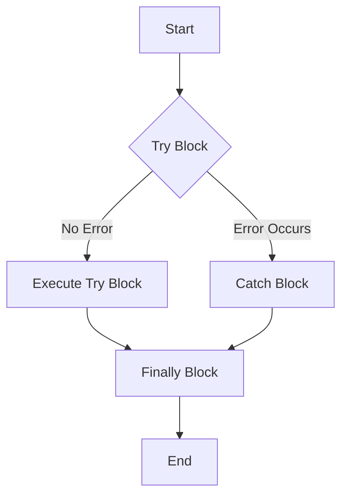

## 2.9 Error Handling with Try/Catch

In programming, errors are inevitable. They can arise from unexpected user input, network issues, or bugs in the code. As developers, it is crucial to anticipate these errors and handle them gracefully to ensure a smooth user experience. JavaScript provides a robust mechanism for error handling through the use of `try`, `catch`, and `finally` blocks. In this section, we will explore how these constructs work, how to generate custom errors using `throw`, and how to handle errors in synchronous code. We will also touch upon the limitations of these constructs in asynchronous code, which we will delve into in later sections.

### Understanding Try, Catch, and Finally

The `try...catch` statement is a powerful tool in JavaScript that allows you to test a block of code for errors (try), handle the error if one occurs (catch), and execute code regardless of the result (finally). Let's break down each part:

- **`try` block**: This is where you place the code that might throw an error. If an error occurs, the control is passed to the `catch` block.
- **`catch` block**: This block is executed if an error occurs in the `try` block. It allows you to define how to handle the error.
- **`finally` block**: This block is optional and executes after the `try` and `catch` blocks, regardless of whether an error was thrown or not. It is often used for cleanup tasks.

#### Syntax of Try, Catch, and Finally

Here's the basic syntax of a `try...catch...finally` statement:

```javascript
try {
    // Code that may throw an error
} catch (error) {
    // Code to handle the error
} finally {
    // Code that will run regardless of an error
}
```

#### Example: Basic Try, Catch, and Finally

Let's look at a simple example to illustrate how `try`, `catch`, and `finally` work together:

```javascript
function divide(a, b) {
    try {
        if (b === 0) {
            throw new Error("Cannot divide by zero");
        }
        console.log(a / b);
    } catch (error) {
        console.error("Error:", error.message);
    } finally {
        console.log("Division operation completed.");
    }
}

divide(10, 2); // Outputs: 5, "Division operation completed."
divide(10, 0); // Outputs: "Error: Cannot divide by zero", "Division operation completed."
```

In this example, the `divide` function attempts to divide two numbers. If the divisor is zero, it throws a custom error using `throw`. The `catch` block captures this error and logs it to the console. The `finally` block runs regardless of whether an error was thrown, ensuring that the message "Division operation completed." is always displayed.

### Throwing Custom Errors

The `throw` statement allows you to create custom errors in your code. This is particularly useful when you want to enforce certain conditions or validate inputs. When you use `throw`, you can specify any expression, but it's common to throw an instance of the `Error` object or one of its subclasses.

#### Syntax of Throw

The syntax for `throw` is straightforward:

```javascript
throw expression;
```

#### Example: Throwing Custom Errors

Let's enhance our previous example by adding input validation:

```javascript
function calculateSquareRoot(number) {
    try {
        if (number < 0) {
            throw new RangeError("Cannot calculate square root of a negative number");
        }
        console.log(Math.sqrt(number));
    } catch (error) {
        console.error("Error:", error.message);
    } finally {
        console.log("Square root calculation completed.");
    }
}

calculateSquareRoot(16); // Outputs: 4, "Square root calculation completed."
calculateSquareRoot(-1); // Outputs: "Error: Cannot calculate square root of a negative number", "Square root calculation completed."
```

In this example, we throw a `RangeError` if the input number is negative, as calculating the square root of a negative number is not possible in real numbers. The `catch` block handles the error, and the `finally` block ensures that a completion message is always logged.

### Error Handling in Synchronous Code

Error handling is straightforward in synchronous code because the `try`, `catch`, and `finally` blocks execute in a linear fashion. This means that you can predict the flow of execution and handle errors as they occur.

#### Example: Synchronous Error Handling

Consider a function that reads a property from an object:

```javascript
function getProperty(obj, prop) {
    try {
        if (!obj.hasOwnProperty(prop)) {
            throw new ReferenceError(`Property '${prop}' does not exist`);
        }
        return obj[prop];
    } catch (error) {
        console.error("Error:", error.message);
    }
}

const person = { name: "Alice", age: 25 };
console.log(getProperty(person, "name")); // Outputs: Alice
console.log(getProperty(person, "address")); // Outputs: "Error: Property 'address' does not exist"
```

In this example, the `getProperty` function checks if the specified property exists on the object. If not, it throws a `ReferenceError`. The `catch` block handles the error by logging it to the console.

### Limitations with Asynchronous Code

While `try...catch` is effective for synchronous code, it has limitations when dealing with asynchronous operations, such as callbacks, promises, and async/await. This is because errors in asynchronous code do not propagate to the surrounding `try...catch` block. Instead, you need to handle errors within the asynchronous context itself.

#### Brief Mention: Asynchronous Error Handling

For example, consider the following asynchronous code using a callback:

```javascript
function fetchData(callback) {
    setTimeout(() => {
        try {
            // Simulate an error
            throw new Error("Failed to fetch data");
        } catch (error) {
            callback(error, null);
        }
    }, 1000);
}

fetchData((error, data) => {
    if (error) {
        console.error("Error:", error.message);
    } else {
        console.log("Data:", data);
    }
});
```

In this example, the error is caught within the asynchronous function itself, and the callback is used to pass the error back to the caller. This pattern is common in callback-based asynchronous code.

We will explore more about error handling in asynchronous code, including promises and async/await, in later sections.

### Visualizing Error Handling Flow

To better understand how `try`, `catch`, and `finally` work together, let's visualize the flow of execution using a flowchart.



**Description**: This flowchart illustrates the flow of execution in a `try...catch...finally` statement. If no error occurs in the `try` block, the code executes normally, and the `finally` block runs afterward. If an error occurs, the `catch` block handles it, followed by the execution of the `finally` block.

### Try It Yourself

Now that we've covered the basics of error handling with `try`, `catch`, and `finally`, it's time to experiment with these concepts. Here are a few suggestions for you to try:

1. **Modify the `divide` function** to handle cases where the inputs are not numbers. Use `throw` to generate a `TypeError` if the inputs are invalid.

2. **Create a function** that reads a file and handles potential errors, such as the file not existing. Use `try...catch` to manage these errors.

3. **Experiment with the `finally` block** by adding additional cleanup tasks, such as closing a file or releasing resources.

### Key Takeaways

- The `try...catch` statement is used to handle errors in JavaScript.
- The `try` block contains code that may throw an error, while the `catch` block handles the error if it occurs.
- The `finally` block executes regardless of whether an error was thrown, making it ideal for cleanup tasks.
- The `throw` statement allows you to generate custom errors, providing more control over error handling.
- Error handling in synchronous code is straightforward, but asynchronous code requires different approaches, which we will cover later.

Remember, mastering error handling is an essential skill for any developer. It not only improves the robustness of your code but also enhances the user experience by preventing unexpected crashes. Keep experimenting, stay curious, and enjoy the journey!

## Quiz Time!



### What is the purpose of the `try` block in JavaScript?

- [x] To test a block of code for errors
- [ ] To handle errors when they occur
- [ ] To execute code regardless of an error
- [ ] To generate custom errors

> **Explanation:** The `try` block is used to test a block of code for errors. If an error occurs, control is passed to the `catch` block.

### What does the `catch` block do?

- [x] Handles errors that occur in the `try` block
- [ ] Executes code regardless of an error
- [ ] Tests a block of code for errors
- [ ] Generates custom errors

> **Explanation:** The `catch` block handles errors that occur in the `try` block, allowing you to define how to handle the error.

### What is the purpose of the `finally` block?

- [x] To execute code regardless of whether an error occurred
- [ ] To handle errors when they occur
- [ ] To test a block of code for errors
- [ ] To generate custom errors

> **Explanation:** The `finally` block executes code regardless of whether an error occurred, making it ideal for cleanup tasks.

### How do you generate a custom error in JavaScript?

- [x] Using the `throw` statement
- [ ] Using the `try` statement
- [ ] Using the `catch` statement
- [ ] Using the `finally` statement

> **Explanation:** The `throw` statement is used to generate custom errors in JavaScript.

### What type of error is thrown when trying to access a non-existent property on an object?

- [x] ReferenceError
- [ ] TypeError
- [ ] SyntaxError
- [ ] RangeError

> **Explanation:** A `ReferenceError` is thrown when trying to access a non-existent property on an object.

### Can the `finally` block be omitted in a `try...catch` statement?

- [x] Yes
- [ ] No

> **Explanation:** The `finally` block is optional and can be omitted in a `try...catch` statement.

### What happens if an error occurs in the `finally` block?

- [x] The error is thrown and can be caught by an outer `try...catch`
- [ ] The error is ignored
- [ ] The program crashes
- [ ] The error is handled by the `catch` block

> **Explanation:** If an error occurs in the `finally` block, it is thrown and can be caught by an outer `try...catch`.

### What is a limitation of `try...catch` in asynchronous code?

- [x] Errors do not propagate to the surrounding `try...catch` block
- [ ] Errors are handled automatically
- [ ] The `finally` block does not execute
- [ ] The `catch` block is ignored

> **Explanation:** In asynchronous code, errors do not propagate to the surrounding `try...catch` block, requiring different error handling approaches.

### Which statement is used to pass an error back to the caller in asynchronous code?

- [x] Callback
- [ ] Throw
- [ ] Return
- [ ] Finally

> **Explanation:** In asynchronous code, a callback is often used to pass an error back to the caller.

### True or False: The `finally` block always executes, even if an error is thrown.

- [x] True
- [ ] False

> **Explanation:** The `finally` block always executes, regardless of whether an error is thrown or not.


