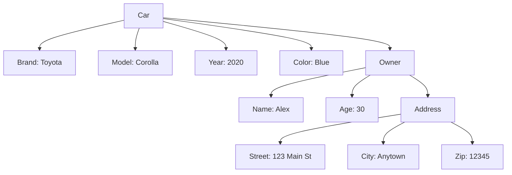

## 3.1 Creating Objects with Object Literals

Welcome to the exciting world of JavaScript objects! In this section, we'll delve into creating objects using object literals, a fundamental concept in JavaScript that allows us to structure and organize data efficiently. Whether you're building a simple application or a complex system, understanding object literals is crucial for writing clean and maintainable code.

### What is an Object Literal?

In JavaScript, an object is a collection of key-value pairs, where each key is a string (or Symbol) and each value can be any type, including numbers, strings, arrays, or even other objects. An object literal is a simple and concise way to create objects using a pair of curly braces `{}`.

#### Syntax of Object Literals

The syntax for creating an object literal is straightforward:

```javascript
let objectName = {
  key1: value1,
  key2: value2,
  // more key-value pairs
};
```

- **`objectName`**: The variable name that will hold the object.
- **`key`**: A string representing the name of the property.
- **`value`**: The data associated with the key, which can be of any data type.

### Creating Simple Objects

Let's start by creating a simple object to represent a car:

```javascript
let car = {
  brand: "Toyota",
  model: "Corolla",
  year: 2020,
  color: "blue"
};

console.log(car);
```

In this example, `car` is an object with four properties: `brand`, `model`, `year`, and `color`. Each property has a corresponding value, making it easy to store related data together.

#### Accessing Object Properties

You can access the properties of an object using dot notation or bracket notation:

```javascript
// Dot notation
console.log(car.brand); // Output: Toyota

// Bracket notation
console.log(car["model"]); // Output: Corolla
```

Dot notation is more commonly used due to its simplicity and readability. However, bracket notation is useful when the property name contains special characters or spaces, or when the property name is stored in a variable.

### Creating Nested Objects

Objects can also contain other objects, allowing you to create complex data structures. This is known as nesting. Let's extend our car example to include an owner object:

```javascript
let car = {
  brand: "Toyota",
  model: "Corolla",
  year: 2020,
  color: "blue",
  owner: {
    name: "Alex",
    age: 30,
    address: {
      street: "123 Main St",
      city: "Anytown",
      zip: "12345"
    }
  }
};

console.log(car.owner.name); // Output: Alex
console.log(car.owner.address.city); // Output: Anytown
```

In this example, the `owner` property is itself an object with its own properties, and the `address` property within `owner` is another nested object. This structure allows you to represent complex relationships and hierarchies within your data.

### Simplicity and Readability of Object Literals

Object literals provide a clear and concise way to create objects. They are easy to read and write, making your code more maintainable. Here's why object literals are preferred:

- **Conciseness**: Object literals allow you to define an entire object in a single expression.
- **Readability**: The structure of an object literal closely resembles the data it represents, making it easy to understand.
- **Flexibility**: You can easily add, modify, or remove properties from an object literal.

### Practical Example: Representing a Book

Let's create an object to represent a book, including its title, author, and publication details:

```javascript
let book = {
  title: "JavaScript: The Good Parts",
  author: "Douglas Crockford",
  publication: {
    year: 2008,
    publisher: "O'Reilly Media",
    isbn: "978-0596517748"
  }
};

console.log(book.title); // Output: JavaScript: The Good Parts
console.log(book.publication.publisher); // Output: O'Reilly Media
```

This example demonstrates how object literals can be used to organize related information in a structured way.

### Try It Yourself

Now it's your turn! Try creating your own object using object literals. Here's a challenge:

Create an object to represent a smartphone with the following properties:
- `brand`
- `model`
- `operatingSystem`
- `specs` (an object containing `ram`, `storage`, and `battery`)

Once you've created the object, practice accessing its properties using both dot notation and bracket notation.

### Visualizing Object Structure

To help visualize how objects and nested objects are structured, let's use a diagram to represent the `car` object we created earlier:



This diagram illustrates the hierarchical structure of the `car` object, showing how properties and nested objects are related.

### References and Further Reading

For more information on JavaScript objects and object literals, check out these resources:
- [MDN Web Docs: Working with Objects](https://developer.mozilla.org/en-US/docs/Web/JavaScript/Guide/Working_with_Objects)
- [W3Schools: JavaScript Objects](https://www.w3schools.com/js/js_objects.asp)

### Knowledge Check

Let's reinforce what we've learned with a few questions:

1. What is an object literal in JavaScript?
2. How do you access a property of an object using dot notation?
3. What is the advantage of using object literals over other methods of creating objects?
4. Create an object to represent a laptop with properties for `brand`, `model`, and `specs` (including `processor`, `ram`, and `storage`).

### Embrace the Journey

Remember, this is just the beginning of your journey with JavaScript objects. As you progress, you'll build more complex and interactive applications. Keep experimenting, stay curious, and enjoy the journey!

## Quiz Time!



### What is an object literal in JavaScript?

- [x] A way to define an object using curly braces with key-value pairs.
- [ ] A function that creates objects.
- [ ] A method to iterate over object properties.
- [ ] A special type of array.

> **Explanation:** An object literal is a way to define an object using curly braces `{}` with key-value pairs, making it a straightforward method to create objects.

### How do you access a property of an object using dot notation?

- [x] By using the object's name followed by a dot and the property name.
- [ ] By enclosing the property name in square brackets.
- [ ] By calling a method on the object.
- [ ] By using a for loop.

> **Explanation:** Dot notation accesses a property by using the object's name followed by a dot and the property name, e.g., `objectName.propertyName`.

### What is the advantage of using object literals over other methods of creating objects?

- [x] They are concise and easy to read.
- [ ] They require less memory.
- [ ] They automatically handle errors.
- [ ] They are faster than other methods.

> **Explanation:** Object literals provide a concise and easy-to-read syntax, making them a preferred method for creating objects in JavaScript.

### Which of the following is a valid way to define a nested object?

- [x] Including an object as a value in another object's property.
- [ ] Using a function to return an object.
- [ ] Creating an object with a constructor.
- [ ] Defining an object inside a loop.

> **Explanation:** A nested object is defined by including an object as a value in another object's property, creating a hierarchy.

### How can you modify a property value of an object literal?

- [x] By assigning a new value using dot notation.
- [ ] By using a special method.
- [x] By assigning a new value using bracket notation.
- [ ] By recreating the object.

> **Explanation:** You can modify a property value using either dot notation or bracket notation by assigning a new value to the property.

### What is the output of the following code?
```javascript
let person = { name: "Sam", age: 25 };
console.log(person["name"]);
```

- [x] Sam
- [ ] 25
- [ ] Undefined
- [ ] Error

> **Explanation:** The code accesses the `name` property of the `person` object using bracket notation, which outputs "Sam".

### What is a key feature of object literals?

- [x] They allow for easy creation of objects with a clear structure.
- [ ] They automatically validate data types.
- [x] They can contain nested objects.
- [ ] They are only used for small data sets.

> **Explanation:** Object literals allow for easy creation of objects with a clear structure and can contain nested objects, making them versatile.

### How do you delete a property from an object literal?

- [x] Using the `delete` operator.
- [ ] By setting the property to `null`.
- [ ] By using a special method.
- [ ] By removing it from the object definition.

> **Explanation:** The `delete` operator is used to remove a property from an object literal.

### Which of the following is a correct way to create an object literal?

- [x] `let obj = { key: "value" };`
- [ ] `let obj = new Object();`
- [ ] `let obj = Object.create();`
- [ ] `let obj = (key: "value");`

> **Explanation:** `let obj = { key: "value" };` is the correct syntax for creating an object literal.

### True or False: Object literals can only contain primitive data types as values.

- [ ] True
- [x] False

> **Explanation:** False. Object literals can contain any data type as values, including other objects, arrays, functions, and more.



By mastering object literals, you're building a strong foundation for working with objects in JavaScript. Keep practicing, and soon you'll be creating complex data structures with ease!
