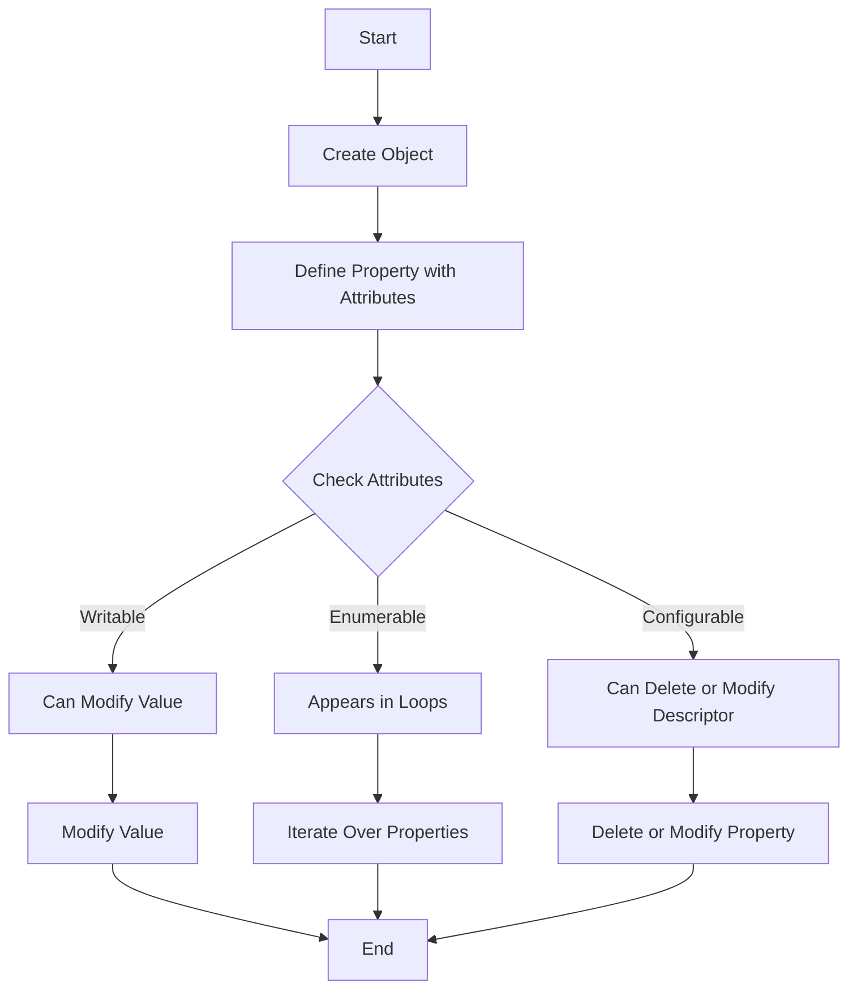

## 3.10 Property Descriptors and Attributes

In JavaScript, objects are collections of properties, and each property is associated with a key-value pair. However, there's more to properties than just their values. Properties have attributes that define their behavior and characteristics. Understanding these attributes and how to manipulate them is crucial for writing robust and flexible JavaScript code. In this section, we will delve into property descriptors and attributes, and learn how to use `Object.getOwnPropertyDescriptor()` and `Object.defineProperty()` to control them.

### Understanding Property Descriptors

A property descriptor is an object that describes a property on another object. It provides detailed information about the property, including its value and various attributes that determine how the property behaves.

#### Key Attributes of Property Descriptors

1. **Value**: The actual data stored in the property.
2. **Writable**: A boolean indicating if the property value can be changed.
3. **Enumerable**: A boolean indicating if the property will appear in `for...in` loops and `Object.keys()`.
4. **Configurable**: A boolean indicating if the property descriptor can be changed and if the property can be deleted.

#### Accessor Descriptors

In addition to data descriptors, properties can also have accessor descriptors, which include:

1. **Get**: A function that returns the property value.
2. **Set**: A function that sets the property value.

### Using Object.getOwnPropertyDescriptor()

The `Object.getOwnPropertyDescriptor()` method allows us to retrieve the descriptor for a specific property on an object. This method is useful for examining the attributes of a property.

```javascript
const person = {
  name: 'Alice',
  age: 30
};

// Get the property descriptor for 'name'
const descriptor = Object.getOwnPropertyDescriptor(person, 'name');
console.log(descriptor);
```

**Output:**

```json
{
  "value": "Alice",
  "writable": true,
  "enumerable": true,
  "configurable": true
}
```

### Using Object.defineProperty()

The `Object.defineProperty()` method is used to define a new property directly on an object, or modify an existing property, and control its attributes.

```javascript
const person = {};

// Define a new property 'name' with specific attributes
Object.defineProperty(person, 'name', {
  value: 'Alice',
  writable: false,
  enumerable: true,
  configurable: true
});

console.log(person.name); // Output: Alice

// Attempt to change the value of 'name'
person.name = 'Bob';
console.log(person.name); // Output: Alice (because writable is false)
```

### Exploring Property Attributes

#### Writable Attribute

The `writable` attribute determines whether the value of a property can be changed. If `writable` is set to `false`, any attempts to modify the property value will fail silently or throw an error in strict mode.

```javascript
const book = {};
Object.defineProperty(book, 'title', {
  value: 'JavaScript Essentials',
  writable: false
});

book.title = 'Advanced JavaScript'; // This will not change the title
console.log(book.title); // Output: JavaScript Essentials
```

#### Enumerable Attribute

The `enumerable` attribute controls whether a property shows up in `for...in` loops and `Object.keys()`.

```javascript
const car = {};
Object.defineProperty(car, 'make', {
  value: 'Toyota',
  enumerable: false
});

console.log(Object.keys(car)); // Output: []
```

#### Configurable Attribute

The `configurable` attribute determines whether a property descriptor can be changed and whether the property can be deleted from the object.

```javascript
const gadget = {};
Object.defineProperty(gadget, 'type', {
  value: 'Smartphone',
  configurable: false
});

// Attempt to delete the property
delete gadget.type;
console.log(gadget.type); // Output: Smartphone
```

### Scenarios for Controlling Property Descriptors

Controlling property descriptors is useful in various scenarios, such as:

- **Creating Immutable Objects**: By setting `writable` and `configurable` to `false`, you can create properties that cannot be changed or deleted, effectively making an object immutable.
- **Defining Read-Only Properties**: Use `writable: false` to create properties that can be read but not modified.
- **Hiding Properties**: Set `enumerable: false` to hide properties from loops and `Object.keys()`, which is useful for internal properties that should not be exposed.
- **Custom Getters and Setters**: Use accessor descriptors to define custom logic for getting and setting property values.

### Code Example: Defining Non-Writable and Non-Enumerable Properties

Let's create an object with a non-writable and non-enumerable property.

```javascript
const user = {};
Object.defineProperty(user, 'id', {
  value: 12345,
  writable: false,
  enumerable: false
});

console.log(user.id); // Output: 12345

// Attempt to change the id
user.id = 67890;
console.log(user.id); // Output: 12345

// Check if 'id' is enumerable
console.log(Object.keys(user)); // Output: []
```

### Try It Yourself

Experiment with the code examples provided. Try changing the attributes and observe how they affect the properties. Here are some suggestions:

- Change the `writable` attribute to `true` and see if you can modify the property value.
- Set `enumerable` to `true` and check if the property appears in `Object.keys()`.
- Define a property with a getter and setter to see how accessor descriptors work.

### Visualizing Property Descriptors

To better understand how property descriptors work, let's visualize the process of defining and retrieving property descriptors using a flowchart.



### References and Links

For more information about property descriptors and attributes, you can refer to the following resources:

- [MDN Web Docs: Object.getOwnPropertyDescriptor()](https://developer.mozilla.org/en-US/docs/Web/JavaScript/Reference/Global_Objects/Object/getOwnPropertyDescriptor)
- [MDN Web Docs: Object.defineProperty()](https://developer.mozilla.org/en-US/docs/Web/JavaScript/Reference/Global_Objects/Object/defineProperty)

### Knowledge Check

Let's review what we've learned about property descriptors and attributes:

- **What are property descriptors?** They are objects that describe the attributes of a property on another object.
- **What are the key attributes of property descriptors?** Value, writable, enumerable, and configurable.
- **How do you retrieve a property descriptor?** Use `Object.getOwnPropertyDescriptor()`.
- **How do you define or modify a property descriptor?** Use `Object.defineProperty()`.

### Embrace the Journey

Remember, understanding property descriptors and attributes is a powerful tool in your JavaScript toolkit. As you continue to explore object-oriented programming, you'll find these concepts invaluable for creating robust and flexible applications. Keep experimenting, stay curious, and enjoy the journey!

## Quiz Time!



### What is a property descriptor in JavaScript?

- [x] An object that describes the attributes of a property on another object.
- [ ] A function that modifies the attributes of a property.
- [ ] A method that deletes a property from an object.
- [ ] A string that represents the value of a property.

> **Explanation:** A property descriptor is an object that provides detailed information about a property, including its value and attributes like writable, enumerable, and configurable.


### Which method is used to retrieve a property descriptor?

- [x] Object.getOwnPropertyDescriptor()
- [ ] Object.defineProperty()
- [ ] Object.keys()
- [ ] Object.values()

> **Explanation:** `Object.getOwnPropertyDescriptor()` is used to retrieve the descriptor for a specific property on an object.


### What does the writable attribute control?

- [x] Whether the property value can be changed.
- [ ] Whether the property can be deleted.
- [ ] Whether the property appears in loops.
- [ ] Whether the property is a function.

> **Explanation:** The writable attribute determines if the value of a property can be modified.


### How can you define a non-enumerable property?

- [x] Use Object.defineProperty() with enumerable set to false.
- [ ] Use Object.keys() to exclude the property.
- [ ] Use Object.getOwnPropertyDescriptor() to hide the property.
- [ ] Use a loop to skip the property.

> **Explanation:** `Object.defineProperty()` allows you to set the enumerable attribute to false, making the property non-enumerable.


### What is the effect of setting configurable to false?

- [x] The property descriptor cannot be changed, and the property cannot be deleted.
- [ ] The property value cannot be changed.
- [ ] The property will not appear in loops.
- [ ] The property will be converted to a string.

> **Explanation:** When configurable is set to false, the property descriptor cannot be modified, and the property cannot be deleted.


### Which attribute determines if a property appears in for...in loops?

- [x] Enumerable
- [ ] Writable
- [ ] Configurable
- [ ] Value

> **Explanation:** The enumerable attribute controls whether a property shows up in for...in loops and Object.keys().


### What is the purpose of accessor descriptors?

- [x] To define custom logic for getting and setting property values.
- [ ] To make properties immutable.
- [ ] To hide properties from loops.
- [ ] To convert properties to functions.

> **Explanation:** Accessor descriptors include get and set functions that define custom logic for accessing and modifying property values.


### How can you make a property read-only?

- [x] Set writable to false using Object.defineProperty().
- [ ] Set configurable to true using Object.defineProperty().
- [ ] Use Object.keys() to exclude the property.
- [ ] Use a loop to prevent changes.

> **Explanation:** By setting writable to false, you make the property read-only, preventing any changes to its value.


### What happens if you try to delete a non-configurable property?

- [x] The property will not be deleted.
- [ ] The property will be deleted.
- [ ] An error will always be thrown.
- [ ] The property will be converted to a string.

> **Explanation:** Non-configurable properties cannot be deleted, and attempts to do so will fail silently or throw an error in strict mode.


### True or False: Property descriptors can only be used with objects created using object literals.

- [ ] True
- [x] False

> **Explanation:** Property descriptors can be used with any object, not just those created using object literals.


