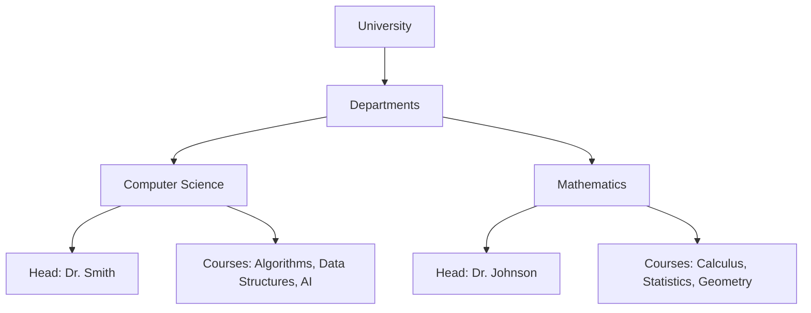

## 3.3 Nested Objects

In our journey through JavaScript and object-oriented programming, we've touched upon the basics of objects. Now, let's delve deeper into the concept of **nested objects**. Nested objects are a powerful feature in JavaScript that allows us to create complex data structures by embedding objects within objects. This concept is essential for modeling real-world entities and managing data efficiently.

### Understanding Nested Objects

**Nested objects** are simply objects that contain other objects as properties. This hierarchical structure allows us to represent complex data relationships in a manageable way. Imagine a scenario where you need to represent a university. A university has multiple departments, and each department has several courses. This is a perfect example of where nested objects shine.

#### Example of a Nested Object

Let's take a look at a simple example to illustrate nested objects:

```javascript
const university = {
  name: "Tech University",
  location: "New York",
  departments: {
    computerScience: {
      head: "Dr. Smith",
      courses: ["Algorithms", "Data Structures", "AI"],
    },
    mathematics: {
      head: "Dr. Johnson",
      courses: ["Calculus", "Statistics", "Geometry"],
    },
  },
};

console.log(university);
```

In this example, the `university` object contains a `departments` object, which in turn contains objects for `computerScience` and `mathematics`. Each of these department objects has its own properties, such as `head` and `courses`.

### Accessing Properties in Nested Objects

Accessing properties in nested objects requires a clear understanding of the object's structure. You can use dot notation or bracket notation to traverse the hierarchy.

#### Using Dot Notation

Dot notation is straightforward and easy to read. Here's how you can access properties in the nested `university` object:

```javascript
// Accessing the name of the university
console.log(university.name); // Output: Tech University

// Accessing the head of the Computer Science department
console.log(university.departments.computerScience.head); // Output: Dr. Smith

// Accessing the courses offered by the Mathematics department
console.log(university.departments.mathematics.courses); // Output: ["Calculus", "Statistics", "Geometry"]
```

#### Using Bracket Notation

Bracket notation is useful when dealing with dynamic property names or when property names contain special characters or spaces.

```javascript
// Accessing the name of the university
console.log(university["name"]); // Output: Tech University

// Accessing the head of the Computer Science department
console.log(university["departments"]["computerScience"]["head"]); // Output: Dr. Smith

// Accessing the courses offered by the Mathematics department
console.log(university["departments"]["mathematics"]["courses"]); // Output: ["Calculus", "Statistics", "Geometry"]
```

### Modifying Properties in Nested Objects

Modifying properties in nested objects follows the same principles as accessing them. You navigate through the object's hierarchy to reach the property you want to change.

#### Example: Updating a Property

Let's update the head of the Computer Science department:

```javascript
university.departments.computerScience.head = "Dr. Williams";
console.log(university.departments.computerScience.head); // Output: Dr. Williams
```

#### Example: Adding a New Course

Suppose we want to add a new course to the Mathematics department:

```javascript
university.departments.mathematics.courses.push("Linear Algebra");
console.log(university.departments.mathematics.courses); // Output: ["Calculus", "Statistics", "Geometry", "Linear Algebra"]
```

### Practical Use Cases for Nested Objects

Nested objects are invaluable when dealing with complex data structures. Here are some practical use cases:

#### 1. Representing Real-World Entities

Nested objects can represent entities with multiple attributes and relationships. For example, a company can be represented with nested objects for departments, employees, and projects.

```javascript
const company = {
  name: "Innovate Tech",
  departments: {
    engineering: {
      employees: [
        { name: "Alice", role: "Engineer" },
        { name: "Bob", role: "Senior Engineer" },
      ],
    },
    marketing: {
      employees: [
        { name: "Charlie", role: "Marketing Specialist" },
        { name: "Dana", role: "Marketing Manager" },
      ],
    },
  },
};
```

#### 2. Configurations and Settings

Applications often require complex configurations, which can be neatly organized using nested objects. This approach allows for easy access and modification of settings.

```javascript
const appConfig = {
  theme: {
    color: "blue",
    fontSize: "14px",
  },
  userPreferences: {
    notifications: {
      email: true,
      sms: false,
    },
  },
};
```

#### 3. API Responses

When working with APIs, responses often come in the form of nested JSON objects. Understanding how to navigate these structures is crucial for extracting the necessary data.

```javascript
const apiResponse = {
  user: {
    id: 123,
    name: "John Doe",
    posts: [
      { id: 1, title: "Hello World" },
      { id: 2, title: "Nested Objects in JavaScript" },
    ],
  },
};
```

### Potential Pitfalls with Nested Objects

While nested objects are powerful, they can introduce challenges. Here are some common pitfalls to watch out for:

#### 1. Cannot Read Property of Undefined

This error occurs when you try to access a property of an object that doesn't exist. To avoid this, always ensure that each level of the object hierarchy exists before accessing deeper properties.

```javascript
// This will throw an error if the 'physics' department does not exist
console.log(university.departments.physics.head); // Error: Cannot read property 'head' of undefined
```

To handle this gracefully, use optional chaining (introduced in ES2020):

```javascript
console.log(university.departments.physics?.head); // Output: undefined
```

#### 2. Deep Nesting

Deeply nested objects can become difficult to manage and understand. It's important to strike a balance between depth and readability. Consider flattening the structure if it becomes too complex.

#### 3. Performance Considerations

Accessing deeply nested properties can impact performance, especially in large datasets. Optimize your data structures and access patterns to ensure efficient performance.

### Visualizing Nested Objects

To better understand the structure of nested objects, let's visualize the `university` object using a diagram:



This diagram illustrates the hierarchical relationship between the university, its departments, and the properties of each department.

### Try It Yourself

Experiment with the following code examples to reinforce your understanding of nested objects. Try modifying the properties, adding new objects, or accessing data at different levels.

```javascript
// Create a nested object for a library
const library = {
  name: "City Library",
  location: "Downtown",
  sections: {
    fiction: {
      books: ["1984", "Brave New World", "Fahrenheit 451"],
      librarian: "Mr. Green",
    },
    nonFiction: {
      books: ["Sapiens", "Educated", "The Immortal Life of Henrietta Lacks"],
      librarian: "Ms. Blue",
    },
  },
};

// Access and modify properties
console.log(library.sections.fiction.books); // Output: ["1984", "Brave New World", "Fahrenheit 451"]
library.sections.fiction.librarian = "Mrs. Red";
console.log(library.sections.fiction.librarian); // Output: Mrs. Red

// Add a new section
library.sections.science = {
  books: ["A Brief History of Time", "The Selfish Gene"],
  librarian: "Dr. White",
};

console.log(library.sections.science);
```

### Knowledge Check

Before moving on, let's summarize the key points:

- Nested objects allow for complex data structures by embedding objects within objects.
- Use dot notation or bracket notation to access and modify properties at various levels.
- Practical use cases include representing real-world entities, managing configurations, and handling API responses.
- Be cautious of potential pitfalls such as accessing undefined properties and deep nesting.

### Embrace the Journey

Remember, mastering nested objects is a significant step in your JavaScript journey. As you continue to explore and experiment, you'll gain confidence in handling complex data structures. Keep practicing, stay curious, and enjoy the process of learning!

## Quiz Time!



### What is a nested object in JavaScript?

- [x] An object that contains other objects as properties.
- [ ] An object with only primitive data types.
- [ ] An object that cannot be modified.
- [ ] An object that is always deeply nested.

> **Explanation:** A nested object is an object that contains other objects as its properties, allowing for complex data structures.

### How can you access a property in a nested object?

- [x] Using dot notation.
- [x] Using bracket notation.
- [ ] Using a special function.
- [ ] Using a loop.

> **Explanation:** You can access properties in nested objects using dot notation or bracket notation.

### What is a practical use case for nested objects?

- [x] Representing real-world entities with complex relationships.
- [ ] Storing only primitive data types.
- [ ] Creating flat data structures.
- [ ] Avoiding object usage.

> **Explanation:** Nested objects are useful for representing complex relationships in real-world entities.

### What error might you encounter when accessing a non-existent property in a nested object?

- [x] Cannot read property of undefined.
- [ ] Syntax error.
- [ ] Type mismatch.
- [ ] Division by zero.

> **Explanation:** Attempting to access a non-existent property in a nested object can result in a "Cannot read property of undefined" error.

### How can you safely access a potentially undefined nested property?

- [x] Using optional chaining.
- [ ] Using a loop.
- [ ] Using a conditional statement.
- [ ] Using a try-catch block.

> **Explanation:** Optional chaining (?.) allows safe access to potentially undefined properties.

### What is a potential pitfall of deeply nested objects?

- [x] They can become difficult to manage and understand.
- [ ] They are always faster to access.
- [ ] They cannot be modified.
- [ ] They are not allowed in JavaScript.

> **Explanation:** Deeply nested objects can become difficult to manage and understand, leading to complexity.

### How can you modify a property in a nested object?

- [x] By navigating through the object's hierarchy to reach the property.
- [ ] By using a special function.
- [ ] By creating a new object.
- [ ] By deleting the object.

> **Explanation:** To modify a property in a nested object, navigate through the object's hierarchy to reach the desired property.

### What is the benefit of using nested objects for configurations?

- [x] They allow for easy access and modification of settings.
- [ ] They make configurations immutable.
- [ ] They prevent changes to settings.
- [ ] They always improve performance.

> **Explanation:** Nested objects allow for easy access and modification of settings, making them ideal for configurations.

### What is the purpose of visualizing nested objects with diagrams?

- [x] To better understand the structure and relationships within the object.
- [ ] To make the object immutable.
- [ ] To improve performance.
- [ ] To create new objects.

> **Explanation:** Visualizing nested objects with diagrams helps in understanding their structure and relationships.

### True or False: Nested objects can only be accessed using dot notation.

- [ ] True
- [x] False

> **Explanation:** Nested objects can be accessed using both dot notation and bracket notation.


