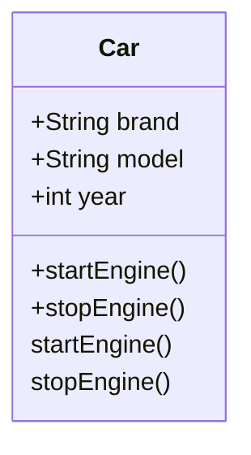

## 3.4 Methods in Objects

In the world of JavaScript, objects are fundamental building blocks that allow us to model real-world entities and their interactions. One of the most powerful features of objects is their ability to encapsulate both data and behavior. In this section, we will delve into methods in objects, exploring how to add functions as properties to create methods, and how these methods can manipulate object data. Understanding methods is crucial for mastering object-oriented programming (OOP) in JavaScript, as they enable us to encapsulate behavior and create more organized, reusable, and maintainable code.

### What Are Methods in Objects?

In JavaScript, a method is simply a function that is a property of an object. Methods are used to define behaviors that objects can perform. They allow objects to act on their data, making it possible to encapsulate functionality within the object itself. This encapsulation is a core principle of OOP, where data and behavior are bundled together.

#### Defining Methods

When we talk about methods in objects, we are essentially referring to functions that are associated with an object. These functions can access and manipulate the data stored within the object, providing a way to interact with the object's properties.

### Adding Methods to Objects

There are several ways to add methods to objects in JavaScript. We can define methods when we create the object, or we can add them to an existing object. Let's explore both approaches.

#### Adding Methods During Object Creation

One of the simplest ways to add methods to an object is by defining them directly within the object literal. This approach is straightforward and allows us to create objects with predefined behaviors.

```javascript
// Creating an object with methods
const car = {
  brand: 'Toyota',
  model: 'Corolla',
  year: 2020,
  startEngine: function() {
    console.log('Engine started');
  },
  stopEngine: function() {
    console.log('Engine stopped');
  }
};

// Using the methods
car.startEngine(); // Output: Engine started
car.stopEngine();  // Output: Engine stopped
```

In this example, we define a `car` object with properties like `brand`, `model`, and `year`. We also add two methods, `startEngine` and `stopEngine`, which are functions that describe the behavior of the car object.

#### Adding Methods to Existing Objects

Sometimes, we may need to add methods to an object after it has been created. This can be done by simply assigning a function to a property of the object.

```javascript
// Creating an object
const book = {
  title: 'JavaScript Mastery',
  author: 'John Doe'
};

// Adding a method to the existing object
book.getSummary = function() {
  return `${this.title} by ${this.author}`;
};

// Using the method
console.log(book.getSummary()); // Output: JavaScript Mastery by John Doe
```

Here, we first create a `book` object with properties `title` and `author`. We then add a method `getSummary` to the object, which returns a string summarizing the book's details.

### Methods and the `this` Keyword

When defining methods, it's important to understand the role of the `this` keyword. In the context of an object method, `this` refers to the object on which the method was called. This allows methods to access and manipulate the properties of the object they belong to.

```javascript
// Object with a method using 'this'
const rectangle = {
  width: 10,
  height: 5,
  calculateArea: function() {
    return this.width * this.height;
  }
};

// Using the method
console.log(rectangle.calculateArea()); // Output: 50
```

In this example, the `calculateArea` method uses `this.width` and `this.height` to access the object's properties and calculate the area of the rectangle.

### Methods for Manipulating Object Data

Methods are often used to manipulate the data stored within an object. They can perform calculations, update properties, or interact with other objects. Let's look at some examples.

#### Example: Updating Object Properties

Methods can be used to update the properties of an object, allowing us to change the state of the object.

```javascript
// Object with a method to update properties
const user = {
  name: 'Alice',
  age: 25,
  updateAge: function(newAge) {
    this.age = newAge;
  }
};

// Using the method to update age
user.updateAge(26);
console.log(user.age); // Output: 26
```

In this example, the `updateAge` method allows us to change the `age` property of the `user` object.

#### Example: Interacting with Other Objects

Methods can also be used to interact with other objects, enabling complex behaviors and interactions.

```javascript
// Two objects with methods to interact
const player1 = {
  name: 'Player 1',
  score: 0,
  updateScore: function(points) {
    this.score += points;
  }
};

const player2 = {
  name: 'Player 2',
  score: 0,
  updateScore: function(points) {
    this.score += points;
  }
};

// Simulating a game
player1.updateScore(10);
player2.updateScore(15);

console.log(player1.score); // Output: 10
console.log(player2.score); // Output: 15
```

In this example, we have two player objects, each with a method to update their score. The methods encapsulate the logic for updating the score, allowing us to simulate a simple game.

### The Role of Methods in Object-Oriented Programming

In object-oriented programming, methods play a crucial role in defining the behavior of objects. They allow us to encapsulate functionality within objects, making our code more organized and modular. By using methods, we can:

- **Encapsulate Behavior**: Methods allow us to bundle related functionality within an object, keeping the code organized and easier to maintain.
- **Promote Reusability**: By defining methods, we can reuse the same functionality across different parts of our application.
- **Enhance Modularity**: Methods help us break down complex functionality into smaller, manageable pieces, improving the modularity of our code.

### Try It Yourself

Now that we've explored methods in objects, let's encourage you to experiment with the concepts. Try modifying the examples provided or create your own objects with methods. Here are a few suggestions:

- Create a `calculator` object with methods for basic arithmetic operations (add, subtract, multiply, divide).
- Define a `person` object with methods to update their name and age.
- Build a `bankAccount` object with methods to deposit and withdraw money, and check the balance.

### Visualizing Object Methods

To better understand how methods work within objects, let's visualize the interaction between an object and its methods using a diagram.



In this diagram, we represent a `Car` class with properties `brand`, `model`, and `year`, and methods `startEngine` and `stopEngine`. This visualization helps us see how methods are associated with an object and how they encapsulate behavior.

### References and Further Reading

To deepen your understanding of methods in objects, consider exploring the following resources:

- [MDN Web Docs: Working with Objects](https://developer.mozilla.org/en-US/docs/Web/JavaScript/Guide/Working_with_Objects)
- [W3Schools: JavaScript Objects](https://www.w3schools.com/js/js_objects.asp)

### Knowledge Check

Before we wrap up, let's reinforce what we've learned with a few questions:

1. What is a method in the context of a JavaScript object?
2. How can you add a method to an existing object?
3. What does the `this` keyword refer to within a method?
4. Why are methods important in object-oriented programming?

### Summary

In this section, we've explored methods in objects, learning how to add functions as properties to create methods. We've seen how methods encapsulate behavior, allowing objects to interact with their data and perform actions. By understanding methods, we can create more organized, reusable, and maintainable code, embracing the principles of object-oriented programming.

Remember, this is just the beginning. As you progress, you'll build more complex and interactive applications using methods in objects. Keep experimenting, stay curious, and enjoy the journey!

## Quiz Time!



### What is a method in the context of a JavaScript object?

- [x] A function that is a property of an object
- [ ] A variable that stores data
- [ ] A loop that iterates over properties
- [ ] A conditional statement within an object

> **Explanation:** A method is a function that is associated with an object, allowing the object to perform actions.

### How can you add a method to an existing object?

- [x] By assigning a function to a property of the object
- [ ] By using the `new` keyword
- [ ] By declaring a variable inside the object
- [ ] By using a loop to iterate over the object

> **Explanation:** You can add a method to an existing object by assigning a function to one of its properties.

### What does the `this` keyword refer to within a method?

- [x] The object on which the method was called
- [ ] The global object
- [ ] The parent object
- [ ] The previous method called

> **Explanation:** Within a method, `this` refers to the object that the method is a part of, allowing access to its properties.

### Why are methods important in object-oriented programming?

- [x] They encapsulate behavior within objects
- [ ] They store data in objects
- [ ] They create loops within objects
- [ ] They define global variables

> **Explanation:** Methods encapsulate behavior, allowing objects to perform actions and interact with their data.

### Which of the following is true about methods?

- [x] Methods can manipulate object data
- [ ] Methods cannot access object properties
- [x] Methods are functions associated with objects
- [ ] Methods are only used for calculations

> **Explanation:** Methods can manipulate object data and are functions associated with objects, allowing them to perform various actions.

### What is the role of the `this` keyword in a method?

- [x] To access the object's properties
- [ ] To declare a new variable
- [ ] To create a new object
- [ ] To define a loop

> **Explanation:** The `this` keyword allows methods to access and manipulate the properties of the object they belong to.

### How do methods promote reusability?

- [x] By allowing the same functionality to be used across different parts of an application
- [ ] By storing data in global variables
- [x] By encapsulating behavior within objects
- [ ] By creating new objects automatically

> **Explanation:** Methods promote reusability by encapsulating behavior within objects, allowing the same functionality to be used in different contexts.

### What is one way to define a method in an object?

- [x] By including a function as a property in the object literal
- [ ] By using a loop to iterate over the object
- [ ] By declaring a global function
- [ ] By using the `new` keyword

> **Explanation:** A method can be defined by including a function as a property in the object literal.

### What is the purpose of methods in objects?

- [x] To define behaviors that objects can perform
- [ ] To store data in arrays
- [ ] To create new variables
- [ ] To define global constants

> **Explanation:** Methods define behaviors that objects can perform, allowing them to interact with their data.

### True or False: Methods can only be added to objects during their creation.

- [ ] True
- [x] False

> **Explanation:** Methods can be added to objects both during their creation and after they have been created.


