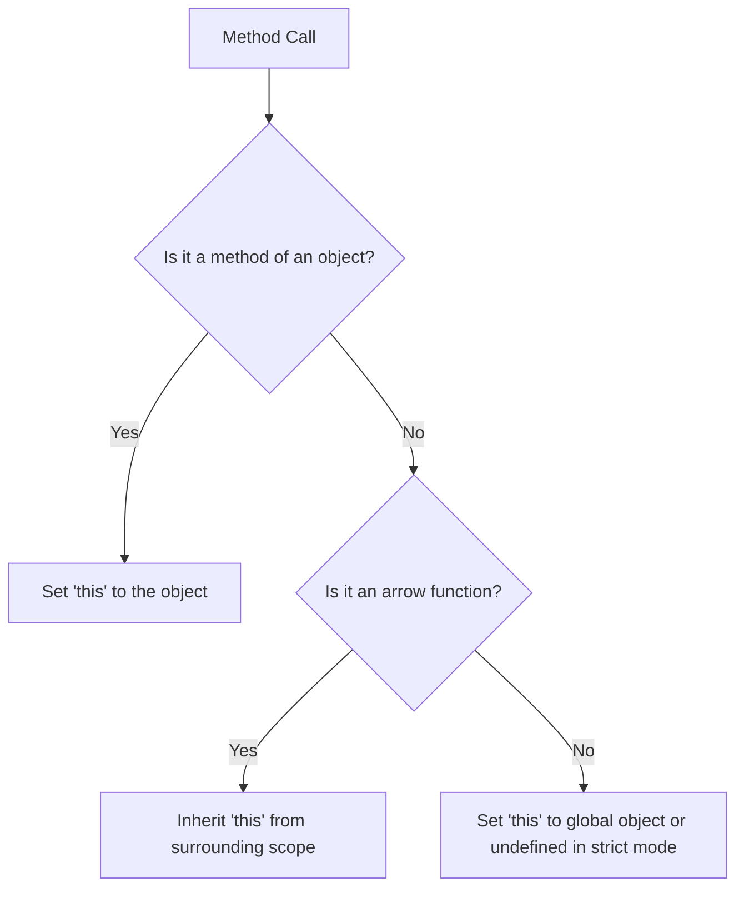

## 3.5 The 'this' Keyword in Methods

In JavaScript, the `this` keyword is a fundamental concept that can be both powerful and perplexing, especially for beginners. Understanding how `this` works is crucial for mastering object-oriented programming in JavaScript. In this section, we will explore how `this` references the containing object in methods, provide examples of its use, discuss common pitfalls, and explain how arrow functions affect `this`.

### Understanding `this` in JavaScript

The `this` keyword in JavaScript is a reference to the object that is currently executing a piece of code. In the context of methods, `this` typically refers to the object that owns the method. However, the value of `this` can change depending on how a function is called.

#### Basic Example of `this` in Methods

Let's start with a simple example to illustrate how `this` works within a method:

```javascript
const person = {
    name: 'Alice',
    greet: function() {
        console.log('Hello, my name is ' + this.name);
    }
};

person.greet(); // Output: Hello, my name is Alice
```

In this example, `this.name` refers to the `name` property of the `person` object. When `person.greet()` is called, `this` inside the `greet` method refers to the `person` object itself.

### Accessing Other Properties and Methods with `this`

One of the primary uses of `this` in methods is to access other properties or methods of the same object. This allows for more dynamic and reusable code.

#### Example: Accessing Properties

Consider the following example where we use `this` to access multiple properties:

```javascript
const car = {
    brand: 'Toyota',
    model: 'Corolla',
    getCarInfo: function() {
        return this.brand + ' ' + this.model;
    }
};

console.log(car.getCarInfo()); // Output: Toyota Corolla
```

Here, `this.brand` and `this.model` access the `brand` and `model` properties of the `car` object, respectively.

#### Example: Calling Other Methods

You can also use `this` to call other methods within the same object:

```javascript
const calculator = {
    number: 10,
    add: function(value) {
        this.number += value;
    },
    subtract: function(value) {
        this.number -= value;
    },
    getResult: function() {
        return this.number;
    }
};

calculator.add(5);
calculator.subtract(3);
console.log(calculator.getResult()); // Output: 12
```

In this example, `this.number` is used to modify the `number` property, and `this` is essential for calling `add`, `subtract`, and `getResult` methods on the `calculator` object.

### Common Mistakes with `this`

Understanding `this` can be tricky due to its dynamic nature. Here are some common mistakes and how to avoid them:

#### Mistake 1: Losing `this` Context

One common mistake is losing the context of `this` when passing methods as callbacks:

```javascript
const user = {
    name: 'Bob',
    sayName: function() {
        console.log(this.name);
    }
};

setTimeout(user.sayName, 1000); // Output: undefined
```

In this example, `this` inside `sayName` becomes `undefined` because `setTimeout` calls the function without an object context. To fix this, you can use `bind`:

```javascript
setTimeout(user.sayName.bind(user), 1000); // Output: Bob
```

#### Mistake 2: `this` in Nested Functions

Another common issue is using `this` inside nested functions:

```javascript
const team = {
    name: 'Developers',
    members: ['Alice', 'Bob'],
    printMembers: function() {
        this.members.forEach(function(member) {
            console.log(this.name + ': ' + member);
        });
    }
};

team.printMembers(); // Output: undefined: Alice, undefined: Bob
```

Here, `this.name` is `undefined` because the inner function has its own `this`. You can solve this by using an arrow function:

```javascript
const team = {
    name: 'Developers',
    members: ['Alice', 'Bob'],
    printMembers: function() {
        this.members.forEach((member) => {
            console.log(this.name + ': ' + member);
        });
    }
};

team.printMembers(); // Output: Developers: Alice, Developers: Bob
```

### Arrow Functions and `this`

Arrow functions have a unique behavior when it comes to `this`. They do not have their own `this` context; instead, they inherit `this` from the surrounding lexical scope.

#### Example: Arrow Functions Inheriting `this`

Let's revisit the previous example using arrow functions:

```javascript
const group = {
    name: 'Artists',
    members: ['Charlie', 'Dana'],
    printMembers: function() {
        this.members.forEach((member) => {
            console.log(this.name + ': ' + member);
        });
    }
};

group.printMembers(); // Output: Artists: Charlie, Artists: Dana
```

In this case, the arrow function inside `forEach` uses the `this` value from `printMembers`, which is the `group` object.

### Practice Exercises

To reinforce your understanding of `this` in methods, try the following exercises:

1. **Exercise 1: Fix the Context**
   - Create an object `book` with properties `title` and `author`, and a method `getDetails` that returns a string combining both properties. Use `setTimeout` to call `getDetails` after 1 second and ensure the correct `this` context is maintained.

2. **Exercise 2: Nested Functions**
   - Write an object `playlist` with a property `songs` (an array of song titles) and a method `listSongs` that logs each song prefixed with the playlist name. Use both regular and arrow functions to achieve this.

3. **Exercise 3: Arrow Functions**
   - Create an object `counter` with a property `count` initialized to 0 and methods `increment` and `getCount`. Use an arrow function in `increment` to increase `count` by 1 and return the updated count using `getCount`.

### Visualizing `this` Context

To better understand how `this` works in different contexts, let's visualize the concept using a flowchart.



This flowchart illustrates how `this` is determined based on the context in which a function is called.

### References and Further Reading

For more information on the `this` keyword in JavaScript, you can explore the following resources:

- [MDN Web Docs: `this`](https://developer.mozilla.org/en-US/docs/Web/JavaScript/Reference/Operators/this)
- [W3Schools: JavaScript `this` Keyword](https://www.w3schools.com/js/js_this.asp)

### Knowledge Check

Before moving on, let's summarize the key points:

- `this` refers to the object that owns the method in which it is used.
- Arrow functions inherit `this` from their surrounding lexical scope.
- Common mistakes include losing `this` context in callbacks and nested functions.
- Use `bind`, arrow functions, or other techniques to maintain the correct `this` context.

### Embrace the Journey

Remember, mastering `this` is an essential step in your JavaScript journey. As you continue to practice and experiment, you'll become more comfortable with its nuances. Keep exploring, stay curious, and enjoy the process of learning!

## Quiz Time!



### What does `this` refer to inside a method of an object?

- [x] The object that owns the method
- [ ] The global object
- [ ] The function itself
- [ ] The parent object

> **Explanation:** Inside a method, `this` refers to the object that owns the method.

### How can you maintain the correct `this` context when passing a method as a callback?

- [x] Use the `bind` method
- [ ] Use a regular function
- [ ] Use a global variable
- [ ] Use a nested function

> **Explanation:** The `bind` method can be used to explicitly set the `this` context for a function.

### What is the value of `this` in an arrow function?

- [x] It inherits `this` from the surrounding lexical scope
- [ ] It refers to the global object
- [ ] It has its own `this` context
- [ ] It is always `undefined`

> **Explanation:** Arrow functions do not have their own `this` context; they inherit it from the surrounding scope.

### What is a common mistake when using `this` in nested functions?

- [x] Losing the `this` context
- [ ] Using `this` to access global variables
- [ ] Using `this` to call other methods
- [ ] Using `this` to define properties

> **Explanation:** A common mistake is losing the `this` context in nested functions, which can lead to unexpected behavior.

### How can you fix the `this` context issue in nested functions?

- [x] Use arrow functions
- [ ] Use a global variable
- [ ] Use a nested function
- [ ] Use a regular function

> **Explanation:** Arrow functions inherit `this` from the surrounding scope, which helps maintain the correct context.

### What happens to `this` in a function called with `setTimeout`?

- [x] It becomes `undefined` or the global object
- [ ] It refers to the object that owns the function
- [ ] It refers to the function itself
- [ ] It is always `null`

> **Explanation:** When a function is called with `setTimeout`, `this` becomes `undefined` in strict mode or the global object otherwise.

### Which method can be used to explicitly set `this` for a function?

- [x] `bind`
- [ ] `call`
- [ ] `apply`
- [ ] `setTimeout`

> **Explanation:** The `bind` method is used to explicitly set `this` for a function.

### What is the output of the following code?
```javascript
const obj = {
    value: 42,
    getValue: function() {
        return this.value;
    }
};
const getValue = obj.getValue;
console.log(getValue());
```

- [x] `undefined`
- [ ] `42`
- [ ] `null`
- [ ] `NaN`

> **Explanation:** When `getValue` is called without an object context, `this` becomes `undefined`, so `this.value` is `undefined`.

### How does `this` behave in strict mode?

- [x] It is `undefined` when not set by the call
- [ ] It always refers to the global object
- [ ] It refers to the function itself
- [ ] It is always `null`

> **Explanation:** In strict mode, `this` is `undefined` when not set by the call.

### True or False: Arrow functions have their own `this` context.

- [x] False
- [ ] True

> **Explanation:** Arrow functions do not have their own `this` context; they inherit it from the surrounding lexical scope.


