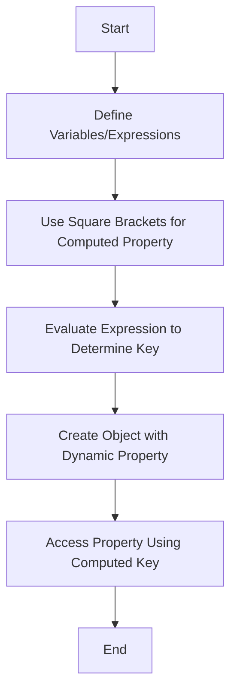

## 3.6 Computed Property Names

In the world of JavaScript, objects are fundamental building blocks that help us organize and manage data efficiently. As we delve deeper into working with objects, we encounter scenarios where we need to define property names dynamically. This is where computed property names come into play, allowing us to use expressions to determine property names at runtime. In this section, we will explore the syntax, practical examples, and use cases for computed property names, empowering you to write more flexible and dynamic JavaScript code.

### Understanding Computed Property Names

Computed property names in JavaScript allow us to define object properties using expressions enclosed in square brackets (`[]`). This feature, introduced in ECMAScript 6 (ES6), enables us to create property names dynamically, based on variables or expressions evaluated at runtime.

#### Syntax of Computed Property Names

The syntax for computed property names is straightforward. When defining an object, you can use square brackets to enclose an expression that will be evaluated to determine the property name. Here's a basic example:

```javascript
const key = 'name';
const person = {
  [key]: 'Alice'
};

console.log(person.name); // Output: Alice
```

In this example, the variable `key` holds the string `'name'`. By using `[key]` as a computed property name, we dynamically assign the property `'name'` to the `person` object.

### Dynamic Property Names at Runtime

One of the most powerful aspects of computed property names is their ability to determine property names at runtime. This allows us to create objects with properties that are not known until the code is executed. Let's explore a more complex example:

```javascript
function createObjectWithDynamicKeys(baseKey, value) {
  const dynamicKey = `${baseKey}_property`;
  return {
    [dynamicKey]: value
  };
}

const dynamicObject = createObjectWithDynamicKeys('user', 'John Doe');
console.log(dynamicObject.user_property); // Output: John Doe
```

In this example, the `createObjectWithDynamicKeys` function takes a `baseKey` and a `value` as arguments. It constructs a dynamic key by appending `'_property'` to the `baseKey`, and then uses this dynamic key to create an object with a computed property name.

### Use Cases for Computed Property Names

Computed property names are particularly useful in scenarios where property names need to be generated dynamically based on certain conditions or inputs. Here are some common use cases:

1. **Dynamic Form Inputs**: When handling form data, you might need to create an object where each property corresponds to a form field. Computed property names allow you to generate these properties based on the form field names.

2. **Localization and Internationalization**: In applications that support multiple languages, computed property names can be used to dynamically access language-specific strings based on the user's locale.

3. **Configuration Objects**: When dealing with configuration settings, computed property names enable you to construct configuration objects with keys that are determined at runtime.

4. **Data Transformation**: When transforming data from one format to another, computed property names can be used to map keys dynamically based on transformation rules.

### Experimenting with Variables and Expressions

To fully grasp the power of computed property names, it's essential to experiment with different variables and expressions. Let's explore some examples that demonstrate various ways to use computed property names:

#### Example 1: Using Variables as Property Names

```javascript
const prefix = 'item';
const index = 1;
const collection = {
  [`${prefix}${index}`]: 'Value 1',
  [`${prefix}${index + 1}`]: 'Value 2'
};

console.log(collection.item1); // Output: Value 1
console.log(collection.item2); // Output: Value 2
```

In this example, we use a combination of a `prefix` and an `index` to create dynamic property names for the `collection` object. The property names `item1` and `item2` are generated using computed property names.

#### Example 2: Conditional Property Names

```javascript
const condition = true;
const conditionalObject = {
  [condition ? 'active' : 'inactive']: true
};

console.log(conditionalObject.active); // Output: true
```

Here, we use a ternary operator within the computed property name to determine the property name based on a condition. If `condition` is `true`, the property `active` is created; otherwise, `inactive` is used.

#### Example 3: Using Functions to Generate Property Names

```javascript
function getKey(index) {
  return `key${index}`;
}

const dynamicKeysObject = {
  [getKey(1)]: 'First',
  [getKey(2)]: 'Second'
};

console.log(dynamicKeysObject.key1); // Output: First
console.log(dynamicKeysObject.key2); // Output: Second
```

In this example, we define a function `getKey` that generates property names based on an index. The function is used within computed property names to create dynamic keys for the `dynamicKeysObject`.

### Visualizing Computed Property Names

To better understand how computed property names work, let's visualize the process using a flowchart. This diagram illustrates the steps involved in creating an object with computed property names.



This flowchart outlines the sequence of steps from defining variables or expressions to creating an object with a dynamic property and accessing it.

### References and Further Reading

For more information on computed property names and their applications, consider exploring the following resources:

- [MDN Web Docs: Object Initializer](https://developer.mozilla.org/en-US/docs/Web/JavaScript/Reference/Operators/Object_initializer#computed_property_names)
- [W3Schools: JavaScript Objects](https://www.w3schools.com/js/js_objects.asp)

These resources provide additional insights and examples to deepen your understanding of computed property names.

### Knowledge Check

Let's reinforce our learning with a few questions and challenges:

1. **Question**: What is the primary benefit of using computed property names in JavaScript?
   - [ ] They make code execution faster.
   - [x] They allow dynamic creation of property names.
   - [ ] They prevent syntax errors in objects.

2. **Challenge**: Create an object with computed property names using a loop to generate keys based on an array of values.

### Try It Yourself

To solidify your understanding of computed property names, try modifying the examples provided. Experiment with different expressions and variables to see how they affect the property names. For instance, try using an array of strings to create an object where each string becomes a property name.

```javascript
const keys = ['first', 'second', 'third'];
const values = [1, 2, 3];
const dynamicObject = {};

keys.forEach((key, index) => {
  dynamicObject[key] = values[index];
});

console.log(dynamicObject);
// Output: { first: 1, second: 2, third: 3 }
```

In this example, we use an array of keys and values to dynamically populate an object. Experiment with different arrays and see how the resulting object changes.

### Embrace the Journey

Remember, this is just the beginning. As you progress, you'll encounter more complex scenarios where computed property names become invaluable. Keep experimenting, stay curious, and enjoy the journey of mastering JavaScript's dynamic capabilities!

## Quiz Time!



### What is a computed property name in JavaScript?

- [x] A property name that is determined at runtime using an expression.
- [ ] A property name that is hardcoded in the object definition.
- [ ] A property name that is always a string.
- [ ] A property name that is always a number.

> **Explanation:** Computed property names allow property names to be determined dynamically using expressions, enabling more flexible and dynamic object structures.

### How do you define a computed property name in an object?

- [x] By using square brackets around an expression.
- [ ] By using curly braces around an expression.
- [ ] By using parentheses around an expression.
- [ ] By using angle brackets around an expression.

> **Explanation:** Square brackets are used to enclose an expression that will be evaluated to determine the property name in an object.

### Which of the following is a valid use case for computed property names?

- [x] Creating dynamic keys for form inputs.
- [ ] Defining static configuration settings.
- [ ] Hardcoding language translations.
- [ ] Storing constant values.

> **Explanation:** Computed property names are ideal for scenarios where keys need to be generated dynamically, such as form inputs or localization.

### What will the following code output?
```javascript
const dynamicKey = 'status';
const obj = { [dynamicKey]: 'active' };
console.log(obj.status);
```

- [x] active
- [ ] status
- [ ] undefined
- [ ] error

> **Explanation:** The computed property name `[dynamicKey]` evaluates to `'status'`, so `obj.status` outputs `'active'`.

### Which operator is commonly used within computed property names for conditional logic?

- [x] Ternary operator (`?:`)
- [ ] Logical AND (`&&`)
- [ ] Logical OR (`||`)
- [ ] Nullish coalescing (`??`)

> **Explanation:** The ternary operator is often used within computed property names to determine the key based on a condition.

### What is the output of the following code?
```javascript
const index = 2;
const obj = { [`key${index}`]: 'value' };
console.log(obj.key2);
```

- [x] value
- [ ] key2
- [ ] undefined
- [ ] error

> **Explanation:** The computed property name `[key${index}]` evaluates to `'key2'`, so `obj.key2` outputs `'value'`.

### How can computed property names help in localization?

- [x] By dynamically accessing language-specific strings based on the user's locale.
- [ ] By hardcoding translations for each language.
- [ ] By storing all translations in a single object.
- [ ] By using a fixed set of keys for all languages.

> **Explanation:** Computed property names allow dynamic access to language-specific strings, making localization more flexible and efficient.

### What is the primary advantage of using computed property names in configuration objects?

- [x] They allow configuration keys to be determined at runtime.
- [ ] They make configuration objects immutable.
- [ ] They simplify the syntax of configuration objects.
- [ ] They prevent configuration errors.

> **Explanation:** Computed property names enable configuration keys to be generated dynamically, adapting to different runtime conditions.

### True or False: Computed property names can only be used with string expressions.

- [ ] True
- [x] False

> **Explanation:** Computed property names can be created using any expression that evaluates to a valid property name, not just strings.

### What is the purpose of the `forEach` method in the "Try It Yourself" example?

- [x] To iterate over the array of keys and assign values to the object.
- [ ] To filter the array of keys based on a condition.
- [ ] To sort the array of keys in ascending order.
- [ ] To map the array of keys to a new array.

> **Explanation:** The `forEach` method is used to iterate over the array of keys and assign corresponding values to the object using computed property names.


