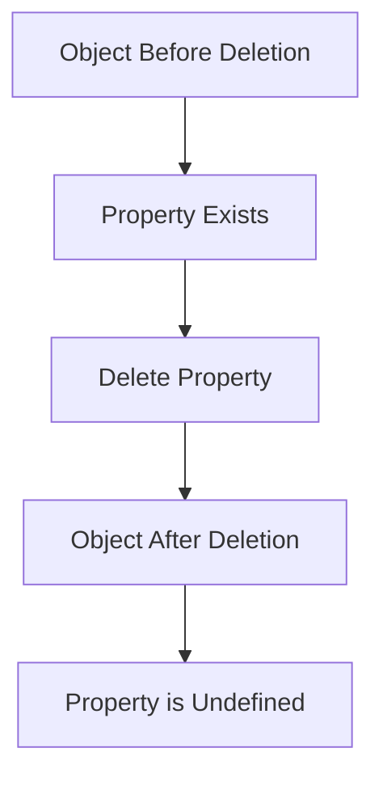

## 3.7 Deleting Properties

In this section, we will delve into the process of deleting properties from objects in JavaScript. Understanding how to manipulate object properties is crucial for effective programming, especially when working with dynamic data structures. Let's explore the syntax and effects of the `delete` operator, consider its implications, and examine alternatives to property deletion.

### Understanding the `delete` Operator

The `delete` operator is a built-in JavaScript operator used to remove properties from objects. Its primary function is to delete a property from an object, thereby freeing up memory and potentially altering the structure of the object.

#### Syntax of the `delete` Operator

The syntax for using the `delete` operator is straightforward:

```javascript
delete object.property;
```

or, using bracket notation:

```javascript
delete object['property'];
```

Both notations achieve the same result, allowing you to remove a specified property from an object.

#### Effect of Using the `delete` Operator

When you use the `delete` operator, it removes the specified property from the object. This means that the property no longer exists in the object, and any attempt to access it will return `undefined`.

**Example:**

```javascript
let car = {
    make: 'Toyota',
    model: 'Camry',
    year: 2020
};

// Deleting the 'model' property
delete car.model;

console.log(car); // Output: { make: 'Toyota', year: 2020 }
console.log(car.model); // Output: undefined
```

In this example, the `model` property is removed from the `car` object, and any subsequent access to `car.model` returns `undefined`.

### Implications of Deleting Properties

While the `delete` operator is useful, it's important to understand its implications, especially regarding performance and behavior in JavaScript.

#### Performance Considerations

1. **Memory Management**: Deleting properties can free up memory, which is beneficial when dealing with large objects or when properties are no longer needed.

2. **Performance Overhead**: The `delete` operator can be slower than setting a property to `undefined` or `null`. This is because `delete` changes the structure of the object, which can affect performance, especially in performance-critical applications.

3. **Optimization Impact**: JavaScript engines like V8 (used in Chrome and Node.js) optimize objects based on their structure. Deleting properties can de-optimize these objects, leading to slower execution times.

#### Behavioral Considerations

1. **Prototype Chain**: The `delete` operator only affects the object on which it is called. If a property is inherited from a prototype, `delete` will not remove it from the prototype chain.

2. **Non-configurable Properties**: Properties that are non-configurable cannot be deleted. Attempting to delete such properties will have no effect in non-strict mode and will throw an error in strict mode.

**Example:**

```javascript
'use strict';

let obj = Object.freeze({ name: 'John' });

// Attempting to delete a non-configurable property
delete obj.name; // Throws an error in strict mode
```

### Alternatives to Deleting Properties

In some cases, you might want to consider alternatives to using the `delete` operator, especially if performance is a concern or if you need to preserve the object's structure.

#### Setting Values to `undefined`

Instead of deleting a property, you can set its value to `undefined`. This approach retains the property in the object but indicates that it has no meaningful value.

**Example:**

```javascript
let book = {
    title: 'JavaScript Basics',
    author: 'Jane Doe'
};

// Setting the 'author' property to undefined
book.author = undefined;

console.log(book); // Output: { title: 'JavaScript Basics', author: undefined }
```

#### Setting Values to `null`

Similar to `undefined`, setting a property to `null` can indicate that the property is intentionally empty or reset.

**Example:**

```javascript
let user = {
    name: 'Alice',
    age: 30
};

// Setting the 'age' property to null
user.age = null;

console.log(user); // Output: { name: 'Alice', age: null }
```

### Visualizing Property Deletion

To better understand how property deletion affects an object, let's visualize the process using a simple diagram.



**Description:** This diagram illustrates the transition of an object before and after a property is deleted. Initially, the property exists in the object. After using the `delete` operator, the property is removed, and any access to it returns `undefined`.

### Practical Examples

Let's explore some practical examples to solidify our understanding of deleting properties in JavaScript.

#### Example 1: Deleting a Property from a Nested Object

Consider an object with nested properties. You can use the `delete` operator to remove a property from a nested object.

**Code Example:**

```javascript
let person = {
    name: 'Bob',
    address: {
        street: '123 Main St',
        city: 'Anytown'
    }
};

// Deleting the 'city' property from the nested 'address' object
delete person.address.city;

console.log(person);
// Output: { name: 'Bob', address: { street: '123 Main St' } }
```

#### Example 2: Attempting to Delete a Non-existent Property

If you try to delete a property that doesn't exist, the `delete` operator has no effect, and no error is thrown.

**Code Example:**

```javascript
let animal = {
    species: 'Dog',
    breed: 'Labrador'
};

// Attempting to delete a non-existent property
delete animal.color;

console.log(animal);
// Output: { species: 'Dog', breed: 'Labrador' }
```

### Try It Yourself

Now it's your turn! Try modifying the examples above by adding new properties and deleting them. Experiment with setting properties to `undefined` or `null` and observe the differences.

### Knowledge Check

Let's reinforce what we've learned with some questions:

1. What is the primary purpose of the `delete` operator in JavaScript?
2. How does the `delete` operator affect the prototype chain?
3. What are some alternatives to using the `delete` operator?
4. Why might setting a property to `undefined` be preferable to deleting it?

### Summary

In this section, we've explored the `delete` operator and its role in removing properties from JavaScript objects. We've discussed the syntax, implications, and alternatives to using `delete`. Remember, while `delete` is a powerful tool, it's important to consider performance and behavior when deciding how to manage object properties.

### References and Further Reading

- [MDN Web Docs: delete operator](https://developer.mozilla.org/en-US/docs/Web/JavaScript/Reference/Operators/delete)
- [JavaScript.info: Object properties configuration](https://javascript.info/property-descriptors)
- [W3Schools: JavaScript Objects](https://www.w3schools.com/js/js_objects.asp)

## Quiz Time!



### What is the primary purpose of the `delete` operator in JavaScript?

- [x] To remove a property from an object
- [ ] To add a new property to an object
- [ ] To modify the value of a property
- [ ] To copy properties from one object to another

> **Explanation:** The `delete` operator is specifically used to remove a property from an object, making it no longer accessible.

### What happens if you try to delete a non-existent property from an object?

- [x] Nothing happens, and no error is thrown
- [ ] An error is thrown
- [ ] The object is deleted
- [ ] The object becomes undefined

> **Explanation:** Attempting to delete a non-existent property does nothing and does not throw an error.

### How does the `delete` operator affect the prototype chain?

- [x] It only affects the object on which it is called
- [ ] It deletes properties from the prototype chain
- [ ] It modifies the prototype chain
- [ ] It adds properties to the prototype chain

> **Explanation:** The `delete` operator only affects the object on which it is called and does not affect the prototype chain.

### Which of the following is an alternative to deleting a property?

- [x] Setting the property value to `undefined`
- [ ] Using the `add` operator
- [ ] Using the `remove` operator
- [ ] Using the `clear` operator

> **Explanation:** Setting a property value to `undefined` is a common alternative to deleting it, as it retains the property in the object.

### What is a potential performance implication of using the `delete` operator?

- [x] It can de-optimize objects in JavaScript engines
- [ ] It speeds up the execution of the program
- [ ] It optimizes memory usage
- [ ] It has no impact on performance

> **Explanation:** Using the `delete` operator can de-optimize objects in JavaScript engines, potentially leading to slower execution times.

### What is the result of deleting a non-configurable property in strict mode?

- [x] An error is thrown
- [ ] The property is deleted
- [ ] The object is deleted
- [ ] Nothing happens

> **Explanation:** In strict mode, attempting to delete a non-configurable property will throw an error.

### Why might setting a property to `null` be preferable to deleting it?

- [x] To indicate that the property is intentionally empty
- [ ] To remove the property from the object
- [ ] To optimize the object's performance
- [ ] To add a new property

> **Explanation:** Setting a property to `null` can indicate that the property is intentionally empty, while retaining the property in the object.

### What does the `delete` operator return when it successfully deletes a property?

- [x] `true`
- [ ] `false`
- [ ] `undefined`
- [ ] `null`

> **Explanation:** The `delete` operator returns `true` when it successfully deletes a property.

### Can the `delete` operator be used on variables?

- [ ] Yes, it can delete variables
- [x] No, it cannot delete variables
- [ ] Yes, but only in strict mode
- [ ] No, but it can delete functions

> **Explanation:** The `delete` operator cannot be used to delete variables; it is only used for object properties.

### True or False: The `delete` operator can remove properties from arrays.

- [x] True
- [ ] False

> **Explanation:** The `delete` operator can be used to remove elements from arrays, but it leaves an empty slot, which may not be ideal for array manipulation.



Remember, this is just the beginning. As you progress, you'll build more complex and interactive web pages. Keep experimenting, stay curious, and enjoy the journey!
