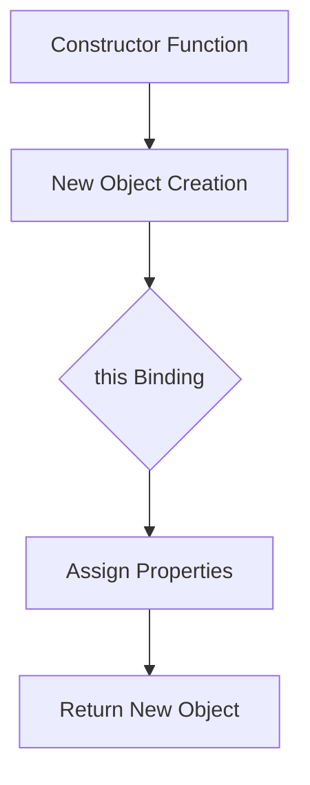

## 4.1 Introduction to Constructor Functions

In the world of JavaScript, creating and manipulating objects is a fundamental skill. One of the most powerful ways to create objects is through constructor functions. In this section, we will explore what constructor functions are, how they work, and why they are essential in object-oriented programming (OOP) in JavaScript. We'll also compare them with object literals and delve into the role of the `this` keyword within constructors.

### What are Constructor Functions?

Constructor functions are special functions in JavaScript used to create and initialize objects. Unlike regular functions, constructor functions are designed to be called with the `new` keyword, which sets up the new object and binds `this` to it. This allows you to create multiple instances of an object with shared properties and methods.

#### Naming Conventions

In JavaScript, constructor functions follow a specific naming convention. By convention, constructor function names start with an uppercase letter. This helps distinguish them from regular functions and indicates that they are intended to be used with the `new` keyword.

```javascript
// Constructor function for a Car object
function Car(make, model, year) {
    this.make = make;
    this.model = model;
    this.year = year;
}
```

### Defining a Constructor Function

To define a constructor function, you simply create a regular function with parameters that represent the properties of the object you want to create. Inside the function, use the `this` keyword to assign values to the object's properties.

```javascript
// Example of a constructor function
function Person(name, age) {
    this.name = name;
    this.age = age;
}

// Creating an instance of Person
const person1 = new Person('Alice', 30);
console.log(person1.name); // Output: Alice
console.log(person1.age);  // Output: 30
```

### Creating Instances with 'new'

The `new` keyword is crucial when using constructor functions. It performs several tasks:

1. **Creates a new empty object**.
2. **Sets the prototype of the new object** to the constructor's prototype.
3. **Binds `this` to the new object** within the constructor function.
4. **Returns the new object** unless the constructor explicitly returns a different object.

```javascript
// Using the 'new' keyword to create an instance
const car1 = new Car('Toyota', 'Corolla', 2020);
console.log(car1.make);  // Output: Toyota
console.log(car1.model); // Output: Corolla
console.log(car1.year);  // Output: 2020
```

### The Role of 'this' in Constructors

In the context of a constructor function, `this` refers to the newly created object. This is what allows you to set properties on the object that is being constructed.

```javascript
function Book(title, author) {
    this.title = title;
    this.author = author;
}

const book1 = new Book('1984', 'George Orwell');
console.log(book1.title);  // Output: 1984
console.log(book1.author); // Output: George Orwell
```

### Comparing Object Literals and Constructor Functions

Object literals are a straightforward way to create a single object, but they lack the ability to create multiple instances with shared properties and methods. Constructor functions, on the other hand, provide a blueprint for creating multiple objects with the same structure.

#### Object Literals

```javascript
// Creating an object using an object literal
const dog = {
    breed: 'Labrador',
    age: 5
};

console.log(dog.breed); // Output: Labrador
console.log(dog.age);   // Output: 5
```

#### Constructor Functions

```javascript
// Constructor function for creating multiple dog objects
function Dog(breed, age) {
    this.breed = breed;
    this.age = age;
}

const dog1 = new Dog('Labrador', 5);
const dog2 = new Dog('Beagle', 3);

console.log(dog1.breed); // Output: Labrador
console.log(dog2.breed); // Output: Beagle
```

### Advantages of Constructor Functions

1. **Reusability**: Constructor functions allow you to create multiple instances of an object with the same properties and methods.
2. **Encapsulation**: They help encapsulate data and behavior within objects.
3. **Prototypal Inheritance**: Constructor functions can be used with prototypes to share methods across instances.

### Visualizing Constructor Functions

Let's use a diagram to visualize how constructor functions work in JavaScript.



**Diagram Description**: This flowchart illustrates the process of using a constructor function to create a new object. The constructor function is called, a new object is created, `this` is bound to the new object, properties are assigned, and finally, the new object is returned.

### Try It Yourself

Now that we've covered the basics, let's try modifying a constructor function to add a method.

```javascript
function Animal(name, species) {
    this.name = name;
    this.species = species;
    this.describe = function() {
        return `${this.name} is a ${this.species}.`;
    };
}

const animal1 = new Animal('Leo', 'Lion');
console.log(animal1.describe()); // Output: Leo is a Lion.
```

**Challenge**: Modify the `Animal` constructor function to include a method that returns the animal's name in uppercase.

### Knowledge Check

- What is the purpose of the `new` keyword in constructor functions?
- How does `this` behave differently in a constructor function compared to a regular function?
- What are the advantages of using constructor functions over object literals?

### Summary

Constructor functions are a powerful feature in JavaScript that enable the creation of multiple object instances with shared properties and methods. By using the `new` keyword, we can leverage the `this` keyword to bind properties to new objects. Understanding constructor functions is a crucial step in mastering object-oriented programming in JavaScript.

Remember, this is just the beginning. As you progress, you'll build more complex and interactive web pages. Keep experimenting, stay curious, and enjoy the journey!

## Quiz Time!



### What is the primary purpose of a constructor function in JavaScript?

- [x] To create and initialize objects
- [ ] To perform arithmetic operations
- [ ] To handle events
- [ ] To manage asynchronous tasks

> **Explanation:** Constructor functions are used to create and initialize objects in JavaScript, providing a blueprint for creating multiple instances with shared properties and methods.

### Which keyword is used to create an instance of an object using a constructor function?

- [x] new
- [ ] create
- [ ] instance
- [ ] object

> **Explanation:** The `new` keyword is used to create an instance of an object using a constructor function. It sets up the new object and binds `this` to it.

### What does the `this` keyword refer to within a constructor function?

- [x] The newly created object
- [ ] The global object
- [ ] The function itself
- [ ] The parent object

> **Explanation:** Within a constructor function, the `this` keyword refers to the newly created object, allowing properties to be assigned to it.

### How do constructor functions differ from object literals?

- [x] Constructor functions allow for creating multiple instances with shared properties
- [ ] Constructor functions are used for creating a single object
- [ ] Object literals can create multiple instances
- [ ] Object literals use the `new` keyword

> **Explanation:** Constructor functions provide a blueprint for creating multiple instances with shared properties and methods, unlike object literals which are used for creating a single object.

### What naming convention is typically used for constructor functions?

- [x] Start with an uppercase letter
- [ ] Use all lowercase letters
- [ ] Use underscores
- [ ] Start with a number

> **Explanation:** Constructor functions typically start with an uppercase letter to distinguish them from regular functions and indicate their intended use with the `new` keyword.

### What happens if you forget to use the `new` keyword with a constructor function?

- [x] The function will not create a new object
- [ ] The function will create a new object
- [ ] The function will throw an error
- [ ] The function will return `undefined`

> **Explanation:** If you forget to use the `new` keyword, the function will not create a new object and `this` will not be bound to a new instance.

### Which of the following is a benefit of using constructor functions?

- [x] Reusability of code
- [ ] Increased memory usage
- [ ] Slower execution
- [ ] Limited to a single instance

> **Explanation:** Constructor functions allow for the reusability of code by providing a blueprint for creating multiple instances with shared properties and methods.

### How can you add a method to a constructor function?

- [x] By defining a function within the constructor
- [ ] By using the `addMethod` keyword
- [ ] By using the `function` keyword outside the constructor
- [ ] By using the `method` keyword

> **Explanation:** You can add a method to a constructor function by defining a function within the constructor itself, using `this` to bind it to the new object.

### What is the result of calling a constructor function without the `new` keyword?

- [x] The global object may be modified
- [ ] A new object is always created
- [ ] An error is thrown
- [ ] The function returns `null`

> **Explanation:** Calling a constructor function without the `new` keyword may result in modifying the global object, as `this` will not be bound to a new instance.

### True or False: Constructor functions can only be used to create objects with properties, not methods.

- [ ] True
- [x] False

> **Explanation:** False. Constructor functions can be used to create objects with both properties and methods, allowing for more complex and reusable object structures.


