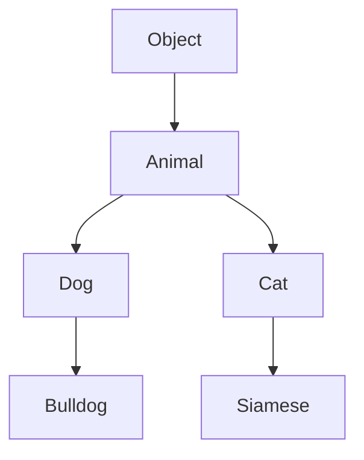

## 4.10 Pitfalls of Prototypal Inheritance

In the world of JavaScript, prototypal inheritance is a powerful feature that allows objects to inherit properties and methods from other objects. However, like any powerful tool, it comes with its own set of challenges and pitfalls. Understanding these pitfalls is crucial for writing robust and maintainable code. In this section, we'll explore some common issues associated with prototypal inheritance and provide strategies to mitigate them.

### Understanding Prototypal Inheritance

Before diving into the pitfalls, let's briefly revisit what prototypal inheritance is. In JavaScript, every object has a prototype, which is another object from which it inherits properties and methods. This prototype chain allows for property and method sharing across objects, enabling a form of inheritance.

Here's a simple example to illustrate prototypal inheritance:

```javascript
// Define a prototype object
const animal = {
  eat: function() {
    console.log("Eating...");
  }
};

// Create a new object that inherits from animal
const dog = Object.create(animal);
dog.bark = function() {
  console.log("Woof!");
};

// dog can access both its own method and the inherited method
dog.bark(); // Output: Woof!
dog.eat();  // Output: Eating...
```

In this example, `dog` inherits the `eat` method from `animal`. This is the essence of prototypal inheritance.

### Pitfall 1: Shared Mutable State

One of the most common pitfalls of prototypal inheritance is the shared mutable state. When objects share a prototype, they also share any properties defined on that prototype. If these properties are mutable, changes made by one object can affect all other objects that inherit from the same prototype.

#### Example of Shared Mutable State

Consider the following example:

```javascript
// Define a prototype with a mutable property
const vehicle = {
  wheels: 4
};

// Create two objects inheriting from vehicle
const car = Object.create(vehicle);
const bike = Object.create(vehicle);

// Modify the wheels property on the car object
car.wheels = 2;

console.log(car.wheels); // Output: 2
console.log(bike.wheels); // Output: 4
```

In this case, `car` and `bike` have their own `wheels` property because we assigned a new value to `car.wheels`. However, if we had modified an object or array property on the prototype, both objects would reflect that change.

#### Mitigating Shared Mutable State

To avoid shared mutable state, ensure that mutable properties are defined directly on the instances rather than on the prototype. Use constructor functions or classes to initialize instance-specific properties.

```javascript
function Vehicle(wheels) {
  this.wheels = wheels;
}

const car = new Vehicle(4);
const bike = new Vehicle(2);

console.log(car.wheels); // Output: 4
console.log(bike.wheels); // Output: 2
```

### Pitfall 2: Inherited Properties Being Modified

Another pitfall is the accidental modification of inherited properties. When an object inherits properties from its prototype, it can inadvertently modify those properties, leading to unexpected behavior.

#### Example of Inherited Properties Being Modified

```javascript
const gadget = {
  power: "off"
};

const phone = Object.create(gadget);

// Accidentally modify the inherited property
phone.power = "on";

console.log(phone.power); // Output: on
console.log(gadget.power); // Output: off
```

In this example, `phone` modifies its own `power` property, but the prototype's `power` property remains unchanged. This can lead to confusion if not handled carefully.

#### Mitigating Inherited Property Modifications

To prevent accidental modifications, always check if a property exists directly on the object before modifying it. Use `hasOwnProperty` to distinguish between own properties and inherited properties.

```javascript
if (phone.hasOwnProperty('power')) {
  phone.power = "on";
} else {
  console.log("Cannot modify inherited property directly.");
}
```

### Pitfall 3: Complexity in Debugging

Prototypal inheritance can introduce complexity when debugging. The inheritance hierarchy can make it difficult to trace where a particular property or method is being accessed or modified.

#### Example of Debugging Complexity

Consider a scenario where multiple objects inherit from a common prototype, and a bug arises due to a shared method:

```javascript
const appliance = {
  status: "off",
  toggleStatus: function() {
    this.status = this.status === "off" ? "on" : "off";
  }
};

const fan = Object.create(appliance);
const light = Object.create(appliance);

fan.toggleStatus();
console.log(fan.status); // Output: on
console.log(light.status); // Output: off
```

If a bug occurs in the `toggleStatus` method, it can be challenging to determine which object or prototype is causing the issue.

#### Mitigating Debugging Complexity

To simplify debugging, keep the inheritance hierarchy shallow and well-documented. Use meaningful names for prototypes and methods to make the code more readable. Additionally, leverage modern JavaScript tools like debuggers and linters to trace issues effectively.

### Pitfall 4: Performance Overhead

Prototypal inheritance can introduce performance overhead, especially in deep inheritance chains. Each time a property or method is accessed, JavaScript must traverse the prototype chain to find it, which can impact performance.

#### Example of Performance Overhead

```javascript
const base = {
  method: function() {
    console.log("Base method");
  }
};

const derived1 = Object.create(base);
const derived2 = Object.create(derived1);
const derived3 = Object.create(derived2);

derived3.method(); // Output: Base method
```

In this example, accessing `method` on `derived3` requires traversing three levels of the prototype chain, which can be inefficient in large applications.

#### Mitigating Performance Overhead

To mitigate performance overhead, minimize the depth of the prototype chain. Consider using composition over inheritance, where objects are composed of smaller, reusable components rather than relying on deep inheritance hierarchies.

### Pitfall 5: Lack of Encapsulation

Prototypal inheritance can lead to a lack of encapsulation, where internal implementation details are exposed to inheriting objects. This can result in tight coupling and reduced flexibility.

#### Example of Lack of Encapsulation

```javascript
const device = {
  _status: "off",
  toggle: function() {
    this._status = this._status === "off" ? "on" : "off";
  }
};

const tablet = Object.create(device);
console.log(tablet._status); // Output: off
```

In this example, the `_status` property is exposed to inheriting objects, violating encapsulation principles.

#### Mitigating Lack of Encapsulation

To achieve better encapsulation, use closures or ES6 classes with private fields to hide internal implementation details. This ensures that only intended methods and properties are accessible.

```javascript
class Device {
  #status = "off";

  toggle() {
    this.#status = this.#status === "off" ? "on" : "off";
  }

  getStatus() {
    return this.#status;
  }
}

const tablet = new Device();
console.log(tablet.getStatus()); // Output: off
```

### Visualizing the Prototype Chain

To better understand how prototypal inheritance works, let's visualize the prototype chain using a diagram. This will help illustrate how objects are linked through their prototypes.



In this diagram, `Animal` is the prototype for both `Dog` and `Cat`, and `Dog` further serves as a prototype for `Bulldog`. This hierarchy illustrates how objects are connected through their prototypes.

### Try It Yourself

To solidify your understanding of prototypal inheritance and its pitfalls, try modifying the code examples provided in this section. Experiment with creating new objects, modifying properties, and observing how changes affect the prototype chain. Consider the following challenges:

1. Create a new object that inherits from `gadget` and add a unique method to it.
2. Modify the `toggleStatus` method to include a logging feature that tracks each status change.
3. Refactor the `vehicle` example to use ES6 classes and private fields for better encapsulation.

### References and Further Reading

For more information on prototypal inheritance and JavaScript's object model, consider exploring the following resources:

- [MDN Web Docs: Inheritance and the prototype chain](https://developer.mozilla.org/en-US/docs/Web/JavaScript/Inheritance_and_the_prototype_chain)
- [JavaScript.info: Prototypal inheritance](https://javascript.info/prototype-inheritance)
- [W3Schools: JavaScript Object Prototypes](https://www.w3schools.com/js/js_object_prototypes.asp)

### Knowledge Check

To reinforce your understanding of the pitfalls of prototypal inheritance, consider the following questions:

- What is a shared mutable state, and how can it affect objects inheriting from the same prototype?
- How can you prevent accidental modifications of inherited properties?
- What strategies can you use to simplify debugging in a prototypal inheritance hierarchy?
- Why might deep prototype chains lead to performance issues?
- How can you achieve better encapsulation when using prototypal inheritance?

### Embrace the Journey

Remember, mastering prototypal inheritance is a journey. As you continue to explore JavaScript's object model, you'll gain a deeper understanding of how to leverage inheritance effectively while avoiding common pitfalls. Keep experimenting, stay curious, and enjoy the process of learning and growing as a developer!

## Quiz Time!



### What is a shared mutable state in prototypal inheritance?

- [x] A state where changes to a prototype's property affect all inheriting objects.
- [ ] A state where each object has its own copy of the prototype's properties.
- [ ] A state where objects cannot modify inherited properties.
- [ ] A state where prototypes are immutable.

> **Explanation:** Shared mutable state occurs when objects share a prototype with mutable properties, leading to changes affecting all inheriting objects.

### How can you prevent accidental modifications of inherited properties?

- [x] Use `hasOwnProperty` to check if a property exists directly on the object.
- [ ] Always modify properties on the prototype.
- [ ] Use deep inheritance chains.
- [ ] Avoid using prototypes altogether.

> **Explanation:** Using `hasOwnProperty` ensures that modifications are made only to properties that exist directly on the object, preventing accidental changes to inherited properties.

### What is a common issue with deep prototype chains?

- [x] Performance overhead due to traversing multiple levels.
- [ ] Increased encapsulation of properties.
- [ ] Simplified debugging process.
- [ ] Enhanced readability of code.

> **Explanation:** Deep prototype chains can lead to performance overhead because accessing properties requires traversing multiple levels in the chain.

### How can you achieve better encapsulation in prototypal inheritance?

- [x] Use closures or ES6 classes with private fields.
- [ ] Expose all properties to inheriting objects.
- [ ] Use only public methods and properties.
- [ ] Avoid using classes altogether.

> **Explanation:** Closures and ES6 classes with private fields help hide internal implementation details, achieving better encapsulation.

### Why is debugging more complex in prototypal inheritance?

- [x] The inheritance hierarchy makes it difficult to trace property access.
- [ ] Prototypes automatically log all method calls.
- [ ] Inherited properties are always immutable.
- [ ] Objects in the chain cannot have their own methods.

> **Explanation:** The inheritance hierarchy can obscure where properties and methods are accessed or modified, complicating the debugging process.

### What is a strategy to mitigate shared mutable state?

- [x] Define mutable properties directly on instances.
- [ ] Use deep inheritance chains.
- [ ] Share all properties across prototypes.
- [ ] Avoid using constructor functions.

> **Explanation:** Defining mutable properties directly on instances prevents changes from affecting all objects inheriting from the same prototype.

### How can you simplify debugging in a prototypal inheritance hierarchy?

- [x] Keep the hierarchy shallow and well-documented.
- [ ] Use deep inheritance chains for all objects.
- [ ] Avoid using meaningful names for prototypes.
- [ ] Rely solely on console logs.

> **Explanation:** A shallow, well-documented hierarchy with meaningful names helps simplify the debugging process.

### What is a potential downside of using prototypal inheritance?

- [x] Lack of encapsulation.
- [ ] Automatic property encapsulation.
- [ ] Simplified code structure.
- [ ] Enhanced performance.

> **Explanation:** Prototypal inheritance can lead to a lack of encapsulation, exposing internal implementation details to inheriting objects.

### How can you mitigate performance overhead in prototypal inheritance?

- [x] Minimize the depth of the prototype chain.
- [ ] Use deep inheritance chains for all objects.
- [ ] Avoid using composition.
- [ ] Rely solely on prototype methods.

> **Explanation:** Minimizing the depth of the prototype chain reduces the performance overhead associated with traversing multiple levels.

### Prototypal inheritance can lead to tight coupling between objects.

- [x] True
- [ ] False

> **Explanation:** Prototypal inheritance can lead to tight coupling because inheriting objects may depend on the internal implementation details of their prototypes.


