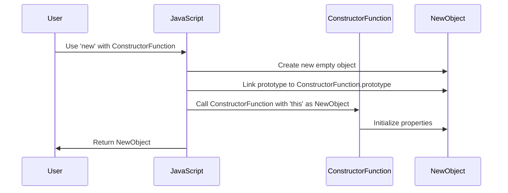

## 4.2 The Role of the 'new' Operator

In the world of JavaScript, understanding how objects are created and managed is crucial for mastering object-oriented programming (OOP). One of the key players in this process is the `new` operator. In this section, we will delve into the role of the `new` operator, how it works, and why it is essential when working with constructor functions.

### What is the 'new' Operator?

The `new` operator in JavaScript is used to create an instance of a user-defined object type or one of the built-in object types that has a constructor function. When you use the `new` operator, it performs several important tasks that are crucial for setting up the new object correctly.

### Steps Involved When Using 'new'

Let's break down the steps that occur when the `new` operator is used:

1. **Creating a New Object**: The `new` operator creates a new, empty object. This object is an instance of the constructor function's prototype.

2. **Setting the Prototype**: The newly created object is linked to the constructor function's prototype. This means that the object inherits properties and methods from the constructor's prototype.

3. **Binding 'this'**: Within the constructor function, the `this` keyword is bound to the new object. This allows the constructor to initialize properties on the new object.

4. **Executing the Constructor**: The constructor function is executed with the `this` context set to the new object. This is where the initial properties and methods are defined.

5. **Returning the Object**: By default, the `new` operator returns the newly created object. If the constructor explicitly returns an object, that object is returned instead.

### Example of Using 'new'

Let's look at an example to see how the `new` operator works in practice:

```javascript
// Define a constructor function
function Car(make, model) {
  this.make = make;
  this.model = model;
  this.displayInfo = function() {
    console.log(`Car: ${this.make} ${this.model}`);
  };
}

// Create a new instance of Car using 'new'
const myCar = new Car('Toyota', 'Corolla');

// Access properties and methods
console.log(myCar.make); // Output: Toyota
console.log(myCar.model); // Output: Corolla
myCar.displayInfo(); // Output: Car: Toyota Corolla
```

In this example, the `Car` constructor function is used to create a new car object. The `new` operator ensures that the `this` keyword within the `Car` function refers to the new object being created.

### What Happens If 'new' is Omitted?

Omitting the `new` operator when calling a constructor function can lead to unexpected results. Without `new`, the `this` keyword inside the constructor function will not refer to a new object. Instead, it will refer to the global object (in non-strict mode) or be `undefined` (in strict mode). This can lead to errors or unintended behavior.

#### Example Without 'new'

```javascript
// Call the constructor function without 'new'
const anotherCar = Car('Honda', 'Civic');

console.log(anotherCar); // Output: undefined
console.log(window.make); // Output: Honda (in non-strict mode)
```

In the example above, calling `Car` without `new` does not create a new object. Instead, it assigns the properties `make` and `model` to the global object, which is not the intended behavior.

### Importance of Using 'new' with Constructors

Using the `new` operator with constructors is essential for several reasons:

- **Correct Initialization**: It ensures that the new object is correctly initialized with the properties and methods defined in the constructor.
- **Prototype Linking**: It links the new object to the constructor's prototype, allowing for inheritance of methods and properties.
- **Avoiding Global Pollution**: It prevents accidental assignment of properties to the global object, which can lead to hard-to-debug issues.

### Visualizing the 'new' Operator

To better understand how the `new` operator works, let's visualize the process using a diagram:



This diagram illustrates the sequence of actions that occur when the `new` operator is used with a constructor function.

### Try It Yourself

Now that we've covered the basics, it's time to experiment. Try modifying the `Car` constructor function to include additional properties or methods. Create multiple instances and observe how they behave. This hands-on practice will reinforce your understanding of the `new` operator.

### Common Mistakes and How to Avoid Them

1. **Forgetting 'new'**: Always remember to use `new` when calling a constructor function. This is a common mistake that can lead to unexpected results.

2. **Constructor Function Naming**: By convention, constructor functions should start with an uppercase letter. This helps distinguish them from regular functions and reminds you to use `new`.

3. **Returning Objects Explicitly**: If a constructor function returns an object explicitly, that object will be returned instead of the newly created instance. Be cautious when returning objects from constructors.

### Knowledge Check

Let's pause and check your understanding with a few questions:

- What are the steps involved when using the `new` operator?
- What happens if you omit `new` when calling a constructor function?
- Why is it important to use `new` with constructors?

### Further Reading

For more information on the `new` operator and constructor functions, consider exploring the following resources:

- [MDN Web Docs: new Operator](https://developer.mozilla.org/en-US/docs/Web/JavaScript/Reference/Operators/new)
- [JavaScript.info: Constructors and 'new'](https://javascript.info/constructor-new)

### Summary

In this section, we've explored the role of the `new` operator in JavaScript. We've seen how it initializes new objects, links prototypes, and ensures correct property assignment. Understanding the `new` operator is fundamental to mastering object-oriented programming in JavaScript. As you continue your journey, remember to experiment, ask questions, and build on the concepts you've learned.

## Quiz Time!



### What does the 'new' operator do in JavaScript?

- [x] Creates a new object and links it to the constructor's prototype
- [ ] Deletes an existing object
- [ ] Modifies the global object
- [ ] Changes the data type of a variable

> **Explanation:** The 'new' operator creates a new object and links it to the constructor's prototype, allowing for inheritance of methods and properties.

### What happens if you omit 'new' when calling a constructor function?

- [x] The 'this' keyword refers to the global object in non-strict mode
- [ ] A new object is still created
- [ ] The constructor function is not executed
- [ ] The function returns undefined

> **Explanation:** Omitting 'new' causes 'this' to refer to the global object in non-strict mode, leading to unintended behavior.

### Why is it important to use 'new' with constructors?

- [x] It ensures correct initialization of objects
- [ ] It allows functions to return strings
- [ ] It changes the function's execution context
- [ ] It prevents the creation of new objects

> **Explanation:** Using 'new' ensures that objects are correctly initialized and linked to the constructor's prototype.

### What is the result of calling a constructor function without 'new' in strict mode?

- [x] 'this' is undefined
- [ ] A new object is created
- [ ] The global object is modified
- [ ] The function throws an error

> **Explanation:** In strict mode, 'this' is undefined when 'new' is omitted, which can lead to errors.

### What is the default return value of a constructor function when using 'new'?

- [x] The newly created object
- [ ] undefined
- [ ] The global object
- [ ] A string

> **Explanation:** By default, a constructor function returns the newly created object when called with 'new'.

### What is the purpose of linking a new object to a constructor's prototype?

- [x] To allow inheritance of properties and methods
- [ ] To delete existing properties
- [ ] To change the object's data type
- [ ] To modify the global object

> **Explanation:** Linking a new object to a constructor's prototype allows it to inherit properties and methods.

### How can you prevent accidental assignment of properties to the global object?

- [x] Use 'new' when calling constructor functions
- [ ] Use 'delete' operator
- [ ] Avoid using functions
- [ ] Use global variables

> **Explanation:** Using 'new' prevents properties from being accidentally assigned to the global object.

### What is a common convention for naming constructor functions?

- [x] Start with an uppercase letter
- [ ] Use all lowercase letters
- [ ] Use numbers
- [ ] Start with a special character

> **Explanation:** Constructor functions typically start with an uppercase letter to distinguish them from regular functions.

### What happens if a constructor function explicitly returns an object?

- [x] The returned object becomes the result of the 'new' expression
- [ ] The newly created object is returned
- [ ] The function throws an error
- [ ] The global object is modified

> **Explanation:** If a constructor function explicitly returns an object, that object is returned instead of the newly created instance.

### True or False: The 'new' operator is optional when creating objects with constructor functions.

- [ ] True
- [x] False

> **Explanation:** The 'new' operator is essential for correctly creating objects with constructor functions.



Remember, this is just the beginning. As you progress, you'll build more complex and interactive applications using JavaScript's powerful object-oriented features. Keep experimenting, stay curious, and enjoy the journey!
