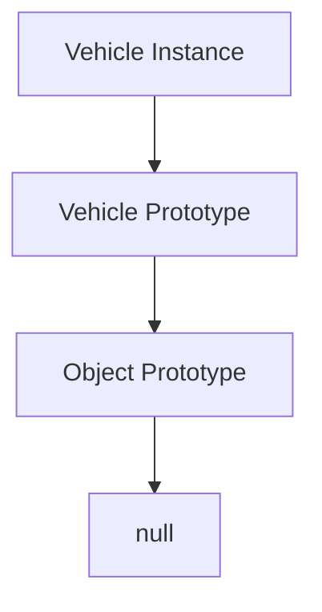

## 4.3 Adding Methods to Constructors

In this section, we delve into the concept of adding methods to constructors in JavaScript using prototypes. This is a fundamental aspect of object-oriented programming (OOP) in JavaScript that enhances memory efficiency and provides a structured way to share methods across instances. By the end of this guide, you'll understand why methods should be added to the prototype property, how to do it, and the benefits it brings.

### Understanding the Need for Prototypes

When we create objects in JavaScript using constructor functions, we often want to define methods that can be shared across all instances of that object. If we were to define these methods directly within the constructor, each instance would have its own copy of the method. This can lead to inefficient memory usage, especially when dealing with a large number of instances.

#### Why Use Prototypes?

- **Memory Efficiency**: By adding methods to the prototype, all instances share the same method, which is stored once in memory.
- **Consistency**: Changes to the method in the prototype are reflected across all instances.
- **Performance**: Reduces the overhead of creating multiple copies of the same method for each instance.

### Adding Methods to a Constructor's Prototype

Let's explore how to add methods to a constructor's prototype with a simple example.

```javascript
// Define a constructor function
function Person(name, age) {
  this.name = name;
  this.age = age;
}

// Add a method to the prototype
Person.prototype.greet = function() {
  console.log(`Hello, my name is ${this.name} and I am ${this.age} years old.`);
};

// Create instances
const alice = new Person('Alice', 30);
const bob = new Person('Bob', 25);

// Call the method
alice.greet(); // Output: Hello, my name is Alice and I am 30 years old.
bob.greet(); // Output: Hello, my name is Bob and I am 25 years old.
```

In this example, the `greet` method is added to the `Person` constructor's prototype. This means every instance of `Person` can access the `greet` method, but it is stored only once in memory.

### Memory Efficiency with Prototypes

To understand the memory efficiency gained by using prototypes, let's compare instance methods with prototype methods.

#### Instance Methods

If we define methods inside the constructor, each instance will have its own copy of the method.

```javascript
function Animal(type) {
  this.type = type;
  this.describe = function() {
    console.log(`This is a ${this.type}.`);
  };
}

const cat = new Animal('Cat');
const dog = new Animal('Dog');

console.log(cat.describe === dog.describe); // Output: false
```

In this case, `cat` and `dog` each have their own `describe` method, leading to redundant copies in memory.

#### Prototype Methods

By moving the method to the prototype, we ensure that all instances share the same method.

```javascript
function Vehicle(make) {
  this.make = make;
}

Vehicle.prototype.describe = function() {
  console.log(`This vehicle is a ${this.make}.`);
};

const car = new Vehicle('Toyota');
const bike = new Vehicle('Honda');

console.log(car.describe === bike.describe); // Output: true
```

Here, `car` and `bike` share the same `describe` method, which is more memory-efficient.

### Visualizing the Prototype Chain

To better understand how prototypes work, let's visualize the prototype chain.



In this diagram, each `Vehicle` instance points to the `Vehicle` prototype, which in turn points to the `Object` prototype. This chain allows instances to access methods defined in their constructor's prototype.

### Key Differences: Instance Methods vs. Prototype Methods

- **Instance Methods**: Defined inside the constructor, each instance gets its own copy. Suitable for methods that need to maintain state specific to an instance.
- **Prototype Methods**: Defined on the constructor's prototype, shared across all instances. Ideal for methods that do not need to maintain unique state.

### Try It Yourself

Experiment with the following code by adding a new method to the prototype and testing it with different instances.

```javascript
function Book(title, author) {
  this.title = title;
  this.author = author;
}

// Add a method to the prototype
Book.prototype.getSummary = function() {
  return `${this.title} by ${this.author}`;
};

// Create instances
const book1 = new Book('1984', 'George Orwell');
const book2 = new Book('Brave New World', 'Aldous Huxley');

// Test the method
console.log(book1.getSummary()); // Output: 1984 by George Orwell
console.log(book2.getSummary()); // Output: Brave New World by Aldous Huxley
```

**Challenge**: Try adding another method to the `Book` prototype that returns a string indicating whether the book is a classic (e.g., published before 1950).

### References and Further Reading

- [MDN Web Docs: Prototypes](https://developer.mozilla.org/en-US/docs/Web/JavaScript/Inheritance_and_the_prototype_chain)
- [W3Schools: JavaScript Prototypes](https://www.w3schools.com/js/js_object_prototypes.asp)

### Knowledge Check

- What is the main advantage of using prototype methods over instance methods?
- How does the prototype chain work in JavaScript?

### Embrace the Journey

Remember, understanding prototypes is a crucial step in mastering JavaScript's object-oriented capabilities. As you continue to explore, you'll find that prototypes offer a powerful way to manage shared behavior across instances. Keep experimenting, stay curious, and enjoy the journey!

## Quiz Time!



### What is the primary benefit of adding methods to a constructor's prototype?

- [x] Memory efficiency
- [ ] Faster execution
- [ ] Easier debugging
- [ ] More readable code

> **Explanation:** Adding methods to a constructor's prototype allows all instances to share the same method, reducing memory usage.

### How do you add a method to a constructor's prototype?

- [x] Using the constructor's prototype property
- [ ] Directly inside the constructor function
- [ ] By creating a new object
- [ ] Using the `new` keyword

> **Explanation:** Methods are added to a constructor's prototype by assigning them to the constructor's `prototype` property.

### What happens when you define a method inside a constructor function?

- [ ] It becomes a prototype method
- [x] Each instance gets its own copy
- [ ] It is shared across all instances
- [ ] It cannot be accessed by instances

> **Explanation:** Methods defined inside a constructor function are copied to each instance, leading to redundant memory usage.

### Which of the following is true about prototype methods?

- [x] They are shared across all instances
- [ ] They are unique to each instance
- [ ] They cannot access instance properties
- [ ] They are stored in the global scope

> **Explanation:** Prototype methods are shared across all instances, making them memory-efficient.

### What is the prototype chain?

- [x] A series of links between objects and their prototypes
- [ ] A method for creating objects
- [ ] A way to define instance properties
- [ ] A debugging tool

> **Explanation:** The prototype chain is the series of links between an object and its prototype, allowing access to shared methods.

### How can you visualize the prototype chain?

- [x] Using diagrams like Mermaid.js
- [ ] By printing objects to the console
- [ ] With a debugger
- [ ] By reading the source code

> **Explanation:** Diagrams like Mermaid.js can help visualize the prototype chain and understand object relationships.

### What is the result of `console.log(car.describe === bike.describe);` if `describe` is a prototype method?

- [x] true
- [ ] false
- [ ] undefined
- [ ] null

> **Explanation:** If `describe` is a prototype method, both `car` and `bike` share the same method, resulting in `true`.

### What is a key difference between instance methods and prototype methods?

- [x] Instance methods are unique to each instance, while prototype methods are shared.
- [ ] Prototype methods are faster.
- [ ] Instance methods are easier to write.
- [ ] Prototype methods cannot access `this`.

> **Explanation:** Instance methods are unique to each instance, while prototype methods are shared across all instances.

### Why might you choose to use an instance method over a prototype method?

- [x] When the method needs to maintain state specific to an instance
- [ ] For better memory efficiency
- [ ] To make the code more readable
- [ ] To speed up execution

> **Explanation:** Instance methods are suitable when the method needs to maintain state specific to an instance.

### True or False: Prototype methods are stored once in memory and shared across all instances.

- [x] True
- [ ] False

> **Explanation:** Prototype methods are stored once in memory, making them efficient and shared across all instances.




