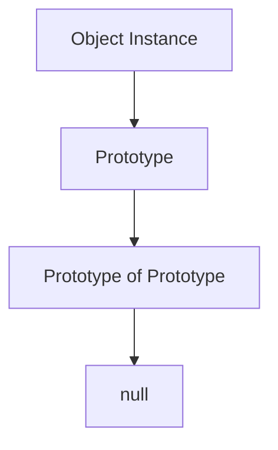
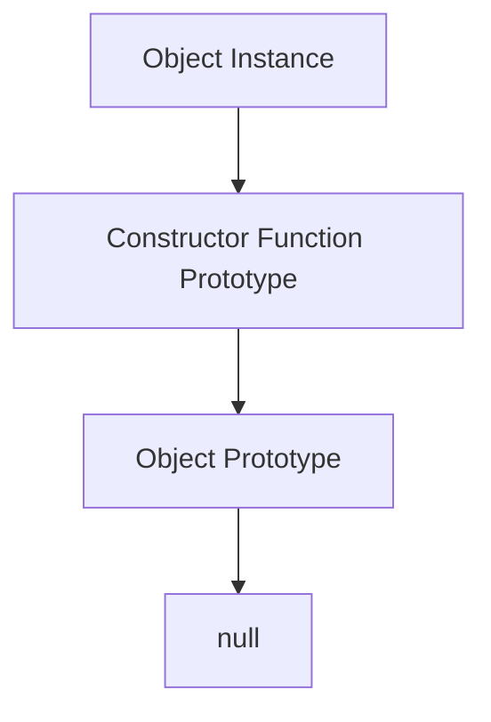

## 4.4 Understanding Prototypes

Welcome to the fascinating world of prototypes in JavaScript! In this section, we will unravel the mystery behind prototypes, a fundamental concept that powers inheritance in JavaScript. Understanding prototypes is essential for mastering object-oriented programming in JavaScript, as they form the backbone of how objects inherit properties and methods.

### What is a Prototype?

In JavaScript, every object has a prototype. A prototype is a special object that other objects can inherit properties and methods from. Think of it as a blueprint or a template that provides default properties and methods to objects. When an object is created, it automatically links to a prototype, allowing it to access the properties and methods defined in that prototype.

#### The Role of Prototypes in JavaScript Inheritance

Prototypes play a crucial role in JavaScript's inheritance model. Unlike classical inheritance found in languages like Java or C++, JavaScript uses prototypal inheritance. This means that objects can inherit directly from other objects. The prototype of an object acts as a fallback source for properties and methods. If a property or method is not found on the object itself, JavaScript looks up the prototype chain to find it.

### The Prototype Chain

The prototype chain is a series of linked objects. When you try to access a property or method on an object, JavaScript first checks the object itself. If it doesn't find the property or method there, it looks at the object's prototype. If it's still not found, it continues up the chain, checking each prototype until it either finds the property or method or reaches the end of the chain.

Let's visualize the prototype chain with a simple diagram:



In this diagram, the `Object Instance` has a prototype, which in turn has its own prototype, and so on, until the chain ends with `null`.

### Understanding `__proto__` and `prototype`

JavaScript provides two different ways to interact with prototypes: `__proto__` and `prototype`. Understanding the difference between these two is key to mastering prototypes.

#### `__proto__`

The `__proto__` property is an internal property that points to an object's prototype. It's a reference to the prototype object from which the object inherits properties and methods. Although `__proto__` is widely used, it's considered a legacy feature and is not recommended for use in modern JavaScript. Instead, you should use `Object.getPrototypeOf()` and `Object.setPrototypeOf()` for accessing and setting prototypes.

Here's an example of using `__proto__`:

```javascript
const animal = {
    eats: true
};

const rabbit = {
    jumps: true
};

rabbit.__proto__ = animal;

console.log(rabbit.eats); // true
console.log(rabbit.jumps); // true
```

In this example, `rabbit` inherits the `eats` property from `animal` through its `__proto__`.

#### `prototype`

The `prototype` property, on the other hand, is a property of functions, specifically constructor functions. When you create a new object using a constructor function, the `prototype` property of the constructor function becomes the prototype of the newly created object.

Consider this example:

```javascript
function Animal() {}

Animal.prototype.eats = true;

const rabbit = new Animal();

console.log(rabbit.eats); // true
```

Here, `Animal.prototype` is the prototype of the `rabbit` object. Any properties or methods added to `Animal.prototype` are accessible to all instances created with `new Animal()`.

### Visualizing the Prototype Chain

To better understand how the prototype chain works, let's visualize it with a more detailed diagram:



In this diagram, the `Object Instance` is linked to the `Constructor Function Prototype`, which is linked to the `Object Prototype`, and finally ends with `null`.

### How Objects Inherit Properties and Methods

When you access a property or method on an object, JavaScript follows these steps:

1. **Check the Object Itself**: JavaScript first checks if the property or method exists on the object itself.
2. **Check the Prototype**: If not found, JavaScript checks the object's prototype.
3. **Follow the Prototype Chain**: JavaScript continues up the prototype chain, checking each prototype until it finds the property or method or reaches the end of the chain.

Let's see this process in action with an example:

```javascript
function Animal() {}
Animal.prototype.eats = true;

function Rabbit() {}
Rabbit.prototype = Object.create(Animal.prototype);
Rabbit.prototype.jumps = true;

const rabbit = new Rabbit();

console.log(rabbit.eats); // true
console.log(rabbit.jumps); // true
```

In this example, `rabbit` inherits the `eats` property from `Animal.prototype` and the `jumps` property from `Rabbit.prototype`.

### Modifying Prototypes

You can add or modify properties and methods on a prototype, which will affect all objects that inherit from that prototype. However, be cautious when modifying built-in prototypes like `Array.prototype` or `Object.prototype`, as it can lead to unexpected behavior in your code and third-party libraries.

Here's how you can modify a prototype:

```javascript
function Animal() {}
Animal.prototype.eats = true;

const rabbit = new Animal();

Animal.prototype.jumps = true;

console.log(rabbit.jumps); // true
```

In this example, we added a `jumps` property to `Animal.prototype`, and `rabbit` automatically inherits it.

### Try It Yourself

Experiment with the code examples provided in this section. Try adding new properties or methods to prototypes and observe how they affect object instances. Modify the prototype chain and see how inheritance changes. This hands-on practice will deepen your understanding of prototypes.

### Common Pitfalls and Best Practices

- **Avoid Using `__proto__`**: Use `Object.getPrototypeOf()` and `Object.setPrototypeOf()` instead.
- **Be Cautious with Built-in Prototypes**: Modifying built-in prototypes can lead to compatibility issues.
- **Use Constructor Functions and Classes**: They provide a more structured way to work with prototypes.

### Summary

Prototypes are a powerful feature of JavaScript that enable inheritance and code reuse. By understanding how prototypes and the prototype chain work, you can create more efficient and organized code. Remember, prototypes are the backbone of object-oriented programming in JavaScript, and mastering them will greatly enhance your JavaScript skills.

### Further Reading

For more information on prototypes and inheritance in JavaScript, check out these resources:

- [MDN Web Docs: Inheritance and the prototype chain](https://developer.mozilla.org/en-US/docs/Web/JavaScript/Inheritance_and_the_prototype_chain)
- [JavaScript.info: Prototypes](https://javascript.info/prototypes)

## Quiz Time!



### What is a prototype in JavaScript?

- [x] A special object that other objects can inherit properties and methods from
- [ ] A function that creates new objects
- [ ] A variable that holds data
- [ ] A method to manipulate strings

> **Explanation:** A prototype is a special object that provides default properties and methods to other objects.

### How does JavaScript find a property on an object?

- [x] It first checks the object itself, then its prototype chain
- [ ] It only checks the object itself
- [ ] It checks the global scope
- [ ] It checks the DOM

> **Explanation:** JavaScript first checks the object itself for the property, and if not found, it follows the prototype chain.

### What is the difference between `__proto__` and `prototype`?

- [x] `__proto__` is an internal property of objects, while `prototype` is a property of constructor functions
- [ ] `__proto__` is used for arrays, while `prototype` is used for objects
- [ ] `__proto__` is a method, while `prototype` is a variable
- [ ] There is no difference

> **Explanation:** `__proto__` is an internal property of objects pointing to their prototype, whereas `prototype` is a property of constructor functions.

### Which method is recommended for setting an object's prototype?

- [x] Object.setPrototypeOf()
- [ ] Using `__proto__`
- [ ] Object.createPrototype()
- [ ] Object.assign()

> **Explanation:** `Object.setPrototypeOf()` is the recommended method for setting an object's prototype.

### What happens if a property is not found on an object or its prototype chain?

- [x] JavaScript returns `undefined`
- [ ] JavaScript throws an error
- [ ] JavaScript creates the property
- [ ] JavaScript returns `null`

> **Explanation:** If a property is not found on an object or its prototype chain, JavaScript returns `undefined`.

### Can you modify built-in prototypes in JavaScript?

- [x] Yes, but it's not recommended
- [ ] No, they are immutable
- [ ] Yes, and it's encouraged
- [ ] No, it will cause an error

> **Explanation:** You can modify built-in prototypes, but it's not recommended as it can lead to unexpected behavior.

### How can you access an object's prototype in a modern way?

- [x] Using Object.getPrototypeOf()
- [ ] Using `__proto__`
- [ ] Using Object.prototype
- [ ] Using Object.assign()

> **Explanation:** `Object.getPrototypeOf()` is the modern method for accessing an object's prototype.

### What is the end of a prototype chain?

- [x] null
- [ ] undefined
- [ ] Object.prototype
- [ ] The global object

> **Explanation:** The end of a prototype chain is `null`, indicating there are no further prototypes.

### What is prototypal inheritance?

- [x] Objects inheriting directly from other objects
- [ ] Classes inheriting from other classes
- [ ] Functions inheriting from other functions
- [ ] Variables inheriting from other variables

> **Explanation:** Prototypal inheritance involves objects inheriting directly from other objects.

### True or False: The prototype chain can be visualized as a linked list.

- [x] True
- [ ] False

> **Explanation:** The prototype chain can be visualized as a linked list, where each object points to its prototype.



Remember, this is just the beginning. As you progress, you'll build more complex and interactive web pages. Keep experimenting, stay curious, and enjoy the journey!

---
