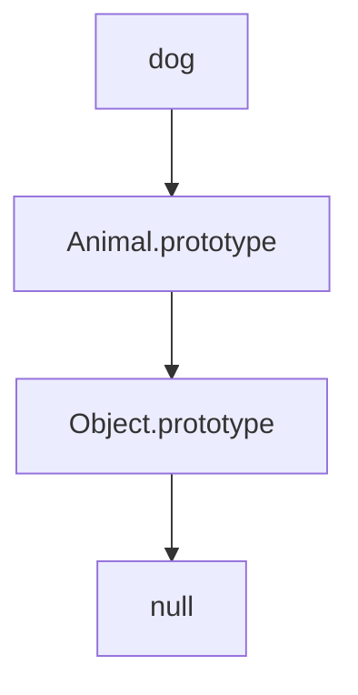
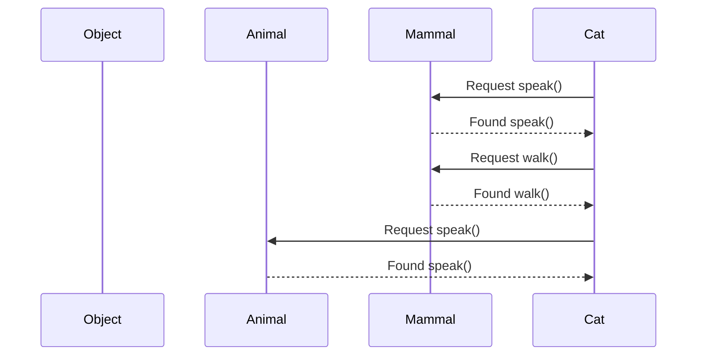

## 4.5 Prototype Inheritance

In JavaScript, understanding prototype inheritance is key to mastering object-oriented programming. This section will guide you through the concept of prototype inheritance, how it works, and how you can leverage it to create more efficient and reusable code. We'll cover prototype chaining, inheritance across multiple levels, method overriding, and the potential pitfalls of modifying built-in prototypes.

### Understanding Prototype Inheritance

Prototype inheritance is a fundamental feature of JavaScript that allows objects to inherit properties and methods from other objects. Unlike classical inheritance in languages like Java or C++, JavaScript uses a prototype-based inheritance model. This means that every object in JavaScript has a prototype, which is another object from which it can inherit properties.

#### What is a Prototype?

A prototype is a blueprint or a template from which objects inherit properties and methods. In JavaScript, when you create an object using a constructor function, the object automatically inherits from the constructor's prototype.

```javascript
function Animal(name) {
  this.name = name;
}

Animal.prototype.speak = function() {
  console.log(`${this.name} makes a noise.`);
};

const dog = new Animal('Dog');
dog.speak(); // Output: Dog makes a noise.
```

In the example above, the `Animal` constructor function has a prototype property, which is an object containing a `speak` method. The `dog` object, created using the `Animal` constructor, inherits the `speak` method from `Animal.prototype`.

### Prototype Chaining

Prototype chaining is the mechanism by which JavaScript objects inherit from one another. When you try to access a property or method on an object, JavaScript will first look for it on the object itself. If it doesn't find it there, it will look up the prototype chain until it finds the property or reaches the end of the chain.

#### Visualizing Prototype Chain

Let's visualize how prototype chaining works using a diagram:



In this diagram, the `dog` object inherits from `Animal.prototype`, which in turn inherits from `Object.prototype`. If a property or method is not found on `dog`, JavaScript will look for it on `Animal.prototype`, and if it's still not found, it will look on `Object.prototype`.

### Inheritance Across Multiple Levels

JavaScript allows for inheritance across multiple levels, meaning an object can inherit from another object, which in turn inherits from yet another object. This creates a chain of inheritance.

#### Example of Multi-Level Inheritance

Let's extend our previous example to demonstrate inheritance across multiple levels:

```javascript
function Mammal(name) {
  this.name = name;
}

Mammal.prototype = Object.create(Animal.prototype);
Mammal.prototype.constructor = Mammal;

Mammal.prototype.walk = function() {
  console.log(`${this.name} is walking.`);
};

const cat = new Mammal('Cat');
cat.speak(); // Output: Cat makes a noise.
cat.walk();  // Output: Cat is walking.
```

In this example, `Mammal` inherits from `Animal`, and `cat` is an instance of `Mammal`. The `cat` object can access both the `speak` method from `Animal.prototype` and the `walk` method from `Mammal.prototype`.

### Method Overriding in Prototypes

Method overriding occurs when a method in a child object has the same name as a method in its prototype chain. The method in the child object will override the method in the prototype.

#### Example of Method Overriding

```javascript
Mammal.prototype.speak = function() {
  console.log(`${this.name} says hello.`);
};

cat.speak(); // Output: Cat says hello.
```

In this example, we override the `speak` method in `Mammal.prototype`. Now, when `cat.speak()` is called, it uses the overridden method in `Mammal.prototype` instead of the one in `Animal.prototype`.

### Modifying Built-in Prototypes

While JavaScript allows you to modify built-in prototypes like `Array.prototype` or `Object.prototype`, it's generally considered bad practice. Modifying built-in prototypes can lead to unexpected behavior and compatibility issues.

#### Potential Issues with Modifying Built-in Prototypes

1. **Global Impact**: Changes to built-in prototypes affect all instances, which can lead to conflicts with other code or libraries.
2. **Performance Overhead**: Modifying prototypes can slow down property lookups.
3. **Future Compatibility**: Your changes might conflict with future versions of JavaScript.

### Best Practices for Prototype Inheritance

- **Use Constructor Functions**: Define constructor functions to create objects and use prototypes for shared methods.
- **Avoid Modifying Built-in Prototypes**: Instead, create utility functions or use modern JavaScript features like classes.
- **Leverage Object.create()**: Use `Object.create()` to create objects with a specific prototype, which is cleaner and more efficient.

### Try It Yourself

Experiment with the following code to deepen your understanding of prototype inheritance:

```javascript
function Bird(name) {
  this.name = name;
}

Bird.prototype.fly = function() {
  console.log(`${this.name} is flying.`);
};

const sparrow = new Bird('Sparrow');
sparrow.fly(); // Output: Sparrow is flying.

// Try adding a new method to Bird.prototype
Bird.prototype.sing = function() {
  console.log(`${this.name} is singing.`);
};

sparrow.sing(); // Output: Sparrow is singing.
```

Try modifying the `Bird` prototype and observe how it affects the `sparrow` instance. Experiment with adding, overriding, and removing methods to see how prototype inheritance works in practice.

### Visualizing Prototype Inheritance

To further illustrate prototype inheritance, let's use a sequence diagram to show the method lookup process:



In this diagram, we see how `Cat` looks up methods in its prototype chain, first checking `Mammal`, then `Animal`.

### References and Further Reading

- [MDN Web Docs: Inheritance and the prototype chain](https://developer.mozilla.org/en-US/docs/Web/JavaScript/Inheritance_and_the_prototype_chain)
- [JavaScript.info: Prototypes, inheritance](https://javascript.info/prototype-inheritance)

### Knowledge Check

- What is prototype inheritance, and how does it differ from classical inheritance?
- How does JavaScript use prototype chaining to look up properties and methods?
- What are the potential pitfalls of modifying built-in prototypes?

### Embrace the Journey

Remember, mastering prototype inheritance is a journey. As you continue to explore JavaScript, you'll encounter more complex scenarios where understanding prototypes will be invaluable. Keep experimenting, stay curious, and enjoy the journey!

## Quiz Time!



### What is prototype inheritance in JavaScript?

- [x] A way for objects to inherit properties and methods from other objects.
- [ ] A method to create new objects without constructors.
- [ ] A feature that allows functions to inherit from classes.
- [ ] A technique to optimize code execution.

> **Explanation:** Prototype inheritance allows objects to inherit properties and methods from other objects, forming a prototype chain.

### How does JavaScript look up a property in an object?

- [x] It searches the object and then its prototype chain.
- [ ] It only searches the object itself.
- [ ] It searches the object's constructor.
- [ ] It searches the global scope.

> **Explanation:** JavaScript first searches the object itself, and if the property is not found, it continues searching up the prototype chain.

### What is a potential issue with modifying built-in prototypes?

- [x] It can lead to unexpected behavior in other code.
- [ ] It improves performance.
- [ ] It enhances compatibility with future JavaScript versions.
- [ ] It is always recommended for code optimization.

> **Explanation:** Modifying built-in prototypes can lead to unexpected behavior and compatibility issues with other code and libraries.

### What method can you use to create an object with a specific prototype?

- [x] Object.create()
- [ ] Object.assign()
- [ ] Object.defineProperty()
- [ ] Object.freeze()

> **Explanation:** `Object.create()` is used to create a new object with a specified prototype.

### Which method is overridden in the example provided?

- [x] speak()
- [ ] walk()
- [ ] fly()
- [ ] sing()

> **Explanation:** The `speak()` method is overridden in the `Mammal.prototype`.

### What is the purpose of the `constructor` property in prototypes?

- [x] To reference the function that created the instance's prototype.
- [ ] To define a new method in the prototype.
- [ ] To delete properties from the prototype.
- [ ] To modify the prototype chain.

> **Explanation:** The `constructor` property references the function that created the instance's prototype, helping to maintain the prototype chain.

### What is the result of calling `cat.speak()` after overriding the method?

- [x] Cat says hello.
- [ ] Cat makes a noise.
- [ ] Cat is walking.
- [ ] Cat is flying.

> **Explanation:** After overriding, `cat.speak()` outputs "Cat says hello."

### What does `Object.prototype` represent in the prototype chain?

- [x] The top-level prototype from which all objects inherit.
- [ ] A method for creating new objects.
- [ ] A built-in JavaScript function.
- [ ] A property of the global object.

> **Explanation:** `Object.prototype` is the top-level prototype from which all JavaScript objects inherit.

### What is a best practice when using prototype inheritance?

- [x] Avoid modifying built-in prototypes.
- [ ] Always modify built-in prototypes for optimization.
- [ ] Use global variables for all properties.
- [ ] Avoid using constructor functions.

> **Explanation:** Avoid modifying built-in prototypes to prevent conflicts and unexpected behavior.

### True or False: JavaScript uses classical inheritance similar to Java.

- [ ] True
- [x] False

> **Explanation:** False. JavaScript uses prototype-based inheritance, not classical inheritance like Java.


