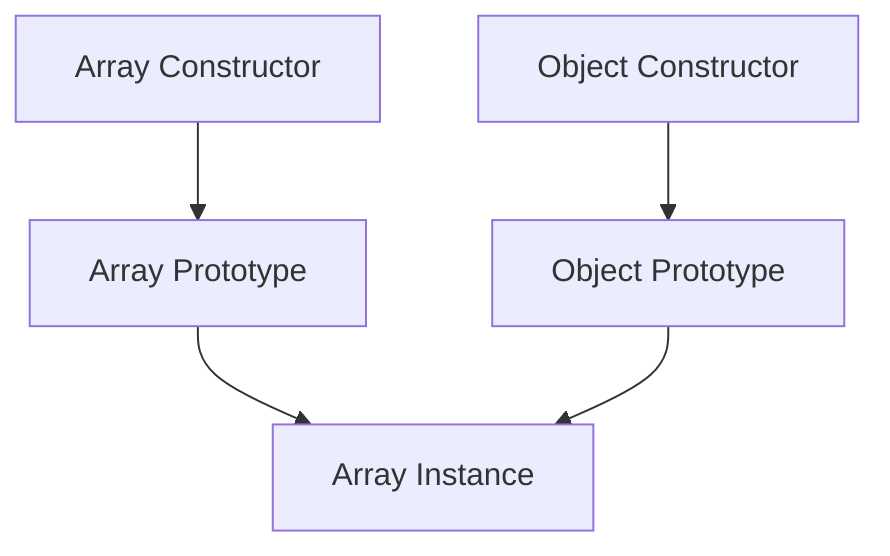

## 4.6 Built-in Constructors and Prototypes

In this section, we will delve into JavaScript's built-in constructors and their prototypes. Understanding these concepts is crucial for anyone looking to master object-oriented programming in JavaScript. We will explore common built-in constructors, how they can be extended, and the best practices for doing so responsibly.

### Introduction to Built-in Constructors

JavaScript provides a set of built-in constructors that allow us to create objects of various types. These constructors are functions that, when invoked with the `new` keyword, create and return an object. Some of the most common built-in constructors include:

- **Object**: The most fundamental constructor, used to create plain objects.
- **Array**: Used to create array objects, which are list-like collections of elements.
- **Function**: Used to create new function objects.
- **Date**: Used to create date objects representing a single moment in time.
- **String**: Used to create string objects.
- **Number**: Used to create number objects.
- **Boolean**: Used to create boolean objects.
- **RegExp**: Used to create regular expression objects.
- **Error**: Used to create error objects for exception handling.

Each of these constructors has an associated prototype object. When a new object is created using a constructor, it inherits properties and methods from the constructor's prototype.

### Understanding Prototypes

In JavaScript, every function, including constructors, has a `prototype` property. This property is an object that contains properties and methods that should be shared by all instances created by the constructor. When you create a new object using a constructor, JavaScript sets the object's internal `[[Prototype]]` (also known as `__proto__`) to point to the constructor's `prototype` object.

#### Visualizing the Prototype Chain

Let's visualize how the prototype chain works using a simple diagram:



In this diagram, an array instance inherits from the `Array Prototype`, which in turn inherits from the `Object Prototype`. This chain is what allows JavaScript objects to have access to methods and properties defined higher up in the chain.

### Common Built-in Constructors

Let's take a closer look at some of the most commonly used built-in constructors in JavaScript.

#### Object Constructor

The `Object` constructor is the most basic constructor in JavaScript. It is used to create plain objects:

```javascript
let obj = new Object();
console.log(obj); // Outputs: {}
```

However, in practice, object literals `{}` are more commonly used to create objects.

#### Array Constructor

The `Array` constructor is used to create array objects:

```javascript
let arr = new Array(1, 2, 3);
console.log(arr); // Outputs: [1, 2, 3]
```

Again, array literals `[]` are more commonly used in practice.

#### Function Constructor

The `Function` constructor creates new function objects:

```javascript
let func = new Function('a', 'b', 'return a + b');
console.log(func(2, 3)); // Outputs: 5
```

However, function expressions or declarations are preferred for creating functions.

#### Date Constructor

The `Date` constructor creates date objects:

```javascript
let date = new Date();
console.log(date); // Outputs: current date and time
```

#### String, Number, and Boolean Constructors

These constructors create wrapper objects for primitive values:

```javascript
let str = new String('Hello');
let num = new Number(42);
let bool = new Boolean(true);

console.log(str);  // Outputs: [String: 'Hello']
console.log(num);  // Outputs: [Number: 42]
console.log(bool); // Outputs: [Boolean: true]
```

### Extending Built-in Prototypes

JavaScript allows us to extend the prototypes of built-in constructors by adding new methods or properties. This can be useful for adding functionality that is not available by default. However, it must be done with caution to avoid potential issues.

#### Adding Methods to Built-in Prototypes

Let's add a method to the `Array` prototype:

```javascript
Array.prototype.last = function() {
    return this[this.length - 1];
};

let numbers = [1, 2, 3];
console.log(numbers.last()); // Outputs: 3
```

In this example, we added a `last` method to the `Array` prototype, which returns the last element of the array.

#### Risks of Modifying Built-in Prototypes

While extending built-in prototypes can be powerful, it comes with risks:

1. **Compatibility Issues**: Modifying prototypes can lead to conflicts with future versions of JavaScript or other libraries that may define the same method names.
2. **Performance Overhead**: Adding methods to prototypes can slow down property lookups.
3. **Unexpected Behaviors**: Other code that relies on the original behavior of the prototype may break.

#### Best Practices for Extending Prototypes

- **Avoid Modifying Prototypes**: Whenever possible, avoid modifying built-in prototypes. Instead, consider using utility functions or libraries.
- **Use Unique Method Names**: If you must extend a prototype, use unique method names to minimize the risk of conflicts.
- **Document Changes**: Clearly document any changes made to prototypes to ensure other developers are aware of them.

### Practical Examples

Let's explore some practical examples of extending built-in prototypes responsibly.

#### Adding a Method to the String Prototype

Suppose we want to add a method to the `String` prototype that repeats a string a specified number of times:

```javascript
String.prototype.repeatString = function(count) {
    return this.repeat(count);
};

let greeting = 'Hello';
console.log(greeting.repeatString(3)); // Outputs: HelloHelloHello
```

In this example, we added a `repeatString` method to the `String` prototype, which uses the built-in `repeat` method to repeat the string.

#### Adding a Method to the Date Prototype

Let's add a method to the `Date` prototype that formats the date as `YYYY-MM-DD`:

```javascript
Date.prototype.toFormattedString = function() {
    let year = this.getFullYear();
    let month = (this.getMonth() + 1).toString().padStart(2, '0');
    let day = this.getDate().toString().padStart(2, '0');
    return `${year}-${month}-${day}`;
};

let today = new Date();
console.log(today.toFormattedString()); // Outputs: formatted date
```

In this example, we added a `toFormattedString` method to the `Date` prototype, which formats the date in a specific format.

### Try It Yourself

Now it's your turn! Try modifying the code examples above to add your own methods to built-in prototypes. For instance, you could add a method to the `Array` prototype that returns the sum of all elements in the array. Remember to follow best practices and use unique method names.

### Knowledge Check

Before we wrap up, let's do a quick knowledge check to reinforce what we've learned.

- What are some common built-in constructors in JavaScript?
- How can you add a method to a built-in prototype?
- What are the risks associated with modifying built-in prototypes?
- What are some best practices for extending prototypes?

### Summary

In this section, we've explored JavaScript's built-in constructors and their prototypes. We've learned how to extend these prototypes by adding new methods and discussed the risks and best practices associated with doing so. By understanding these concepts, you can harness the power of JavaScript's object-oriented features while writing clean and maintainable code.

Remember, this is just the beginning. As you progress, you'll build more complex and interactive web pages. Keep experimenting, stay curious, and enjoy the journey!

## Quiz Time!



### Which of the following is a built-in constructor in JavaScript?

- [x] Array
- [ ] List
- [x] Date
- [ ] Map

> **Explanation:** Array and Date are built-in constructors in JavaScript, while List and Map are not.

### What does the `prototype` property of a constructor function represent?

- [x] An object containing shared properties and methods for instances
- [ ] A method to create new objects
- [ ] A function to initialize objects
- [ ] A variable to store object data

> **Explanation:** The `prototype` property is an object that contains shared properties and methods for instances created by the constructor.

### How can you add a method to a built-in prototype?

- [x] By assigning a function to the prototype property
- [ ] By creating a new constructor
- [ ] By using the `new` keyword
- [ ] By modifying the constructor function

> **Explanation:** You can add a method to a built-in prototype by assigning a function to the prototype property.

### What is a potential risk of modifying built-in prototypes?

- [x] Compatibility issues with future JavaScript versions
- [ ] Increased code readability
- [ ] Enhanced performance
- [ ] Improved security

> **Explanation:** Modifying built-in prototypes can lead to compatibility issues with future JavaScript versions.

### Which of the following is a best practice when extending prototypes?

- [x] Use unique method names
- [ ] Modify prototypes frequently
- [ ] Avoid documenting changes
- [ ] Use common method names

> **Explanation:** Using unique method names helps minimize the risk of conflicts when extending prototypes.

### What is the `__proto__` property?

- [x] An internal property pointing to the prototype object
- [ ] A method for creating new objects
- [ ] A function for initializing objects
- [ ] A variable for storing object data

> **Explanation:** The `__proto__` property is an internal property that points to the prototype object.

### Why should you avoid modifying built-in prototypes?

- [x] To prevent unexpected behaviors in other code
- [ ] To increase the complexity of your code
- [ ] To reduce code readability
- [ ] To improve performance

> **Explanation:** Modifying built-in prototypes can lead to unexpected behaviors in other code that relies on the original prototype behavior.

### What is the purpose of the `new` keyword in JavaScript?

- [x] To create a new object instance
- [ ] To define a new function
- [ ] To declare a new variable
- [ ] To initialize a new array

> **Explanation:** The `new` keyword is used to create a new object instance from a constructor function.

### How can you ensure compatibility when extending prototypes?

- [x] By avoiding modifications to built-in prototypes
- [ ] By frequently updating your code
- [ ] By using common method names
- [ ] By ignoring documentation

> **Explanation:** Avoiding modifications to built-in prototypes helps ensure compatibility with future JavaScript versions.

### True or False: Modifying built-in prototypes can improve performance.

- [ ] True
- [x] False

> **Explanation:** Modifying built-in prototypes can introduce performance overhead due to slower property lookups.


