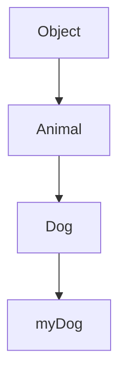

## 4.7 Checking an Object's Prototype

In JavaScript, understanding and working with prototypes is crucial for mastering object-oriented programming. Prototypes allow objects to inherit properties and methods from other objects, creating a powerful mechanism for code reuse and organization. In this section, we'll explore how to check an object's prototype using two essential tools: the `instanceof` operator and the `isPrototypeOf` method. We'll delve into their workings, provide practical examples, and discuss their limitations to ensure you have a comprehensive understanding of prototype verification in JavaScript.

### Understanding the `instanceof` Operator

The `instanceof` operator is a binary operator used to check if an object is an instance of a particular constructor function. It returns `true` if the object is an instance, and `false` otherwise. This operator is particularly useful when you want to determine the type of an object or verify its prototype chain.

#### How `instanceof` Works

When you use `instanceof`, JavaScript checks the prototype chain of the object on the left side of the operator to see if it contains the prototype property of the constructor function on the right side. If it does, `instanceof` returns `true`.

Here's a simple example to illustrate this concept:

```javascript
// Define a constructor function
function Animal(name) {
  this.name = name;
}

// Create an instance of Animal
const dog = new Animal('Buddy');

// Check if dog is an instance of Animal
console.log(dog instanceof Animal); // Output: true
```

In this example, `dog` is an instance of `Animal`, so `dog instanceof Animal` returns `true`.

#### Common Mistakes with `instanceof`

While `instanceof` is a powerful tool, it's important to be aware of its limitations and common pitfalls:

1. **Cross-Frame Issues**: If objects are created in different JavaScript execution contexts (e.g., different iframes), `instanceof` may not work as expected because each context has its own global object and constructor functions.

2. **Primitive Values**: `instanceof` only works with objects. If you try to use it with primitive values like strings or numbers, it will always return `false`.

3. **Prototype Changes**: If the prototype of a constructor function is changed after an object is created, `instanceof` may give unexpected results.

Here's an example demonstrating these issues:

```javascript
// Cross-frame issue example
// Assume iframe1 and iframe2 are two different iframes
const iframe1Array = iframe1.contentWindow.Array;
const iframe2Array = iframe2.contentWindow.Array;

const array1 = new iframe1Array();
console.log(array1 instanceof iframe2Array); // Output: false

// Prototype change issue example
function Car() {}
const myCar = new Car();

Car.prototype = {};
console.log(myCar instanceof Car); // Output: false
```

### Using `isPrototypeOf` for Prototype Verification

The `isPrototypeOf` method is another way to check prototype relationships. It is called on a prototype object and takes an object as an argument, returning `true` if the prototype is in the object's prototype chain.

#### How `isPrototypeOf` Works

`isPrototypeOf` directly checks if an object exists in another object's prototype chain. This method is useful when you want to verify if a specific prototype is part of an object's inheritance hierarchy.

Here's an example to demonstrate `isPrototypeOf`:

```javascript
// Define a constructor function
function Vehicle() {}

// Create an instance of Vehicle
const car = new Vehicle();

// Check if Vehicle.prototype is in car's prototype chain
console.log(Vehicle.prototype.isPrototypeOf(car)); // Output: true
```

In this example, `Vehicle.prototype` is indeed in `car`'s prototype chain, so `Vehicle.prototype.isPrototypeOf(car)` returns `true`.

#### Common Mistakes with `isPrototypeOf`

While `isPrototypeOf` is straightforward, there are a few things to keep in mind:

1. **Direct Prototype Check**: `isPrototypeOf` checks the prototype chain, not the constructor function. Make sure you're calling it on the correct prototype object.

2. **Prototype Changes**: Similar to `instanceof`, if the prototype of a constructor function is changed after an object is created, `isPrototypeOf` may give unexpected results.

Here's an example illustrating these points:

```javascript
function Gadget() {}
const phone = new Gadget();

// Change the prototype of Gadget
Gadget.prototype = {};

// Check if the original prototype is in phone's prototype chain
console.log(Gadget.prototype.isPrototypeOf(phone)); // Output: false
```

### Comparing `instanceof` and `isPrototypeOf`

Both `instanceof` and `isPrototypeOf` are useful for checking prototype relationships, but they serve slightly different purposes and have distinct use cases.

- **`instanceof`**: Use this operator when you want to check if an object is an instance of a specific constructor function. It's more concise and commonly used for type checking.

- **`isPrototypeOf`**: Use this method when you want to verify if a specific prototype is part of an object's prototype chain. It's more explicit and can be useful for checking inheritance hierarchies.

### Limitations of Prototype Checking

While `instanceof` and `isPrototypeOf` are powerful tools, they have limitations that can affect type checking:

1. **Prototype Changes**: As mentioned earlier, if the prototype of a constructor function is changed after an object is created, both `instanceof` and `isPrototypeOf` may give unexpected results.

2. **Cross-Frame Issues**: Objects created in different JavaScript execution contexts may not be recognized as instances of each other's constructors due to separate global objects.

3. **Complex Inheritance**: In complex inheritance scenarios, relying solely on `instanceof` or `isPrototypeOf` may not provide a complete picture of an object's type or capabilities.

### Practical Examples and Exercises

Let's solidify our understanding with some practical examples and exercises:

#### Example 1: Checking Inheritance Hierarchy

```javascript
function Animal() {}
function Dog() {}

Dog.prototype = Object.create(Animal.prototype);
Dog.prototype.constructor = Dog;

const myDog = new Dog();

// Check prototype relationships
console.log(myDog instanceof Dog); // Output: true
console.log(myDog instanceof Animal); // Output: true
console.log(Animal.prototype.isPrototypeOf(myDog)); // Output: true
```

In this example, `Dog` inherits from `Animal`, so `myDog` is an instance of both `Dog` and `Animal`.

#### Example 2: Prototype Chain Verification

```javascript
function Person() {}
function Employee() {}

Employee.prototype = Object.create(Person.prototype);
Employee.prototype.constructor = Employee;

const employee = new Employee();

// Verify prototype chain
console.log(Person.prototype.isPrototypeOf(employee)); // Output: true
console.log(Employee.prototype.isPrototypeOf(employee)); // Output: true
```

Here, `Employee` inherits from `Person`, and we verify the prototype chain using `isPrototypeOf`.

### Try It Yourself

Now it's your turn! Try modifying the examples above to experiment with prototype relationships. Here are some ideas:

- Change the prototype of a constructor function after creating an instance and observe the effects on `instanceof` and `isPrototypeOf`.
- Create a multi-level inheritance hierarchy and verify prototype relationships at each level.
- Experiment with objects created in different iframes (if possible) to see how `instanceof` behaves.

### Visualizing Prototype Chains

To better understand prototype chains, let's visualize them using a diagram. This will help you see how objects are linked through their prototypes.



In this diagram, `myDog` is an instance of `Dog`, which inherits from `Animal`, and `Animal` inherits from `Object`. This visual representation shows the prototype chain and how `instanceof` and `isPrototypeOf` work in practice.

### References and Further Reading

For more information on prototypes and inheritance in JavaScript, check out these resources:

- [MDN Web Docs: Prototypes](https://developer.mozilla.org/en-US/docs/Web/JavaScript/Inheritance_and_the_prototype_chain)
- [JavaScript.info: Prototypes](https://javascript.info/prototype-inheritance)
- [W3Schools: JavaScript Prototypes](https://www.w3schools.com/js/js_object_prototypes.asp)

### Knowledge Check

Before we wrap up, let's review some key points:

- The `instanceof` operator checks if an object is an instance of a specific constructor function by examining its prototype chain.
- The `isPrototypeOf` method verifies if a prototype is part of an object's prototype chain.
- Both tools have limitations, such as cross-frame issues and prototype changes.
- Use `instanceof` for type checking and `isPrototypeOf` for verifying inheritance hierarchies.

### Embrace the Journey

Remember, mastering prototypes and inheritance in JavaScript is a journey. As you continue to explore and experiment, you'll gain a deeper understanding of how these concepts work together to create powerful and flexible code. Keep experimenting, stay curious, and enjoy the journey!

## Quiz Time!



### What does the `instanceof` operator do?

- [x] Checks if an object is an instance of a specific constructor function.
- [ ] Checks if an object has a specific property.
- [ ] Checks if an object is a primitive value.
- [ ] Checks if an object is in the global scope.

> **Explanation:** The `instanceof` operator checks if an object is an instance of a specific constructor function by examining its prototype chain.

### Which method verifies if a prototype is part of an object's prototype chain?

- [ ] `instanceof`
- [x] `isPrototypeOf`
- [ ] `hasOwnProperty`
- [ ] `Object.create`

> **Explanation:** The `isPrototypeOf` method verifies if a prototype is part of an object's prototype chain.

### What will `console.log(dog instanceof Animal);` output if `dog` is an instance of `Animal`?

- [x] true
- [ ] false
- [ ] undefined
- [ ] null

> **Explanation:** If `dog` is an instance of `Animal`, `console.log(dog instanceof Animal);` will output `true`.

### What happens if you change the prototype of a constructor function after creating an instance?

- [ ] The instance's prototype chain is updated automatically.
- [x] The instance's prototype chain remains unchanged.
- [ ] The instance is deleted.
- [ ] The instance becomes a primitive value.

> **Explanation:** If you change the prototype of a constructor function after creating an instance, the instance's prototype chain remains unchanged.

### Which of the following is a limitation of `instanceof`?

- [x] Cross-frame issues
- [ ] It works with primitive values
- [ ] It can only check for properties
- [ ] It is not supported in modern browsers

> **Explanation:** One limitation of `instanceof` is cross-frame issues, where objects created in different JavaScript execution contexts may not be recognized as instances of each other's constructors.

### What does `Vehicle.prototype.isPrototypeOf(car);` check?

- [x] If `Vehicle.prototype` is in `car`'s prototype chain.
- [ ] If `car` is an instance of `Vehicle`.
- [ ] If `car` has a property named `prototype`.
- [ ] If `Vehicle` is a primitive value.

> **Explanation:** `Vehicle.prototype.isPrototypeOf(car);` checks if `Vehicle.prototype` is in `car`'s prototype chain.

### What is a common mistake when using `isPrototypeOf`?

- [x] Calling it on the wrong prototype object.
- [ ] Using it with primitive values.
- [ ] Using it for type checking.
- [ ] Using it in the global scope.

> **Explanation:** A common mistake when using `isPrototypeOf` is calling it on the wrong prototype object.

### How does `instanceof` determine if an object is an instance of a constructor?

- [x] By checking the object's prototype chain.
- [ ] By checking the object's properties.
- [ ] By checking the object's methods.
- [ ] By checking the object's type.

> **Explanation:** `instanceof` determines if an object is an instance of a constructor by checking the object's prototype chain.

### What is the output of `console.log(Person.prototype.isPrototypeOf(employee));` if `employee` is an instance of `Employee` which inherits from `Person`?

- [x] true
- [ ] false
- [ ] undefined
- [ ] null

> **Explanation:** If `employee` is an instance of `Employee` which inherits from `Person`, `console.log(Person.prototype.isPrototypeOf(employee));` will output `true`.

### True or False: `instanceof` can be used with primitive values.

- [ ] True
- [x] False

> **Explanation:** `instanceof` cannot be used with primitive values; it only works with objects.


