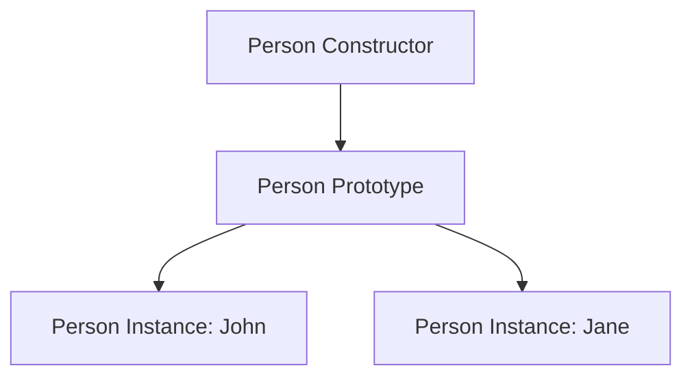

## 4.8 Modifying Prototypes

In JavaScript, prototypes are a powerful feature that allows objects to inherit properties and methods from other objects. This section will guide you through the process of modifying prototypes, enabling you to extend the functionality of your objects dynamically. By the end of this section, you'll understand how to add new methods to a constructor's prototype, modify existing methods, and recognize the impact of these changes on all instances of the constructor.

### Understanding Prototypes

Before we dive into modifying prototypes, let's briefly revisit what prototypes are. In JavaScript, every object has a prototype, which is another object from which it inherits properties and methods. This prototype chain allows for a form of inheritance that is central to JavaScript's object-oriented capabilities.

### Extending a Constructor's Prototype

One of the most common uses of prototypes is to add methods that should be shared across all instances of a constructor function. This is more efficient than defining methods inside the constructor itself, as it avoids creating a new function for each instance.

#### Adding New Methods

Let's start by adding a new method to a constructor's prototype. Consider the following example:

```javascript
// Define a constructor function
function Person(name, age) {
  this.name = name;
  this.age = age;
}

// Add a method to the prototype
Person.prototype.greet = function() {
  console.log(`Hello, my name is ${this.name} and I am ${this.age} years old.`);
};

// Create a new instance
const john = new Person('John', 30);
john.greet(); // Output: Hello, my name is John and I am 30 years old.
```

In this example, we define a `Person` constructor function and add a `greet` method to its prototype. This method is then available to all instances of `Person`, such as `john`.

#### Demonstrating the Impact

When you add a method to a prototype, it becomes available to all existing and future instances of the constructor. This is because instances reference the prototype for methods and properties they don't have themselves.

```javascript
// Create another instance
const jane = new Person('Jane', 25);
jane.greet(); // Output: Hello, my name is Jane and I am 25 years old.
```

Both `john` and `jane` can use the `greet` method because it is defined on the `Person` prototype.

### Modifying Existing Prototype Methods

You can also modify existing methods on a prototype. This allows you to change the behavior of all instances of a constructor function.

#### Example of Modification

Let's modify the `greet` method to include a more personalized message:

```javascript
// Modify the greet method
Person.prototype.greet = function() {
  console.log(`Hi there! I'm ${this.name}, nice to meet you!`);
};

// Test the modified method
john.greet(); // Output: Hi there! I'm John, nice to meet you!
jane.greet(); // Output: Hi there! I'm Jane, nice to meet you!
```

By modifying the `greet` method on the prototype, we change the behavior for all instances of `Person`.

### Impact on All Instances

When you modify a prototype, the change affects all instances that are linked to that prototype. This is because instances do not have their own copies of prototype methods; they reference the prototype directly.

#### Visualizing the Prototype Chain

To better understand this concept, let's visualize the prototype chain:



In this diagram, both `John` and `Jane` instances are linked to the `Person Prototype`. Any changes to the prototype are immediately reflected in both instances.

### Warnings and Best Practices

While modifying prototypes can be powerful, it comes with certain risks and best practices to consider:

#### Avoid Breaking the Prototype Chain

Be cautious when modifying prototypes, as incorrect changes can break the prototype chain, leading to unexpected behavior.

- **Do Not Overwrite the Prototype**: Overwriting the entire prototype object can sever the connection between existing instances and their methods.

```javascript
// Incorrect: Overwriting the prototype
Person.prototype = {
  greet: function() {
    console.log('This will break existing instances.');
  }
};

// Existing instances are affected
john.greet(); // Error: john.greet is not a function
```

- **Use Object.assign for Safe Modifications**: Instead of overwriting, use `Object.assign` to safely add or modify methods.

```javascript
// Correct: Use Object.assign to modify the prototype
Object.assign(Person.prototype, {
  greet: function() {
    console.log(`Hi, I'm ${this.name}.`);
  }
});

john.greet(); // Output: Hi, I'm John.
```

#### Consider Performance Implications

Modifying prototypes can have performance implications, especially in large applications. Each time you modify a prototype, JavaScript engines may need to re-optimize the affected objects.

### Try It Yourself

Now that you've learned how to modify prototypes, try experimenting with the following exercises:

1. **Add a New Method**: Add a `sayGoodbye` method to the `Person` prototype that logs a farewell message.
2. **Modify an Existing Method**: Change the `greet` method to include the person's age in the message.
3. **Create a New Constructor**: Define a new constructor `Animal` and add methods to its prototype. Create instances and test your methods.

### Knowledge Check

- What happens when you modify a method on a prototype?
- Why should you avoid overwriting the entire prototype object?
- How can you safely add new methods to a prototype?

### Summary

In this section, we've explored how to modify prototypes in JavaScript. By adding or changing methods on a prototype, you can extend the functionality of all instances of a constructor. However, it's important to be cautious and follow best practices to avoid breaking the prototype chain or causing performance issues. Remember, modifying prototypes is a powerful tool in your JavaScript toolkit, but it should be used judiciously.

## Quiz Time!



### What is a prototype in JavaScript?

- [x] An object from which other objects inherit properties and methods.
- [ ] A function that creates new objects.
- [ ] A variable that stores data.
- [ ] A method that modifies object properties.

> **Explanation:** In JavaScript, a prototype is an object from which other objects inherit properties and methods, forming the basis of JavaScript's inheritance model.

### How do you add a new method to a constructor's prototype?

- [x] By assigning a function to the constructor's prototype property.
- [ ] By defining the method inside the constructor function.
- [ ] By creating a new instance of the constructor.
- [ ] By using the `new` keyword.

> **Explanation:** You can add a new method to a constructor's prototype by assigning a function to the constructor's prototype property, making it available to all instances.

### What is the impact of modifying a method on a prototype?

- [x] It changes the behavior for all instances linked to that prototype.
- [ ] It only affects new instances created after the modification.
- [ ] It creates a new method for each instance.
- [ ] It has no effect on existing instances.

> **Explanation:** Modifying a method on a prototype changes the behavior for all instances linked to that prototype, as they reference the prototype directly.

### Why should you avoid overwriting the entire prototype object?

- [x] It can break the connection between existing instances and their methods.
- [ ] It improves performance.
- [ ] It simplifies code maintenance.
- [ ] It enhances security.

> **Explanation:** Overwriting the entire prototype object can break the connection between existing instances and their methods, leading to errors.

### How can you safely add new methods to a prototype?

- [x] By using `Object.assign` to modify the prototype.
- [ ] By overwriting the prototype object.
- [ ] By creating a new constructor function.
- [ ] By using the `new` keyword.

> **Explanation:** Using `Object.assign` allows you to safely add new methods to a prototype without overwriting it, preserving existing connections.

### What is a potential performance implication of modifying prototypes?

- [x] JavaScript engines may need to re-optimize affected objects.
- [ ] It increases memory usage significantly.
- [ ] It slows down the creation of new instances.
- [ ] It has no impact on performance.

> **Explanation:** Modifying prototypes can cause JavaScript engines to re-optimize affected objects, which may impact performance in large applications.

### What is the purpose of the prototype chain?

- [x] To allow objects to inherit properties and methods from other objects.
- [ ] To store data in a hierarchical structure.
- [ ] To define the order of method execution.
- [ ] To manage memory allocation.

> **Explanation:** The prototype chain allows objects to inherit properties and methods from other objects, enabling a form of inheritance in JavaScript.

### How can you modify an existing method on a prototype?

- [x] By reassigning the method on the prototype to a new function.
- [ ] By creating a new instance of the constructor.
- [ ] By using the `new` keyword.
- [ ] By defining the method inside the constructor function.

> **Explanation:** You can modify an existing method on a prototype by reassigning it to a new function, changing its behavior for all instances.

### What is the result of adding a method to a prototype?

- [x] The method becomes available to all instances of the constructor.
- [ ] The method is only available to new instances.
- [ ] The method is copied to each instance.
- [ ] The method is stored in a separate object.

> **Explanation:** Adding a method to a prototype makes it available to all instances of the constructor, as they reference the prototype for methods.

### True or False: Modifying a prototype affects all existing and future instances of the constructor.

- [x] True
- [ ] False

> **Explanation:** True. Modifying a prototype affects all existing and future instances of the constructor, as they share the same prototype.



Remember, this is just the beginning. As you progress, you'll build more complex and interactive applications using these concepts. Keep experimenting, stay curious, and enjoy the journey!
