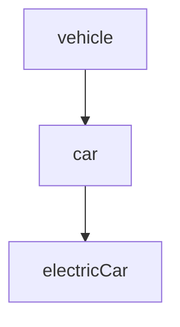

## 4.9 Object.create() Method

Welcome to the fascinating world of JavaScript's `Object.create()` method! In this section, we'll explore how this method allows us to create objects with a specified prototype, providing a powerful tool for leveraging JavaScript's prototypal inheritance. We'll cover its syntax, compare it with constructor functions and classes, and discuss scenarios where it shines. Let's dive in!

### Understanding Object.create()

The `Object.create()` method is a built-in JavaScript function that creates a new object, using an existing object as the prototype of the newly created object. This method is part of JavaScript's prototypal inheritance model, which allows objects to inherit properties and methods from other objects.

#### Syntax of Object.create()

The syntax for `Object.create()` is straightforward:

```javascript
Object.create(proto, [propertiesObject])
```

- **proto**: The object which should be the prototype of the newly-created object.
- **propertiesObject** (optional): An object containing property descriptors to be added to the new object.

The `proto` parameter is required and must be an object or `null`. If it's not an object or `null`, a `TypeError` will be thrown. The `propertiesObject` is optional and can be used to add properties to the new object, similar to how properties are defined using `Object.defineProperties()`.

### Creating Objects with Object.create()

Let's see how `Object.create()` works with a simple example:

```javascript
// Define a prototype object
const animal = {
  type: 'Animal',
  makeSound() {
    console.log('Some generic animal sound');
  }
};

// Create a new object with 'animal' as its prototype
const dog = Object.create(animal);

// Access properties and methods from the prototype
console.log(dog.type); // Output: Animal
dog.makeSound(); // Output: Some generic animal sound

// Add a new property to the 'dog' object
dog.breed = 'Labrador';
console.log(dog.breed); // Output: Labrador
```

In this example, `dog` is created with `animal` as its prototype. This means `dog` inherits properties and methods from `animal`, such as `type` and `makeSound()`.

### Comparing Object.create() with Constructor Functions and Classes

JavaScript provides multiple ways to create objects and manage inheritance. Let's compare `Object.create()` with constructor functions and classes.

#### Constructor Functions

Constructor functions are a traditional way to create objects and set up inheritance in JavaScript. They use the `new` keyword to create instances.

```javascript
function Animal() {
  this.type = 'Animal';
}

Animal.prototype.makeSound = function() {
  console.log('Some generic animal sound');
};

const dog = new Animal();
console.log(dog.type); // Output: Animal
dog.makeSound(); // Output: Some generic animal sound
```

#### Classes

ES6 introduced classes, which provide a more familiar syntax for creating objects and managing inheritance, similar to other object-oriented languages.

```javascript
class Animal {
  constructor() {
    this.type = 'Animal';
  }

  makeSound() {
    console.log('Some generic animal sound');
  }
}

const dog = new Animal();
console.log(dog.type); // Output: Animal
dog.makeSound(); // Output: Some generic animal sound
```

#### Object.create() vs. Constructor Functions and Classes

- **Simplicity**: `Object.create()` is simpler and more direct for creating objects with a specific prototype. It doesn't require a constructor function or class definition.
- **Flexibility**: `Object.create()` allows for more flexible prototype chains, as you can directly specify any object as a prototype.
- **Performance**: `Object.create()` can be more performant in some cases, as it avoids the overhead of function calls associated with constructors.
- **Property Descriptors**: With `Object.create()`, you can define property descriptors directly, allowing for fine-grained control over property characteristics.

### Use Cases for Object.create()

`Object.create()` is particularly useful in scenarios where you need to:

1. **Create Objects with a Specific Prototype**: When you want to create an object with a specific prototype without the need for a constructor function or class.

2. **Prototype-based Inheritance**: When implementing prototype-based inheritance, `Object.create()` provides a straightforward way to set up the prototype chain.

3. **Object Composition**: When you need to compose objects from multiple prototypes, `Object.create()` allows you to easily set up the desired prototype chain.

4. **Performance Optimization**: In performance-critical applications, `Object.create()` can be a more efficient way to create objects with a specific prototype.

### Advanced Examples with Object.create()

Let's explore some advanced examples to see the versatility of `Object.create()`.

#### Example 1: Creating a Hierarchy of Objects

```javascript
// Base prototype
const vehicle = {
  type: 'Vehicle',
  start() {
    console.log('Starting the vehicle');
  }
};

// Car prototype inheriting from vehicle
const car = Object.create(vehicle);
car.wheels = 4;
car.drive = function() {
  console.log('Driving the car');
};

// ElectricCar prototype inheriting from car
const electricCar = Object.create(car);
electricCar.battery = '100 kWh';
electricCar.charge = function() {
  console.log('Charging the electric car');
};

electricCar.start(); // Output: Starting the vehicle
electricCar.drive(); // Output: Driving the car
electricCar.charge(); // Output: Charging the electric car
console.log(electricCar.wheels); // Output: 4
console.log(electricCar.battery); // Output: 100 kWh
```

In this example, we create a hierarchy of objects: `vehicle`, `car`, and `electricCar`. Each object inherits properties and methods from its prototype, demonstrating the power of prototypal inheritance.

#### Example 2: Using Property Descriptors

```javascript
const person = {
  name: 'Unknown',
  greet() {
    console.log(`Hello, my name is ${this.name}`);
  }
};

const john = Object.create(person, {
  name: {
    value: 'John',
    writable: true,
    enumerable: true,
    configurable: true
  }
});

john.greet(); // Output: Hello, my name is John
```

In this example, we use `Object.create()` with property descriptors to define the `name` property on the `john` object. This allows us to control the property's characteristics, such as writability and enumerability.

### Visualizing Prototypal Inheritance with Object.create()

To better understand how `Object.create()` sets up the prototype chain, let's visualize the inheritance hierarchy using a diagram.



In this diagram, `vehicle` is the base prototype, `car` inherits from `vehicle`, and `electricCar` inherits from `car`. This visual representation helps clarify the relationships between objects in the prototype chain.

### Try It Yourself

Now that we've covered the basics and some advanced examples, it's time for you to experiment with `Object.create()`. Try modifying the examples above or create your own objects with custom prototypes. Here are some ideas to get you started:

- Create a prototype for a `Book` object with properties like `title` and `author`, and methods like `read()`.
- Use `Object.create()` to create a `ScienceBook` object that inherits from `Book` and adds a `field` property.
- Experiment with property descriptors to control the characteristics of properties on your objects.

### Key Takeaways

- `Object.create()` is a powerful method for creating objects with a specified prototype, leveraging JavaScript's prototypal inheritance.
- It provides a simple and flexible way to set up prototype chains without the need for constructor functions or classes.
- `Object.create()` is particularly useful in scenarios where you need to create objects with specific prototypes, implement prototype-based inheritance, or optimize performance.
- By understanding and using `Object.create()`, you can harness the full power of JavaScript's prototypal inheritance model.

### Further Reading

For more information on `Object.create()` and prototypal inheritance, check out these resources:

- [MDN Web Docs: Object.create()](https://developer.mozilla.org/en-US/docs/Web/JavaScript/Reference/Global_Objects/Object/create)
- [JavaScript.info: Prototypal Inheritance](https://javascript.info/prototype-inheritance)

Remember, this is just the beginning. As you progress, you'll build more complex and interactive applications using JavaScript's powerful object-oriented features. Keep experimenting, stay curious, and enjoy the journey!

## Quiz Time!



### What does Object.create() do in JavaScript?

- [x] Creates a new object with a specified prototype
- [ ] Creates a new class
- [ ] Creates a new function
- [ ] Creates a new array

> **Explanation:** `Object.create()` is used to create a new object with a specified prototype, allowing for prototypal inheritance.


### What is the required parameter for Object.create()?

- [x] proto
- [ ] propertiesObject
- [ ] constructor
- [ ] class

> **Explanation:** The `proto` parameter is required and specifies the prototype of the newly-created object.


### How can you add properties to an object created with Object.create()?

- [x] Using property descriptors in the second argument
- [ ] Using the new keyword
- [ ] Using a class constructor
- [ ] Using a function declaration

> **Explanation:** Properties can be added using property descriptors in the optional second argument of `Object.create()`.


### Which of the following is a benefit of using Object.create()?

- [x] It allows for flexible prototype chains
- [ ] It requires less code than classes
- [ ] It is the only way to create objects in JavaScript
- [ ] It automatically handles asynchronous operations

> **Explanation:** `Object.create()` allows for flexible prototype chains by directly specifying any object as a prototype.


### What will happen if you pass a non-object as the proto parameter to Object.create()?

- [x] A TypeError will be thrown
- [ ] The method will return null
- [ ] The method will create an empty object
- [ ] The method will ignore the parameter

> **Explanation:** If the `proto` parameter is not an object or `null`, a `TypeError` will be thrown.


### Which method is used to define property descriptors when creating an object with Object.create()?

- [x] Object.defineProperties()
- [ ] Object.defineProperty()
- [ ] Object.assign()
- [ ] Object.freeze()

> **Explanation:** Property descriptors can be defined using the optional second argument in `Object.create()`, similar to `Object.defineProperties()`.


### What is the output of the following code snippet?

```javascript
const animal = { type: 'Animal' };
const dog = Object.create(animal);
console.log(dog.type);
```

- [x] Animal
- [ ] undefined
- [ ] null
- [ ] Error

> **Explanation:** The `dog` object inherits the `type` property from the `animal` prototype, so the output is "Animal".


### How does Object.create() differ from using a class to create objects?

- [x] Object.create() does not require a constructor function
- [ ] Object.create() is only available in ES6
- [ ] Object.create() cannot create objects
- [ ] Object.create() is slower than classes

> **Explanation:** `Object.create()` does not require a constructor function or class definition, making it simpler for creating objects with a specific prototype.


### Which of the following is a use case for Object.create()?

- [x] Implementing prototype-based inheritance
- [ ] Handling asynchronous operations
- [ ] Managing state in React
- [ ] Creating HTML elements

> **Explanation:** `Object.create()` is particularly useful for implementing prototype-based inheritance by setting up the prototype chain.


### True or False: Object.create() can be used to create objects with multiple prototypes.

- [x] True
- [ ] False

> **Explanation:** While `Object.create()` itself creates an object with a single prototype, it can be used in combination with other techniques to compose objects from multiple prototypes.


