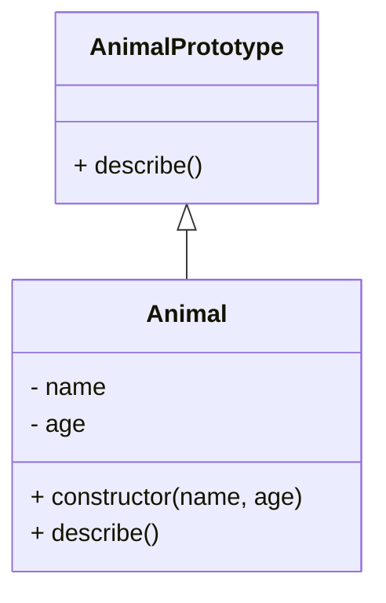

## 5.1 Introduction to Classes in ES6

Welcome to the exciting world of ES6 classes in JavaScript! If you're just starting your journey into object-oriented programming (OOP) with JavaScript, you're in the right place. In this section, we'll explore the motivations behind adding classes to JavaScript, delve into the basic class declaration syntax, compare ES6 classes with traditional constructor functions, and emphasize that classes are essentially syntactic sugar over prototypes. Let's dive in!

### Why Classes in JavaScript?

JavaScript has always been a versatile and dynamic language, but before the introduction of ES6 (ECMAScript 2015), it lacked a formal class syntax that many developers from other programming languages were accustomed to. This absence often led to confusion, especially for those transitioning from languages like Java or C++, where classes are a fundamental part of the language.

#### Motivations for Introducing Classes

1. **Familiarity**: Developers coming from class-based languages found JavaScript's prototype-based inheritance model challenging to grasp. Introducing classes made JavaScript more approachable by providing a familiar syntax.
   
2. **Readability and Structure**: Classes offer a cleaner and more structured way to define objects and their behaviors, making code more readable and maintainable.

3. **Syntactic Sugar**: While classes in JavaScript are syntactic sugar over the existing prototype-based inheritance, they simplify the process of creating and managing objects, making the code more intuitive.

4. **Consistency**: Classes provide a consistent way to define object blueprints, reducing the cognitive load on developers who need to understand and maintain complex codebases.

### Basic Class Declaration Syntax

Let's start by looking at how to declare a class in ES6. The syntax is straightforward and resembles class declarations in other languages. Here's a simple example:

```javascript
// Define a class named 'Animal'
class Animal {
  // Constructor method to initialize the object
  constructor(name, age) {
    this.name = name; // Assign the name property
    this.age = age;   // Assign the age property
  }

  // Method to describe the animal
  describe() {
    return `${this.name} is ${this.age} years old.`;
  }
}

// Create an instance of the Animal class
const dog = new Animal('Buddy', 3);
console.log(dog.describe()); // Output: Buddy is 3 years old.
```

#### Key Components of a Class

- **Class Declaration**: The `class` keyword is used to declare a class, followed by the class name (`Animal` in our example).
  
- **Constructor Method**: The `constructor` method is a special method for creating and initializing an object created with a class. It is called automatically when a new instance of the class is created.

- **Methods**: Functions defined within a class are called methods. In the example above, `describe()` is a method of the `Animal` class.

### Comparing ES6 Classes with Constructor Functions

Before ES6, JavaScript developers used constructor functions to create objects and simulate classes. Let's compare the two approaches to understand the differences and similarities.

#### Constructor Function Example

```javascript
// Define a constructor function
function Animal(name, age) {
  this.name = name;
  this.age = age;
}

// Add a method to the prototype
Animal.prototype.describe = function() {
  return `${this.name} is ${this.age} years old.`;
};

// Create an instance using the constructor function
const cat = new Animal('Whiskers', 2);
console.log(cat.describe()); // Output: Whiskers is 2 years old.
```

#### ES6 Class Example

```javascript
// Define a class
class Animal {
  constructor(name, age) {
    this.name = name;
    this.age = age;
  }

  describe() {
    return `${this.name} is ${this.age} years old.`;
  }
}

// Create an instance using the class
const bird = new Animal('Tweety', 1);
console.log(bird.describe()); // Output: Tweety is 1 years old.
```

#### Key Differences

1. **Syntax**: The class syntax is more concise and easier to read compared to constructor functions and prototype assignments.

2. **Method Definition**: In classes, methods are defined directly within the class body, whereas in constructor functions, methods are typically added to the prototype separately.

3. **Inheritance**: Classes provide a more straightforward syntax for inheritance using the `extends` keyword, which we'll explore in later sections.

4. **Syntactic Sugar**: It's important to remember that classes are syntactic sugar over JavaScript's existing prototype-based inheritance. This means they don't introduce new inheritance models but provide a cleaner and more intuitive way to work with objects.

### Understanding Classes as Syntactic Sugar

The term "syntactic sugar" refers to syntax within a programming language that is designed to make things easier to read or express. It doesn't introduce new functionality but makes the code more human-friendly.

#### Visualizing Prototypes and Classes

Let's visualize how classes are syntactic sugar over prototypes using a simple diagram.



**Description**: In this diagram, the `Animal` class is shown as a blueprint with properties (`name`, `age`) and methods (`constructor`, `describe`). The `AnimalPrototype` represents the prototype object where the `describe` method is actually stored. The arrow indicates that `Animal` instances inherit from `AnimalPrototype`.

### Try It Yourself

Now that we've covered the basics, it's time for you to experiment! Try modifying the `Animal` class to add more properties or methods. For example, you could add a `speak` method that outputs a sound the animal makes. Here's a starting point:

```javascript
class Animal {
  constructor(name, age, sound) {
    this.name = name;
    this.age = age;
    this.sound = sound;
  }

  describe() {
    return `${this.name} is ${this.age} years old.`;
  }

  speak() {
    return `${this.name} says ${this.sound}`;
  }
}

const lion = new Animal('Simba', 5, 'Roar');
console.log(lion.describe()); // Output: Simba is 5 years old.
console.log(lion.speak());    // Output: Simba says Roar
```

### Further Reading and Resources

To deepen your understanding of ES6 classes and their role in JavaScript, consider exploring the following resources:

- [MDN Web Docs: Classes](https://developer.mozilla.org/en-US/docs/Web/JavaScript/Reference/Classes)
- [W3Schools: JavaScript Classes](https://www.w3schools.com/js/js_classes.asp)

### Knowledge Check

Let's reinforce what we've learned with a few questions:

1. What is the primary motivation for introducing classes in JavaScript?
2. How do you define a method within an ES6 class?
3. What is the purpose of the `constructor` method in a class?
4. How do ES6 classes compare to constructor functions in terms of syntax and readability?
5. Why are classes considered syntactic sugar over prototypes?

### Embrace the Journey

Remember, this is just the beginning of your exploration into ES6 classes and object-oriented programming in JavaScript. As you continue to learn and experiment, you'll discover more powerful ways to structure your code and create robust applications. Keep experimenting, stay curious, and enjoy the journey!

## Quiz Time!



### What is the primary motivation for introducing classes in JavaScript?

- [x] To provide a familiar syntax for developers from class-based languages
- [ ] To introduce a new inheritance model
- [ ] To replace prototype-based inheritance
- [ ] To make JavaScript slower

> **Explanation:** The primary motivation for introducing classes in JavaScript was to provide a familiar syntax for developers from class-based languages, making the language more approachable.

### How do you define a method within an ES6 class?

- [x] By writing the method directly within the class body
- [ ] By adding it to the prototype outside the class
- [ ] By using the `function` keyword inside the class
- [ ] By defining it in the constructor

> **Explanation:** In ES6 classes, methods are defined directly within the class body without using the `function` keyword.

### What is the purpose of the `constructor` method in a class?

- [x] To initialize an object created with the class
- [ ] To define static properties
- [ ] To inherit from other classes
- [ ] To add methods to the prototype

> **Explanation:** The `constructor` method is used to initialize an object created with the class, setting up initial properties.

### How do ES6 classes compare to constructor functions in terms of syntax and readability?

- [x] Classes offer a more concise and readable syntax
- [ ] Classes require more code to achieve the same functionality
- [ ] Classes are less intuitive than constructor functions
- [ ] Classes do not support method definitions

> **Explanation:** ES6 classes offer a more concise and readable syntax compared to constructor functions, making the code easier to understand.

### Why are classes considered syntactic sugar over prototypes?

- [x] They provide a cleaner syntax without changing the underlying prototype-based inheritance
- [ ] They introduce a completely new inheritance model
- [ ] They eliminate the need for prototypes
- [ ] They make JavaScript slower

> **Explanation:** Classes are considered syntactic sugar because they provide a cleaner syntax without changing the underlying prototype-based inheritance model.

### What keyword is used to declare a class in ES6?

- [x] class
- [ ] function
- [ ] object
- [ ] prototype

> **Explanation:** The `class` keyword is used to declare a class in ES6.

### Which method is automatically called when a new instance of a class is created?

- [x] constructor
- [ ] init
- [ ] create
- [ ] setup

> **Explanation:** The `constructor` method is automatically called when a new instance of a class is created.

### What keyword is used to create an instance of a class?

- [x] new
- [ ] create
- [ ] instance
- [ ] object

> **Explanation:** The `new` keyword is used to create an instance of a class.

### Can ES6 classes have multiple constructors?

- [ ] Yes
- [x] No

> **Explanation:** ES6 classes cannot have multiple constructors. Each class can have only one `constructor` method.

### Are ES6 classes a new feature introduced in ECMAScript 2015?

- [x] True
- [ ] False

> **Explanation:** True. ES6 classes were introduced as part of ECMAScript 2015 (ES6).




