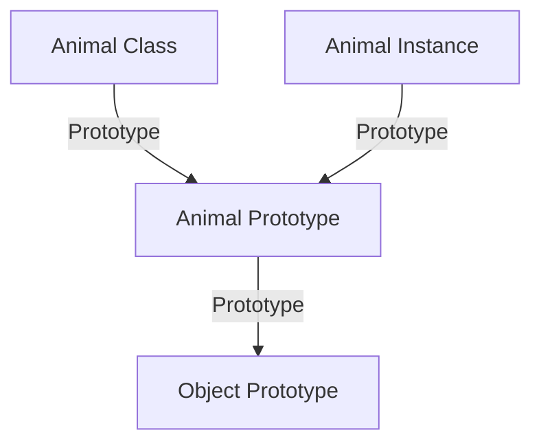

## 5.10 Mixing Old and New Syntax

As JavaScript has evolved, so too has its approach to object-oriented programming. With the introduction of ES6, JavaScript developers gained access to a more intuitive class syntax, which complements the traditional prototype-based system. In this section, we will explore how to integrate these two paradigms, providing you with the flexibility to use both when necessary.

### Understanding the Basics

Before we dive into mixing old and new syntax, let's briefly revisit the core concepts of prototypes and classes in JavaScript.

#### Prototypes

In JavaScript, every object has a prototype, which is another object from which it inherits properties and methods. This prototype-based inheritance is a powerful feature that allows for method sharing across instances.

```javascript
// Traditional prototype-based constructor
function Animal(name) {
  this.name = name;
}

Animal.prototype.speak = function() {
  console.log(`${this.name} makes a noise.`);
};

// Creating an instance
const dog = new Animal('Dog');
dog.speak(); // Output: Dog makes a noise.
```

#### ES6 Classes

ES6 introduced a more familiar class-based syntax, which is syntactic sugar over JavaScript's existing prototype-based inheritance.

```javascript
// ES6 class syntax
class Animal {
  constructor(name) {
    this.name = name;
  }

  speak() {
    console.log(`${this.name} makes a noise.`);
  }
}

// Creating an instance
const cat = new Animal('Cat');
cat.speak(); // Output: Cat makes a noise.
```

### Mixing Prototypes and Classes

There are scenarios where you might want to mix traditional prototypes with modern ES6 classes. Let's explore how to do this effectively.

#### Adding Methods to a Class's Prototype

Even with ES6 classes, you can still add methods to a class's prototype after its declaration. This can be useful for extending functionality without modifying the original class definition.

```javascript
class Vehicle {
  constructor(type) {
    this.type = type;
  }
}

// Adding a method to the prototype
Vehicle.prototype.describe = function() {
  console.log(`This is a ${this.type}.`);
};

const car = new Vehicle('Car');
car.describe(); // Output: This is a Car.
```

#### Scenarios for Mixing Syntax

1. **Extending Built-in Objects**: Sometimes, you need to extend built-in objects like `Array` or `Date`. While ES6 classes can be used, prototypes offer more direct control over the inheritance chain.

2. **Legacy Code Integration**: When working with legacy codebases that use prototypes, you might need to introduce new features using ES6 classes while maintaining backward compatibility.

3. **Performance Optimization**: In certain cases, using prototypes can lead to performance improvements, especially when dealing with large numbers of objects.

#### Potential Pitfalls

While mixing old and new syntax can be powerful, it also comes with potential pitfalls:

- **Inconsistency**: Mixing paradigms can lead to inconsistent code, making it harder for others to understand and maintain.
- **Prototype Chain Confusion**: Misunderstanding the prototype chain can lead to unexpected behavior, especially when methods are added post-declaration.
- **Performance Overhead**: Unnecessary complexity in the inheritance chain can introduce performance overhead.

#### Avoiding Pitfalls

- **Maintain Consistency**: Choose a primary paradigm (either classes or prototypes) for your project and use the other sparingly.
- **Document Your Code**: Clearly document any instances where you mix paradigms to ensure future maintainability.
- **Test Thoroughly**: Ensure that your code behaves as expected by writing comprehensive tests.

### Maintaining Consistency in Codebases

To maintain consistency when mixing old and new syntax, consider the following guidelines:

- **Use Classes for New Code**: When writing new code, prefer ES6 classes for their readability and ease of use.
- **Refactor Legacy Code Gradually**: When refactoring, gradually introduce classes while maintaining existing prototype-based functionality.
- **Leverage Tools**: Use linters and code quality tools to enforce coding standards and detect inconsistencies.

### Try It Yourself

Let's put what we've learned into practice. Modify the following code to add a new method to the `Animal` class using prototypes, and then create an instance to test it.

```javascript
class Animal {
  constructor(name) {
    this.name = name;
  }

  speak() {
    console.log(`${this.name} makes a noise.`);
  }
}

// Add a new method using prototypes
// Animal.prototype.walk = function() {
//   console.log(`${this.name} is walking.`);
// };

// Create an instance and test the new method
const bird = new Animal('Bird');
// bird.walk(); // Output: Bird is walking.
```

### Visualizing the Prototype Chain

To better understand how prototypes and classes interact, let's visualize the prototype chain.



In this diagram, we see that the `Animal` class has a prototype, which is linked to the `Object` prototype. Each instance of `Animal` points to the `Animal` prototype, allowing it to inherit methods defined there.

### References and Further Reading

- [MDN Web Docs: Working with Prototypes](https://developer.mozilla.org/en-US/docs/Web/JavaScript/Guide/Working_with_Objects#using_prototypes_in_javascript)
- [MDN Web Docs: Classes](https://developer.mozilla.org/en-US/docs/Web/JavaScript/Reference/Classes)
- [JavaScript Info: Prototypes](https://javascript.info/prototype-inheritance)

### Knowledge Check

- **What are the advantages of using ES6 classes over traditional prototypes?**
- **When might you need to add methods to a class's prototype after declaration?**
- **What are some potential pitfalls of mixing old and new syntax?**

### Embrace the Journey

Remember, mastering JavaScript's object-oriented capabilities is a journey. As you continue to explore and experiment, you'll gain a deeper understanding of how to use both prototypes and classes effectively. Keep practicing, stay curious, and enjoy the process!

## Quiz Time!



### What is the primary advantage of using ES6 classes over traditional prototypes?

- [x] Improved readability and ease of use
- [ ] Better performance
- [ ] More features
- [ ] Compatibility with older browsers

> **Explanation:** ES6 classes provide a more intuitive and readable syntax compared to traditional prototypes, making it easier for developers to understand and maintain code.

### How can you add a method to a class's prototype after its declaration?

- [x] By using `ClassName.prototype.methodName = function() {...}`
- [ ] By declaring the method inside the class
- [ ] By using `Object.defineProperty`
- [ ] By using `class extends`

> **Explanation:** You can add methods to a class's prototype using `ClassName.prototype.methodName = function() {...}`, allowing instances of the class to access the method.

### When might you need to mix old and new syntax in JavaScript?

- [x] When extending built-in objects
- [x] When working with legacy code
- [ ] When writing new code from scratch
- [ ] When using only ES6 features

> **Explanation:** Mixing old and new syntax can be necessary when extending built-in objects or integrating with legacy codebases that use prototypes.

### What is a potential pitfall of mixing old and new syntax?

- [x] Inconsistent code
- [ ] Improved performance
- [ ] Easier debugging
- [ ] Simplified inheritance

> **Explanation:** Mixing old and new syntax can lead to inconsistent code, making it harder for others to understand and maintain.

### How can you maintain consistency when mixing old and new syntax?

- [x] Use classes for new code
- [x] Document mixed syntax instances
- [ ] Avoid using prototypes entirely
- [ ] Use only one paradigm throughout

> **Explanation:** To maintain consistency, use classes for new code, document instances of mixed syntax, and gradually refactor legacy code.

### What is the role of the prototype chain in JavaScript?

- [x] It allows objects to inherit properties and methods
- [ ] It improves code readability
- [ ] It enhances performance
- [ ] It simplifies debugging

> **Explanation:** The prototype chain allows objects to inherit properties and methods from other objects, enabling code reuse and method sharing.

### Which tool can help enforce coding standards and detect inconsistencies?

- [x] Linters
- [ ] Debuggers
- [ ] Compilers
- [ ] Transpilers

> **Explanation:** Linters can help enforce coding standards and detect inconsistencies, ensuring code quality and maintainability.

### What is the purpose of the `super` keyword in ES6 classes?

- [x] To call the parent class constructor
- [ ] To define private methods
- [ ] To create static methods
- [ ] To declare instance variables

> **Explanation:** The `super` keyword is used to call the parent class constructor, allowing subclasses to inherit properties and methods.

### What does the `Object.create()` method do?

- [x] Creates a new object with a specified prototype
- [ ] Defines a new class
- [ ] Adds a method to a prototype
- [ ] Modifies an existing object

> **Explanation:** The `Object.create()` method creates a new object with a specified prototype, allowing for more flexible inheritance patterns.

### True or False: ES6 classes are a complete replacement for prototypes in JavaScript.

- [ ] True
- [x] False

> **Explanation:** False. ES6 classes are syntactic sugar over JavaScript's existing prototype-based inheritance, not a complete replacement.


