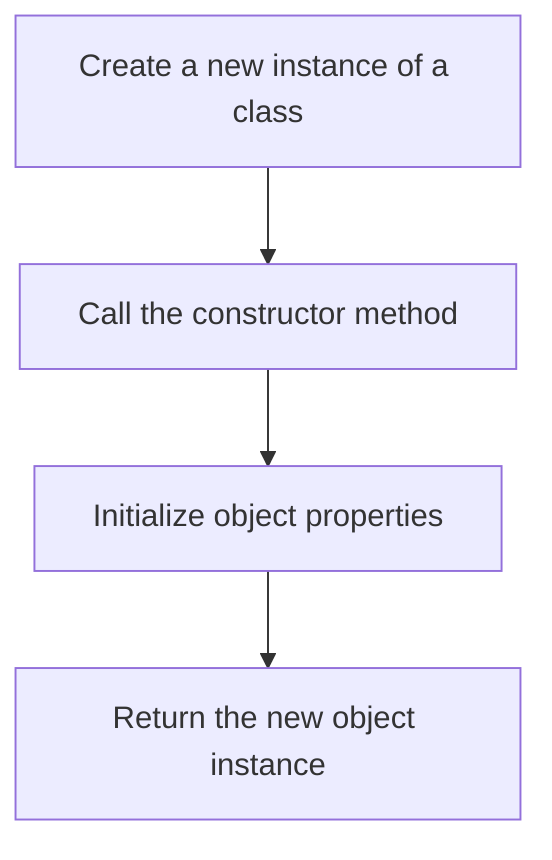

## 5.2 Defining Class Constructors

Welcome to the exciting world of JavaScript classes! In this section, we will delve into the concept of class constructors, a fundamental aspect of object-oriented programming (OOP) in JavaScript. By the end of this chapter, you will understand how to define a constructor within a class, the role it plays in setting the initial state of an object, and how to work with classes both with and without constructors. Let's embark on this journey together!

### Understanding Class Constructors

In JavaScript, a class constructor is a special method used to initialize objects created from a class. When you create a new instance of a class, the constructor method is automatically called, allowing you to set up the initial state of the object. This is similar to how constructors work in other object-oriented languages like Java or C++.

#### The Role of the Constructor

The primary role of a constructor is to initialize the properties of an object. It sets up the initial values for the object's properties and can also perform any setup tasks required when the object is created. Constructors provide a way to pass arguments to an object at the time of creation, allowing for flexible and dynamic initialization.

### Defining a Constructor in a Class

Let's start by looking at how to define a constructor within a class. In JavaScript, the constructor is defined using the `constructor` keyword inside the class body. Here's a simple example:

```javascript
class Car {
  constructor(make, model, year) {
    this.make = make;
    this.model = model;
    this.year = year;
  }
}

// Creating a new instance of the Car class
const myCar = new Car('Toyota', 'Corolla', 2020);

console.log(myCar.make); // Output: Toyota
console.log(myCar.model); // Output: Corolla
console.log(myCar.year); // Output: 2020
```

In this example, we define a `Car` class with a constructor that takes three parameters: `make`, `model`, and `year`. Inside the constructor, we use the `this` keyword to assign these parameters to the object's properties. When we create a new instance of the `Car` class using the `new` keyword, the constructor is called, and the object's properties are initialized with the provided values.

### The Importance of the `this` Keyword

The `this` keyword is crucial in constructors as it refers to the current instance of the class. It allows you to set properties on the object being created. Without `this`, you wouldn't be able to assign values to the object's properties.

### Classes Without Constructors

It's possible to define a class without explicitly defining a constructor. In such cases, JavaScript provides a default constructor. This default constructor is essentially an empty function that does nothing. Here's an example:

```javascript
class Animal {
  // No constructor defined
}

// Creating an instance of the Animal class
const myAnimal = new Animal();

console.log(myAnimal); // Output: Animal {}
```

In this example, the `Animal` class does not have an explicit constructor. When we create an instance of the class, JavaScript uses a default constructor, which doesn't initialize any properties.

### Default Constructors

When no constructor is defined in a class, JavaScript automatically provides a default constructor. This default constructor is equivalent to an empty function that takes no arguments and does nothing. It is important to note that if you define any constructor in a class, the default constructor is no longer provided.

### Constructors with Default Parameters

JavaScript allows you to define default parameters in constructors, providing a way to set default values for object properties if no arguments are passed. Here's an example:

```javascript
class Book {
  constructor(title = 'Unknown', author = 'Unknown', year = 0) {
    this.title = title;
    this.author = author;
    this.year = year;
  }
}

// Creating a new instance of the Book class with default parameters
const myBook = new Book();

console.log(myBook.title); // Output: Unknown
console.log(myBook.author); // Output: Unknown
console.log(myBook.year); // Output: 0
```

In this example, the `Book` class constructor has default parameters for `title`, `author`, and `year`. If no arguments are provided when creating an instance, these default values are used.

### Constructors and Inheritance

When working with class inheritance, constructors play a crucial role. In a derived class, you can call the constructor of the base class using the `super` keyword. This allows you to inherit properties and methods from the base class. Let's see an example:

```javascript
class Vehicle {
  constructor(type) {
    this.type = type;
  }
}

class Motorcycle extends Vehicle {
  constructor(make, model) {
    super('Motorcycle'); // Call the base class constructor
    this.make = make;
    this.model = model;
  }
}

// Creating an instance of the Motorcycle class
const myMotorcycle = new Motorcycle('Harley-Davidson', 'Sportster');

console.log(myMotorcycle.type); // Output: Motorcycle
console.log(myMotorcycle.make); // Output: Harley-Davidson
console.log(myMotorcycle.model); // Output: Sportster
```

In this example, the `Motorcycle` class extends the `Vehicle` class. The `super` keyword is used to call the constructor of the `Vehicle` class, allowing the `Motorcycle` class to inherit the `type` property.

### Constructor Overloading

JavaScript does not support constructor overloading in the traditional sense, as seen in languages like Java or C++. However, you can achieve similar functionality by using default parameters or by checking the number and types of arguments passed to the constructor. Here's an example:

```javascript
class Person {
  constructor(name, age) {
    if (typeof name === 'string' && typeof age === 'number') {
      this.name = name;
      this.age = age;
    } else if (typeof name === 'string') {
      this.name = name;
      this.age = 0; // Default age
    } else {
      this.name = 'Unknown';
      this.age = 0;
    }
  }
}

// Creating instances of the Person class
const person1 = new Person('Alice', 30);
const person2 = new Person('Bob');
const person3 = new Person();

console.log(person1.name, person1.age); // Output: Alice 30
console.log(person2.name, person2.age); // Output: Bob 0
console.log(person3.name, person3.age); // Output: Unknown 0
```

In this example, the `Person` class constructor checks the types of the arguments passed and assigns default values if necessary, simulating constructor overloading.

### Best Practices for Using Constructors

- **Keep Constructors Simple**: Avoid complex logic in constructors. They should primarily focus on initializing object properties.
- **Use Default Parameters**: Provide default parameters to make constructors more flexible and reduce the need for multiple constructor overloads.
- **Avoid Side Effects**: Constructors should not perform actions that have side effects, such as making network requests or modifying global state.
- **Document Parameter Expectations**: Clearly document the parameters expected by the constructor to ensure correct usage.

### Visualizing Class Constructors

To better understand how class constructors work, let's visualize the process of creating an object from a class using a flowchart.



This flowchart illustrates the sequence of steps involved when creating a new instance of a class. The constructor method is called, object properties are initialized, and the new object instance is returned.

### Try It Yourself

Now that we've covered the basics of class constructors, it's time for you to experiment! Try modifying the code examples provided in this section to see how constructors work in different scenarios. Here are a few suggestions:

- **Add Additional Properties**: Extend the `Car` class to include additional properties like `color` and `mileage`.
- **Experiment with Default Parameters**: Modify the `Book` class to include a default genre parameter.
- **Create a New Class**: Define a new class for a `Laptop` with properties like `brand`, `model`, and `price`.

### References and Further Reading

- [MDN Web Docs: Classes](https://developer.mozilla.org/en-US/docs/Web/JavaScript/Reference/Classes)
- [W3Schools: JavaScript Classes](https://www.w3schools.com/js/js_classes.asp)

### Knowledge Check

Before we wrap up, let's reinforce what we've learned with a few questions:

1. What is the primary role of a class constructor in JavaScript?
2. How do you define a constructor in a JavaScript class?
3. What happens if you don't define a constructor in a class?
4. How can you simulate constructor overloading in JavaScript?
5. What is the `super` keyword used for in class inheritance?

### Embrace the Journey

Remember, mastering class constructors is just one step in your journey to becoming proficient in JavaScript and object-oriented programming. As you continue to explore and experiment, you'll gain a deeper understanding of how to create robust and flexible applications. Keep experimenting, stay curious, and enjoy the journey!

## Quiz Time!



### What is the primary role of a class constructor in JavaScript?

- [x] To initialize the properties of an object
- [ ] To define methods for the class
- [ ] To create a new class
- [ ] To delete an object

> **Explanation:** The primary role of a class constructor is to initialize the properties of an object when it is created.

### How do you define a constructor in a JavaScript class?

- [x] Using the `constructor` keyword inside the class body
- [ ] Using the `init` keyword inside the class body
- [ ] Using a function outside the class
- [ ] Using the `new` keyword

> **Explanation:** In JavaScript, a constructor is defined using the `constructor` keyword inside the class body.

### What happens if you don't define a constructor in a class?

- [x] JavaScript provides a default constructor
- [ ] The class cannot be instantiated
- [ ] The class will throw an error
- [ ] The class will not have any properties

> **Explanation:** If no constructor is defined, JavaScript provides a default constructor that does nothing.

### How can you simulate constructor overloading in JavaScript?

- [x] By using default parameters and checking argument types
- [ ] By defining multiple constructors
- [ ] By using the `overload` keyword
- [ ] By using the `super` keyword

> **Explanation:** JavaScript does not support constructor overloading, but you can simulate it using default parameters and checking argument types.

### What is the `super` keyword used for in class inheritance?

- [x] To call the constructor of the base class
- [ ] To define a new class
- [ ] To delete a property
- [ ] To create a static method

> **Explanation:** The `super` keyword is used to call the constructor of the base class in a derived class.

### Which keyword is used to refer to the current instance of a class?

- [x] `this`
- [ ] `self`
- [ ] `instance`
- [ ] `object`

> **Explanation:** The `this` keyword is used to refer to the current instance of a class.

### What is the default value for a property if no arguments are passed to a constructor with default parameters?

- [x] The value specified as the default parameter
- [ ] `undefined`
- [ ] `null`
- [ ] `0`

> **Explanation:** If no arguments are passed, the default parameter value specified in the constructor is used.

### Can a constructor have side effects like modifying global state?

- [ ] Yes, it's recommended
- [x] No, constructors should avoid side effects
- [ ] Yes, if necessary
- [ ] No, it's not possible

> **Explanation:** Constructors should avoid side effects like modifying global state to ensure predictable behavior.

### What is the purpose of documenting parameter expectations in a constructor?

- [x] To ensure correct usage and understanding
- [ ] To increase code size
- [ ] To make the code run faster
- [ ] To create more constructors

> **Explanation:** Documenting parameter expectations helps ensure correct usage and understanding of the constructor.

### True or False: JavaScript supports traditional constructor overloading like Java.

- [ ] True
- [x] False

> **Explanation:** JavaScript does not support traditional constructor overloading like Java, but similar functionality can be achieved using default parameters and argument checks.


