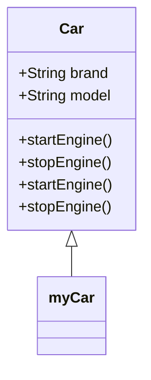
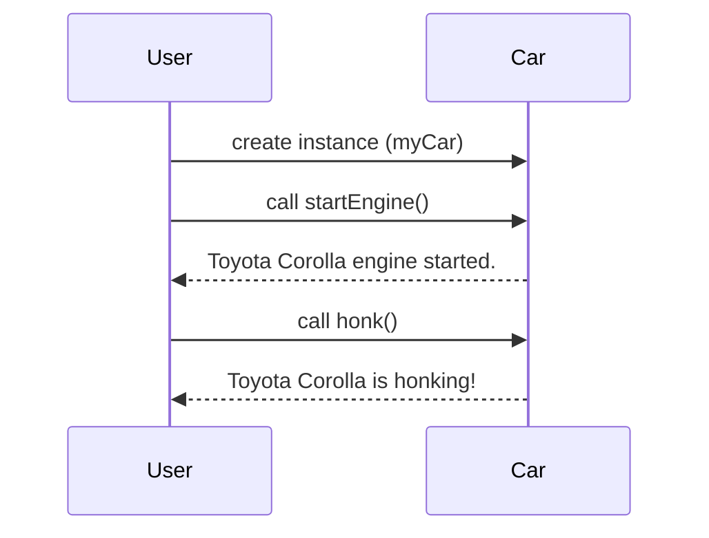

## 5.3 Creating Instance Methods

In this section, we will explore how to create instance methods in JavaScript using ES6 classes. Instance methods are functions that belong to an instance of a class, allowing us to define behavior that is specific to each object created from the class. By the end of this section, you'll understand how to define these methods, how they differ from other types of methods, and how to use them effectively in your JavaScript applications.

### Understanding Instance Methods

Instance methods are a fundamental concept in object-oriented programming (OOP). They allow objects to have behaviors that can be invoked on individual instances. In JavaScript, when we define a method inside a class, it becomes an instance method. These methods are shared across all instances of the class, thanks to JavaScript's prototype-based inheritance.

#### What is a Prototype?

Before diving into instance methods, it's essential to understand the concept of a prototype. In JavaScript, every object has a prototype, which is another object from which it inherits properties and methods. When we define a method inside a class, it is automatically added to the class's prototype. This means that all instances of the class share the same method, which is memory efficient.

### Defining Instance Methods in ES6 Classes

In ES6, classes provide a more straightforward syntax for creating objects and defining instance methods. Let's look at how we can define instance methods within a class.

```javascript
class Car {
  constructor(brand, model) {
    this.brand = brand;
    this.model = model;
  }

  // Instance method
  startEngine() {
    console.log(`${this.brand} ${this.model} engine started.`);
  }

  // Another instance method
  stopEngine() {
    console.log(`${this.brand} ${this.model} engine stopped.`);
  }
}

// Creating an instance of the Car class
const myCar = new Car('Toyota', 'Corolla');

// Calling instance methods
myCar.startEngine(); // Output: Toyota Corolla engine started.
myCar.stopEngine();  // Output: Toyota Corolla engine stopped.
```

In this example, `startEngine` and `stopEngine` are instance methods of the `Car` class. They are defined inside the class and can be called on any instance of the class.

### How Instance Methods Work

When you create an instance of a class, the instance methods are not copied to each object. Instead, they are stored in the prototype of the class. This means that all instances share the same method definition, which is efficient in terms of memory usage.

#### Prototype Chain

Let's visualize how instance methods are linked to the prototype chain:



In the diagram above, `myCar` is an instance of the `Car` class. The methods `startEngine` and `stopEngine` are part of the `Car` class's prototype, which `myCar` inherits.

### Instance Methods vs. Constructor Methods

It's important to distinguish between instance methods and methods defined within the constructor. Methods defined inside the constructor are not shared across instances. Instead, they are unique to each instance, which can lead to higher memory usage if many instances are created.

#### Example: Constructor Method

```javascript
class Car {
  constructor(brand, model) {
    this.brand = brand;
    this.model = model;
    this.startEngine = function() {
      console.log(`${this.brand} ${this.model} engine started.`);
    };
  }
}

// Creating instances
const car1 = new Car('Toyota', 'Corolla');
const car2 = new Car('Honda', 'Civic');

// Each instance has its own startEngine method
console.log(car1.startEngine === car2.startEngine); // Output: false
```

In this example, `startEngine` is defined inside the constructor, making it a unique method for each instance. This contrasts with instance methods, which are shared across instances.

### Advantages of Instance Methods

1. **Memory Efficiency**: Since instance methods are stored in the prototype, they are not duplicated for each instance, saving memory.
2. **Consistency**: All instances share the same method implementation, ensuring consistent behavior across objects.
3. **Ease of Maintenance**: Changes to an instance method affect all instances, making it easier to update and maintain code.

### Using Instance Methods Effectively

To make the most of instance methods, consider the following best practices:

- **Encapsulation**: Use instance methods to encapsulate behavior that is specific to the class. This keeps your code organized and modular.
- **Reusability**: Define methods that can be reused across different instances, promoting code reuse.
- **Clarity**: Keep method names descriptive and consistent with their functionality to improve code readability.

### Try It Yourself

Let's experiment with instance methods by modifying the `Car` class. Add a new method called `honk` that prints a message like "Toyota Corolla is honking!" and test it on an instance.

```javascript
class Car {
  constructor(brand, model) {
    this.brand = brand;
    this.model = model;
  }

  startEngine() {
    console.log(`${this.brand} ${this.model} engine started.`);
  }

  stopEngine() {
    console.log(`${this.brand} ${this.model} engine stopped.`);
  }

  // New instance method
  honk() {
    console.log(`${this.brand} ${this.model} is honking!`);
  }
}

// Create an instance and test the new method
const myCar = new Car('Toyota', 'Corolla');
myCar.honk(); // Output: Toyota Corolla is honking!
```

### Visualizing Method Calls

To better understand how method calls work, let's visualize the process using a sequence diagram.



In this diagram, the `User` creates an instance of the `Car` class and calls the `startEngine` and `honk` methods. The `Car` class responds with the appropriate messages.

### Common Pitfalls and Solutions

1. **Forgetting `this`**: Always use `this` to refer to instance properties within methods. Forgetting `this` can lead to errors or unexpected behavior.
   
   ```javascript
   class Car {
     constructor(brand, model) {
       this.brand = brand;
       this.model = model;
     }

     startEngine() {
       console.log(`${brand} ${model} engine started.`); // Error: brand is not defined
     }
   }
   ```

   **Solution**: Use `this.brand` and `this.model` to access instance properties.

2. **Method Overwriting**: Be cautious when defining methods with the same name in subclasses, as they can overwrite parent class methods.

   **Solution**: Use the `super` keyword to call the parent class method if needed.

### Knowledge Check

- What is an instance method, and how does it differ from a method defined inside the constructor?
- Why are instance methods more memory efficient than constructor methods?
- How can you call an instance method on an object?

### Summary

In this section, we've learned how to create and use instance methods in JavaScript ES6 classes. We've explored the benefits of using instance methods, such as memory efficiency and consistency, and provided practical examples to illustrate their usage. By understanding and applying these concepts, you can write more organized and efficient JavaScript code.

Remember, this is just the beginning. As you progress, you'll build more complex and interactive applications. Keep experimenting, stay curious, and enjoy the journey!

## Quiz Time!



### What is an instance method in JavaScript?

- [x] A method that belongs to an instance of a class.
- [ ] A method that belongs to the global object.
- [ ] A method that is defined outside of any class.
- [ ] A method that is unique to each instance and defined inside the constructor.

> **Explanation:** An instance method is a function defined within a class that can be called on instances of that class.

### Where are instance methods stored in JavaScript?

- [x] In the prototype of the class.
- [ ] In the constructor of the class.
- [ ] In each instance of the class.
- [ ] In the global scope.

> **Explanation:** Instance methods are stored in the prototype of the class, allowing them to be shared across all instances.

### How do instance methods improve memory efficiency?

- [x] They are shared across all instances, reducing duplication.
- [ ] They are stored in the global object.
- [ ] They are unique to each instance.
- [ ] They are stored in local variables.

> **Explanation:** Instance methods are stored in the prototype, meaning they are not duplicated for each instance, which saves memory.

### What keyword is used to access instance properties within a method?

- [x] this
- [ ] self
- [ ] instance
- [ ] object

> **Explanation:** The `this` keyword is used to access properties of the current instance within a method.

### What happens if you define a method inside the constructor?

- [x] Each instance gets its own copy of the method.
- [ ] The method is shared across all instances.
- [ ] The method is stored in the prototype.
- [ ] The method cannot be called on instances.

> **Explanation:** Methods defined inside the constructor are unique to each instance, leading to separate copies for each object.

### How can you call an instance method on an object?

- [x] By using the dot notation with the object.
- [ ] By using the `call` function.
- [ ] By using the `apply` function.
- [ ] By using the `bind` function.

> **Explanation:** Instance methods are called using dot notation, e.g., `object.methodName()`.

### What is the benefit of using instance methods for encapsulation?

- [x] They keep behavior specific to the class organized and modular.
- [ ] They allow global access to methods.
- [ ] They make methods unique to each instance.
- [ ] They store methods in local variables.

> **Explanation:** Instance methods encapsulate behavior within the class, promoting organized and modular code.

### What is the result of calling a method defined in the constructor on two different instances?

- [x] Each instance will have its own separate method.
- [ ] Both instances will share the same method.
- [ ] The method will not be callable.
- [ ] The method will be stored in the prototype.

> **Explanation:** Methods defined in the constructor are unique to each instance, resulting in separate copies.

### How can you visualize the relationship between a class and its instances?

- [x] By using a class diagram.
- [ ] By using a pie chart.
- [ ] By using a bar graph.
- [ ] By using a line chart.

> **Explanation:** A class diagram is a visual representation of the relationship between a class and its instances.

### True or False: Instance methods are defined inside the constructor.

- [ ] True
- [x] False

> **Explanation:** Instance methods are defined inside the class but outside the constructor, and they are stored in the prototype.


