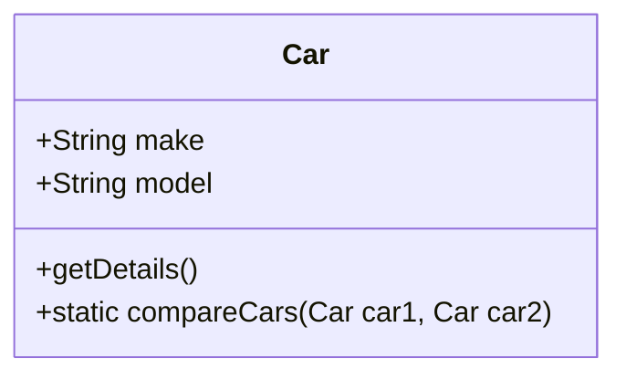

## 5.4 Static Methods and Properties

In the world of object-oriented programming (OOP), understanding the distinction between static and instance methods is crucial. JavaScript, being a versatile language, offers both of these features, allowing developers to write more organized and efficient code. In this section, we will delve into static methods and properties, exploring their purpose, usage, and how they differ from instance methods.

### Introduction to the `static` Keyword

The `static` keyword in JavaScript is used to define methods and properties that belong to the class itself, rather than to instances of the class. This means that static methods and properties can be accessed directly on the class without needing to create an instance. This is particularly useful for utility functions or constants that are relevant to the class as a whole, rather than any specific object created from the class.

#### Syntax and Usage

To define a static method or property, you simply prefix the method or property name with the `static` keyword within the class body. Here's a basic example:

```javascript
class MathUtilities {
  static PI = 3.14159;

  static calculateCircumference(radius) {
    return 2 * MathUtilities.PI * radius;
  }
}

// Accessing static property and method
console.log(MathUtilities.PI); // 3.14159
console.log(MathUtilities.calculateCircumference(5)); // 31.4159
```

In this example, `PI` is a static property, and `calculateCircumference` is a static method. Both can be accessed directly on the `MathUtilities` class without creating an instance.

### Static Methods vs. Instance Methods

Static methods differ from instance methods in several key ways:

1. **Belonging**: Static methods belong to the class itself, while instance methods belong to the objects created from the class.
2. **Access**: Static methods are accessed using the class name, whereas instance methods are accessed using an instance of the class.
3. **`this` Keyword**: Within static methods, the `this` keyword does not refer to an instance of the class. Instead, it refers to the class itself.

#### Example of Instance vs. Static Methods

Let's look at an example to illustrate these differences:

```javascript
class Car {
  constructor(make, model) {
    this.make = make;
    this.model = model;
  }

  // Instance method
  getDetails() {
    return `${this.make} ${this.model}`;
  }

  // Static method
  static compareCars(car1, car2) {
    return car1.make === car2.make && car1.model === car2.model;
  }
}

const car1 = new Car('Toyota', 'Corolla');
const car2 = new Car('Honda', 'Civic');

console.log(car1.getDetails()); // Toyota Corolla
console.log(Car.compareCars(car1, car2)); // false
```

In this code, `getDetails` is an instance method that can be called on any `Car` object, while `compareCars` is a static method that compares two `Car` instances.

### When to Use Static Methods

Static methods are ideal for operations that are related to the class but do not require an instance to function. Here are some scenarios where static methods are beneficial:

- **Utility Functions**: Functions that perform operations related to the class but do not depend on instance data. For example, mathematical calculations or data validation functions.
- **Factory Methods**: Methods that create instances of the class in a specific way. They can be used to encapsulate the logic of object creation.
- **Constants**: Defining constant values that are relevant to the class as a whole.

#### Example of a Utility Static Method

Consider a utility class for string operations:

```javascript
class StringUtilities {
  static toUpperCase(str) {
    return str.toUpperCase();
  }
}

console.log(StringUtilities.toUpperCase('hello')); // HELLO
```

Here, `toUpperCase` is a static method that converts a string to uppercase. It doesn't require an instance of `StringUtilities` to work.

### Limitations of Static Methods

While static methods are powerful, they come with certain limitations:

- **No Access to Instance Data**: Static methods cannot access instance properties or methods directly. They operate independently of any object instance.
- **Limited Use Cases**: Overusing static methods can lead to less flexible code. They should be used judiciously, primarily for operations that are truly independent of instance data.

### Visualizing Static Methods and Properties

To better understand the relationship between static and instance methods, let's visualize this concept using a class diagram:



In this diagram, `make` and `model` are instance properties, `getDetails` is an instance method, and `compareCars` is a static method. The static method is associated with the class itself, not with any specific instance.

### Practical Examples of Static Methods

Let's explore some practical examples to solidify our understanding of static methods and properties.

#### Example 1: A Simple Logger Class

A logger class can be used to log messages with different severity levels. Static methods are perfect for this task:

```javascript
class Logger {
  static logInfo(message) {
    console.log(`INFO: ${message}`);
  }

  static logWarning(message) {
    console.warn(`WARNING: ${message}`);
  }

  static logError(message) {
    console.error(`ERROR: ${message}`);
  }
}

// Using the Logger class
Logger.logInfo('This is an informational message.');
Logger.logWarning('This is a warning message.');
Logger.logError('This is an error message.');
```

In this example, `Logger` provides static methods for logging messages with different severity levels. These methods can be called directly on the class.

#### Example 2: A Configuration Manager

A configuration manager class can use static properties to store configuration settings:

```javascript
class ConfigManager {
  static settings = {
    apiUrl: 'https://api.example.com',
    timeout: 5000
  };

  static getSetting(key) {
    return ConfigManager.settings[key];
  }
}

// Accessing configuration settings
console.log(ConfigManager.getSetting('apiUrl')); // https://api.example.com
```

Here, `settings` is a static property that holds configuration settings, and `getSetting` is a static method to retrieve them.

### Try It Yourself

Now it's your turn! Try modifying the examples above to add new static methods or properties. For instance, you could add a static method to the `Logger` class that logs messages to a file instead of the console. Experimenting with these examples will help reinforce your understanding of static methods and properties.

### Summary

In this section, we've explored the concept of static methods and properties in JavaScript. We've learned that:

- Static methods and properties belong to the class itself, not to instances of the class.
- They are useful for utility functions, factory methods, and constants.
- Static methods cannot access instance properties or methods directly.
- Overusing static methods can lead to less flexible code, so they should be used judiciously.

Remember, mastering static methods and properties is an important step in becoming proficient in object-oriented programming with JavaScript. Keep practicing and experimenting with these concepts to deepen your understanding.

## Quiz Time!



### What does the `static` keyword do in JavaScript?

- [x] It defines methods and properties that belong to the class itself.
- [ ] It defines methods and properties that belong to instances of the class.
- [ ] It defines private methods and properties.
- [ ] It defines asynchronous methods and properties.

> **Explanation:** The `static` keyword is used to define methods and properties that belong to the class itself, not to instances of the class.

### How do you access a static method in JavaScript?

- [x] By using the class name followed by the method name.
- [ ] By using an instance of the class followed by the method name.
- [ ] By using the `this` keyword inside the method.
- [ ] By using the `super` keyword inside the method.

> **Explanation:** Static methods are accessed using the class name, not an instance of the class.

### Can static methods access instance properties directly?

- [ ] Yes, they can access instance properties directly.
- [x] No, they cannot access instance properties directly.
- [ ] Yes, but only if they use the `this` keyword.
- [ ] Yes, but only if they are called from an instance method.

> **Explanation:** Static methods cannot access instance properties directly because they belong to the class, not to any specific instance.

### Which of the following is a good use case for static methods?

- [x] Utility functions that do not depend on instance data.
- [ ] Methods that modify instance properties.
- [ ] Methods that require access to the `this` keyword.
- [ ] Methods that are called frequently by instances.

> **Explanation:** Static methods are ideal for utility functions that do not depend on instance data.

### What is the output of the following code?

```javascript
class Example {
  static greet() {
    return 'Hello, World!';
  }
}

console.log(Example.greet());
```

- [x] "Hello, World!"
- [ ] An error occurs because `greet` is static.
- [ ] `undefined`
- [ ] "Hello, Example!"

> **Explanation:** The static method `greet` is called on the `Example` class, and it returns "Hello, World!".

### What is a limitation of static methods?

- [x] They cannot access instance properties or methods.
- [ ] They can only be used in ES6 classes.
- [ ] They are slower than instance methods.
- [ ] They require more memory than instance methods.

> **Explanation:** Static methods cannot access instance properties or methods because they belong to the class itself.

### Which keyword is used to define a static property?

- [x] `static`
- [ ] `this`
- [ ] `super`
- [ ] `private`

> **Explanation:** The `static` keyword is used to define static properties and methods.

### What is the purpose of a static property?

- [x] To store data that is relevant to the class as a whole.
- [ ] To store data that is unique to each instance.
- [ ] To store data that is private to the class.
- [ ] To store data that is shared between instances.

> **Explanation:** Static properties are used to store data that is relevant to the class as a whole, not to any specific instance.

### True or False: Static methods can be called on instances of the class.

- [ ] True
- [x] False

> **Explanation:** Static methods cannot be called on instances of the class; they must be called on the class itself.

### Which of the following is a correct way to define a static method?

- [x] `static myMethod() { /* code */ }`
- [ ] `myMethod() static { /* code */ }`
- [ ] `static: myMethod() { /* code */ }`
- [ ] `myMethod static() { /* code */ }`

> **Explanation:** The correct syntax for defining a static method is to use the `static` keyword followed by the method name and its body.



Remember, this is just the beginning. As you progress, you'll build more complex and interactive applications. Keep experimenting, stay curious, and enjoy the journey!
