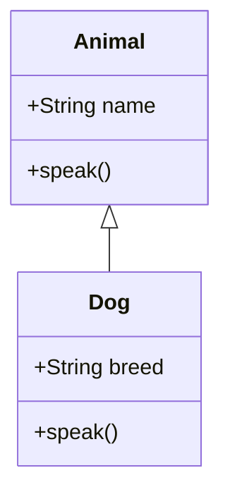

## 5.5 Inheritance with extends and super

In this section, we will explore the concepts of inheritance in JavaScript using the `extends` and `super` keywords. These tools allow us to create class hierarchies, enabling subclasses to inherit properties and methods from parent classes. This is a fundamental aspect of object-oriented programming (OOP) that promotes code reuse and organization.

### Understanding Inheritance

Inheritance is a mechanism by which one class (the child or subclass) can inherit properties and methods from another class (the parent or superclass). This allows us to create a new class based on an existing class, extending its functionality without modifying the original class.

### Creating a Subclass with extends

The `extends` keyword in JavaScript is used to create a subclass that inherits from a parent class. Let's start by looking at a simple example:

```javascript
// Parent class
class Animal {
  constructor(name) {
    this.name = name;
  }

  speak() {
    console.log(`${this.name} makes a noise.`);
  }
}

// Subclass
class Dog extends Animal {
  constructor(name, breed) {
    super(name); // Call the parent class constructor
    this.breed = breed;
  }

  speak() {
    console.log(`${this.name} barks.`);
  }
}

const dog = new Dog('Rex', 'German Shepherd');
dog.speak(); // Output: Rex barks.
```

In this example, we have a parent class `Animal` with a constructor that initializes the `name` property and a `speak` method. The `Dog` class extends `Animal`, inheriting its properties and methods. The `Dog` class also has its own constructor and a `speak` method that overrides the parent class's method.

### Using super to Call the Parent Class Constructor

The `super()` function is used within a subclass constructor to call the constructor of its parent class. This is necessary to properly initialize the parent class's properties within the subclass.

#### Why Use super()?

When you create a subclass, the JavaScript engine requires you to call `super()` before you can use `this` in the subclass constructor. This ensures that the parent class's constructor is executed, setting up any necessary properties or logic.

#### Example of super()

Let's expand on the previous example to see how `super()` is used:

```javascript
// Parent class
class Animal {
  constructor(name) {
    this.name = name;
  }

  speak() {
    console.log(`${this.name} makes a noise.`);
  }
}

// Subclass
class Dog extends Animal {
  constructor(name, breed) {
    super(name); // Call the parent class constructor
    this.breed = breed; // Initialize subclass-specific property
  }

  speak() {
    console.log(`${this.name} barks.`);
  }
}

const dog = new Dog('Buddy', 'Golden Retriever');
console.log(dog.name); // Output: Buddy
console.log(dog.breed); // Output: Golden Retriever
```

In this example, `super(name)` calls the `Animal` class constructor, passing the `name` argument to it. This initializes the `name` property in the `Animal` class, which `Dog` inherits.

### Overriding Methods in Subclasses

One of the powerful features of inheritance is the ability to override methods in subclasses. This allows a subclass to provide a specific implementation of a method that is already defined in its parent class.

#### Example of Method Overriding

Continuing with our `Animal` and `Dog` example, let's see how method overriding works:

```javascript
// Parent class
class Animal {
  constructor(name) {
    this.name = name;
  }

  speak() {
    console.log(`${this.name} makes a noise.`);
  }
}

// Subclass
class Dog extends Animal {
  constructor(name, breed) {
    super(name);
    this.breed = breed;
  }

  // Override the speak method
  speak() {
    console.log(`${this.name} barks.`);
  }
}

const dog = new Dog('Max', 'Bulldog');
dog.speak(); // Output: Max barks.
```

In this example, the `Dog` class overrides the `speak` method of the `Animal` class. When `dog.speak()` is called, the overridden method in the `Dog` class is executed, not the one in the `Animal` class.

### Inheritance Chains and Prototype Relationships

In JavaScript, classes are syntactical sugar over the existing prototype-based inheritance. When you use `extends`, JavaScript sets up the prototype chain between the subclass and the superclass.

#### Prototype Chain

The prototype chain is a series of links between objects that JavaScript uses to resolve property and method lookups. When you access a property or method on an object, JavaScript first looks for it on the object itself. If it doesn't find it, it looks up the prototype chain.

#### Visualizing the Prototype Chain

Here's a diagram to help visualize the prototype chain when using `extends`:



In this diagram, `Dog` inherits from `Animal`. The `Dog` class has access to the properties and methods of `Animal` through the prototype chain.

### Key Points to Remember

- **extends**: Use this keyword to create a subclass that inherits from a parent class.
- **super()**: Call this function in a subclass constructor to invoke the parent class constructor.
- **Method Overriding**: Subclasses can override methods from the parent class to provide specific functionality.
- **Prototype Chain**: JavaScript uses a prototype chain to resolve property and method lookups, allowing subclasses to inherit from superclasses.

### Try It Yourself

Experiment with the following code to deepen your understanding of inheritance:

1. Create a new subclass `Cat` that extends `Animal`.
2. Override the `speak` method in `Cat` to output a different message.
3. Add a new method to `Cat` that is not present in `Animal`.

```javascript
// Your code here
```

### Additional Resources

- [MDN Web Docs: Classes](https://developer.mozilla.org/en-US/docs/Web/JavaScript/Reference/Classes)
- [W3Schools: JavaScript Classes](https://www.w3schools.com/js/js_classes.asp)

### Knowledge Check

- What is the purpose of the `extends` keyword in JavaScript?
- How does the `super()` function work in a subclass constructor?
- What is method overriding, and why is it useful?

### Embrace the Journey

Remember, mastering inheritance in JavaScript is a step towards writing more organized and reusable code. As you continue to explore object-oriented programming, you'll discover new ways to structure your applications efficiently. Keep experimenting, stay curious, and enjoy the journey!

## Quiz Time!



### What does the `extends` keyword do in JavaScript?

- [x] It creates a subclass that inherits from a parent class.
- [ ] It defines a new method in a class.
- [ ] It initializes a class constructor.
- [ ] It deletes a method from a class.

> **Explanation:** The `extends` keyword is used to create a subclass that inherits properties and methods from a parent class.

### How do you call the parent class constructor in a subclass?

- [x] Using the `super()` function.
- [ ] Using the `extends` keyword.
- [ ] By directly calling the parent class name.
- [ ] By using the `this` keyword.

> **Explanation:** The `super()` function is used within a subclass constructor to call the parent class constructor.

### What is method overriding?

- [x] Providing a specific implementation of a method in a subclass that is already defined in its parent class.
- [ ] Creating a new method in a subclass.
- [ ] Removing a method from a parent class.
- [ ] Changing the parameters of a method in a parent class.

> **Explanation:** Method overriding allows a subclass to provide a specific implementation of a method that is already defined in its parent class.

### What is the prototype chain?

- [x] A series of links between objects that JavaScript uses to resolve property and method lookups.
- [ ] A method to create new objects.
- [ ] A function to delete properties from an object.
- [ ] A way to initialize class constructors.

> **Explanation:** The prototype chain is a series of links between objects that JavaScript uses to resolve property and method lookups.

### Which keyword is used to create a subclass in JavaScript?

- [x] extends
- [ ] super
- [ ] this
- [ ] class

> **Explanation:** The `extends` keyword is used to create a subclass that inherits from a parent class.

### What happens if you don't call `super()` in a subclass constructor?

- [x] JavaScript will throw an error.
- [ ] The subclass will inherit all properties and methods.
- [ ] The subclass will not be created.
- [ ] The subclass will work as expected.

> **Explanation:** If you don't call `super()` in a subclass constructor, JavaScript will throw an error because it requires the parent class constructor to be called before using `this`.

### Can a subclass have its own methods?

- [x] Yes, a subclass can have its own methods.
- [ ] No, a subclass can only inherit methods.
- [ ] Yes, but only if they are also in the parent class.
- [ ] No, methods are not allowed in subclasses.

> **Explanation:** A subclass can have its own methods in addition to the methods it inherits from the parent class.

### What is the purpose of the `super()` function?

- [x] To call the parent class constructor from a subclass.
- [ ] To create a new class.
- [ ] To delete a method from a class.
- [ ] To override a method in a class.

> **Explanation:** The `super()` function is used to call the parent class constructor from a subclass.

### Can a subclass override multiple methods from a parent class?

- [x] Yes, a subclass can override multiple methods.
- [ ] No, a subclass can only override one method.
- [ ] Yes, but only if they are static methods.
- [ ] No, overriding is not allowed in subclasses.

> **Explanation:** A subclass can override multiple methods from a parent class, providing specific implementations for each.

### True or False: The `extends` keyword is only used for method inheritance.

- [ ] True
- [x] False

> **Explanation:** False. The `extends` keyword is used for both property and method inheritance, allowing a subclass to inherit all features of a parent class.


