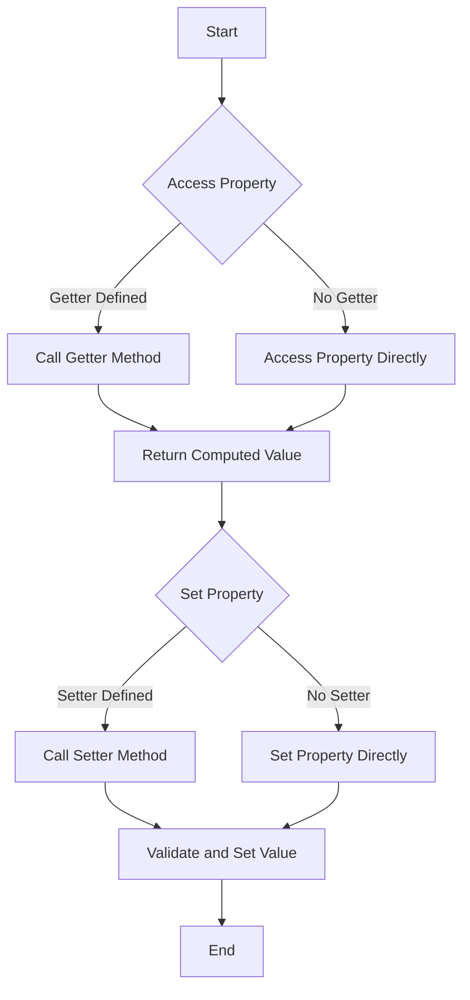

## 5.7 Getters and Setters in Classes

In this section, we will delve into the world of getters and setters in JavaScript ES6 classes. Getters and setters are special methods that allow you to control access to object properties. They are instrumental in encapsulating data, providing a way to add logic around property access, and ensuring data integrity through validation. Let's explore how to define and use these methods effectively.

### Understanding Getters and Setters

Before we dive into the specifics of getters and setters in ES6 classes, let's clarify what these terms mean:

- **Getters**: Methods that get the value of a specific property. They allow you to access property values in a controlled manner.
- **Setters**: Methods that set the value of a specific property. They enable you to validate and manipulate data before assigning it to a property.

### Why Use Getters and Setters?

Getters and setters offer several advantages:

1. **Encapsulation**: They encapsulate the internal representation of an object, allowing you to change the internal implementation without affecting external code.
2. **Validation**: Setters can include validation logic to ensure that only valid data is assigned to a property.
3. **Computed Properties**: Getters can compute and return values dynamically based on other properties.
4. **Read-Only Properties**: By defining only a getter, you can create read-only properties.
5. **Debugging and Logging**: You can add logging or debugging information within getters and setters to track property access and changes.

### Defining Getters and Setters in ES6 Classes

In ES6 classes, getters and setters are defined using the `get` and `set` keywords. Let's see how this works with a simple example:

```javascript
class Person {
  constructor(firstName, lastName) {
    this._firstName = firstName;
    this._lastName = lastName;
  }

  // Getter for fullName
  get fullName() {
    return `${this._firstName} ${this._lastName}`;
  }

  // Setter for fullName
  set fullName(name) {
    const [firstName, lastName] = name.split(' ');
    this._firstName = firstName;
    this._lastName = lastName;
  }
}

const person = new Person('John', 'Doe');
console.log(person.fullName); // Output: John Doe

person.fullName = 'Jane Smith';
console.log(person.fullName); // Output: Jane Smith
```

In this example, we have a `Person` class with a `fullName` property. The getter method retrieves the full name by concatenating the first and last names, while the setter method splits a full name string into first and last names and assigns them to the respective properties.

### Benefits of Using Getters and Setters

#### 1. Data Validation

One of the primary benefits of setters is the ability to validate data before it is assigned to a property. This ensures that your objects remain in a valid state. Let's enhance our previous example to include validation:

```javascript
class Person {
  constructor(firstName, lastName) {
    this._firstName = firstName;
    this._lastName = lastName;
  }

  get fullName() {
    return `${this._firstName} ${this._lastName}`;
  }

  set fullName(name) {
    const [firstName, lastName] = name.split(' ');
    if (!firstName || !lastName) {
      throw new Error('Invalid full name');
    }
    this._firstName = firstName;
    this._lastName = lastName;
  }
}

const person = new Person('John', 'Doe');
try {
  person.fullName = 'Jane';
} catch (error) {
  console.error(error.message); // Output: Invalid full name
}
```

In this version, the setter method checks if both a first and last name are provided. If not, it throws an error, preventing invalid data from being assigned.

#### 2. Computed Properties

Getters can be used to create computed properties, which are properties whose values are derived from other properties. This can be particularly useful for calculations or formatting:

```javascript
class Rectangle {
  constructor(width, height) {
    this._width = width;
    this._height = height;
  }

  get area() {
    return this._width * this._height;
  }
}

const rectangle = new Rectangle(5, 10);
console.log(rectangle.area); // Output: 50
```

In this example, the `area` property is computed based on the `width` and `height` properties. The getter method calculates and returns the area whenever it is accessed.

#### 3. Read-Only Properties

By defining only a getter and omitting the setter, you can create read-only properties. This is useful when you want to expose certain data without allowing it to be modified:

```javascript
class Circle {
  constructor(radius) {
    this._radius = radius;
  }

  get diameter() {
    return this._radius * 2;
  }
}

const circle = new Circle(5);
console.log(circle.diameter); // Output: 10

// Attempting to set the diameter will have no effect
circle.diameter = 20;
console.log(circle.diameter); // Output: 10
```

In this example, the `diameter` property is read-only. Attempting to set it does nothing because there is no setter defined.

### Performance Considerations

While getters and setters provide powerful capabilities, they can introduce some performance overhead. This is because each access to a property involves a function call. However, in most cases, this overhead is negligible and outweighed by the benefits of encapsulation and validation.

If performance is a critical concern, consider the following:

- **Use getters and setters judiciously**: Only use them when necessary for encapsulation, validation, or computed properties.
- **Profile your code**: Use JavaScript profiling tools to identify performance bottlenecks.
- **Optimize critical paths**: If a getter or setter is on a performance-critical path, consider optimizing the logic within the method.

### Try It Yourself

Now that we've covered the basics of getters and setters, try modifying the code examples to deepen your understanding. Here are a few suggestions:

1. **Add Validation**: Modify the `Rectangle` class to include validation in the setter methods for `width` and `height` to ensure they are positive numbers.

2. **Create a Computed Property**: Add a `perimeter` computed property to the `Rectangle` class that calculates and returns the perimeter based on `width` and `height`.

3. **Experiment with Read-Only Properties**: Create a class with a read-only property and try accessing and modifying it to see how it behaves.

### Visualizing Getters and Setters

To better understand how getters and setters work, let's visualize the process using a flowchart. This flowchart illustrates the flow of data when accessing and setting a property with getters and setters.



In this diagram, we see that when a property is accessed, the getter method is called if it is defined. Similarly, when a property is set, the setter method is called if it is defined, allowing for validation and manipulation of the data.

### Further Reading

To learn more about getters and setters in JavaScript, check out these resources:

- [MDN Web Docs: Working with Objects](https://developer.mozilla.org/en-US/docs/Web/JavaScript/Guide/Working_with_Objects)
- [JavaScript.info: Property Getters and Setters](https://javascript.info/property-accessors)

### Knowledge Check

Let's reinforce what we've learned with a few questions:

- What are the primary benefits of using getters and setters in JavaScript?
- How can getters be used to create computed properties?
- What happens if you define a getter but no setter for a property?
- How can setters be used for data validation?

### Summary

In this section, we've explored the powerful capabilities of getters and setters in JavaScript ES6 classes. We've seen how they can be used to encapsulate data, validate inputs, and create computed properties. By understanding and using getters and setters effectively, you can write more robust and maintainable JavaScript code.

Remember, this is just the beginning. As you progress, you'll build more complex and interactive applications using these concepts. Keep experimenting, stay curious, and enjoy the journey!

## Quiz Time!



### What is the primary purpose of getters in JavaScript classes?

- [x] To retrieve the value of a property
- [ ] To set the value of a property
- [ ] To delete a property
- [ ] To create a new property

> **Explanation:** Getters are used to retrieve or compute the value of a property in a controlled manner.

### What keyword is used to define a setter in a JavaScript class?

- [ ] get
- [x] set
- [ ] define
- [ ] function

> **Explanation:** The `set` keyword is used to define a setter method in a JavaScript class.

### How can you create a read-only property in a JavaScript class?

- [x] Define only a getter for the property
- [ ] Define only a setter for the property
- [ ] Define both a getter and a setter for the property
- [ ] Do not define any getter or setter for the property

> **Explanation:** By defining only a getter and no setter, you create a read-only property.

### What is a potential downside of using getters and setters?

- [ ] They make code harder to read
- [ ] They cannot be used in ES6 classes
- [x] They can introduce performance overhead
- [ ] They are not supported in all browsers

> **Explanation:** Getters and setters can introduce performance overhead due to the function calls involved in accessing properties.

### Which method allows you to validate data before assigning it to a property?

- [ ] Getter
- [x] Setter
- [ ] Constructor
- [ ] Method

> **Explanation:** Setters allow you to include validation logic before assigning data to a property.

### What happens if you try to set a property that only has a getter defined?

- [x] The property remains unchanged
- [ ] The property is set to `undefined`
- [ ] An error is thrown
- [ ] The property is deleted

> **Explanation:** If a property only has a getter, attempting to set it will have no effect, and the property remains unchanged.

### How can getters be used to create computed properties?

- [x] By calculating and returning a value based on other properties
- [ ] By directly setting a value to a property
- [ ] By deleting existing properties
- [ ] By creating new properties

> **Explanation:** Getters can compute and return values dynamically based on other properties, creating computed properties.

### What is the benefit of using getters and setters for debugging?

- [x] You can add logging or debugging information within them
- [ ] They automatically log all property accesses
- [ ] They prevent errors from occurring
- [ ] They make code run faster

> **Explanation:** Getters and setters allow you to add logging or debugging information to track property access and changes.

### Can setters be used to manipulate data before assigning it to a property?

- [x] Yes
- [ ] No

> **Explanation:** Setters can manipulate data before it is assigned to a property, allowing for validation and transformation.

### True or False: Getters and setters are only available in ES6 classes.

- [ ] True
- [x] False

> **Explanation:** Getters and setters can be used in both ES6 classes and traditional JavaScript objects.


