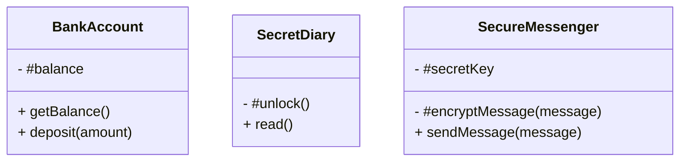

## 5.8 Private Fields and Methods (ES2021)

In the world of object-oriented programming (OOP), encapsulation is a fundamental concept that allows you to bundle data and methods that operate on the data within one unit, typically a class. Encapsulation also involves restricting access to certain components, which is essential for maintaining control over the internal state of an object. JavaScript, with the introduction of ES2021, has taken a significant step towards true encapsulation by introducing private fields and methods. Let's delve into how these features work and how they can be used to enhance your JavaScript classes.

### Understanding the '#' Notation for Private Fields and Methods

In JavaScript, private fields and methods are denoted by a `#` prefix. This syntax is part of the class fields proposal and provides a way to declare fields and methods that are not accessible from outside the class. This means that any attempt to access these private members from outside the class will result in a syntax error.

#### Defining Private Fields

Private fields are declared within a class using the `#` prefix. They are initialized directly within the class body, and their scope is limited to the class itself.

```javascript
class BankAccount {
  // Private field
  #balance;

  constructor(initialBalance) {
    this.#balance = initialBalance;
  }

  // Public method to access private field
  getBalance() {
    return this.#balance;
  }

  // Public method to modify private field
  deposit(amount) {
    if (amount > 0) {
      this.#balance += amount;
    }
  }
}

const account = new BankAccount(1000);
console.log(account.getBalance()); // 1000
account.deposit(500);
console.log(account.getBalance()); // 1500
console.log(account.#balance); // SyntaxError: Private field '#balance' must be declared in an enclosing class
```

In the example above, `#balance` is a private field that cannot be accessed directly from outside the `BankAccount` class. Instead, we provide public methods `getBalance` and `deposit` to interact with the private field.

#### Defining Private Methods

Similar to private fields, private methods are defined using the `#` prefix. These methods can only be called from within the class.

```javascript
class SecretDiary {
  // Private method
  #unlock() {
    console.log("Diary unlocked!");
  }

  // Public method
  read() {
    this.#unlock();
    console.log("Reading the diary...");
  }
}

const diary = new SecretDiary();
diary.read(); // Diary unlocked! Reading the diary...
diary.#unlock(); // SyntaxError: Private method '#unlock' is not accessible outside class 'SecretDiary'
```

In this example, the `#unlock` method is private and can only be invoked from within the `SecretDiary` class. Attempting to call it from outside the class results in a syntax error.

### How Private Members Are Inaccessible Outside the Class

The primary purpose of private fields and methods is to enforce encapsulation by restricting access to the internal state and behavior of a class. This is crucial for maintaining the integrity of an object's data and preventing unintended interference from external code.

#### Encapsulation Benefits

1. **Data Integrity**: By restricting access to private fields, you ensure that the data cannot be modified directly from outside the class, reducing the risk of accidental or malicious changes.

2. **Implementation Hiding**: Private methods allow you to hide complex logic that should not be exposed to the outside world, keeping the class interface clean and easy to understand.

3. **Controlled Access**: Public methods act as controlled gateways to interact with private fields, allowing you to validate data before making changes.

4. **Maintainability**: Encapsulation makes it easier to refactor code since changes to private members do not affect external code that uses the class.

### Examples of Defining and Using Private Fields and Methods

Let's explore more examples to solidify our understanding of private fields and methods.

#### Example: A Simple Counter Class

```javascript
class Counter {
  // Private field
  #count = 0;

  // Public method to increment the counter
  increment() {
    this.#count++;
  }

  // Public method to get the current count
  getCount() {
    return this.#count;
  }
}

const counter = new Counter();
counter.increment();
console.log(counter.getCount()); // 1
counter.increment();
console.log(counter.getCount()); // 2
console.log(counter.#count); // SyntaxError: Private field '#count' must be declared in an enclosing class
```

In this example, `#count` is a private field that tracks the count value. The `increment` and `getCount` methods provide controlled access to modify and retrieve the count.

#### Example: A Secure Messaging System

```javascript
class SecureMessenger {
  // Private field
  #secretKey;

  constructor(secretKey) {
    this.#secretKey = secretKey;
  }

  // Private method
  #encryptMessage(message) {
    // Simple encryption logic for demonstration
    return message.split('').reverse().join('') + this.#secretKey;
  }

  // Public method
  sendMessage(message) {
    const encryptedMessage = this.#encryptMessage(message);
    console.log(`Sending encrypted message: ${encryptedMessage}`);
  }
}

const messenger = new SecureMessenger("123");
messenger.sendMessage("Hello"); // Sending encrypted message: olleH123
messenger.#encryptMessage("Hello"); // SyntaxError: Private method '#encryptMessage' is not accessible outside class 'SecureMessenger'
```

In this secure messaging system, the `#secretKey` and `#encryptMessage` are private, ensuring that the encryption logic and key are not exposed outside the `SecureMessenger` class.

### Compatibility and Transpilation Considerations

While private fields and methods provide powerful encapsulation features, it's essential to consider compatibility and transpilation for broader browser support.

#### Browser Compatibility

As of ES2021, private fields and methods are supported in most modern browsers, including Chrome, Firefox, Safari, and Edge. However, older browsers may not support these features natively.

#### Transpilation with Babel

To ensure compatibility with older environments, you can use Babel, a popular JavaScript transpiler, to convert your code into a version that is compatible with older browsers. Babel can transform private fields and methods into a format that uses closures or WeakMaps to simulate private behavior.

To set up Babel for transpiling private fields and methods, you can use the following configuration:

```json
{
  "presets": ["@babel/preset-env"],
  "plugins": ["@babel/plugin-proposal-class-properties", "@babel/plugin-proposal-private-methods"]
}
```

By using Babel, you can write modern JavaScript code with private fields and methods while ensuring that it runs smoothly in environments that do not support these features natively.

### Try It Yourself

Now that we've explored private fields and methods, it's time to experiment with them. Try modifying the code examples to:

- Add more private fields and methods to the classes.
- Create a class that uses both private and public methods to perform a complex task.
- Transpile the code using Babel and test it in different browsers.

### Visualizing Private Fields and Methods

To help visualize how private fields and methods work within a class, let's use a Mermaid.js diagram to represent the encapsulation concept.



In this diagram, the `-` symbol represents private fields and methods, while the `+` symbol represents public methods. This visual representation highlights the encapsulation within each class, showing how private members are hidden from the outside world.

### Key Takeaways

- Private fields and methods in JavaScript are denoted by a `#` prefix and provide true encapsulation.
- Private members are inaccessible from outside the class, ensuring data integrity and implementation hiding.
- Public methods serve as controlled gateways to interact with private fields and methods.
- Private fields and methods are supported in modern browsers, and Babel can be used for compatibility with older environments.

### Embrace the Journey

Remember, this is just the beginning of your journey into JavaScript's object-oriented programming features. As you progress, you'll discover more powerful tools and techniques to build robust and maintainable applications. Keep experimenting, stay curious, and enjoy the journey!

## Quiz Time!



### What is the primary purpose of private fields and methods in JavaScript?

- [x] To enforce encapsulation by restricting access to internal class components
- [ ] To allow direct access to class fields from outside the class
- [ ] To make all class methods public
- [ ] To simplify the syntax of class definitions

> **Explanation:** Private fields and methods enforce encapsulation by restricting access to the internal state and behavior of a class, ensuring data integrity and implementation hiding.

### How are private fields and methods denoted in JavaScript?

- [x] By using a `#` prefix
- [ ] By using a `_` prefix
- [ ] By using a `@` prefix
- [ ] By using a `!` prefix

> **Explanation:** Private fields and methods in JavaScript are denoted by a `#` prefix, as introduced in ES2021.

### What happens if you try to access a private field from outside its class?

- [x] A syntax error occurs
- [ ] The field is accessed successfully
- [ ] The field is set to `undefined`
- [ ] The field is automatically converted to a public field

> **Explanation:** Accessing a private field from outside its class results in a syntax error because private fields are not accessible from outside the class.

### Which of the following is a benefit of using private fields and methods?

- [x] Data integrity
- [ ] Increased code complexity
- [ ] Reduced code readability
- [ ] Unrestricted access to class components

> **Explanation:** Private fields and methods ensure data integrity by restricting access to the internal state of a class, reducing the risk of accidental or malicious changes.

### How can you ensure compatibility of private fields and methods with older browsers?

- [x] By using Babel to transpile the code
- [ ] By avoiding the use of private fields and methods
- [ ] By using a different JavaScript version
- [ ] By writing the code in a different programming language

> **Explanation:** Babel can be used to transpile code with private fields and methods into a format compatible with older browsers that do not support these features natively.

### What symbol represents private fields and methods in a Mermaid.js class diagram?

- [x] `-`
- [ ] `+`
- [ ] `*`
- [ ] `#`

> **Explanation:** In a Mermaid.js class diagram, the `-` symbol represents private fields and methods, indicating their restricted access.

### Which of the following is a correct way to define a private method in JavaScript?

- [x] `#myPrivateMethod() { /* method body */ }`
- [ ] `private myPrivateMethod() { /* method body */ }`
- [ ] `_myPrivateMethod() { /* method body */ }`
- [ ] `@myPrivateMethod() { /* method body */ }`

> **Explanation:** Private methods in JavaScript are defined using the `#` prefix, as shown in the correct option.

### What is the role of public methods in a class with private fields?

- [x] To provide controlled access to private fields
- [ ] To expose private fields directly
- [ ] To replace private fields with public ones
- [ ] To make the class definition shorter

> **Explanation:** Public methods provide controlled access to private fields, allowing for validation and controlled interaction with the class's internal state.

### What is a potential use case for private methods in a class?

- [x] Hiding complex logic that should not be exposed
- [ ] Making all methods accessible from outside the class
- [ ] Simplifying the class interface by exposing all methods
- [ ] Allowing unrestricted modification of class fields

> **Explanation:** Private methods are used to hide complex logic that should not be exposed to the outside world, keeping the class interface clean and easy to understand.

### True or False: Private fields and methods are supported in all browsers without any additional tools.

- [ ] True
- [x] False

> **Explanation:** While private fields and methods are supported in most modern browsers, older browsers may not support these features natively, requiring tools like Babel for compatibility.


