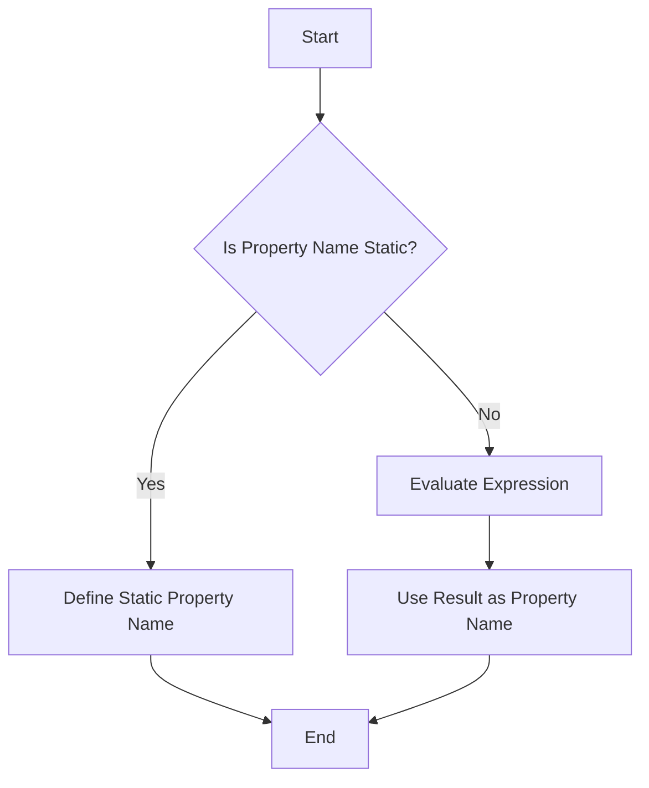

## 5.9 Computed Property Names in Classes

In the world of JavaScript, flexibility is key. One of the powerful features introduced in ES6 is the ability to use computed property names within objects and classes. This feature allows developers to define property names dynamically, which can be particularly useful when the property names are not known until runtime. In this section, we will explore how to use computed property names in JavaScript classes, understand their advantages, and discuss best practices to ensure code clarity and maintainability.

### Understanding Computed Property Names

Computed property names allow you to use expressions to determine the property names of an object or a class. This is achieved by enclosing the expression in square brackets `[]`. The expression is evaluated, and the result is used as the property name.

#### Example of Computed Property Names in Objects

Before diving into classes, let's look at a simple example of computed property names in a regular object:

```javascript
const dynamicKey = 'name';
const person = {
  [dynamicKey]: 'John Doe',
  age: 30
};

console.log(person.name); // Output: John Doe
```

In this example, the property name `name` is dynamically set using the value of the `dynamicKey` variable.

### Computed Property Names in Classes

In JavaScript classes, computed property names can be used to define both methods and properties dynamically. This is particularly useful when you need to create methods or properties based on variable input or conditions.

#### Defining Computed Method Names

To define a computed method name in a class, you use the same square bracket syntax. Here's an example:

```javascript
class DynamicMethods {
  constructor() {
    this.prefix = 'get';
  }

  [this.prefix + 'Name']() {
    return 'Dynamic Method Name';
  }
}

const instance = new DynamicMethods();
console.log(instance.getName()); // Output: Dynamic Method Name
```

In this example, the method name `getName` is constructed dynamically using the `prefix` property of the class.

#### Use Cases for Computed Property Names in Classes

1. **Dynamic API Endpoints**: When building a class that interacts with various API endpoints, computed property names can be used to generate methods for each endpoint dynamically.

2. **Localization**: In applications that support multiple languages, computed property names can be used to dynamically generate methods or properties based on the current language settings.

3. **Conditional Logic**: When the logic of your application requires different methods to be available based on certain conditions, computed property names can help in creating those methods on the fly.

### Limitations and Readability Concerns

While computed property names offer flexibility, they can also introduce complexity and potential readability issues. Here are some considerations:

- **Readability**: Code with dynamic property names can be harder to read and understand, especially for developers who are not familiar with the codebase. It's important to ensure that the logic behind the dynamic names is clear and well-documented.

- **Debugging**: Debugging issues related to computed property names can be challenging because the property names are not explicitly defined in the code.

- **Performance**: Although the performance impact is generally minimal, using computed property names in performance-critical sections of code should be done with caution.

### Best Practices for Using Computed Property Names

1. **Use Sparingly**: Only use computed property names when necessary. If a static property name will suffice, prefer that for clarity.

2. **Document Your Code**: Always document the logic behind computed property names. Explain why they are used and what the expected outcomes are.

3. **Maintain Consistency**: If using computed property names, try to maintain a consistent pattern across your codebase to make it easier for others to follow.

4. **Test Thoroughly**: Ensure that your dynamic property names are covered by unit tests to catch any potential issues early.

### Try It Yourself

To get a better understanding of computed property names, try modifying the following code example. Change the `prefix` to something else and see how it affects the method name:

```javascript
class DynamicMethods {
  constructor() {
    this.prefix = 'fetch';
  }

  [this.prefix + 'Data']() {
    return 'Fetching Data';
  }
}

const instance = new DynamicMethods();
console.log(instance.fetchData()); // Output: Fetching Data
```

### Visualizing Computed Property Names

To better understand how computed property names work, let's visualize the process using a flowchart:



**Description**: This flowchart illustrates the decision-making process for defining property names. If the property name is static, it is defined directly. If not, an expression is evaluated, and the result is used as the property name.

### Conclusion

Computed property names in JavaScript classes provide a powerful tool for creating dynamic and flexible code. However, with great power comes great responsibility. It's crucial to use this feature judiciously to maintain code readability and performance. As you continue to explore JavaScript and object-oriented programming, keep experimenting with computed property names to see how they can enhance your projects.

Remember, this is just the beginning. As you progress, you'll build more complex and interactive applications. Keep experimenting, stay curious, and enjoy the journey!

## Quiz Time!



### What is a computed property name in JavaScript?

- [x] A property name that is determined by evaluating an expression.
- [ ] A property name that is always static.
- [ ] A property name that is always a string.
- [ ] A property name that is always a number.

> **Explanation:** A computed property name is determined by evaluating an expression enclosed in square brackets.

### How do you define a computed property name in a class?

- [x] By using square brackets around an expression.
- [ ] By using curly braces around an expression.
- [ ] By using parentheses around an expression.
- [ ] By using angle brackets around an expression.

> **Explanation:** Computed property names are defined using square brackets around the expression.

### What is a potential drawback of using computed property names?

- [x] They can make the code harder to read.
- [ ] They always improve performance.
- [ ] They are always easier to debug.
- [ ] They make the code more secure.

> **Explanation:** Computed property names can make the code harder to read and understand.

### In what scenario might computed property names be useful?

- [x] When creating methods for dynamic API endpoints.
- [ ] When defining static configuration settings.
- [ ] When hardcoding user roles.
- [ ] When setting fixed error messages.

> **Explanation:** Computed property names are useful for dynamic scenarios like API endpoints.

### What should you do to ensure clarity when using computed property names?

- [x] Document the logic behind them.
- [ ] Use them as often as possible.
- [ ] Avoid using comments.
- [ ] Only use them in small projects.

> **Explanation:** Documenting the logic behind computed property names ensures clarity.

### What is the syntax for a computed property name?

- [x] `[expression]`
- [ ] `{expression}`
- [ ] `(expression)`
- [ ] `<expression>`

> **Explanation:** The syntax for a computed property name is `[expression]`.

### What is a good practice when using computed property names?

- [x] Use them sparingly and document their usage.
- [ ] Use them everywhere for consistency.
- [ ] Avoid using them in any project.
- [ ] Only use them in large projects.

> **Explanation:** It's best to use computed property names sparingly and document their usage.

### How can computed property names affect debugging?

- [x] They can make debugging more challenging.
- [ ] They always simplify debugging.
- [ ] They have no effect on debugging.
- [ ] They automatically fix bugs.

> **Explanation:** Computed property names can make debugging more challenging because the property names are not explicitly defined.

### What is the benefit of computed property names in localization?

- [x] They allow dynamic generation of methods based on language settings.
- [ ] They make the code run faster.
- [ ] They reduce the need for translation.
- [ ] They eliminate the need for language files.

> **Explanation:** Computed property names allow dynamic generation of methods based on language settings.

### True or False: Computed property names are only useful in classes.

- [ ] True
- [x] False

> **Explanation:** Computed property names can be used in both objects and classes, not just classes.




